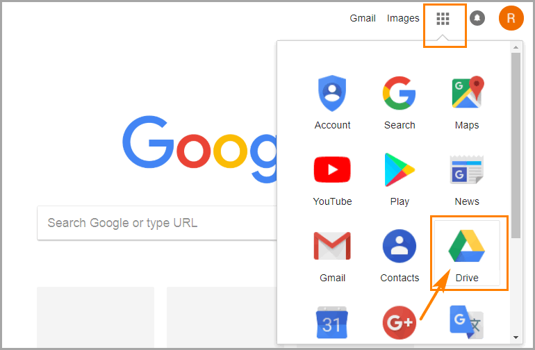
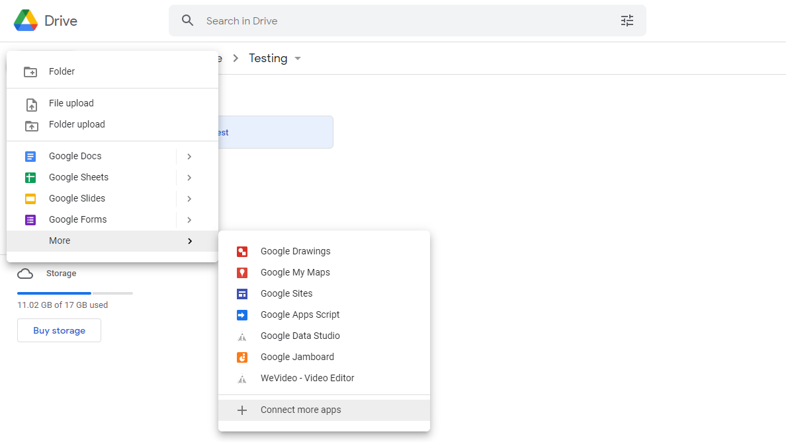
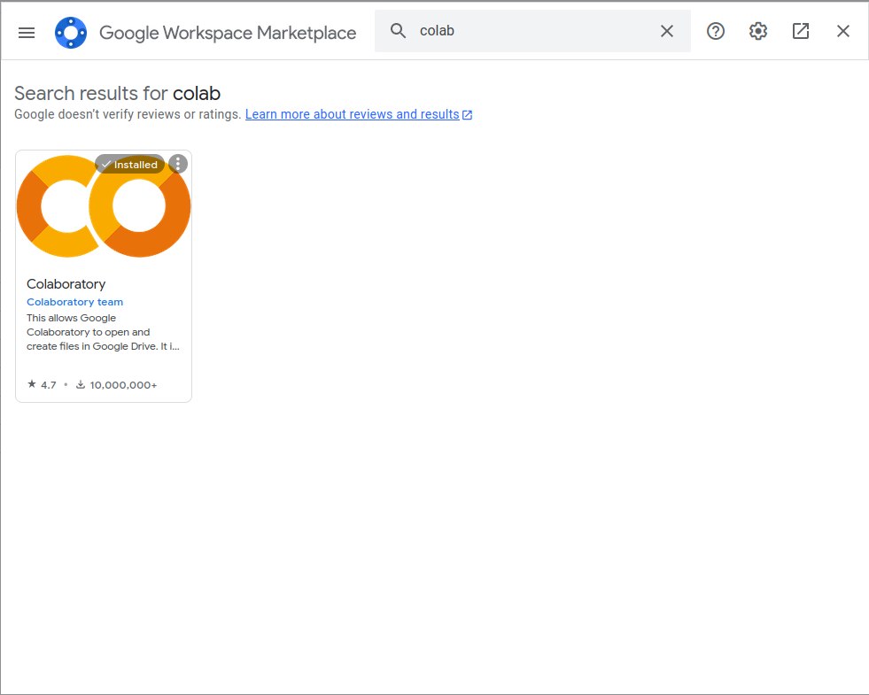
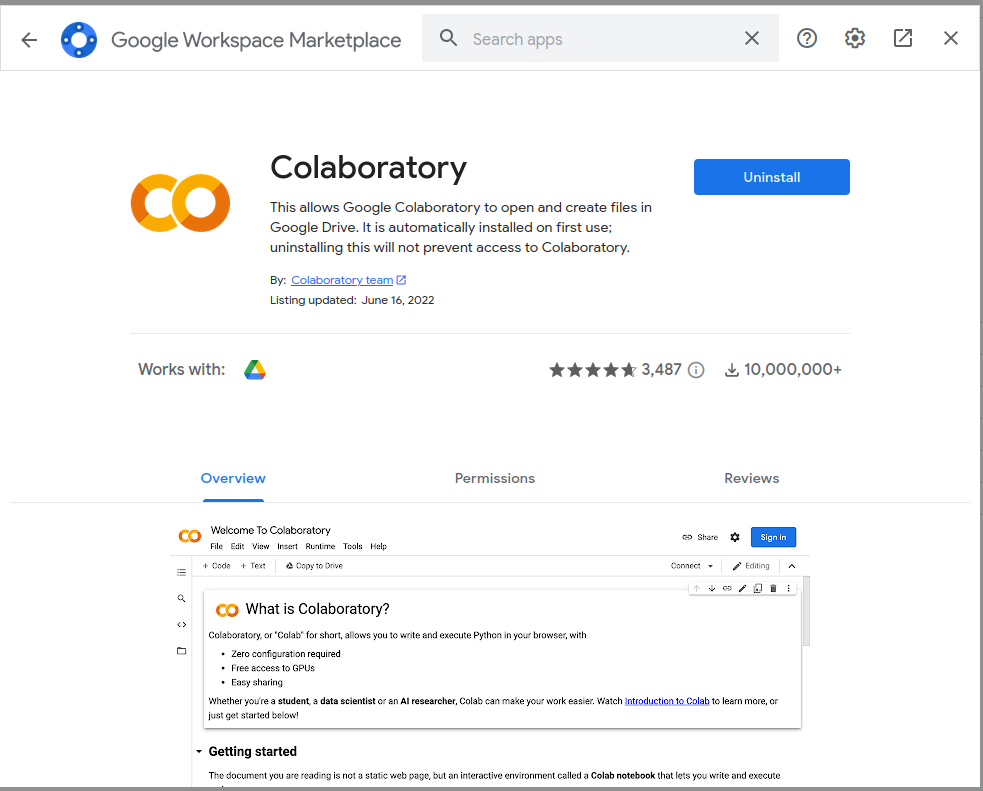
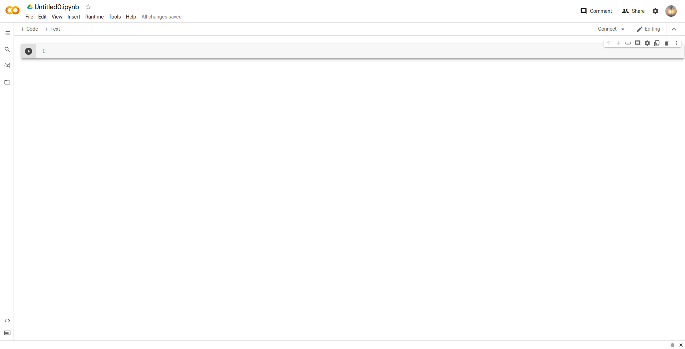
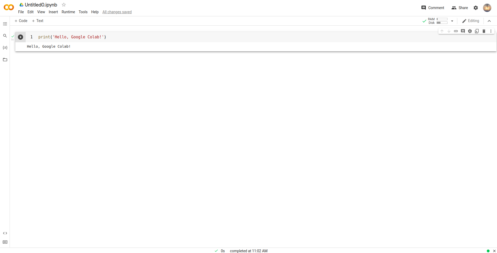

# Setting up Google Colab

> **Note**: In case of any problems or questions, feel free to contact Simo via email or Moodle!

## Step 1

Navigate to [Google](https://www.google.com) and open your Goodle Drive folder.



## Step 2

Right click in an empty region **below** your folders and choose the option *More/Connect more apps*.



## Step 3

In the search bar enter *Colab* and press *Enter*. You should get the following result:



## Step 4

Click on the icon. In your case the blue button on the right should have the text *Install*. Press it.



## Step 5

Close this window. Let's try to open Google Colab. Right click in an empty region below your folders and choose *More/Google Colaboratory*.


## Step 6

You should get the following opened as a seperate tab.



## Step 7

Paste the following in the empty cell and press ***Cntr + Enter***:

```python
print('Hello, Google Colab!')
```

You should get the following result:



## Step 8

Please go through this tutorial to learn more creating Jupyter notebooks (Python files ending in *.ipynb*) in Google Colab: <https://colab.research.google.com/notebooks/basic_features_overview.ipynb> .

Congratulations! You have successfully prepared your machine for programming in Python via Google Colab 🥳 !
