# Goals for week 01

1. Get familiar with `numpy`.
2. Get familiar with `pandas`.
3. Get familiar with `matplotlib`.

## Administrative

- Homework 1: 15/16.11. Topic: Classification.
- Homework 2: 13/14.12. Topic: Clustering.

## Task 01

**Description:**

Here is a Python list `baseball` - it holds the height of some baseball players in centimeters:

```python
baseball = [180, 215, 210, 210, 188, 176, 209, 200]
```

Create a numpy array from `baseball` and output the array along with its type.

**Acceptance criteria:**

1. The test case passes.
2. The `if __name__ == '__main__'` block is used.

**Test case:**

```python
python task01.py
```

```console
Baseball array: [180 215 210 210 188 176 209 200]
Type of baseball array: <class 'numpy.ndarray'>
```

## Task 02

**Description:**

You are a huge baseball fan. You decide to call the MLB (Major League Baseball) and ask around for some more statistics on the height of the main players. They pass along data on more than a thousand players, which is stored as a regular Python list: `height_in`. The height is expressed in inches. Make a numpy array out of it and convert the units to meters by multiplying with `0.0254`.

```python
height_in = [74, 74, 72, 72, 73, 69, 69, 71, 76, 71, 73, 73, 74, 74, 69, 70, 73, 75, 78, 79, 76, 74, 76, 72, 71, 75, 77, 74, 73, 74, 78, 73, 75, 73, 75, 75, 74, 69, 71, 74, 73, 73, 76, 74, 74, 70, 72, 77, 74, 70, 73, 75, 76, 76, 78, 74, 74, 76, 77, 81, 78, 75, 77, 75, 76, 74, 72, 72, 75, 73, 73, 73, 70, 70, 70, 76, 68, 71, 72, 75, 75, 75, 75, 68, 74, 78, 71, 73, 76, 74, 74, 79, 75, 73, 76, 74, 74, 73, 72, 74, 73, 74, 72, 73, 69, 72, 73, 75, 75, 73, 72, 72, 76, 74, 72, 77, 74, 77, 75, 76, 80, 74, 74, 75, 78, 73, 73, 74, 75, 76, 71, 73, 74, 76, 76, 74, 73, 74, 70, 72, 73, 73, 73, 73, 71, 74, 74, 72, 74, 71, 74, 73, 75, 75, 79, 73, 75, 76, 74, 76, 78, 74, 76, 72, 74, 76, 74, 75, 78, 75, 72, 74, 72, 74, 70, 71, 70, 75, 71, 71, 73, 72, 71, 73, 72, 75, 74, 74, 75, 73, 77, 73, 76, 75, 74, 76, 75, 73, 71, 76, 75, 72, 71, 77, 73, 74, 71, 72, 74, 75, 73, 72, 75, 75, 74, 72, 74, 71, 70, 74, 77, 77, 75, 75, 78, 75, 76, 73, 75, 75, 79, 77, 76, 71, 75, 74, 69, 71, 76, 72, 72, 70, 72, 73, 71, 72, 71, 73, 72, 73, 74, 74, 72, 75, 74, 74, 77, 75, 73, 72, 71, 74, 77, 75, 75, 75, 78, 78, 74, 76, 78, 76, 70, 72, 80, 74, 74, 71, 70, 72, 71, 74, 71, 72, 71, 74, 69, 76, 75, 75, 76, 73, 76, 73, 77, 73, 72, 72, 77, 77, 71, 74, 74, 73, 78, 75, 73, 70, 74, 72, 73, 73, 75, 75, 74, 76, 73, 74, 75, 75, 72, 73, 73, 72, 74, 78, 76, 73, 74, 75, 70, 75, 71, 72, 78, 75, 73, 73, 71, 75, 77, 72, 69, 73, 74, 72, 70, 75, 70, 72, 72, 74, 73, 74, 76, 75, 80, 72, 75, 73, 74, 74, 73, 75, 75, 71, 73, 75, 74, 74, 72, 74, 74, 74, 73, 76, 75, 72, 73, 73, 73, 72, 72, 72, 72, 71, 75, 75, 74, 73, 75, 79, 74, 76, 73, 74, 74, 72, 74, 74, 75, 78, 74, 74, 74, 77, 70, 73, 74, 73, 71, 75, 71, 72, 77, 74, 70, 77, 73, 72, 76, 71, 76, 78, 75, 73, 78, 74, 79, 75, 76, 72, 75, 75, 70, 72, 70, 74, 71, 76, 73, 76, 71, 69, 72, 72, 69, 73, 69, 73, 74, 74, 72, 71, 72, 72, 76, 76, 76, 74, 76, 75, 71, 72, 71, 73, 75, 76, 75, 71, 75, 74, 72, 73, 73, 73, 73, 76, 72, 76, 73, 73, 73, 75, 75, 77, 73, 72, 75, 70, 74, 72, 80, 71, 71, 74, 74, 73, 75, 76, 73, 77, 72, 73, 77, 76, 71, 75, 73, 74, 77, 71, 72, 73, 69, 73, 70, 74, 76, 73, 73, 75, 73, 79, 74, 73, 74, 77, 75, 74, 73, 77, 73, 77, 74, 74, 73, 77, 74, 77, 75, 77, 75, 71, 74, 70, 79, 72, 72, 70, 74, 74, 72, 73, 72, 74, 74, 76, 82, 74, 74, 70, 73, 73, 74, 77, 72, 76, 73, 73, 72, 74, 74, 71, 72, 75, 74, 74, 77, 70, 71, 73, 76, 71, 75, 74, 72, 76, 79, 76, 73, 76, 78, 75, 76, 72, 72, 73, 73, 75, 71, 76, 70, 75, 74, 75, 73, 71, 71, 72, 73, 73, 72, 69, 73, 78, 71, 73, 75, 76, 70, 74, 77, 75, 79, 72, 77, 73, 75, 75, 75, 73, 73, 76, 77, 75, 70, 71, 71, 75, 74, 69, 70, 75, 72, 75, 73, 72, 72, 72, 76, 75, 74, 69, 73, 72, 72, 75, 77, 76, 80, 77, 76, 79, 71, 75, 73, 76, 77, 73, 76, 70, 75, 73, 75, 70, 69, 71, 72, 72, 73, 70, 70, 73, 76, 75, 72, 73, 79, 71, 72, 74, 74, 74, 72, 76, 76, 72, 72, 71, 72, 72, 70, 77, 74, 72, 76, 71, 76, 71, 73, 70, 73, 73, 72, 71, 71, 71, 72, 72, 74, 74, 74, 71, 72, 75, 72, 71, 72, 72, 72, 72, 74, 74, 77, 75, 73, 75, 73, 76, 72, 77, 75, 72, 71, 71, 75, 72, 73, 73, 71, 70, 75, 71, 76, 73, 68, 71, 72, 74, 77, 72, 76, 78, 81, 72, 73, 76, 72, 72, 74, 76, 73, 76, 75, 70, 71, 74, 72, 73, 76, 76, 73, 71, 68, 71, 71, 74, 77, 69, 72, 76, 75, 76, 75, 76, 72, 74, 76, 74, 72, 75, 78, 77, 70, 72, 79, 74, 71, 68, 77, 75, 71, 72, 70, 72, 72, 73, 72, 74, 72, 72, 75, 72, 73, 74, 72, 78, 75, 72, 74, 75, 75, 76, 74, 74, 73, 74, 71, 74, 75, 76, 74, 76, 76, 73, 75, 75, 74, 68, 72, 75, 71, 70, 72, 73, 72, 75, 74, 70, 76, 71, 82, 72, 73, 74, 71, 75, 77, 72, 74, 72, 73, 78, 77, 73, 73, 73, 73, 73, 76, 75, 70, 73, 72, 73, 75, 74, 73, 73, 76, 73, 75, 70, 77, 72, 77, 74, 75, 75, 75, 75, 72, 74, 71, 76, 71, 75, 76, 83, 75, 74, 76, 72, 72, 75, 75, 72, 77, 73, 72, 70, 74, 72, 74, 72, 71, 70, 71, 76, 74, 76, 74, 74, 74, 75, 75, 71, 71, 74, 77, 71, 74, 75, 77, 76, 74, 76, 72, 71, 72, 75, 73, 68, 72, 69, 73, 73, 75, 70, 70, 74, 75, 74, 74, 73, 74, 75, 77, 73, 74, 76, 74, 75, 73, 76, 78, 75, 73, 77, 74, 72, 74, 72, 71, 73, 75, 73, 67, 67, 76, 74, 73, 70, 75, 70, 72, 77, 79, 78, 74, 75, 75, 78, 76, 75, 69, 75, 72, 75, 73, 74, 75, 75, 73]
```

**Acceptance criteria:**

1. The test case passes.

**Test case:**

```python
python task02.py
```

```console
np_height_in=array([74, 74, 72, ..., 75, 75, 73])
np_height_metres=array([1.8796, 1.8796, 1.8288, ..., 1.905 , 1.905 , 1.8542])
```

## Task 03

**Description:**

`numpy` is great for doing vector arithmetic. If you compare its functionality with regular Python lists, however, some things have changed.

First of all, `numpy` arrays cannot contain elements with different types. Second, the typical arithmetic operators, such as `+`, `-`, `*` and `/` have a different meaning for regular Python lists and `numpy` arrays.

Some lines of code have been provided for you. Try these out and output the one that would match this:

```python
np.array([True, 1, 2]) + np.array([3, 4, False])
```

Possible answers:

```text
A. np.array([True, 1, 2, 3, 4, False])
B. np.array([4, 3, 0]) + np.array([0, 2, 2])
C. np.array([1, 1, 2]) + np.array([3, 4, -1])
D. np.array([0, 1, 2, 3, 4, 5])
```

**Acceptance criteria:**

1. A script is created that prints out `Answer: ` followed by a letter `A`, `B`, `C`, or `D` that contains the correct line.

**Test case:**

```python
python task03.py
```

```console
Answer: <put the letter here>
```

## Task 04

**Description:**

Subsetting (using the square bracket notation on lists or arrays) works exactly the same with both lists and arrays.

Here are two lists: `height_in` and `weight_lb`:

```python
height_in = [74, 74, 72, 72, 73, 69, 69, 71, 76, 71, 73, 73, 74, 74, 69, 70, 73, 75, 78, 79, 76, 74, 76, 72, 71, 75, 77, 74, 73, 74, 78, 73, 75, 73, 75, 75, 74, 69, 71, 74, 73, 73, 76, 74, 74, 70, 72, 77, 74, 70, 73, 75, 76, 76, 78, 74, 74, 76, 77, 81, 78, 75, 77, 75, 76, 74, 72, 72, 75, 73, 73, 73, 70, 70, 70, 76, 68, 71, 72, 75, 75, 75, 75, 68, 74, 78, 71, 73, 76, 74, 74, 79, 75, 73, 76, 74, 74, 73, 72, 74, 73, 74, 72, 73, 69, 72, 73, 75, 75, 73, 72, 72, 76, 74, 72, 77, 74, 77, 75, 76, 80, 74, 74, 75, 78, 73, 73, 74, 75, 76, 71, 73, 74, 76, 76, 74, 73, 74, 70, 72, 73, 73, 73, 73, 71, 74, 74, 72, 74, 71, 74, 73, 75, 75, 79, 73, 75, 76, 74, 76, 78, 74, 76, 72, 74, 76, 74, 75, 78, 75, 72, 74, 72, 74, 70, 71, 70, 75, 71, 71, 73, 72, 71, 73, 72, 75, 74, 74, 75, 73, 77, 73, 76, 75, 74, 76, 75, 73, 71, 76, 75, 72, 71, 77, 73, 74, 71, 72, 74, 75, 73, 72, 75, 75, 74, 72, 74, 71, 70, 74, 77, 77, 75, 75, 78, 75, 76, 73, 75, 75, 79, 77, 76, 71, 75, 74, 69, 71, 76, 72, 72, 70, 72, 73, 71, 72, 71, 73, 72, 73, 74, 74, 72, 75, 74, 74, 77, 75, 73, 72, 71, 74, 77, 75, 75, 75, 78, 78, 74, 76, 78, 76, 70, 72, 80, 74, 74, 71, 70, 72, 71, 74, 71, 72, 71, 74, 69, 76, 75, 75, 76, 73, 76, 73, 77, 73, 72, 72, 77, 77, 71, 74, 74, 73, 78, 75, 73, 70, 74, 72, 73, 73, 75, 75, 74, 76, 73, 74, 75, 75, 72, 73, 73, 72, 74, 78, 76, 73, 74, 75, 70, 75, 71, 72, 78, 75, 73, 73, 71, 75, 77, 72, 69, 73, 74, 72, 70, 75, 70, 72, 72, 74, 73, 74, 76, 75, 80, 72, 75, 73, 74, 74, 73, 75, 75, 71, 73, 75, 74, 74, 72, 74, 74, 74, 73, 76, 75, 72, 73, 73, 73, 72, 72, 72, 72, 71, 75, 75, 74, 73, 75, 79, 74, 76, 73, 74, 74, 72, 74, 74, 75, 78, 74, 74, 74, 77, 70, 73, 74, 73, 71, 75, 71, 72, 77, 74, 70, 77, 73, 72, 76, 71, 76, 78, 75, 73, 78, 74, 79, 75, 76, 72, 75, 75, 70, 72, 70, 74, 71, 76, 73, 76, 71, 69, 72, 72, 69, 73, 69, 73, 74, 74, 72, 71, 72, 72, 76, 76, 76, 74, 76, 75, 71, 72, 71, 73, 75, 76, 75, 71, 75, 74, 72, 73, 73, 73, 73, 76, 72, 76, 73, 73, 73, 75, 75, 77, 73, 72, 75, 70, 74, 72, 80, 71, 71, 74, 74, 73, 75, 76, 73, 77, 72, 73, 77, 76, 71, 75, 73, 74, 77, 71, 72, 73, 69, 73, 70, 74, 76, 73, 73, 75, 73, 79, 74, 73, 74, 77, 75, 74, 73, 77, 73, 77, 74, 74, 73, 77, 74, 77, 75, 77, 75, 71, 74, 70, 79, 72, 72, 70, 74, 74, 72, 73, 72, 74, 74, 76, 82, 74, 74, 70, 73, 73, 74, 77, 72, 76, 73, 73, 72, 74, 74, 71, 72, 75, 74, 74, 77, 70, 71, 73, 76, 71, 75, 74, 72, 76, 79, 76, 73, 76, 78, 75, 76, 72, 72, 73, 73, 75, 71, 76, 70, 75, 74, 75, 73, 71, 71, 72, 73, 73, 72, 69, 73, 78, 71, 73, 75, 76, 70, 74, 77, 75, 79, 72, 77, 73, 75, 75, 75, 73, 73, 76, 77, 75, 70, 71, 71, 75, 74, 69, 70, 75, 72, 75, 73, 72, 72, 72, 76, 75, 74, 69, 73, 72, 72, 75, 77, 76, 80, 77, 76, 79, 71, 75, 73, 76, 77, 73, 76, 70, 75, 73, 75, 70, 69, 71, 72, 72, 73, 70, 70, 73, 76, 75, 72, 73, 79, 71, 72, 74, 74, 74, 72, 76, 76, 72, 72, 71, 72, 72, 70, 77, 74, 72, 76, 71, 76, 71, 73, 70, 73, 73, 72, 71, 71, 71, 72, 72, 74, 74, 74, 71, 72, 75, 72, 71, 72, 72, 72, 72, 74, 74, 77, 75, 73, 75, 73, 76, 72, 77, 75, 72, 71, 71, 75, 72, 73, 73, 71, 70, 75, 71, 76, 73, 68, 71, 72, 74, 77, 72, 76, 78, 81, 72, 73, 76, 72, 72, 74, 76, 73, 76, 75, 70, 71, 74, 72, 73, 76, 76, 73, 71, 68, 71, 71, 74, 77, 69, 72, 76, 75, 76, 75, 76, 72, 74, 76, 74, 72, 75, 78, 77, 70, 72, 79, 74, 71, 68, 77, 75, 71, 72, 70, 72, 72, 73, 72, 74, 72, 72, 75, 72, 73, 74, 72, 78, 75, 72, 74, 75, 75, 76, 74, 74, 73, 74, 71, 74, 75, 76, 74, 76, 76, 73, 75, 75, 74, 68, 72, 75, 71, 70, 72, 73, 72, 75, 74, 70, 76, 71, 82, 72, 73, 74, 71, 75, 77, 72, 74, 72, 73, 78, 77, 73, 73, 73, 73, 73, 76, 75, 70, 73, 72, 73, 75, 74, 73, 73, 76, 73, 75, 70, 77, 72, 77, 74, 75, 75, 75, 75, 72, 74, 71, 76, 71, 75, 76, 83, 75, 74, 76, 72, 72, 75, 75, 72, 77, 73, 72, 70, 74, 72, 74, 72, 71, 70, 71, 76, 74, 76, 74, 74, 74, 75, 75, 71, 71, 74, 77, 71, 74, 75, 77, 76, 74, 76, 72, 71, 72, 75, 73, 68, 72, 69, 73, 73, 75, 70, 70, 74, 75, 74, 74, 73, 74, 75, 77, 73, 74, 76, 74, 75, 73, 76, 78, 75, 73, 77, 74, 72, 74, 72, 71, 73, 75, 73, 67, 67, 76, 74, 73, 70, 75, 70, 72, 77, 79, 78, 74, 75, 75, 78, 76, 75, 69, 75, 72, 75, 73, 74, 75, 75, 73]
weight_lb = [180, 215, 210, 210, 188, 176, 209, 200, 231, 180, 188, 180, 185, 160, 180, 185, 189, 185, 219, 230, 205, 230, 195, 180, 192, 225, 203, 195, 182, 188, 200, 180, 200, 200, 245, 240, 215, 185, 175, 199, 200, 215, 200, 205, 206, 186, 188, 220, 210, 195, 200, 200, 212, 224, 210, 205, 220, 195, 200, 260, 228, 270, 200, 210, 190, 220, 180, 205, 210, 220, 211, 200, 180, 190, 170, 230, 155, 185, 185, 200, 225, 225, 220, 160, 205, 235, 250, 210, 190, 160, 200, 205, 222, 195, 205, 220, 220, 170, 185, 195, 220, 230, 180, 220, 180, 180, 170, 210, 215, 200, 213, 180, 192, 235, 185, 235, 210, 222, 210, 230, 220, 180, 190, 200, 210, 194, 180, 190, 240, 200, 198, 200, 195, 210, 220, 190, 210, 225, 180, 185, 170, 185, 185, 180, 178, 175, 200, 204, 211, 190, 210, 190, 190, 185, 290, 175, 185, 200, 220, 170, 220, 190, 220, 205, 200, 250, 225, 215, 210, 215, 195, 200, 194, 220, 180, 180, 170, 195, 180, 170, 206, 205, 200, 225, 201, 225, 233, 180, 225, 180, 220, 180, 237, 215, 190, 235, 190, 180, 165, 195, 200, 190, 190, 185, 185, 205, 190, 205, 206, 220, 208, 170, 195, 210, 190, 211, 230, 170, 185, 185, 241, 225, 210, 175, 230, 200, 215, 198, 226, 278, 215, 230, 240, 184, 219, 170, 218, 190, 225, 220, 176, 190, 197, 204, 167, 180, 195, 220, 215, 185, 190, 205, 205, 200, 210, 215, 200, 205, 211, 190, 208, 200, 210, 232, 230, 210, 220, 210, 202, 212, 225, 170, 190, 200, 237, 220, 170, 193, 190, 150, 220, 200, 190, 185, 185, 200, 172, 220, 225, 190, 195, 219, 190, 197, 200, 195, 210, 177, 220, 235, 180, 195, 195, 190, 230, 190, 200, 190, 190, 200, 200, 184, 200, 180, 219, 187, 200, 220, 205, 190, 170, 160, 215, 175, 205, 200, 214, 200, 190, 180, 205, 220, 190, 215, 235, 191, 200, 181, 200, 210, 240, 185, 165, 190, 185, 175, 155, 210, 170, 175, 220, 210, 205, 200, 205, 195, 240, 150, 200, 215, 202, 200, 190, 205, 190, 160, 215, 185, 200, 190, 210, 185, 220, 190, 202, 205, 220, 175, 160, 190, 200, 229, 206, 220, 180, 195, 175, 188, 230, 190, 200, 190, 219, 235, 180, 180, 180, 200, 234, 185, 220, 223, 200, 210, 200, 210, 190, 177, 227, 180, 195, 199, 175, 185, 240, 210, 180, 194, 225, 180, 205, 193, 230, 230, 220, 200, 249, 190, 208, 245, 250, 160, 192, 220, 170, 197, 155, 190, 200, 220, 210, 228, 190, 160, 184, 180, 180, 200, 176, 160, 222, 211, 195, 200, 175, 206, 240, 185, 260, 185, 221, 205, 200, 170, 201, 205, 185, 205, 245, 220, 210, 220, 185, 175, 170, 180, 200, 210, 175, 220, 206, 180, 210, 195, 200, 200, 164, 180, 220, 195, 205, 170, 240, 210, 195, 200, 205, 192, 190, 170, 240, 200, 205, 175, 250, 220, 224, 210, 195, 180, 245, 175, 180, 215, 175, 180, 195, 230, 230, 205, 215, 195, 180, 205, 180, 190, 180, 190, 190, 220, 210, 255, 190, 230, 200, 205, 210, 225, 215, 220, 205, 200, 220, 197, 225, 187, 245, 185, 185, 175, 200, 180, 188, 225, 200, 210, 245, 213, 231, 165, 228, 210, 250, 191, 190, 200, 215, 254, 232, 180, 215, 220, 180, 200, 170, 195, 210, 200, 220, 165, 180, 200, 200, 170, 224, 220, 180, 198, 240, 239, 185, 210, 220, 200, 195, 220, 230, 170, 220, 230, 165, 205, 192, 210, 205, 200, 210, 185, 195, 202, 205, 195, 180, 200, 185, 240, 185, 220, 205, 205, 180, 201, 190, 208, 240, 180, 230, 195, 215, 190, 195, 215, 215, 220, 220, 230, 195, 190, 195, 209, 204, 170, 185, 205, 175, 210, 190, 180, 180, 160, 235, 200, 210, 180, 190, 197, 203, 205, 170, 200, 250, 200, 220, 200, 190, 170, 190, 220, 215, 206, 215, 185, 235, 188, 230, 195, 168, 190, 160, 200, 200, 189, 180, 190, 200, 220, 187, 240, 190, 180, 185, 210, 220, 219, 190, 193, 175, 180, 215, 210, 200, 190, 185, 220, 170, 195, 205, 195, 210, 190, 190, 180, 220, 190, 186, 185, 190, 180, 190, 170, 210, 240, 220, 180, 210, 210, 195, 160, 180, 205, 200, 185, 245, 190, 210, 200, 200, 222, 215, 240, 170, 220, 156, 190, 202, 221, 200, 190, 210, 190, 200, 165, 190, 185, 230, 208, 209, 175, 180, 200, 205, 200, 250, 210, 230, 244, 202, 240, 200, 215, 177, 210, 170, 215, 217, 198, 200, 220, 170, 200, 230, 231, 183, 192, 167, 190, 180, 180, 215, 160, 205, 223, 175, 170, 190, 240, 175, 230, 223, 196, 167, 195, 190, 250, 190, 190, 190, 170, 160, 150, 225, 220, 209, 210, 176, 260, 195, 190, 184, 180, 195, 195, 219, 225, 212, 202, 185, 200, 209, 200, 195, 228, 210, 190, 212, 190, 218, 220, 190, 235, 210, 200, 188, 210, 235, 188, 215, 216, 220, 180, 185, 200, 210, 220, 185, 231, 210, 195, 200, 205, 200, 190, 250, 185, 180, 170, 180, 208, 235, 215, 244, 220, 185, 230, 190, 200, 180, 190, 196, 180, 230, 224, 160, 178, 205, 185, 210, 180, 190, 200, 257, 190, 220, 165, 205, 200, 208, 185, 215, 170, 235, 210, 170, 180, 170, 190, 150, 230, 203, 260, 246, 186, 210, 198, 210, 215, 180, 200, 245, 200, 192, 192, 200, 192, 205, 190, 186, 170, 197, 219, 200, 220, 207, 225, 207, 212, 225, 170, 190, 210, 230, 210, 200, 238, 234, 222, 200, 190, 170, 220, 223, 210, 215, 196, 175, 175, 189, 205, 210, 180, 180, 197, 220, 228, 190, 204, 165, 216, 220, 208, 210, 215, 195, 200, 215, 229, 240, 207, 205, 208, 185, 190, 170, 208, 225, 190, 225, 185, 180, 165, 240, 220, 212, 163, 215, 175, 205, 210, 205, 208, 215, 180, 200, 230, 211, 230, 190, 220, 180, 205, 190, 180, 205, 190, 195]
```

We have to:

1. Convert the lists into `numpy` arrays.
2. Output the weight at position `51`.
3. Output a sub-array of the heights that contains the elements at position `101` up to **and including** position `111`.

**Acceptance criteria:**

1. The test case passes.

**Test case:**

```python
python task04.py
```

```console
Weight at position 51: 200
Sub-array: [73 74 72 73 69 72 73 75 75 73 72]
```

## Task 05

**Description:**

Create a 2D numpy array from the following list of lists:

```python
baseball = [[180, 78.4],
            [215, 102.7],
            [210, 98.5],
            [188, 75.2]]
```

Name it `np_baseball`, output its type and the number of rows and columns.

**Acceptance criteria:**

1. The test case passes.

**Test case:**

```python
python task05.py
```

```console
Type: <class 'numpy.ndarray'>
Number of rows and columns: (4, 2)
```

## Task 06

**Description:**

Here's the baseball data as a 2D numpy array with 3 columns (`height`, `weight` and `age`) and `1015` rows:

```python
np_baseball = np.array([[74000.0, 180.0, 22.99], [74.0, 215.0, 34.69], [72.0, 210.0, 30.78], [72.0, 210.0, 35.43], [73.0, 188.0, 35.71], [69.0, 176.0, 29.39], [69.0, 209.0, 30.77], [71.0, 200.0, 35.07], [76.0, 231.0, 30.19], [71.0, 180.0, 27.05], [73.0, 188.0, 23.88], [73.0, 180.0, 26.96], [74.0, 185.0, 23.29], [74.0, 160.0, 26.11], [69.0, 180.0, 27.55], [70.0, 185.0, 34.27], [73.0, 189.0, 27.99], [75.0, 185.0, 22.38], [78.0, 219.0, 22.89], [79.0, 230.0, 25.76], [76.0, 205.0, 36.33], [74.0, 230.0, 31.17], [76.0, 195.0, 32.31], [72.0, 180.0, 31.03], [71.0, 192.0, 29.26], [75.0, 225.0, 29.47], [77.0, 203.0, 32.46], [74.0, 195.0, 35.67], [73.0, 182.0, 25.89], [74.0, 188.0, 26.55], [78.0, 200.0, 24.17], [73.0, 180.0, 26.69], [75.0, 200.0, 25.13], [73.0, 200.0, 27.9], [75.0, 245.0, 30.17], [75.0, 240.0, 31.36], [74.0, 215.0, 30.99], [69.0, 185.0, 32.24], [71.0, 175.0, 27.61], [74.0, 199.0, 28.2], [73.0, 200.0, 28.85], [73.0, 215.0, 24.21], [76.0, 200.0, 22.02], [74.0, 205.0, 24.97], [74.0, 206.0, 26.78], [70.0, 186.0, 32.51], [72.0, 188.0, 30.95], [77.0, 220.0, 33.09], [74.0, 210.0, 32.74], [70.0, 195.0, 30.69], [73000.0, 200.0, 23.45], [75.0, 200.0, 24.94], [76.0, 212.0, 24.09], [76.0, 224.0, 35.23], [78.0, 210.0, 27.43], [74.0, 205.0, 30.6], [74.0, 220.0, 27.94], [76.0, 195.0, 29.99], [77.0, 200.0, 25.17], [81.0, 260.0, 24.13], [78.0, 228.0, 30.46], [75.0, 270.0, 25.96], [77.0, 200.0, 22.55], [75.0, 210.0, 26.29], [76.0, 190.0, 24.79], [74.0, 220.0, 31.74], [72.0, 180.0, 23.92], [72.0, 205.0, 25.33], [75.0, 210.0, 24.02], [73.0, 220.0, 23.7], [73.0, 211.0, 31.59], [73.0, 200.0, 29.95], [70.0, 180.0, 23.64], [70.0, 190.0, 32.33], [70.0, 170.0, 23.13], [76.0, 230.0, 26.6], [68.0, 155.0, 26.46], [71.0, 185.0, 25.75], [72.0, 185.0, 27.51], [75.0, 200.0, 25.11], [75.0, 225.0, 32.51], [75.0, 225.0, 34.67], [75.0, 220.0, 31.06], [68.0, 160.0, 29.1], [74.0, 205.0, 28.66], [78.0, 235.0, 28.35], [71.0, 250.0, 33.77], [73.0, 210.0, 30.89], [76.0, 190.0, 37.74], [74.0, 160.0, 24.14], [74.0, 200.0, 25.71], [79.0, 205.0, 24.41], [75.0, 222.0, 24.32], [73.0, 195.0, 28.09], [76.0, 205.0, 33.31], [74.0, 220.0, 36.4], [74.0, 220.0, 37.36], [73.0, 170.0, 31.61], [72.0, 185.0, 25.14], [74.0, 195.0, 30.29], [73000.0, 220.0, 36.37], [74.0, 230.0, 34.89], [72.0, 180.0, 23.79], [73.0, 220.0, 27.96], [69.0, 180.0, 23.54], [72.0, 180.0, 31.37], [73.0, 170.0, 31.29], [75.0, 210.0, 33.01], [75.0, 215.0, 25.1], [73.0, 200.0, 31.28], [72.0, 213.0, 34.75], [72.0, 180.0, 23.46], [76.0, 192.0, 25.37], [74.0, 235.0, 29.57], [72.0, 185.0, 27.33], [77.0, 235.0, 40.29], [74.0, 210.0, 40.58], [77.0, 222.0, 26.79], [75.0, 210.0, 32.55], [76.0, 230.0, 26.27], [80.0, 220.0, 29.47], [74.0, 180.0, 29.07], [74.0, 190.0, 23.15], [75.0, 200.0, 24.9], [78.0, 210.0, 23.29], [73.0, 194.0, 31.18], [73.0, 180.0, 26.56], [74.0, 190.0, 25.03], [75.0, 240.0, 35.66], [76.0, 200.0, 29.64], [71.0, 198.0, 30.74], [73.0, 200.0, 28.43], [74.0, 195.0, 33.77], [76.0, 210.0, 40.97], [76.0, 220.0, 23.52], [74.0, 190.0, 28.19], [73.0, 210.0, 26.84], [74.0, 225.0, 26.16], [70.0, 180.0, 28.67], [72.0, 185.0, 24.2], [73.0, 170.0, 27.08], [73.0, 185.0, 24.76], [73.0, 185.0, 23.36], [73.0, 180.0, 25.35], [71.0, 178.0, 24.63], [74.0, 175.0, 24.02], [74.0, 200.0, 24.58], [72.0, 204.0, 30.82], [74.0, 211.0, 32.89], [71.0, 190.0, 33.33], [74000.0, 210.0, 33.52], [73.0, 190.0, 36.24], [75.0, 190.0, 28.5], [75.0, 185.0, 29.42], [79.0, 290.0, 26.61], [73.0, 175.0, 23.79], [75.0, 185.0, 24.96], [76.0, 200.0, 25.93], [74.0, 220.0, 22.81], [76.0, 170.0, 25.29], [78.0, 220.0, 26.07], [74.0, 190.0, 26.09], [76.0, 220.0, 23.23], [72.0, 205.0, 33.49], [74.0, 200.0, 31.84], [76.0, 250.0, 42.3], [74.0, 225.0, 35.82], [75.0, 215.0, 35.27], [78.0, 210.0, 26.81], [75.0, 215.0, 38.49], [72.0, 195.0, 32.68], [74.0, 200.0, 34.93], [72.0, 194.0, 26.26], [74.0, 220.0, 27.56], [70.0, 180.0, 23.98], [71.0, 180.0, 29.73], [70.0, 170.0, 31.33], [75.0, 195.0, 27.13], [71.0, 180.0, 26.75], [71.0, 170.0, 27.09], [73.0, 206.0, 29.23], [72.0, 205.0, 28.88], [71.0, 200.0, 33.01], [73.0, 225.0, 30.57], [72.0, 201.0, 31.24], [75.0, 225.0, 24.95], [74.0, 233.0, 24.62], [74.0, 180.0, 24.98], [75.0, 225.0, 26.22], [73.0, 180.0, 26.04], [77.0, 220.0, 26.45], [73.0, 180.0, 25.25], [76.0, 237.0, 27.77], [75.0, 215.0, 35.16], [74.0, 190.0, 37.1], [76.0, 235.0, 34.51], [75.0, 190.0, 29.28], [73.0, 180.0, 32.14], [71.0, 165.0, 23.94], [76.0, 195.0, 27.45], [75000.0, 200.0, 28.77], [72.0, 190.0, 23.58], [71.0, 190.0, 27.56], [77.0, 185.0, 24.01], [73.0, 185.0, 26.52], [74.0, 205.0, 35.54], [71.0, 190.0, 29.43], [72.0, 205.0, 29.9], [74.0, 206.0, 32.7], [75.0, 220.0, 28.8], [73.0, 208.0, 32.82], [72.0, 170.0, 24.36], [75.0, 195.0, 32.68], [75.0, 210.0, 31.59], [74.0, 190.0, 33.32], [72.0, 211.0, 32.97], [74.0, 230.0, 32.72], [71.0, 170.0, 22.55], [70.0, 185.0, 27.45], [74.0, 185.0, 38.23], [77.0, 241.0, 31.14], [77.0, 225.0, 34.71], [75.0, 210.0, 26.13], [75.0, 175.0, 24.43], [78.0, 230.0, 23.76], [75.0, 200.0, 26.92], [76.0, 215.0, 25.85], [73.0, 198.0, 30.16], [75.0, 226.0, 25.03], [75.0, 278.0, 24.21], [79.0, 215.0, 26.51], [77.0, 230.0, 26.36], [76.0, 240.0, 30.88], [71.0, 184.0, 32.57], [75.0, 219.0, 37.68], [74.0, 170.0, 37.25], [69.0, 218.0, 35.25], [71.0, 190.0, 33.95], [76.0, 225.0, 32.66], [72.0, 220.0, 26.68], [72.0, 176.0, 25.18], [70.0, 190.0, 31.39], [72.0, 197.0, 33.74], [73.0, 204.0, 31.42], [71.0, 167.0, 27.5], [72.0, 180.0, 24.25], [71.0, 195.0, 29.78], [73.0, 220.0, 30.0], [72.0, 215.0, 33.09], [73.0, 185.0, 25.96], [74000.0, 190.0, 23.34], [74.0, 205.0, 29.98], [72.0, 205.0, 38.28], [75.0, 200.0, 24.97], [74.0, 210.0, 24.34], [74.0, 215.0, 29.49], [77.0, 200.0, 24.02], [75.0, 205.0, 24.73], [73.0, 211.0, 42.3], [72.0, 190.0, 29.54], [71.0, 208.0, 29.95], [74.0, 200.0, 29.24], [77.0, 210.0, 30.3], [75.0, 232.0, 40.77], [75.0, 230.0, 38.85], [75.0, 210.0, 22.31], [78.0, 220.0, 25.44], [78.0, 210.0, 21.78], [74.0, 202.0, 22.64], [76.0, 212.0, 26.11], [78.0, 225.0, 27.55], [76.0, 170.0, 24.63], [70.0, 190.0, 23.58], [72.0, 200.0, 30.73], [80.0, 237.0, 32.17], [74.0, 220.0, 30.43], [74.0, 170.0, 23.27], [71.0, 193.0, 32.51], [70.0, 190.0, 25.08], [72.0, 150.0, 22.41], [71.0, 220.0, 27.9], [74.0, 200.0, 34.74], [71.0, 190.0, 30.79], [72.0, 185.0, 25.71], [71.0, 185.0, 29.26], [74.0, 200.0, 21.58], [69.0, 172.0, 33.36], [76.0, 220.0, 24.94], [75.0, 225.0, 20.9], [75.0, 190.0, 21.52], [76.0, 195.0, 25.85], [73.0, 219.0, 27.27], [76.0, 190.0, 26.75], [73.0, 197.0, 36.03], [77.0, 200.0, 30.52], [73.0, 195.0, 32.55], [72.0, 210.0, 29.86], [72.0, 177.0, 29.58], [77.0, 220.0, 30.02], [77.0, 235.0, 29.16], [71000.0, 180.0, 22.3], [74.0, 195.0, 22.06], [74.0, 195.0, 25.65], [73.0, 190.0, 25.49], [78.0, 230.0, 27.86], [75.0, 190.0, 23.73], [73.0, 200.0, 31.78], [70.0, 190.0, 23.06], [74.0, 190.0, 26.6], [72.0, 200.0, 29.39], [73.0, 200.0, 26.51], [73.0, 184.0, 25.08], [75.0, 200.0, 25.76], [75.0, 180.0, 22.52], [74.0, 219.0, 25.57], [76.0, 187.0, 25.43], [73.0, 200.0, 34.65], [74.0, 220.0, 22.68], [75.0, 205.0, 21.46], [75.0, 190.0, 23.47], [72.0, 170.0, 23.1], [73.0, 160.0, 29.14], [73.0, 215.0, 29.77], [72.0, 175.0, 23.85], [74.0, 205.0, 28.88], [78.0, 200.0, 24.49], [76.0, 214.0, 25.19], [73.0, 200.0, 27.48], [74.0, 190.0, 28.31], [75.0, 180.0, 26.54], [70.0, 205.0, 26.77], [75.0, 220.0, 23.75], [71.0, 190.0, 26.41], [72.0, 215.0, 36.47], [78.0, 235.0, 26.06], [75.0, 191.0, 27.55], [73.0, 200.0, 31.28], [73.0, 181.0, 29.04], [71.0, 200.0, 32.95], [75.0, 210.0, 26.65], [77.0, 240.0, 27.5], [72.0, 185.0, 30.9], [69.0, 165.0, 29.09], [73.0, 190.0, 36.67], [74.0, 185.0, 23.44], [72.0, 175.0, 29.09], [70.0, 155.0, 22.89], [75.0, 210.0, 25.48], [70.0, 170.0, 25.84], [72.0, 175.0, 27.2], [72000.0, 220.0, 25.22], [74.0, 210.0, 24.67], [73.0, 205.0, 39.25], [74.0, 200.0, 32.17], [76.0, 205.0, 32.77], [75.0, 195.0, 29.83], [80.0, 240.0, 31.02], [72.0, 150.0, 29.73], [75.0, 200.0, 28.48], [73.0, 215.0, 26.51], [74.0, 202.0, 26.0], [74.0, 200.0, 23.36], [73.0, 190.0, 25.9], [75.0, 205.0, 28.5], [75.0, 190.0, 25.62], [71.0, 160.0, 30.94], [73.0, 215.0, 26.59], [75.0, 185.0, 22.78], [74.0, 200.0, 32.26], [74.0, 190.0, 30.35], [72.0, 210.0, 33.26], [74.0, 185.0, 32.35], [74.0, 220.0, 27.3], [74.0, 190.0, 32.08], [73.0, 202.0, 25.25], [76.0, 205.0, 25.03], [75.0, 220.0, 26.89], [72.0, 175.0, 24.69], [73.0, 160.0, 22.44], [73.0, 190.0, 30.36], [73.0, 200.0, 26.27], [72.0, 229.0, 29.5], [72.0, 206.0, 29.75], [72.0, 220.0, 38.3], [72.0, 180.0, 39.75], [71.0, 195.0, 32.84], [75.0, 175.0, 26.66], [75.0, 188.0, 24.94], [74.0, 230.0, 27.76], [73.0, 190.0, 23.66], [75.0, 200.0, 24.96], [79.0, 190.0, 23.65], [74.0, 219.0, 29.42], [76.0, 235.0, 32.18], [73.0, 180.0, 26.66], [74.0, 180.0, 27.47], [74.0, 180.0, 25.66], [72.0, 200.0, 35.13], [74.0, 234.0, 31.15], [74.0, 185.0, 35.67], [75000.0, 220.0, 29.6], [78.0, 223.0, 30.14], [74.0, 200.0, 24.53], [74.0, 210.0, 24.49], [74.0, 200.0, 26.28], [77.0, 210.0, 24.06], [70.0, 190.0, 35.88], [73.0, 177.0, 30.42], [74.0, 227.0, 30.09], [73.0, 180.0, 26.5], [71.0, 195.0, 24.94], [75.0, 199.0, 29.6], [71.0, 175.0, 32.43], [72.0, 185.0, 37.16], [77.0, 240.0, 30.57], [74.0, 210.0, 27.01], [70.0, 180.0, 30.23], [77.0, 194.0, 26.03], [73.0, 225.0, 28.23], [72.0, 180.0, 25.21], [76.0, 205.0, 25.45], [71.0, 193.0, 26.24], [76.0, 230.0, 30.15], [78.0, 230.0, 29.8], [75.0, 220.0, 33.41], [73.0, 200.0, 30.95], [78.0, 249.0, 31.17], [74.0, 190.0, 30.95], [79.0, 208.0, 29.44], [75.0, 245.0, 27.14], [76.0, 250.0, 26.21], [72.0, 160.0, 24.08], [75.0, 192.0, 23.96], [75.0, 220.0, 24.94], [70.0, 170.0, 29.56], [72.0, 197.0, 26.42], [70.0, 155.0, 23.92], [74.0, 190.0, 25.23], [71.0, 200.0, 35.82], [76.0, 220.0, 23.87], [73.0, 210.0, 32.57], [76.0, 228.0, 25.79], [71.0, 190.0, 31.47], [69.0, 160.0, 22.61], [72.0, 184.0, 24.85], [72.0, 180.0, 27.33], [69.0, 180.0, 26.67], [73.0, 200.0, 37.43], [69.0, 176.0, 29.31], [73.0, 160.0, 29.85], [74000.0, 222.0, 27.93], [74.0, 211.0, 31.62], [72.0, 195.0, 30.55], [71.0, 200.0, 24.77], [72.0, 175.0, 33.77], [72.0, 206.0, 27.97], [76.0, 240.0, 27.85], [76.0, 185.0, 23.26], [76.0, 260.0, 25.38], [74.0, 185.0, 23.35], [76.0, 221.0, 25.45], [75.0, 205.0, 26.49], [71.0, 200.0, 24.0], [72.0, 170.0, 24.16], [71.0, 201.0, 28.1], [73.0, 205.0, 25.65], [75.0, 185.0, 28.58], [76.0, 205.0, 32.27], [75.0, 245.0, 29.86], [71.0, 220.0, 25.14], [75.0, 210.0, 23.03], [74.0, 220.0, 30.25], [72.0, 185.0, 30.67], [73.0, 175.0, 27.73], [73.0, 170.0, 23.34], [73.0, 180.0, 25.94], [73.0, 200.0, 31.56], [76.0, 210.0, 34.85], [72.0, 175.0, 23.98], [76.0, 220.0, 23.14], [73.0, 206.0, 28.99], [73.0, 180.0, 25.02], [73.0, 210.0, 29.85], [75.0, 195.0, 27.03], [75.0, 200.0, 25.15], [77.0, 200.0, 27.12], [73.0, 164.0, 31.63], [72.0, 180.0, 32.62], [75.0, 220.0, 39.79], [70.0, 195.0, 34.47], [74.0, 205.0, 23.47], [72.0, 170.0, 25.31], [80.0, 240.0, 27.1], [71.0, 210.0, 24.35], [71.0, 195.0, 23.45], [74.0, 200.0, 28.24], [74.0, 205.0, 28.77], [73.0, 192.0, 26.53], [75.0, 190.0, 25.64], [76.0, 170.0, 25.83], [73000.0, 240.0, 38.06], [77.0, 200.0, 36.38], [72.0, 205.0, 25.27], [73.0, 175.0, 27.2], [77.0, 250.0, 31.59], [76.0, 220.0, 29.56], [71.0, 224.0, 35.5], [75.0, 210.0, 30.35], [73.0, 195.0, 24.11], [74.0, 180.0, 23.29], [77.0, 245.0, 31.48], [71.0, 175.0, 27.23], [72.0, 180.0, 24.07], [73.0, 215.0, 28.68], [69.0, 175.0, 27.05], [73.0, 180.0, 31.15], [70.0, 195.0, 31.85], [74.0, 230.0, 31.68], [76.0, 230.0, 34.23], [73.0, 205.0, 32.01], [73.0, 215.0, 25.41], [75.0, 195.0, 24.73], [73.0, 180.0, 25.66], [79.0, 205.0, 24.5], [74.0, 180.0, 24.38], [73.0, 190.0, 26.89], [74.0, 180.0, 24.2], [77.0, 190.0, 26.97], [75.0, 190.0, 25.21], [74.0, 220.0, 30.46], [73.0, 210.0, 28.53], [77.0, 255.0, 25.75], [73.0, 190.0, 31.15], [77.0, 230.0, 26.48], [74.0, 200.0, 26.93], [74.0, 205.0, 29.55], [73.0, 210.0, 34.75], [77.0, 225.0, 29.71], [74.0, 215.0, 29.83], [77.0, 220.0, 33.57], [75.0, 205.0, 28.21], [77.0, 200.0, 27.54], [75.0, 220.0, 26.05], [71.0, 197.0, 23.64], [74.0, 225.0, 24.82], [70.0, 187.0, 29.8], [79.0, 245.0, 34.71], [72.0, 185.0, 29.22], [72.0, 185.0, 23.96], [70.0, 175.0, 23.87], [74000.0, 200.0, 26.77], [74.0, 180.0, 23.49], [72.0, 188.0, 26.77], [73.0, 225.0, 24.51], [72.0, 200.0, 33.23], [74.0, 210.0, 31.04], [74.0, 245.0, 32.02], [76.0, 213.0, 31.44], [82.0, 231.0, 43.47], [74.0, 165.0, 28.38], [74.0, 228.0, 27.81], [70.0, 210.0, 24.57], [73.0, 250.0, 23.34], [73.0, 191.0, 27.09], [74.0, 190.0, 25.14], [77.0, 200.0, 27.07], [72.0, 215.0, 24.02], [76.0, 254.0, 27.6], [73.0, 232.0, 27.99], [73.0, 180.0, 27.56], [72.0, 215.0, 28.63], [74.0, 220.0, 30.99], [74.0, 180.0, 26.33], [71.0, 200.0, 26.97], [72.0, 170.0, 22.85], [75.0, 195.0, 23.19], [74.0, 210.0, 23.87], [74.0, 200.0, 33.98], [77.0, 220.0, 28.26], [70.0, 165.0, 29.12], [71.0, 180.0, 26.18], [73.0, 200.0, 28.03], [76.0, 200.0, 23.08], [71.0, 170.0, 26.24], [75.0, 224.0, 26.63], [74.0, 220.0, 24.21], [72.0, 180.0, 23.01], [76.0, 198.0, 23.13], [79.0, 240.0, 23.08], [76.0, 239.0, 25.13], [73.0, 185.0, 24.66], [76.0, 210.0, 26.03], [78.0, 220.0, 28.7], [75.0, 200.0, 25.57], [76.0, 195.0, 24.65], [72.0, 220.0, 25.55], [72.0, 230.0, 22.27], [73.0, 170.0, 24.76], [73.0, 220.0, 23.98], [75.0, 230.0, 27.85], [71000.0, 165.0, 22.14], [76.0, 205.0, 27.05], [70.0, 192.0, 31.45], [75.0, 210.0, 32.03], [74.0, 205.0, 29.95], [75.0, 200.0, 23.47], [73.0, 210.0, 37.21], [71.0, 185.0, 25.67], [71.0, 195.0, 34.69], [72.0, 202.0, 30.04], [73.0, 205.0, 32.52], [73.0, 195.0, 24.15], [72.0, 180.0, 26.86], [69.0, 200.0, 27.94], [73.0, 185.0, 26.63], [78.0, 240.0, 27.31], [71.0, 185.0, 30.55], [73.0, 220.0, 40.68], [75.0, 205.0, 37.27], [76.0, 205.0, 25.78], [70.0, 180.0, 30.98], [74.0, 201.0, 28.41], [77.0, 190.0, 30.01], [75.0, 208.0, 31.57], [79.0, 240.0, 28.81], [72.0, 180.0, 24.09], [77.0, 230.0, 26.47], [73.0, 195.0, 30.5], [75.0, 215.0, 23.74], [75.0, 190.0, 24.49], [75.0, 195.0, 26.73], [73.0, 215.0, 27.01], [73.0, 215.0, 39.75], [76.0, 220.0, 27.16], [77.0, 220.0, 25.74], [75.0, 230.0, 37.43], [70.0, 195.0, 39.85], [71.0, 190.0, 28.62], [71.0, 195.0, 23.9], [75.0, 209.0, 25.18], [74.0, 204.0, 33.53], [69.0, 170.0, 33.03], [70.0, 185.0, 31.35], [75.0, 205.0, 22.39], [72.0, 175.0, 27.99], [75.0, 210.0, 27.22], [73.0, 190.0, 27.49], [72.0, 180.0, 27.53], [72.0, 180.0, 26.26], [72.0, 160.0, 25.18], [76000.0, 235.0, 27.12], [75.0, 200.0, 27.69], [74.0, 210.0, 25.69], [69.0, 180.0, 28.11], [73.0, 190.0, 31.21], [72.0, 197.0, 30.8], [72.0, 203.0, 30.21], [75.0, 205.0, 28.06], [77.0, 170.0, 26.52], [76.0, 200.0, 23.1], [80.0, 250.0, 25.02], [77.0, 200.0, 26.14], [76.0, 220.0, 25.38], [79.0, 200.0, 27.6], [71.0, 190.0, 25.5], [75.0, 170.0, 24.24], [73.0, 190.0, 23.32], [76.0, 220.0, 31.56], [77.0, 215.0, 34.19], [73.0, 206.0, 36.78], [76.0, 215.0, 27.73], [70.0, 185.0, 34.88], [75.0, 235.0, 31.0], [73.0, 188.0, 48.52], [75.0, 230.0, 34.68], [70.0, 195.0, 37.38], [69.0, 168.0, 24.33], [71.0, 190.0, 37.3], [72.0, 160.0, 23.72], [72.0, 200.0, 24.19], [73.0, 200.0, 25.7], [70.0, 189.0, 29.06], [70.0, 180.0, 33.48], [73.0, 190.0, 29.85], [76.0, 200.0, 34.3], [75.0, 220.0, 40.66], [72.0, 187.0, 21.9], [73.0, 240.0, 27.39], [79.0, 190.0, 23.13], [71.0, 180.0, 35.35], [72.0, 185.0, 40.93], [74.0, 210.0, 33.67], [74.0, 220.0, 37.39], [74.0, 219.0, 27.97], [72.0, 190.0, 25.54], [76.0, 193.0, 25.81], [76.0, 175.0, 22.53], [72.0, 180.0, 22.86], [72.0, 215.0, 24.07], [71.0, 210.0, 29.5], [72000.0, 200.0, 30.03], [72.0, 190.0, 27.38], [70.0, 185.0, 30.51], [77.0, 220.0, 28.3], [74.0, 170.0, 29.84], [72.0, 195.0, 33.41], [76.0, 205.0, 33.6], [71.0, 195.0, 35.6], [76.0, 210.0, 24.19], [71.0, 190.0, 37.88], [73.0, 190.0, 27.56], [70.0, 180.0, 24.42], [73.0, 220.0, 31.05], [73.0, 190.0, 31.56], [72.0, 186.0, 35.55], [71.0, 185.0, 41.21], [71.0, 190.0, 27.12], [71.0, 180.0, 26.97], [72.0, 190.0, 28.92], [72.0, 170.0, 30.06], [74.0, 210.0, 31.51], [74.0, 240.0, 30.69], [74.0, 220.0, 30.19], [71.0, 180.0, 38.11], [72.0, 210.0, 28.68], [75.0, 210.0, 27.44], [72.0, 195.0, 24.63], [71.0, 160.0, 28.11], [72.0, 180.0, 28.9], [72.0, 205.0, 24.11], [72.0, 200.0, 40.53], [72.0, 185.0, 29.5], [74.0, 245.0, 28.62], [74.0, 190.0, 26.42], [77.0, 210.0, 30.18], [75.0, 200.0, 33.75], [73.0, 200.0, 30.06], [75.0, 222.0, 29.22], [73.0, 215.0, 24.47], [76.0, 240.0, 24.94], [72.0, 170.0, 28.77], [77.0, 220.0, 28.54], [75.0, 156.0, 27.32], [72.0, 190.0, 35.12], [71.0, 202.0, 24.04], [71.0, 221.0, 36.39], [75.0, 200.0, 22.81], [72.0, 190.0, 33.6], [73.0, 210.0, 38.98], [73.0, 190.0, 34.39], [71000.0, 200.0, 33.15], [70.0, 165.0, 29.35], [75.0, 190.0, 26.59], [71.0, 185.0, 23.46], [76.0, 230.0, 22.43], [73.0, 208.0, 24.89], [68.0, 209.0, 24.67], [71.0, 175.0, 26.17], [72.0, 180.0, 29.54], [74.0, 200.0, 39.49], [77.0, 205.0, 34.08], [72.0, 200.0, 30.52], [76.0, 250.0, 28.77], [78.0, 210.0, 33.75], [81.0, 230.0, 32.69], [72.0, 244.0, 22.59], [73.0, 202.0, 37.04], [76.0, 240.0, 22.7], [72.0, 200.0, 25.6], [72.0, 215.0, 27.23], [74.0, 177.0, 25.74], [76.0, 210.0, 30.29], [73.0, 170.0, 26.72], [76.0, 215.0, 33.9], [75.0, 217.0, 29.86], [70.0, 198.0, 36.13], [71.0, 200.0, 27.54], [74.0, 220.0, 31.49], [72.0, 170.0, 28.1], [73.0, 200.0, 34.07], [76.0, 230.0, 27.28], [76.0, 231.0, 30.8], [73.0, 183.0, 28.2], [71.0, 192.0, 27.9], [68.0, 167.0, 28.26], [71.0, 190.0, 30.96], [71.0, 180.0, 24.18], [74.0, 180.0, 27.52], [77.0, 215.0, 27.78], [69.0, 160.0, 26.25], [72.0, 205.0, 29.5], [76.0, 223.0, 30.39], [75.0, 175.0, 23.18], [76.0, 170.0, 25.81], [75.0, 190.0, 23.01], [76.0, 240.0, 31.72], [72.0, 175.0, 44.28], [74.0, 230.0, 36.91], [76.0, 223.0, 26.54], [74.0, 196.0, 29.27], [72000.0, 167.0, 30.51], [75.0, 195.0, 31.28], [78.0, 190.0, 26.51], [77.0, 250.0, 34.87], [70.0, 190.0, 39.28], [72.0, 190.0, 28.56], [79.0, 190.0, 27.82], [74.0, 170.0, 25.94], [71.0, 160.0, 28.53], [68.0, 150.0, 22.11], [77.0, 225.0, 27.71], [75.0, 220.0, 37.38], [71.0, 209.0, 30.67], [72.0, 210.0, 30.48], [70.0, 176.0, 27.12], [72.0, 260.0, 22.81], [72.0, 195.0, 24.46], [73.0, 190.0, 34.73], [72.0, 184.0, 36.53], [74.0, 180.0, 24.53], [72.0, 195.0, 27.17], [72.0, 195.0, 26.9], [75.0, 219.0, 33.67], [72.0, 225.0, 29.14], [73.0, 212.0, 32.61], [74.0, 202.0, 33.87], [72.0, 185.0, 24.41], [78.0, 200.0, 24.94], [75.0, 209.0, 27.36], [72.0, 200.0, 26.33], [74.0, 195.0, 25.72], [75.0, 228.0, 28.7], [75.0, 210.0, 28.53], [76.0, 190.0, 26.07], [74.0, 212.0, 27.31], [74.0, 190.0, 23.26], [73.0, 218.0, 28.62], [74.0, 220.0, 32.16], [71.0, 190.0, 38.43], [74.0, 235.0, 31.81], [75.0, 210.0, 29.1], [76.0, 200.0, 31.28], [74.0, 188.0, 29.17], [76.0, 210.0, 25.89], [76.0, 235.0, 26.13], [73.0, 188.0, 29.13], [75.0, 215.0, 28.92], [75.0, 216.0, 26.01], [74.0, 220.0, 24.81], [68.0, 180.0, 28.79], [72000.0, 185.0, 33.77], [75.0, 200.0, 33.85], [71.0, 210.0, 27.36], [70.0, 220.0, 26.01], [72.0, 185.0, 29.95], [73.0, 231.0, 28.12], [72.0, 210.0, 32.87], [75.0, 195.0, 31.2], [74.0, 200.0, 34.14], [70.0, 205.0, 36.11], [76.0, 200.0, 26.31], [71.0, 190.0, 27.5], [82.0, 250.0, 27.77], [72.0, 185.0, 40.88], [73.0, 180.0, 25.75], [74.0, 170.0, 31.41], [71.0, 180.0, 30.84], [75.0, 208.0, 30.57], [77.0, 235.0, 39.79], [72.0, 215.0, 39.38], [74.0, 244.0, 29.42], [72.0, 220.0, 26.19], [73.0, 185.0, 23.74], [78.0, 230.0, 26.03], [77.0, 190.0, 28.59], [73.0, 200.0, 26.77], [73.0, 180.0, 27.21], [73.0, 190.0, 24.87], [73.0, 196.0, 30.26], [73.0, 180.0, 22.34], [76.0, 230.0, 26.2], [75.0, 224.0, 28.45], [70.0, 160.0, 27.63], [73.0, 178.0, 25.93], [72.0, 205.0, 28.94], [73.0, 185.0, 26.8], [75.0, 210.0, 22.42], [74.0, 180.0, 27.26], [73.0, 190.0, 28.38], [73.0, 200.0, 25.23], [76.0, 257.0, 28.16], [73.0, 190.0, 28.48], [75.0, 220.0, 26.78], [70.0, 165.0, 25.24], [77.0, 205.0, 27.45], [72.0, 200.0, 29.05], [77.0, 208.0, 29.08], [74.0, 185.0, 25.84], [75.0, 215.0, 25.4], [75.0, 170.0, 26.54], [75000.0, 235.0, 22.73], [75.0, 210.0, 28.53], [72.0, 170.0, 25.37], [74.0, 180.0, 25.35], [71.0, 170.0, 26.43], [76.0, 190.0, 25.43], [71.0, 150.0, 29.23], [75.0, 230.0, 30.22], [76.0, 203.0, 32.3], [83.0, 260.0, 28.42], [75.0, 246.0, 25.24], [74.0, 186.0, 29.13], [76.0, 210.0, 24.63], [72.0, 198.0, 24.95], [72.0, 210.0, 28.06], [75.0, 215.0, 25.86], [75.0, 180.0, 27.32], [72.0, 200.0, 25.91], [77.0, 245.0, 26.63], [73.0, 200.0, 25.95], [72.0, 192.0, 29.17], [70.0, 192.0, 29.19], [74.0, 200.0, 28.44], [72.0, 192.0, 26.36], [74.0, 205.0, 28.29], [72.0, 190.0, 29.45], [71.0, 186.0, 25.34], [70.0, 170.0, 26.86], [71.0, 197.0, 26.36], [76.0, 219.0, 27.39], [74.0, 200.0, 25.84], [76.0, 220.0, 25.08], [74.0, 207.0, 23.87], [74.0, 225.0, 24.68], [74.0, 207.0, 24.64], [75.0, 212.0, 29.19], [75.0, 225.0, 28.84], [71.0, 170.0, 25.33], [71.0, 190.0, 24.45], [74.0, 210.0, 28.32], [77.0, 230.0, 32.34], [71.0, 210.0, 34.97], [74.0, 200.0, 32.04], [75.0, 238.0, 23.49], [77.0, 234.0, 26.09], [76.0, 222.0, 26.41], [74.0, 200.0, 26.55], [76.0, 190.0, 24.62], [72.0, 170.0, 28.49], [71.0, 220.0, 32.61], [72000.0, 223.0, 28.06], [75.0, 210.0, 28.08], [73.0, 215.0, 37.34], [68.0, 196.0, 35.25], [72.0, 175.0, 24.77], [69.0, 175.0, 39.85], [73.0, 189.0, 35.49], [73.0, 205.0, 31.84], [75.0, 210.0, 26.67], [70.0, 180.0, 34.75], [70.0, 180.0, 28.91], [74.0, 197.0, 32.73], [75.0, 220.0, 35.72], [74.0, 228.0, 42.6], [74.0, 190.0, 26.22], [73.0, 204.0, 21.85], [74.0, 165.0, 24.28], [75.0, 216.0, 22.41], [77.0, 220.0, 32.56], [73.0, 208.0, 32.74], [74.0, 210.0, 26.39], [76.0, 215.0, 28.8], [74.0, 195.0, 28.2], [75.0, 200.0, 26.52], [73.0, 215.0, 34.52], [76.0, 229.0, 34.32], [78.0, 240.0, 26.98], [75.0, 207.0, 28.86], [73.0, 205.0, 24.96], [77.0, 208.0, 25.3], [74.0, 185.0, 27.06], [72.0, 190.0, 25.44], [74.0, 170.0, 25.53], [72.0, 208.0, 34.87], [71.0, 225.0, 24.63], [73.0, 190.0, 27.99], [75.0, 225.0, 27.12], [73.0, 185.0, 31.14], [67.0, 180.0, 30.21], [67.0, 165.0, 32.11], [76.0, 240.0, 31.91], [74.0, 220.0, 34.44], [73.0, 212.0, 36.68], [70.0, 163.0, 37.66], [75.0, 215.0, 30.98], [70.0, 175.0, 27.07], [72.0, 205.0, 29.11], [77.0, 210.0, 25.82], [79.0, 205.0, 25.5], [78.0, 208.0, 29.57], [74000.0, 215.0, 25.37], [75.0, 180.0, 33.99], [75.0, 200.0, 29.86], [78.0, 230.0, 31.84], [76.0, 211.0, 38.31], [75.0, 230.0, 34.48], [69.0, 190.0, 36.88], [75.0, 220.0, 32.34], [72.0, 180.0, 31.58], [75.0, 205.0, 28.89], [73.0, 190.0, 25.08], [74.0, 180.0, 25.73], [75.0, 205.0, 25.19], [75.0, 190.0, 31.01], [73.0, 195.0, 27.92]])
```

After restructuring the data, however, **you notice that some height values are *abnormally* high**. Let's discover which summary statistic is best suited if you're dealing with so-called ***outliers***.

Create a numpy array `np_height_in` that is equal to first column of `np_baseball` and output the mean and median of `np_height_in`.

Answer the question: Is there anything abnormal about the results?.

**Acceptance criteria:**

1. The test case passes.
2. A comment is written with an answer to the question in the description.

**Test case:**

```python
python task06.py
```

```console
Mean: 1586.4610837438424
Median: 74.0
```

## Task 07

**Description:**

You decide to complain to the MLB. They find the error and send the corrected data over to you:

```python
np_baseball = np.array([[74.0, 180.0, 22.99], [74.0, 215.0, 34.69], [72.0, 210.0, 30.78], [72.0, 210.0, 35.43], [73.0, 188.0, 35.71], [69.0, 176.0, 29.39], [69.0, 209.0, 30.77], [71.0, 200.0, 35.07], [76.0, 231.0, 30.19], [71.0, 180.0, 27.05], [73.0, 188.0, 23.88], [73.0, 180.0, 26.96], [74.0, 185.0, 23.29], [74.0, 160.0, 26.11], [69.0, 180.0, 27.55], [70.0, 185.0, 34.27], [73.0, 189.0, 27.99], [75.0, 185.0, 22.38], [78.0, 219.0, 22.89], [79.0, 230.0, 25.76], [76.0, 205.0, 36.33], [74.0, 230.0, 31.17], [76.0, 195.0, 32.31], [72.0, 180.0, 31.03], [71.0, 192.0, 29.26], [75.0, 225.0, 29.47], [77.0, 203.0, 32.46], [74.0, 195.0, 35.67], [73.0, 182.0, 25.89], [74.0, 188.0, 26.55], [78.0, 200.0, 24.17], [73.0, 180.0, 26.69], [75.0, 200.0, 25.13], [73.0, 200.0, 27.9], [75.0, 245.0, 30.17], [75.0, 240.0, 31.36], [74.0, 215.0, 30.99], [69.0, 185.0, 32.24], [71.0, 175.0, 27.61], [74.0, 199.0, 28.2], [73.0, 200.0, 28.85], [73.0, 215.0, 24.21], [76.0, 200.0, 22.02], [74.0, 205.0, 24.97], [74.0, 206.0, 26.78], [70.0, 186.0, 32.51], [72.0, 188.0, 30.95], [77.0, 220.0, 33.09], [74.0, 210.0, 32.74], [70.0, 195.0, 30.69], [73.0, 200.0, 23.45], [75.0, 200.0, 24.94], [76.0, 212.0, 24.09], [76.0, 224.0, 35.23], [78.0, 210.0, 27.43], [74.0, 205.0, 30.6], [74.0, 220.0, 27.94], [76.0, 195.0, 29.99], [77.0, 200.0, 25.17], [81.0, 260.0, 24.13], [78.0, 228.0, 30.46], [75.0, 270.0, 25.96], [77.0, 200.0, 22.55], [75.0, 210.0, 26.29], [76.0, 190.0, 24.79], [74.0, 220.0, 31.74], [72.0, 180.0, 23.92], [72.0, 205.0, 25.33], [75.0, 210.0, 24.02], [73.0, 220.0, 23.7], [73.0, 211.0, 31.59], [73.0, 200.0, 29.95], [70.0, 180.0, 23.64], [70.0, 190.0, 32.33], [70.0, 170.0, 23.13], [76.0, 230.0, 26.6], [68.0, 155.0, 26.46], [71.0, 185.0, 25.75], [72.0, 185.0, 27.51], [75.0, 200.0, 25.11], [75.0, 225.0, 32.51], [75.0, 225.0, 34.67], [75.0, 220.0, 31.06], [68.0, 160.0, 29.1], [74.0, 205.0, 28.66], [78.0, 235.0, 28.35], [71.0, 250.0, 33.77], [73.0, 210.0, 30.89], [76.0, 190.0, 37.74], [74.0, 160.0, 24.14], [74.0, 200.0, 25.71], [79.0, 205.0, 24.41], [75.0, 222.0, 24.32], [73.0, 195.0, 28.09], [76.0, 205.0, 33.31], [74.0, 220.0, 36.4], [74.0, 220.0, 37.36], [73.0, 170.0, 31.61], [72.0, 185.0, 25.14], [74.0, 195.0, 30.29], [73.0, 220.0, 36.37], [74.0, 230.0, 34.89], [72.0, 180.0, 23.79], [73.0, 220.0, 27.96], [69.0, 180.0, 23.54], [72.0, 180.0, 31.37], [73.0, 170.0, 31.29], [75.0, 210.0, 33.01], [75.0, 215.0, 25.1], [73.0, 200.0, 31.28], [72.0, 213.0, 34.75], [72.0, 180.0, 23.46], [76.0, 192.0, 25.37], [74.0, 235.0, 29.57], [72.0, 185.0, 27.33], [77.0, 235.0, 40.29], [74.0, 210.0, 40.58], [77.0, 222.0, 26.79], [75.0, 210.0, 32.55], [76.0, 230.0, 26.27], [80.0, 220.0, 29.47], [74.0, 180.0, 29.07], [74.0, 190.0, 23.15], [75.0, 200.0, 24.9], [78.0, 210.0, 23.29], [73.0, 194.0, 31.18], [73.0, 180.0, 26.56], [74.0, 190.0, 25.03], [75.0, 240.0, 35.66], [76.0, 200.0, 29.64], [71.0, 198.0, 30.74], [73.0, 200.0, 28.43], [74.0, 195.0, 33.77], [76.0, 210.0, 40.97], [76.0, 220.0, 23.52], [74.0, 190.0, 28.19], [73.0, 210.0, 26.84], [74.0, 225.0, 26.16], [70.0, 180.0, 28.67], [72.0, 185.0, 24.2], [73.0, 170.0, 27.08], [73.0, 185.0, 24.76], [73.0, 185.0, 23.36], [73.0, 180.0, 25.35], [71.0, 178.0, 24.63], [74.0, 175.0, 24.02], [74.0, 200.0, 24.58], [72.0, 204.0, 30.82], [74.0, 211.0, 32.89], [71.0, 190.0, 33.33], [74.0, 210.0, 33.52], [73.0, 190.0, 36.24], [75.0, 190.0, 28.5], [75.0, 185.0, 29.42], [79.0, 290.0, 26.61], [73.0, 175.0, 23.79], [75.0, 185.0, 24.96], [76.0, 200.0, 25.93], [74.0, 220.0, 22.81], [76.0, 170.0, 25.29], [78.0, 220.0, 26.07], [74.0, 190.0, 26.09], [76.0, 220.0, 23.23], [72.0, 205.0, 33.49], [74.0, 200.0, 31.84], [76.0, 250.0, 42.3], [74.0, 225.0, 35.82], [75.0, 215.0, 35.27], [78.0, 210.0, 26.81], [75.0, 215.0, 38.49], [72.0, 195.0, 32.68], [74.0, 200.0, 34.93], [72.0, 194.0, 26.26], [74.0, 220.0, 27.56], [70.0, 180.0, 23.98], [71.0, 180.0, 29.73], [70.0, 170.0, 31.33], [75.0, 195.0, 27.13], [71.0, 180.0, 26.75], [71.0, 170.0, 27.09], [73.0, 206.0, 29.23], [72.0, 205.0, 28.88], [71.0, 200.0, 33.01], [73.0, 225.0, 30.57], [72.0, 201.0, 31.24], [75.0, 225.0, 24.95], [74.0, 233.0, 24.62], [74.0, 180.0, 24.98], [75.0, 225.0, 26.22], [73.0, 180.0, 26.04], [77.0, 220.0, 26.45], [73.0, 180.0, 25.25], [76.0, 237.0, 27.77], [75.0, 215.0, 35.16], [74.0, 190.0, 37.1], [76.0, 235.0, 34.51], [75.0, 190.0, 29.28], [73.0, 180.0, 32.14], [71.0, 165.0, 23.94], [76.0, 195.0, 27.45], [75.0, 200.0, 28.77], [72.0, 190.0, 23.58], [71.0, 190.0, 27.56], [77.0, 185.0, 24.01], [73.0, 185.0, 26.52], [74.0, 205.0, 35.54], [71.0, 190.0, 29.43], [72.0, 205.0, 29.9], [74.0, 206.0, 32.7], [75.0, 220.0, 28.8], [73.0, 208.0, 32.82], [72.0, 170.0, 24.36], [75.0, 195.0, 32.68], [75.0, 210.0, 31.59], [74.0, 190.0, 33.32], [72.0, 211.0, 32.97], [74.0, 230.0, 32.72], [71.0, 170.0, 22.55], [70.0, 185.0, 27.45], [74.0, 185.0, 38.23], [77.0, 241.0, 31.14], [77.0, 225.0, 34.71], [75.0, 210.0, 26.13], [75.0, 175.0, 24.43], [78.0, 230.0, 23.76], [75.0, 200.0, 26.92], [76.0, 215.0, 25.85], [73.0, 198.0, 30.16], [75.0, 226.0, 25.03], [75.0, 278.0, 24.21], [79.0, 215.0, 26.51], [77.0, 230.0, 26.36], [76.0, 240.0, 30.88], [71.0, 184.0, 32.57], [75.0, 219.0, 37.68], [74.0, 170.0, 37.25], [69.0, 218.0, 35.25], [71.0, 190.0, 33.95], [76.0, 225.0, 32.66], [72.0, 220.0, 26.68], [72.0, 176.0, 25.18], [70.0, 190.0, 31.39], [72.0, 197.0, 33.74], [73.0, 204.0, 31.42], [71.0, 167.0, 27.5], [72.0, 180.0, 24.25], [71.0, 195.0, 29.78], [73.0, 220.0, 30.0], [72.0, 215.0, 33.09], [73.0, 185.0, 25.96], [74.0, 190.0, 23.34], [74.0, 205.0, 29.98], [72.0, 205.0, 38.28], [75.0, 200.0, 24.97], [74.0, 210.0, 24.34], [74.0, 215.0, 29.49], [77.0, 200.0, 24.02], [75.0, 205.0, 24.73], [73.0, 211.0, 42.3], [72.0, 190.0, 29.54], [71.0, 208.0, 29.95], [74.0, 200.0, 29.24], [77.0, 210.0, 30.3], [75.0, 232.0, 40.77], [75.0, 230.0, 38.85], [75.0, 210.0, 22.31], [78.0, 220.0, 25.44], [78.0, 210.0, 21.78], [74.0, 202.0, 22.64], [76.0, 212.0, 26.11], [78.0, 225.0, 27.55], [76.0, 170.0, 24.63], [70.0, 190.0, 23.58], [72.0, 200.0, 30.73], [80.0, 237.0, 32.17], [74.0, 220.0, 30.43], [74.0, 170.0, 23.27], [71.0, 193.0, 32.51], [70.0, 190.0, 25.08], [72.0, 150.0, 22.41], [71.0, 220.0, 27.9], [74.0, 200.0, 34.74], [71.0, 190.0, 30.79], [72.0, 185.0, 25.71], [71.0, 185.0, 29.26], [74.0, 200.0, 21.58], [69.0, 172.0, 33.36], [76.0, 220.0, 24.94], [75.0, 225.0, 20.9], [75.0, 190.0, 21.52], [76.0, 195.0, 25.85], [73.0, 219.0, 27.27], [76.0, 190.0, 26.75], [73.0, 197.0, 36.03], [77.0, 200.0, 30.52], [73.0, 195.0, 32.55], [72.0, 210.0, 29.86], [72.0, 177.0, 29.58], [77.0, 220.0, 30.02], [77.0, 235.0, 29.16], [71.0, 180.0, 22.3], [74.0, 195.0, 22.06], [74.0, 195.0, 25.65], [73.0, 190.0, 25.49], [78.0, 230.0, 27.86], [75.0, 190.0, 23.73], [73.0, 200.0, 31.78], [70.0, 190.0, 23.06], [74.0, 190.0, 26.6], [72.0, 200.0, 29.39], [73.0, 200.0, 26.51], [73.0, 184.0, 25.08], [75.0, 200.0, 25.76], [75.0, 180.0, 22.52], [74.0, 219.0, 25.57], [76.0, 187.0, 25.43], [73.0, 200.0, 34.65], [74.0, 220.0, 22.68], [75.0, 205.0, 21.46], [75.0, 190.0, 23.47], [72.0, 170.0, 23.1], [73.0, 160.0, 29.14], [73.0, 215.0, 29.77], [72.0, 175.0, 23.85], [74.0, 205.0, 28.88], [78.0, 200.0, 24.49], [76.0, 214.0, 25.19], [73.0, 200.0, 27.48], [74.0, 190.0, 28.31], [75.0, 180.0, 26.54], [70.0, 205.0, 26.77], [75.0, 220.0, 23.75], [71.0, 190.0, 26.41], [72.0, 215.0, 36.47], [78.0, 235.0, 26.06], [75.0, 191.0, 27.55], [73.0, 200.0, 31.28], [73.0, 181.0, 29.04], [71.0, 200.0, 32.95], [75.0, 210.0, 26.65], [77.0, 240.0, 27.5], [72.0, 185.0, 30.9], [69.0, 165.0, 29.09], [73.0, 190.0, 36.67], [74.0, 185.0, 23.44], [72.0, 175.0, 29.09], [70.0, 155.0, 22.89], [75.0, 210.0, 25.48], [70.0, 170.0, 25.84], [72.0, 175.0, 27.2], [72.0, 220.0, 25.22], [74.0, 210.0, 24.67], [73.0, 205.0, 39.25], [74.0, 200.0, 32.17], [76.0, 205.0, 32.77], [75.0, 195.0, 29.83], [80.0, 240.0, 31.02], [72.0, 150.0, 29.73], [75.0, 200.0, 28.48], [73.0, 215.0, 26.51], [74.0, 202.0, 26.0], [74.0, 200.0, 23.36], [73.0, 190.0, 25.9], [75.0, 205.0, 28.5], [75.0, 190.0, 25.62], [71.0, 160.0, 30.94], [73.0, 215.0, 26.59], [75.0, 185.0, 22.78], [74.0, 200.0, 32.26], [74.0, 190.0, 30.35], [72.0, 210.0, 33.26], [74.0, 185.0, 32.35], [74.0, 220.0, 27.3], [74.0, 190.0, 32.08], [73.0, 202.0, 25.25], [76.0, 205.0, 25.03], [75.0, 220.0, 26.89], [72.0, 175.0, 24.69], [73.0, 160.0, 22.44], [73.0, 190.0, 30.36], [73.0, 200.0, 26.27], [72.0, 229.0, 29.5], [72.0, 206.0, 29.75], [72.0, 220.0, 38.3], [72.0, 180.0, 39.75], [71.0, 195.0, 32.84], [75.0, 175.0, 26.66], [75.0, 188.0, 24.94], [74.0, 230.0, 27.76], [73.0, 190.0, 23.66], [75.0, 200.0, 24.96], [79.0, 190.0, 23.65], [74.0, 219.0, 29.42], [76.0, 235.0, 32.18], [73.0, 180.0, 26.66], [74.0, 180.0, 27.47], [74.0, 180.0, 25.66], [72.0, 200.0, 35.13], [74.0, 234.0, 31.15], [74.0, 185.0, 35.67], [75.0, 220.0, 29.6], [78.0, 223.0, 30.14], [74.0, 200.0, 24.53], [74.0, 210.0, 24.49], [74.0, 200.0, 26.28], [77.0, 210.0, 24.06], [70.0, 190.0, 35.88], [73.0, 177.0, 30.42], [74.0, 227.0, 30.09], [73.0, 180.0, 26.5], [71.0, 195.0, 24.94], [75.0, 199.0, 29.6], [71.0, 175.0, 32.43], [72.0, 185.0, 37.16], [77.0, 240.0, 30.57], [74.0, 210.0, 27.01], [70.0, 180.0, 30.23], [77.0, 194.0, 26.03], [73.0, 225.0, 28.23], [72.0, 180.0, 25.21], [76.0, 205.0, 25.45], [71.0, 193.0, 26.24], [76.0, 230.0, 30.15], [78.0, 230.0, 29.8], [75.0, 220.0, 33.41], [73.0, 200.0, 30.95], [78.0, 249.0, 31.17], [74.0, 190.0, 30.95], [79.0, 208.0, 29.44], [75.0, 245.0, 27.14], [76.0, 250.0, 26.21], [72.0, 160.0, 24.08], [75.0, 192.0, 23.96], [75.0, 220.0, 24.94], [70.0, 170.0, 29.56], [72.0, 197.0, 26.42], [70.0, 155.0, 23.92], [74.0, 190.0, 25.23], [71.0, 200.0, 35.82], [76.0, 220.0, 23.87], [73.0, 210.0, 32.57], [76.0, 228.0, 25.79], [71.0, 190.0, 31.47], [69.0, 160.0, 22.61], [72.0, 184.0, 24.85], [72.0, 180.0, 27.33], [69.0, 180.0, 26.67], [73.0, 200.0, 37.43], [69.0, 176.0, 29.31], [73.0, 160.0, 29.85], [74.0, 222.0, 27.93], [74.0, 211.0, 31.62], [72.0, 195.0, 30.55], [71.0, 200.0, 24.77], [72.0, 175.0, 33.77], [72.0, 206.0, 27.97], [76.0, 240.0, 27.85], [76.0, 185.0, 23.26], [76.0, 260.0, 25.38], [74.0, 185.0, 23.35], [76.0, 221.0, 25.45], [75.0, 205.0, 26.49], [71.0, 200.0, 24.0], [72.0, 170.0, 24.16], [71.0, 201.0, 28.1], [73.0, 205.0, 25.65], [75.0, 185.0, 28.58], [76.0, 205.0, 32.27], [75.0, 245.0, 29.86], [71.0, 220.0, 25.14], [75.0, 210.0, 23.03], [74.0, 220.0, 30.25], [72.0, 185.0, 30.67], [73.0, 175.0, 27.73], [73.0, 170.0, 23.34], [73.0, 180.0, 25.94], [73.0, 200.0, 31.56], [76.0, 210.0, 34.85], [72.0, 175.0, 23.98], [76.0, 220.0, 23.14], [73.0, 206.0, 28.99], [73.0, 180.0, 25.02], [73.0, 210.0, 29.85], [75.0, 195.0, 27.03], [75.0, 200.0, 25.15], [77.0, 200.0, 27.12], [73.0, 164.0, 31.63], [72.0, 180.0, 32.62], [75.0, 220.0, 39.79], [70.0, 195.0, 34.47], [74.0, 205.0, 23.47], [72.0, 170.0, 25.31], [80.0, 240.0, 27.1], [71.0, 210.0, 24.35], [71.0, 195.0, 23.45], [74.0, 200.0, 28.24], [74.0, 205.0, 28.77], [73.0, 192.0, 26.53], [75.0, 190.0, 25.64], [76.0, 170.0, 25.83], [73.0, 240.0, 38.06], [77.0, 200.0, 36.38], [72.0, 205.0, 25.27], [73.0, 175.0, 27.2], [77.0, 250.0, 31.59], [76.0, 220.0, 29.56], [71.0, 224.0, 35.5], [75.0, 210.0, 30.35], [73.0, 195.0, 24.11], [74.0, 180.0, 23.29], [77.0, 245.0, 31.48], [71.0, 175.0, 27.23], [72.0, 180.0, 24.07], [73.0, 215.0, 28.68], [69.0, 175.0, 27.05], [73.0, 180.0, 31.15], [70.0, 195.0, 31.85], [74.0, 230.0, 31.68], [76.0, 230.0, 34.23], [73.0, 205.0, 32.01], [73.0, 215.0, 25.41], [75.0, 195.0, 24.73], [73.0, 180.0, 25.66], [79.0, 205.0, 24.5], [74.0, 180.0, 24.38], [73.0, 190.0, 26.89], [74.0, 180.0, 24.2], [77.0, 190.0, 26.97], [75.0, 190.0, 25.21], [74.0, 220.0, 30.46], [73.0, 210.0, 28.53], [77.0, 255.0, 25.75], [73.0, 190.0, 31.15], [77.0, 230.0, 26.48], [74.0, 200.0, 26.93], [74.0, 205.0, 29.55], [73.0, 210.0, 34.75], [77.0, 225.0, 29.71], [74.0, 215.0, 29.83], [77.0, 220.0, 33.57], [75.0, 205.0, 28.21], [77.0, 200.0, 27.54], [75.0, 220.0, 26.05], [71.0, 197.0, 23.64], [74.0, 225.0, 24.82], [70.0, 187.0, 29.8], [79.0, 245.0, 34.71], [72.0, 185.0, 29.22], [72.0, 185.0, 23.96], [70.0, 175.0, 23.87], [74.0, 200.0, 26.77], [74.0, 180.0, 23.49], [72.0, 188.0, 26.77], [73.0, 225.0, 24.51], [72.0, 200.0, 33.23], [74.0, 210.0, 31.04], [74.0, 245.0, 32.02], [76.0, 213.0, 31.44], [82.0, 231.0, 43.47], [74.0, 165.0, 28.38], [74.0, 228.0, 27.81], [70.0, 210.0, 24.57], [73.0, 250.0, 23.34], [73.0, 191.0, 27.09], [74.0, 190.0, 25.14], [77.0, 200.0, 27.07], [72.0, 215.0, 24.02], [76.0, 254.0, 27.6], [73.0, 232.0, 27.99], [73.0, 180.0, 27.56], [72.0, 215.0, 28.63], [74.0, 220.0, 30.99], [74.0, 180.0, 26.33], [71.0, 200.0, 26.97], [72.0, 170.0, 22.85], [75.0, 195.0, 23.19], [74.0, 210.0, 23.87], [74.0, 200.0, 33.98], [77.0, 220.0, 28.26], [70.0, 165.0, 29.12], [71.0, 180.0, 26.18], [73.0, 200.0, 28.03], [76.0, 200.0, 23.08], [71.0, 170.0, 26.24], [75.0, 224.0, 26.63], [74.0, 220.0, 24.21], [72.0, 180.0, 23.01], [76.0, 198.0, 23.13], [79.0, 240.0, 23.08], [76.0, 239.0, 25.13], [73.0, 185.0, 24.66], [76.0, 210.0, 26.03], [78.0, 220.0, 28.7], [75.0, 200.0, 25.57], [76.0, 195.0, 24.65], [72.0, 220.0, 25.55], [72.0, 230.0, 22.27], [73.0, 170.0, 24.76], [73.0, 220.0, 23.98], [75.0, 230.0, 27.85], [71.0, 165.0, 22.14], [76.0, 205.0, 27.05], [70.0, 192.0, 31.45], [75.0, 210.0, 32.03], [74.0, 205.0, 29.95], [75.0, 200.0, 23.47], [73.0, 210.0, 37.21], [71.0, 185.0, 25.67], [71.0, 195.0, 34.69], [72.0, 202.0, 30.04], [73.0, 205.0, 32.52], [73.0, 195.0, 24.15], [72.0, 180.0, 26.86], [69.0, 200.0, 27.94], [73.0, 185.0, 26.63], [78.0, 240.0, 27.31], [71.0, 185.0, 30.55], [73.0, 220.0, 40.68], [75.0, 205.0, 37.27], [76.0, 205.0, 25.78], [70.0, 180.0, 30.98], [74.0, 201.0, 28.41], [77.0, 190.0, 30.01], [75.0, 208.0, 31.57], [79.0, 240.0, 28.81], [72.0, 180.0, 24.09], [77.0, 230.0, 26.47], [73.0, 195.0, 30.5], [75.0, 215.0, 23.74], [75.0, 190.0, 24.49], [75.0, 195.0, 26.73], [73.0, 215.0, 27.01], [73.0, 215.0, 39.75], [76.0, 220.0, 27.16], [77.0, 220.0, 25.74], [75.0, 230.0, 37.43], [70.0, 195.0, 39.85], [71.0, 190.0, 28.62], [71.0, 195.0, 23.9], [75.0, 209.0, 25.18], [74.0, 204.0, 33.53], [69.0, 170.0, 33.03], [70.0, 185.0, 31.35], [75.0, 205.0, 22.39], [72.0, 175.0, 27.99], [75.0, 210.0, 27.22], [73.0, 190.0, 27.49], [72.0, 180.0, 27.53], [72.0, 180.0, 26.26], [72.0, 160.0, 25.18], [76.0, 235.0, 27.12], [75.0, 200.0, 27.69], [74.0, 210.0, 25.69], [69.0, 180.0, 28.11], [73.0, 190.0, 31.21], [72.0, 197.0, 30.8], [72.0, 203.0, 30.21], [75.0, 205.0, 28.06], [77.0, 170.0, 26.52], [76.0, 200.0, 23.1], [80.0, 250.0, 25.02], [77.0, 200.0, 26.14], [76.0, 220.0, 25.38], [79.0, 200.0, 27.6], [71.0, 190.0, 25.5], [75.0, 170.0, 24.24], [73.0, 190.0, 23.32], [76.0, 220.0, 31.56], [77.0, 215.0, 34.19], [73.0, 206.0, 36.78], [76.0, 215.0, 27.73], [70.0, 185.0, 34.88], [75.0, 235.0, 31.0], [73.0, 188.0, 48.52], [75.0, 230.0, 34.68], [70.0, 195.0, 37.38], [69.0, 168.0, 24.33], [71.0, 190.0, 37.3], [72.0, 160.0, 23.72], [72.0, 200.0, 24.19], [73.0, 200.0, 25.7], [70.0, 189.0, 29.06], [70.0, 180.0, 33.48], [73.0, 190.0, 29.85], [76.0, 200.0, 34.3], [75.0, 220.0, 40.66], [72.0, 187.0, 21.9], [73.0, 240.0, 27.39], [79.0, 190.0, 23.13], [71.0, 180.0, 35.35], [72.0, 185.0, 40.93], [74.0, 210.0, 33.67], [74.0, 220.0, 37.39], [74.0, 219.0, 27.97], [72.0, 190.0, 25.54], [76.0, 193.0, 25.81], [76.0, 175.0, 22.53], [72.0, 180.0, 22.86], [72.0, 215.0, 24.07], [71.0, 210.0, 29.5], [72.0, 200.0, 30.03], [72.0, 190.0, 27.38], [70.0, 185.0, 30.51], [77.0, 220.0, 28.3], [74.0, 170.0, 29.84], [72.0, 195.0, 33.41], [76.0, 205.0, 33.6], [71.0, 195.0, 35.6], [76.0, 210.0, 24.19], [71.0, 190.0, 37.88], [73.0, 190.0, 27.56], [70.0, 180.0, 24.42], [73.0, 220.0, 31.05], [73.0, 190.0, 31.56], [72.0, 186.0, 35.55], [71.0, 185.0, 41.21], [71.0, 190.0, 27.12], [71.0, 180.0, 26.97], [72.0, 190.0, 28.92], [72.0, 170.0, 30.06], [74.0, 210.0, 31.51], [74.0, 240.0, 30.69], [74.0, 220.0, 30.19], [71.0, 180.0, 38.11], [72.0, 210.0, 28.68], [75.0, 210.0, 27.44], [72.0, 195.0, 24.63], [71.0, 160.0, 28.11], [72.0, 180.0, 28.9], [72.0, 205.0, 24.11], [72.0, 200.0, 40.53], [72.0, 185.0, 29.5], [74.0, 245.0, 28.62], [74.0, 190.0, 26.42], [77.0, 210.0, 30.18], [75.0, 200.0, 33.75], [73.0, 200.0, 30.06], [75.0, 222.0, 29.22], [73.0, 215.0, 24.47], [76.0, 240.0, 24.94], [72.0, 170.0, 28.77], [77.0, 220.0, 28.54], [75.0, 156.0, 27.32], [72.0, 190.0, 35.12], [71.0, 202.0, 24.04], [71.0, 221.0, 36.39], [75.0, 200.0, 22.81], [72.0, 190.0, 33.6], [73.0, 210.0, 38.98], [73.0, 190.0, 34.39], [71.0, 200.0, 33.15], [70.0, 165.0, 29.35], [75.0, 190.0, 26.59], [71.0, 185.0, 23.46], [76.0, 230.0, 22.43], [73.0, 208.0, 24.89], [68.0, 209.0, 24.67], [71.0, 175.0, 26.17], [72.0, 180.0, 29.54], [74.0, 200.0, 39.49], [77.0, 205.0, 34.08], [72.0, 200.0, 30.52], [76.0, 250.0, 28.77], [78.0, 210.0, 33.75], [81.0, 230.0, 32.69], [72.0, 244.0, 22.59], [73.0, 202.0, 37.04], [76.0, 240.0, 22.7], [72.0, 200.0, 25.6], [72.0, 215.0, 27.23], [74.0, 177.0, 25.74], [76.0, 210.0, 30.29], [73.0, 170.0, 26.72], [76.0, 215.0, 33.9], [75.0, 217.0, 29.86], [70.0, 198.0, 36.13], [71.0, 200.0, 27.54], [74.0, 220.0, 31.49], [72.0, 170.0, 28.1], [73.0, 200.0, 34.07], [76.0, 230.0, 27.28], [76.0, 231.0, 30.8], [73.0, 183.0, 28.2], [71.0, 192.0, 27.9], [68.0, 167.0, 28.26], [71.0, 190.0, 30.96], [71.0, 180.0, 24.18], [74.0, 180.0, 27.52], [77.0, 215.0, 27.78], [69.0, 160.0, 26.25], [72.0, 205.0, 29.5], [76.0, 223.0, 30.39], [75.0, 175.0, 23.18], [76.0, 170.0, 25.81], [75.0, 190.0, 23.01], [76.0, 240.0, 31.72], [72.0, 175.0, 44.28], [74.0, 230.0, 36.91], [76.0, 223.0, 26.54], [74.0, 196.0, 29.27], [72.0, 167.0, 30.51], [75.0, 195.0, 31.28], [78.0, 190.0, 26.51], [77.0, 250.0, 34.87], [70.0, 190.0, 39.28], [72.0, 190.0, 28.56], [79.0, 190.0, 27.82], [74.0, 170.0, 25.94], [71.0, 160.0, 28.53], [68.0, 150.0, 22.11], [77.0, 225.0, 27.71], [75.0, 220.0, 37.38], [71.0, 209.0, 30.67], [72.0, 210.0, 30.48], [70.0, 176.0, 27.12], [72.0, 260.0, 22.81], [72.0, 195.0, 24.46], [73.0, 190.0, 34.73], [72.0, 184.0, 36.53], [74.0, 180.0, 24.53], [72.0, 195.0, 27.17], [72.0, 195.0, 26.9], [75.0, 219.0, 33.67], [72.0, 225.0, 29.14], [73.0, 212.0, 32.61], [74.0, 202.0, 33.87], [72.0, 185.0, 24.41], [78.0, 200.0, 24.94], [75.0, 209.0, 27.36], [72.0, 200.0, 26.33], [74.0, 195.0, 25.72], [75.0, 228.0, 28.7], [75.0, 210.0, 28.53], [76.0, 190.0, 26.07], [74.0, 212.0, 27.31], [74.0, 190.0, 23.26], [73.0, 218.0, 28.62], [74.0, 220.0, 32.16], [71.0, 190.0, 38.43], [74.0, 235.0, 31.81], [75.0, 210.0, 29.1], [76.0, 200.0, 31.28], [74.0, 188.0, 29.17], [76.0, 210.0, 25.89], [76.0, 235.0, 26.13], [73.0, 188.0, 29.13], [75.0, 215.0, 28.92], [75.0, 216.0, 26.01], [74.0, 220.0, 24.81], [68.0, 180.0, 28.79], [72.0, 185.0, 33.77], [75.0, 200.0, 33.85], [71.0, 210.0, 27.36], [70.0, 220.0, 26.01], [72.0, 185.0, 29.95], [73.0, 231.0, 28.12], [72.0, 210.0, 32.87], [75.0, 195.0, 31.2], [74.0, 200.0, 34.14], [70.0, 205.0, 36.11], [76.0, 200.0, 26.31], [71.0, 190.0, 27.5], [82.0, 250.0, 27.77], [72.0, 185.0, 40.88], [73.0, 180.0, 25.75], [74.0, 170.0, 31.41], [71.0, 180.0, 30.84], [75.0, 208.0, 30.57], [77.0, 235.0, 39.79], [72.0, 215.0, 39.38], [74.0, 244.0, 29.42], [72.0, 220.0, 26.19], [73.0, 185.0, 23.74], [78.0, 230.0, 26.03], [77.0, 190.0, 28.59], [73.0, 200.0, 26.77], [73.0, 180.0, 27.21], [73.0, 190.0, 24.87], [73.0, 196.0, 30.26], [73.0, 180.0, 22.34], [76.0, 230.0, 26.2], [75.0, 224.0, 28.45], [70.0, 160.0, 27.63], [73.0, 178.0, 25.93], [72.0, 205.0, 28.94], [73.0, 185.0, 26.8], [75.0, 210.0, 22.42], [74.0, 180.0, 27.26], [73.0, 190.0, 28.38], [73.0, 200.0, 25.23], [76.0, 257.0, 28.16], [73.0, 190.0, 28.48], [75.0, 220.0, 26.78], [70.0, 165.0, 25.24], [77.0, 205.0, 27.45], [72.0, 200.0, 29.05], [77.0, 208.0, 29.08], [74.0, 185.0, 25.84], [75.0, 215.0, 25.4], [75.0, 170.0, 26.54], [75.0, 235.0, 22.73], [75.0, 210.0, 28.53], [72.0, 170.0, 25.37], [74.0, 180.0, 25.35], [71.0, 170.0, 26.43], [76.0, 190.0, 25.43], [71.0, 150.0, 29.23], [75.0, 230.0, 30.22], [76.0, 203.0, 32.3], [83.0, 260.0, 28.42], [75.0, 246.0, 25.24], [74.0, 186.0, 29.13], [76.0, 210.0, 24.63], [72.0, 198.0, 24.95], [72.0, 210.0, 28.06], [75.0, 215.0, 25.86], [75.0, 180.0, 27.32], [72.0, 200.0, 25.91], [77.0, 245.0, 26.63], [73.0, 200.0, 25.95], [72.0, 192.0, 29.17], [70.0, 192.0, 29.19], [74.0, 200.0, 28.44], [72.0, 192.0, 26.36], [74.0, 205.0, 28.29], [72.0, 190.0, 29.45], [71.0, 186.0, 25.34], [70.0, 170.0, 26.86], [71.0, 197.0, 26.36], [76.0, 219.0, 27.39], [74.0, 200.0, 25.84], [76.0, 220.0, 25.08], [74.0, 207.0, 23.87], [74.0, 225.0, 24.68], [74.0, 207.0, 24.64], [75.0, 212.0, 29.19], [75.0, 225.0, 28.84], [71.0, 170.0, 25.33], [71.0, 190.0, 24.45], [74.0, 210.0, 28.32], [77.0, 230.0, 32.34], [71.0, 210.0, 34.97], [74.0, 200.0, 32.04], [75.0, 238.0, 23.49], [77.0, 234.0, 26.09], [76.0, 222.0, 26.41], [74.0, 200.0, 26.55], [76.0, 190.0, 24.62], [72.0, 170.0, 28.49], [71.0, 220.0, 32.61], [72.0, 223.0, 28.06], [75.0, 210.0, 28.08], [73.0, 215.0, 37.34], [68.0, 196.0, 35.25], [72.0, 175.0, 24.77], [69.0, 175.0, 39.85], [73.0, 189.0, 35.49], [73.0, 205.0, 31.84], [75.0, 210.0, 26.67], [70.0, 180.0, 34.75], [70.0, 180.0, 28.91], [74.0, 197.0, 32.73], [75.0, 220.0, 35.72], [74.0, 228.0, 42.6], [74.0, 190.0, 26.22], [73.0, 204.0, 21.85], [74.0, 165.0, 24.28], [75.0, 216.0, 22.41], [77.0, 220.0, 32.56], [73.0, 208.0, 32.74], [74.0, 210.0, 26.39], [76.0, 215.0, 28.8], [74.0, 195.0, 28.2], [75.0, 200.0, 26.52], [73.0, 215.0, 34.52], [76.0, 229.0, 34.32], [78.0, 240.0, 26.98], [75.0, 207.0, 28.86], [73.0, 205.0, 24.96], [77.0, 208.0, 25.3], [74.0, 185.0, 27.06], [72.0, 190.0, 25.44], [74.0, 170.0, 25.53], [72.0, 208.0, 34.87], [71.0, 225.0, 24.63], [73.0, 190.0, 27.99], [75.0, 225.0, 27.12], [73.0, 185.0, 31.14], [67.0, 180.0, 30.21], [67.0, 165.0, 32.11], [76.0, 240.0, 31.91], [74.0, 220.0, 34.44], [73.0, 212.0, 36.68], [70.0, 163.0, 37.66], [75.0, 215.0, 30.98], [70.0, 175.0, 27.07], [72.0, 205.0, 29.11], [77.0, 210.0, 25.82], [79.0, 205.0, 25.5], [78.0, 208.0, 29.57], [74.0, 215.0, 25.37], [75.0, 180.0, 33.99], [75.0, 200.0, 29.86], [78.0, 230.0, 31.84], [76.0, 211.0, 38.31], [75.0, 230.0, 34.48], [69.0, 190.0, 36.88], [75.0, 220.0, 32.34], [72.0, 180.0, 31.58], [75.0, 205.0, 28.89], [73.0, 190.0, 25.08], [74.0, 180.0, 25.73], [75.0, 205.0, 25.19], [75.0, 190.0, 31.01], [73.0, 195.0, 27.92]])
```

Output different summary statistics: average height, median height, standard deviation on height and correlation between height and weight.

Answer the question: Do big players tend to be heavier?.

**Acceptance criteria:**

1. The test case passes.
2. A comment is written with an answer to the question in the description.

**Test case:**

```python
python task07.py
```

```console
Average: 73.6896551724138
Median: 74.0
Standard Deviation: 2.312791881046546
Correlation: [[1.         0.53153932]
 [0.53153932 1.        ]]
```

## Task 08

**Description:**

Open and solve `task08_numpy_exercises_part2.ipynb`. Feel free to consult the notes from class (`notes.md`) and also the `python_numpy.pdf` cheat sheet.

**Acceptance criteria:**

1. The code blocks with comments "# Your code here" are filled in.
2. A `.ipynb` file is produced.

## Task 09

**Description:**

The world bank has estimates of the world population for the years `1950` up to `2100`. Here they are as the lists `year` and `pop`:

```python
year = [1950, 1951, 1952, 1953, 1954, 1955, 1956, 1957, 1958, 1959, 1960, 1961, 1962, 1963, 1964, 1965, 1966, 1967, 1968, 1969, 1970, 1971, 1972, 1973, 1974, 1975, 1976, 1977, 1978, 1979, 1980, 1981, 1982, 1983, 1984, 1985, 1986, 1987, 1988, 1989, 1990, 1991, 1992, 1993, 1994, 1995, 1996, 1997, 1998, 1999, 2000, 2001, 2002, 2003, 2004, 2005, 2006, 2007, 2008, 2009, 2010, 2011, 2012, 2013, 2014, 2015, 2016, 2017, 2018, 2019, 2020, 2021, 2022, 2023, 2024, 2025, 2026, 2027, 2028, 2029, 2030, 2031, 2032, 2033, 2034, 2035, 2036, 2037, 2038, 2039, 2040, 2041, 2042, 2043, 2044, 2045, 2046, 2047, 2048, 2049, 2050, 2051, 2052, 2053, 2054, 2055, 2056, 2057, 2058, 2059, 2060, 2061, 2062, 2063, 2064, 2065, 2066, 2067, 2068, 2069, 2070, 2071, 2072, 2073, 2074, 2075, 2076, 2077, 2078, 2079, 2080, 2081, 2082, 2083, 2084, 2085, 2086, 2087, 2088, 2089, 2090, 2091, 2092, 2093, 2094, 2095, 2096, 2097, 2098, 2099, 2100]
pop = [2.53, 2.57, 2.62, 2.67, 2.71, 2.76, 2.81, 2.86, 2.92, 2.97, 3.03, 3.08, 3.14, 3.2, 3.26, 3.33, 3.4, 3.47, 3.54, 3.62, 3.69, 3.77, 3.84, 3.92, 4.0, 4.07, 4.15, 4.22, 4.3, 4.37, 4.45, 4.53, 4.61, 4.69, 4.78, 4.86, 4.95, 5.05, 5.14, 5.23, 5.32, 5.41, 5.49, 5.58, 5.66, 5.74, 5.82, 5.9, 5.98, 6.05, 6.13, 6.2, 6.28, 6.36, 6.44, 6.51, 6.59, 6.67, 6.75, 6.83, 6.92, 7.0, 7.08, 7.16, 7.24, 7.32, 7.4, 7.48, 7.56, 7.64, 7.72, 7.79, 7.87, 7.94, 8.01, 8.08, 8.15, 8.22, 8.29, 8.36, 8.42, 8.49, 8.56, 8.62, 8.68, 8.74, 8.8, 8.86, 8.92, 8.98, 9.04, 9.09, 9.15, 9.2, 9.26, 9.31, 9.36, 9.41, 9.46, 9.5, 9.55, 9.6, 9.64, 9.68, 9.73, 9.77, 9.81, 9.85, 9.88, 9.92, 9.96, 9.99, 10.03, 10.06, 10.09, 10.13, 10.16, 10.19, 10.22, 10.25, 10.28, 10.31, 10.33, 10.36, 10.38, 10.41, 10.43, 10.46, 10.48, 10.5, 10.52, 10.55, 10.57, 10.59, 10.61, 10.63, 10.65, 10.66, 10.68, 10.7, 10.72, 10.73, 10.75, 10.77, 10.78, 10.79, 10.81, 10.82, 10.83, 10.84, 10.85]
```

Print the last items from `year` and `pop` and then create a line plot with `year` on the x-axis and `pop` on the y-axis.

Answer the following question in a comment: *Based on the plot, in approximately **what year** will there be more than 10 billion human beings on this planet?*

Possible answers:

```text
A. 2040
B. 2060
C. 2085
D. 2095
```

**Acceptance criteria:**

1. The test case passes.
2. A comment is written with the letter of the correct line that answers the question in the description.

**Test case:**

```python
python task09.py
```

```console
Last year with estimation: 2100
Last estimated population: 10.85
```

and the following plot is produced:

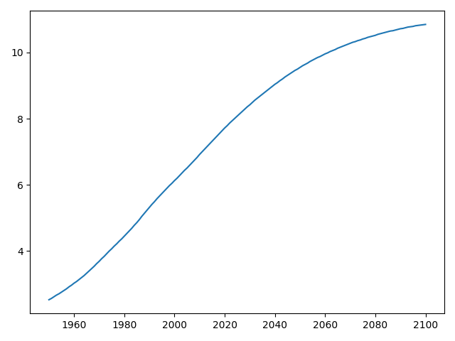

## Task 10

**Description:**

Two lists are given below:

- `life_exp`: contains the life expectancy for countries;
- `gdp_cap`: contains the GDP per capita (i.e. per person) for each country expressed in US Dollars.

```python
life_exp = [43.828, 76.423, 72.301, 42.731, 75.32, 81.235, 79.829, 75.635, 64.062, 79.441, 56.728, 65.554, 74.852, 50.728, 72.39, 73.005, 52.295, 49.58, 59.723, 50.43, 80.653, 44.74100000000001, 50.651, 78.553, 72.961, 72.889, 65.152, 46.462, 55.322, 78.782, 48.328, 75.748, 78.273, 76.486, 78.332, 54.791, 72.235, 74.994, 71.33800000000001, 71.878, 51.57899999999999, 58.04, 52.947, 79.313, 80.657, 56.735, 59.448, 79.406, 60.022, 79.483, 70.259, 56.007, 46.388000000000005, 60.916, 70.19800000000001, 82.208, 73.33800000000001, 81.757, 64.69800000000001, 70.65, 70.964, 59.545, 78.885, 80.745, 80.546, 72.567, 82.603, 72.535, 54.11, 67.297, 78.623, 77.58800000000001, 71.993, 42.592, 45.678, 73.952, 59.443000000000005, 48.303, 74.241, 54.467, 64.164, 72.801, 76.195, 66.803, 74.543, 71.164, 42.082, 62.069, 52.906000000000006, 63.785, 79.762, 80.204, 72.899, 56.867, 46.859, 80.196, 75.64, 65.483, 75.53699999999999, 71.752, 71.421, 71.688, 75.563, 78.098, 78.74600000000001, 76.442, 72.476, 46.242, 65.528, 72.777, 63.062, 74.002, 42.568000000000005, 79.972, 74.663, 77.926, 48.159, 49.339, 80.941, 72.396, 58.556, 39.613, 80.884, 81.70100000000001, 74.143, 78.4, 52.517, 70.616, 58.42, 69.819, 73.923, 71.777, 51.542, 79.425, 78.242, 76.384, 73.747, 74.249, 73.422, 62.698, 42.38399999999999, 43.487]
gdp_cap = [974.5803384, 5937.029525999999, 6223.367465, 4797.231267, 12779.37964, 34435.367439999995, 36126.4927, 29796.04834, 1391.253792, 33692.60508, 1441.284873, 3822.137084, 7446.298803, 12569.85177, 9065.800825, 10680.79282, 1217.032994, 430.0706916, 1713.778686, 2042.09524, 36319.23501, 706.016537, 1704.063724, 13171.63885, 4959.114854, 7006.580419, 986.1478792, 277.5518587, 3632.557798, 9645.06142, 1544.750112, 14619.222719999998, 8948.102923, 22833.30851, 35278.41874, 2082.4815670000003, 6025.374752000001, 6873.262326000001, 5581.180998, 5728.353514, 12154.08975, 641.3695236000001, 690.8055759, 33207.0844, 30470.0167, 13206.48452, 752.7497265, 32170.37442, 1327.60891, 27538.41188, 5186.050003, 942.6542111, 579.2317429999999, 1201.637154, 3548.3308460000003, 39724.97867, 18008.94444, 36180.78919, 2452.210407, 3540.651564, 11605.71449, 4471.061906, 40675.99635, 25523.2771, 28569.7197, 7320.880262000001, 31656.06806, 4519.461171, 1463.249282, 1593.06548, 23348.139730000003, 47306.98978, 10461.05868, 1569.331442, 414.5073415, 12057.49928, 1044.770126, 759.3499101, 12451.6558, 1042.581557, 1803.151496, 10956.99112, 11977.57496, 3095.7722710000003, 9253.896111, 3820.17523, 823.6856205, 944.0, 4811.060429, 1091.359778, 36797.93332, 25185.00911, 2749.320965, 619.6768923999999, 2013.977305, 49357.19017, 22316.19287, 2605.94758, 9809.185636, 4172.838464, 7408.905561, 3190.481016, 15389.924680000002, 20509.64777, 19328.70901, 7670.122558, 10808.47561, 863.0884639000001, 1598.435089, 21654.83194, 1712.472136, 9786.534714, 862.5407561000001, 47143.17964, 18678.31435, 25768.25759, 926.1410683, 9269.657808, 28821.0637, 3970.095407, 2602.394995, 4513.480643, 33859.74835, 37506.41907, 4184.548089, 28718.27684, 1107.482182, 7458.396326999999, 882.9699437999999, 18008.50924, 7092.923025, 8458.276384, 1056.380121, 33203.26128, 42951.65309, 10611.46299, 11415.80569, 2441.576404, 3025.349798, 2280.769906, 1271.211593, 469.70929810000007]
```

GDP stands for Gross Domestic Product. It represents the size of the economy of a country. Divide this by the population size and you get the GDP per capita.

Print the last item from both lists and build a line chart, with `gdp_cap` on the x-axis, and `life_exp` on the y-axis.

Answer the following question in a comment: *Does it make sense to plot this data on a line plot and what would be a better plot?*.

**Acceptance criteria:**

1. The test case passes.
2. A comment is written with an answer to the question in the description.

**Test case:**

```python
python task10.py
```

```console
Last life expectancy: 43.487
Last GDP per capita: 469.70929810000007
```

and the following plot is created:

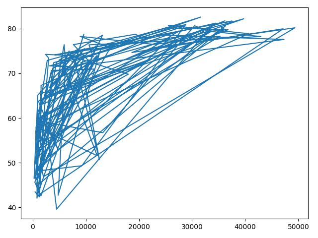

## Task 11

**Description:**

A line plot is not an appropriate plot for the above exercise. Use a more appropriate one. Create one version without and putting the x-axis on a logarithmic scale and another version in which the x-axis is scaled logarithmically.

**Acceptance criteria:**

1. The test case passes.

**Test case:**

```python
python task11.py
```

The following plot is created:

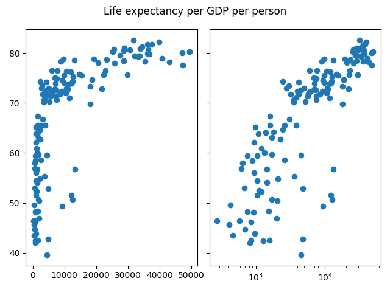

## Task 12

**Description:**

In the previous exercise, we saw that the higher GDP usually corresponds to a higher life expectancy. In other words, **there is a positive correlation**.

Do you think there's a relationship between population and life expectancy of a country?

Use the list `life_exp` from the previous exercise and this time also `pop` is available below, listing the corresponding populations for the countries in 2007. The populations are in millions of people.

```python
pop = [31.889923, 3.600523, 33.333216, 12.420476, 40.301927, 20.434176, 8.199783, 0.708573, 150.448339, 10.392226, 8.078314, 9.119152, 4.552198, 1.639131, 190.010647, 7.322858, 14.326203, 8.390505, 14.131858, 17.696293, 33.390141, 4.369038, 10.238807, 16.284741, 1318.683096, 44.22755, 0.71096, 64.606759, 3.80061, 4.133884, 18.013409, 4.493312, 11.416987, 10.228744, 5.46812, 0.496374, 9.319622, 13.75568, 80.264543, 6.939688, 0.551201, 4.906585, 76.511887, 5.23846, 61.083916, 1.454867, 1.688359, 82.400996, 22.873338, 10.70629, 12.572928, 9.947814, 1.472041, 8.502814, 7.483763, 6.980412, 9.956108, 0.301931, 1110.396331, 223.547, 69.45357, 27.499638, 4.109086, 6.426679, 58.147733, 2.780132, 127.467972, 6.053193, 35.610177, 23.301725, 49.04479, 2.505559, 3.921278, 2.012649, 3.193942, 6.036914, 19.167654, 13.327079, 24.821286, 12.031795, 3.270065, 1.250882, 108.700891, 2.874127, 0.684736, 33.757175, 19.951656, 47.76198, 2.05508, 28.90179, 16.570613, 4.115771, 5.675356, 12.894865, 135.031164, 4.627926, 3.204897, 169.270617, 3.242173, 6.667147, 28.674757, 91.077287, 38.518241, 10.642836, 3.942491, 0.798094, 22.276056, 8.860588, 0.199579, 27.601038, 12.267493, 10.150265, 6.144562, 4.553009, 5.447502, 2.009245, 9.118773, 43.997828, 40.448191, 20.378239, 42.292929, 1.133066, 9.031088, 7.554661, 19.314747, 23.174294, 38.13964, 65.068149, 5.701579, 1.056608, 10.276158, 71.158647, 29.170398, 60.776238, 301.139947, 3.447496, 26.084662, 85.262356, 4.018332, 22.211743, 11.746035, 12.311143]
```

**Acceptance criteria:**

1. An appropriate plot type is used.
2. A comment is written with an answer to the question in the description.

## Task 13

**Description:**

Create a histogram of the list `life_exp` to see how the life expectancy in different countries is distributed. Do not specify the number of bins.

Answer the following question in a comment: *Which bin contains the most observations?*.

**Acceptance criteria:**

1. The test case passes.
2. A comment is written with an answer to the question in the description.

**Test case:**

```console
python task13.py
```

The following plot is created:

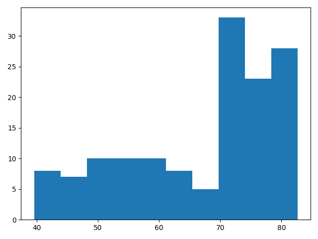

## Task 14

**Description:**

Create two plots on the same canvas: one with `5` bins and another with `20` bins. In order for the information to be presented in a non-biased way, make the two plots share the `y`-axis.

Answer the following questions:

- Which bin contains the most observations in the histogram with `5` bins?
- Is increasing the number of bins beneficial?

**Acceptance criteria:**

1. The test case passes.
2. A comment is written with answers to the questions in the description.

**Test case:**

```console
python task14.py
```

The following plot is created:

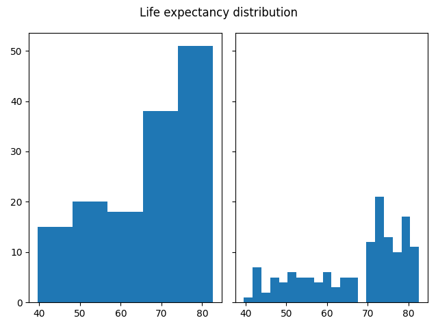

## Task 15

**Description:**

In `notes.md` we saw population pyramids for the present day and for the future. Because we were using a histogram, it was very easy to make a comparison.

Let's do a similar comparison. `life_exp` contains life expectancy data for different countries in `2007`. Here is a second list, `life_exp1950`, containing similar data for `1950`:

```python
life_exp1950 = [28.8, 55.23, 43.08, 30.02, 62.48, 69.12, 66.8, 50.94, 37.48, 68.0, 38.22, 40.41, 53.82, 47.62, 50.92, 59.6, 31.98, 39.03, 39.42, 38.52, 68.75, 35.46, 38.09, 54.74, 44.0, 50.64, 40.72, 39.14, 42.11, 57.21, 40.48, 61.21, 59.42, 66.87, 70.78, 34.81, 45.93, 48.36, 41.89, 45.26, 34.48, 35.93, 34.08, 66.55, 67.41, 37.0, 30.0, 67.5, 43.15, 65.86, 42.02, 33.61, 32.5, 37.58, 41.91, 60.96, 64.03, 72.49, 37.37, 37.47, 44.87, 45.32, 66.91, 65.39, 65.94, 58.53, 63.03, 43.16, 42.27, 50.06, 47.45, 55.56, 55.93, 42.14, 38.48, 42.72, 36.68, 36.26, 48.46, 33.68, 40.54, 50.99, 50.79, 42.24, 59.16, 42.87, 31.29, 36.32, 41.72, 36.16, 72.13, 69.39, 42.31, 37.44, 36.32, 72.67, 37.58, 43.44, 55.19, 62.65, 43.9, 47.75, 61.31, 59.82, 64.28, 52.72, 61.05, 40.0, 46.47, 39.88, 37.28, 58.0, 30.33, 60.4, 64.36, 65.57, 32.98, 45.01, 64.94, 57.59, 38.64, 41.41, 71.86, 69.62, 45.88, 58.5, 41.22, 50.85, 38.6, 59.1, 44.6, 43.58, 39.98, 69.18, 68.44, 66.07, 55.09, 40.41, 43.16, 32.55, 42.04, 48.45]
```

Create a histograms with `15` bins for both datasets, put them side-by-side, sharing the `y`-axis and answer the following question: *Is there a big difference with the histogram for the 2007 data?*.

**Acceptance criteria:**

1. The test case passes.
2. A comment is written with an answer to the question in the description.

**Test case:**

```console
python task15.py
```

The following plot is created:

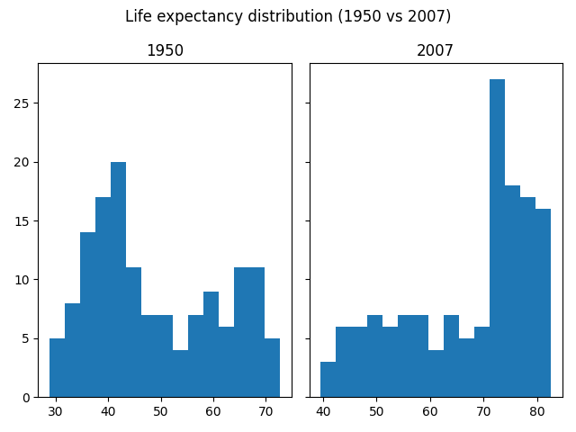

## Task 16

**Description:**

Create a scatter plot with world development data: GDP per capita on the `x`-axis (logarithmic scale), life expectancy on the `y`-axis. Add axis labels - `'GDP per Capita [in USD]'` and `'Life Expectancy [in years]'`, and a title - `'World Development in 2007'`, to the plot.

```python
gdp_cap = [974.5803384, 5937.029525999999, 6223.367465, 4797.231267, 12779.37964, 34435.367439999995, 36126.4927, 29796.04834, 1391.253792, 33692.60508, 1441.284873, 3822.137084, 7446.298803, 12569.85177, 9065.800825, 10680.79282, 1217.032994, 430.0706916, 1713.778686, 2042.09524, 36319.23501, 706.016537, 1704.063724, 13171.63885, 4959.114854, 7006.580419, 986.1478792, 277.5518587, 3632.557798, 9645.06142, 1544.750112, 14619.222719999998, 8948.102923, 22833.30851, 35278.41874, 2082.4815670000003, 6025.374752000001, 6873.262326000001, 5581.180998, 5728.353514, 12154.08975, 641.3695236000001, 690.8055759, 33207.0844, 30470.0167, 13206.48452, 752.7497265, 32170.37442, 1327.60891, 27538.41188, 5186.050003, 942.6542111, 579.2317429999999, 1201.637154, 3548.3308460000003, 39724.97867, 18008.94444, 36180.78919, 2452.210407, 3540.651564, 11605.71449, 4471.061906, 40675.99635, 25523.2771, 28569.7197, 7320.880262000001, 31656.06806, 4519.461171, 1463.249282, 1593.06548, 23348.139730000003, 47306.98978, 10461.05868, 1569.331442, 414.5073415, 12057.49928, 1044.770126, 759.3499101, 12451.6558, 1042.581557, 1803.151496, 10956.99112, 11977.57496, 3095.7722710000003, 9253.896111, 3820.17523, 823.6856205, 944.0, 4811.060429, 1091.359778, 36797.93332, 25185.00911, 2749.320965, 619.6768923999999, 2013.977305, 49357.19017, 22316.19287, 2605.94758, 9809.185636, 4172.838464, 7408.905561, 3190.481016, 15389.924680000002, 20509.64777, 19328.70901, 7670.122558, 10808.47561, 863.0884639000001, 1598.435089, 21654.83194, 1712.472136, 9786.534714, 862.5407561000001, 47143.17964, 18678.31435, 25768.25759, 926.1410683, 9269.657808, 28821.0637, 3970.095407, 2602.394995, 4513.480643, 33859.74835, 37506.41907, 4184.548089, 28718.27684, 1107.482182, 7458.396326999999, 882.9699437999999, 18008.50924, 7092.923025, 8458.276384, 1056.380121, 33203.26128, 42951.65309, 10611.46299, 11415.80569, 2441.576404, 3025.349798, 2280.769906, 1271.211593, 469.70929810000007]
life_exp = [43.828, 76.423, 72.301, 42.731, 75.32, 81.235, 79.829, 75.635, 64.062, 79.441, 56.728, 65.554, 74.852, 50.728, 72.39, 73.005, 52.295, 49.58, 59.723, 50.43, 80.653, 44.74100000000001, 50.651, 78.553, 72.961, 72.889, 65.152, 46.462, 55.322, 78.782, 48.328, 75.748, 78.273, 76.486, 78.332, 54.791, 72.235, 74.994, 71.33800000000001, 71.878, 51.57899999999999, 58.04, 52.947, 79.313, 80.657, 56.735, 59.448, 79.406, 60.022, 79.483, 70.259, 56.007, 46.388000000000005, 60.916, 70.19800000000001, 82.208, 73.33800000000001, 81.757, 64.69800000000001, 70.65, 70.964, 59.545, 78.885, 80.745, 80.546, 72.567, 82.603, 72.535, 54.11, 67.297, 78.623, 77.58800000000001, 71.993, 42.592, 45.678, 73.952, 59.443000000000005, 48.303, 74.241, 54.467, 64.164, 72.801, 76.195, 66.803, 74.543, 71.164, 42.082, 62.069, 52.906000000000006, 63.785, 79.762, 80.204, 72.899, 56.867, 46.859, 80.196, 75.64, 65.483, 75.53699999999999, 71.752, 71.421, 71.688, 75.563, 78.098, 78.74600000000001, 76.442, 72.476, 46.242, 65.528, 72.777, 63.062, 74.002, 42.568000000000005, 79.972, 74.663, 77.926, 48.159, 49.339, 80.941, 72.396, 58.556, 39.613, 80.884, 81.70100000000001, 74.143, 78.4, 52.517, 70.616, 58.42, 69.819, 73.923, 71.777, 51.542, 79.425, 78.242, 76.384, 73.747, 74.249, 73.422, 62.698, 42.38399999999999, 43.487]
```

**Acceptance criteria:**

1. The test case passes.

**Test case:**

```console
python task16.py
```

The following plot is created:

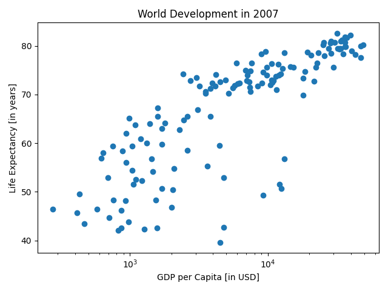

## Task 17

**Description:**

Let's do something different 🙂. Your task is to recreate the following plot:

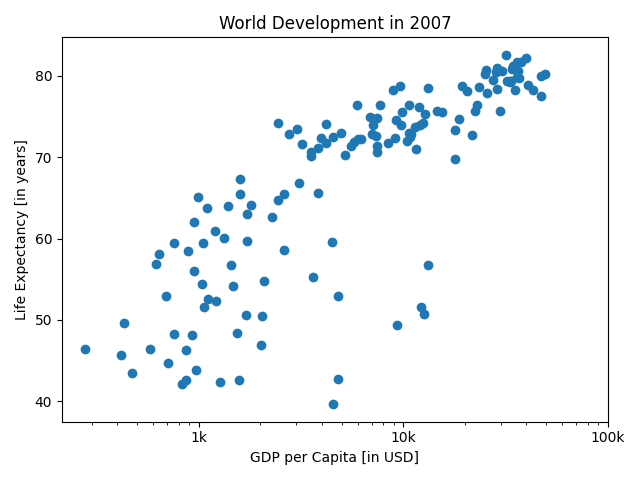

**Acceptance criteria:**

1. Python code is written that recreates the above plot.

## Task 18

**Description:**

Part of the result of running `help(plt.scatter)` is the following:

```console
Help on function scatter in module matplotlib.pyplot:

scatter(x: 'float | ArrayLike', y: 'float | ArrayLike', s: 'float | ArrayLike | None' = None, c: 'ArrayLike | Sequence[ColorType] | ColorType | None' = No
ne, marker: 'MarkerType | None' = None, cmap: 'str | Colormap | None' = None, norm: 'str | Normalize | None' = None, vmin: 'float | None' = None, vmax: 'f
loat | None' = None, alpha: 'float | None' = None, linewidths: 'float | Sequence[float] | None' = None, *, edgecolors: "Literal['face', 'none'] | ColorTyp
e | Sequence[ColorType] | None" = None, plotnonfinite: 'bool' = False, data=None, **kwargs) -> 'PathCollection'
    A scatter plot of *y* vs. *x* with varying marker size and/or color.
    
    Parameters
    ----------
    x, y : float or array-like, shape (n, )
        The data positions.
    
    s : float or array-like, shape (n, ), optional
        The marker size in points**2 (typographic points are 1/72 in.).
        Default is ``rcParams['lines.markersize'] ** 2``.
```

By using the above snippet and the following list `pop`:

```python
pop = [31.889923, 3.600523, 33.333216, 12.420476, 40.301927, 20.434176, 8.199783, 0.708573, 150.448339, 10.392226, 8.078314, 9.119152, 4.552198, 1.639131, 190.010647, 7.322858, 14.326203, 8.390505, 14.131858, 17.696293, 33.390141, 4.369038, 10.238807, 16.284741, 1318.683096, 44.22755, 0.71096, 64.606759, 3.80061, 4.133884, 18.013409, 4.493312, 11.416987, 10.228744, 5.46812, 0.496374, 9.319622, 13.75568, 80.264543, 6.939688, 0.551201, 4.906585, 76.511887, 5.23846, 61.083916, 1.454867, 1.688359, 82.400996, 22.873338, 10.70629, 12.572928, 9.947814, 1.472041, 8.502814, 7.483763, 6.980412, 9.956108, 0.301931, 1110.396331, 223.547, 69.45357, 27.499638, 4.109086, 6.426679, 58.147733, 2.780132, 127.467972, 6.053193, 35.610177, 23.301725, 49.04479, 2.505559, 3.921278, 2.012649, 3.193942, 6.036914, 19.167654, 13.327079, 24.821286, 12.031795, 3.270065, 1.250882, 108.700891, 2.874127, 0.684736, 33.757175, 19.951656, 47.76198, 2.05508, 28.90179, 16.570613, 4.115771, 5.675356, 12.894865, 135.031164, 4.627926, 3.204897, 169.270617, 3.242173, 6.667147, 28.674757, 91.077287, 38.518241, 10.642836, 3.942491, 0.798094, 22.276056, 8.860588, 0.199579, 27.601038, 12.267493, 10.150265, 6.144562, 4.553009, 5.447502, 2.009245, 9.118773, 43.997828, 40.448191, 20.378239, 42.292929, 1.133066, 9.031088, 7.554661, 19.314747, 23.174294, 38.13964, 65.068149, 5.701579, 1.056608, 10.276158, 71.158647, 29.170398, 60.776238, 301.139947, 3.447496, 26.084662, 85.262356, 4.018332, 22.211743, 11.746035, 12.311143]
```

recreate the below plot. Store `pop` as a numpy array **and double every value in it**, before starting to create the plot.


**Acceptance criteria:**

1. Python code is written that recreates the above plot.

## Task 19

**Description:**

By using the documentation of `plt.scatter` and the list `colors` recreate the below plot. Change the opacity of the bubbles by setting the `alpha` argument to `0.8`.

```python
colors = ['red', 'green', 'blue', 'blue', 'yellow', 'black', 'green', 'red', 'red', 'green', 'blue', 'yellow', 'green', 'blue', 'yellow', 'green', 'blue', 'blue', 'red', 'blue', 'yellow', 'blue', 'blue', 'yellow', 'red', 'yellow', 'blue', 'blue', 'blue', 'yellow', 'blue', 'green', 'yellow', 'green', 'green', 'blue', 'yellow', 'yellow', 'blue', 'yellow', 'blue', 'blue', 'blue', 'green', 'green', 'blue', 'blue', 'green', 'blue', 'green', 'yellow', 'blue', 'blue', 'yellow', 'yellow', 'red', 'green', 'green', 'red', 'red', 'red', 'red', 'green', 'red', 'green', 'yellow', 'red', 'red', 'blue', 'red', 'red', 'red', 'red', 'blue', 'blue', 'blue', 'blue', 'blue', 'red', 'blue', 'blue', 'blue', 'yellow', 'red', 'green', 'blue', 'blue', 'red', 'blue', 'red', 'green', 'black', 'yellow', 'blue', 'blue', 'green', 'red', 'red', 'yellow', 'yellow', 'yellow', 'red', 'green', 'green', 'yellow', 'blue', 'green', 'blue', 'blue', 'red', 'blue', 'green', 'blue', 'red', 'green', 'green', 'blue', 'blue', 'green', 'red', 'blue', 'blue', 'green', 'green', 'red', 'red', 'blue', 'red', 'blue', 'yellow', 'blue', 'green', 'blue', 'green', 'yellow', 'yellow', 'yellow', 'red', 'red', 'red', 'blue', 'blue']
```


**Acceptance criteria:**

1. Python code is written that recreates the above plot.

## Task 20

**Description:**

Let's do two final touch-ups. Using the documentation of the function `plt.text` and `plt.grid`, recreate the below plot.

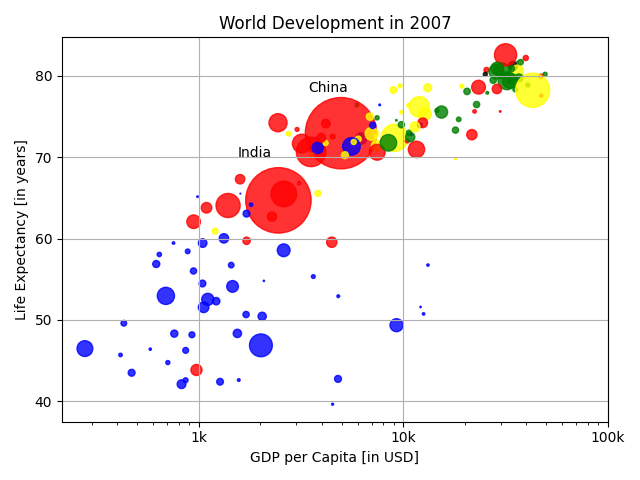

If you have a look at your colorful plot, it's clear that people live longer in countries with a higher GDP per capita. No high income countries have really short life expectancy, and no low income countries have very long life expectancy. Still, there is a huge difference in life expectancy between countries on the same income level. Most people live in middle income countries where difference in lifespan is huge between countries; depending on how income is distributed and how it is used.

What can you say about the plot?

```text
A. The countries in blue, corresponding to Africa, have both low life expectancy and a low GDP per capita.

B. There is a negative correlation between GDP per capita and life expectancy.

C. China has both a lower GDP per capita and lower life expectancy compared to India.
```

**Acceptance criteria:**

1. Python code is written that recreates the above plot.
2. A comment is written with an answer to the question in the description.

## Task 21

**Description:**

In the exercises that follow you will be working with vehicle data from different countries. Each observation corresponds to a country and the columns give information about the number of vehicles per capita, whether people drive left or right, and so on.

Three lists are defined below:

- `names`: contains the country names for which data is available;
- `dr`: booleans that tell whether people drive right in the corresponding country;
- `cpc`: the number of motor vehicles per `1000` people in the corresponding country.

```python
names = ['United States', 'Australia', 'Japan', 'India', 'Russia', 'Morocco', 'Egypt']
dr =  [True, False, False, False, True, True, True]
cpc = [809, 731, 588, 18, 200, 70, 45]
```

Create and output a pandas dataframe with three columns out of this data: `country`, `drives_right`, and `cars_per_cap`.

**Acceptance criteria:**

1. The test case passes.

**Test case:**

```console
python task21.py
```

```console
         country  drives_right  cars_per_cap
0  United States          True           809
1      Australia         False           731
2          Japan         False           588
3          India         False            18
4         Russia          True           200
5        Morocco          True            70
6          Egypt          True            45
```

## Task 22

**Description:**

The row labels in the output of the previous task (i.e. the labels for the different observations) were automatically set to integers from `0` up to `6`. This task is about setting them to something more meaningful. Use the following mapping:

- `United States` should correspond to `US`;
- `Australia` should correspond to `AUS`;
- `Japan` should correspond to `JPN`;
- `India` should correspond to `IN`;
- `Russia` should correspond to `RU`;
- `Morocco` should correspond to `MOR`;
- `Egypt` should correspond to `EG`.

**Acceptance criteria:**

1. The test case passes.

**Test case:**

```console
python task22.py
```

```console
           country  drives_right  cars_per_cap
US   United States          True           809
AUS      Australia         False           731
JPN          Japan         False           588
IN           India         False            18
RU          Russia          True           200
MOR        Morocco          True            70
EG           Egypt          True            45
```

## Task 23

**Description:**

Putting data in a dictionary and then building a DataFrame works, but it's not very efficient. What if you're dealing with millions of observations? In those cases, the data is typically available as files with a regular (and most likely tabular) structure. One of those file types is the CSV file. Let's explore the same `cars` data from the previous exercises, however, the data is available in a CSV file, named `cars.csv` (present in the `DATA` folder in the repository).

Load the data from the CSV file and display it. You'll notice that the row labels were imported as another column without a name. After displaying the first result, load the data again, but this time set the first column to be the index.

**Acceptance criteria:**

1. The test case passes.

**Test case:**

```console
python task23.py
```

```console
  Unnamed: 0  cars_per_cap        country  drives_right
0         US           809  United States          True
1        AUS           731      Australia         False
2        JAP           588          Japan         False
3         IN            18          India         False
4         RU           200         Russia          True
5        MOR            70        Morocco          True
6         EG            45          Egypt          True

After setting first column as index:
     cars_per_cap        country  drives_right
US            809  United States          True
AUS           731      Australia         False
JAP           588          Japan         False
IN             18          India         False
RU            200         Russia          True
MOR            70        Morocco          True
EG             45          Egypt          True
```

## Task 24

**Description:**

Load the `cars` data from the CSV file and output:

- the `country` column as Pandas Series;
- the `country` column as Pandas DataFrame;
- a DataFrame with the `country` and `drives_right` columns;
- the first `3` observations;
- the fourth, fifth and sixth observation.

Then, using the `cars_advanced.csv` data output:

- the observation corresponding to Japan as a Series;
- the observations for Australia and Egypt as a DataFrame;
- the `drives_right` value of `Morocco`;
- a sub-DataFrame, containing the observations for `Russia` and `Morocco` and the columns `country` and `drives_right`.

**Acceptance criteria:**

1. The test case passes.

**Test case:**

```console
python task24.py
```

```console
US     United States
AUS        Australia
JAP            Japan
IN             India
RU            Russia
MOR          Morocco
EG             Egypt
Name: country, dtype: object

           country
US   United States
AUS      Australia
JAP          Japan
IN           India
RU          Russia
MOR        Morocco
EG           Egypt

           country  drives_right
US   United States          True
AUS      Australia         False
JAP          Japan         False
IN           India         False
RU          Russia          True
MOR        Morocco          True
EG           Egypt          True

     cars_per_cap        country  drives_right
US            809  United States          True
AUS           731      Australia         False
JAP           588          Japan         False

     cars_per_cap  country  drives_right
IN             18    India         False
RU            200   Russia          True
MOR            70  Morocco          True

cars_per_cap      588
country         Japan
drives_right    False
Name: JPN, dtype: object

     cars_per_cap    country  drives_right
AUS           731  Australia         False
EG             45      Egypt          True

     drives_right
MOR          True

     country  drives_right
RU    Russia          True
MOR  Morocco          True
```

## Task 25

**Description:**

Load the `cars_advanced` data from the CSV file and output:

- all observations for which the driving happens on the right side of the road;
- the countries for which the percentage of cars per person is higher than `500`;
- the countries that have a percentage of cars per person between `10` and `80` inclusive. Demonstrate how this can be done in two different ways.

**Acceptance criteria:**

1. The test case passes.
2. The last bullet point has two implementations.

**Test case:**

```console
python task25.py
```

```console
     cars_per_cap        country  drives_right
US            809  United States          True
RU            200         Russia          True
MOR            70        Morocco          True
EG             45          Egypt          True 

US     United States
AUS        Australia
JPN            Japan
Name: country, dtype: object

IN       India
MOR    Morocco
EG       Egypt
Name: country, dtype: object

Alternative
IN       India
MOR    Morocco
EG       Egypt
Name: country, dtype: object
```

## Task 26

**Description:**

Load the `cars_advanced` data from the CSV file. Write a `for` loop that iterates over the rows of the data and on each iteration perform outputs the row label and all of the row's contents.

**Acceptance criteria:**

1. The test case passes.

**Test case:**

```console
python task26.py
```

```console
Label is "US"
Row contents:
cars_per_cap              809
country         United States
drives_right             True
Name: US, dtype: object

Label is "AUS"
Row contents:
cars_per_cap          731
country         Australia
drives_right        False
Name: AUS, dtype: object

Label is "JPN"
Row contents:
cars_per_cap      588
country         Japan
drives_right    False
Name: JPN, dtype: object

Label is "IN"
Row contents:
cars_per_cap       18
country         India
drives_right    False
Name: IN, dtype: object

Label is "RU"
Row contents:
cars_per_cap       200
country         Russia
drives_right      True
Name: RU, dtype: object

Label is "MOR"
Row contents:
cars_per_cap         70
country         Morocco
drives_right       True
Name: MOR, dtype: object

Label is "EG"
Row contents:
cars_per_cap       45
country         Egypt
drives_right     True
Name: EG, dtype: object
```

## Task 27

**Description:**

Load the `cars_advanced` data from the CSV file. Write a `for` loop that outputs `US: 809` on the first iteration, `AUS: 731` on the second iteration, and so on.

**Acceptance criteria:**

1. The test case passes.

**Test case:**

```console
python task27.py
```

```console
US: 809
AUS: 731
JPN: 588
IN: 18
RU: 200
MOR: 70
EG: 45
```

## Task 28

**Description:**

Load the `cars_advanced` data from the CSV file. Use a `for` loop to add a new column, named `COUNTRY`, that contains a uppercase version of the country names in the `country` column.

**Acceptance criteria:**

1. The test case passes.

**Test case:**

```console
python task28.py
```

```console
Before:
     cars_per_cap        country  drives_right
US            809  United States          True
AUS           731      Australia         False
JPN           588          Japan         False
IN             18          India         False
RU            200         Russia          True
MOR            70        Morocco          True
EG             45          Egypt          True

After:
     cars_per_cap        country  drives_right        COUNTRY
US            809  United States          True  UNITED STATES
AUS           731      Australia         False      AUSTRALIA
JPN           588          Japan         False          JAPAN
IN             18          India         False          INDIA
RU            200         Russia          True         RUSSIA
MOR            70        Morocco          True        MOROCCO
EG             45          Egypt          True          EGYPT
```

## Task 29

**Description:**

Load the `cars_advanced` data from the CSV file. Replace the `for` loop with a one-liner. The call should give the same result: a column `COUNTRY` should be added, containing an uppercase version of the country names.

**Acceptance criteria:**

1. The test case passes.

**Test case:**

```console
python task29.py
```

```console
Before:
     cars_per_cap        country  drives_right
US            809  United States          True
AUS           731      Australia         False
JPN           588          Japan         False
IN             18          India         False
RU            200         Russia          True
MOR            70        Morocco          True
EG             45          Egypt          True

After:
     cars_per_cap        country  drives_right        COUNTRY
US            809  United States          True  UNITED STATES
AUS           731      Australia         False      AUSTRALIA
JPN           588          Japan         False          JAPAN
IN             18          India         False          INDIA
RU            200         Russia          True         RUSSIA
MOR            70        Morocco          True        MOROCCO
EG             45          Egypt          True          EGYPT
```

## Task 30

**Description:**

Let's play with simulation:

- generate a random floating-point number in the interval $[0, 1)$;
- generate two random integers that simulate rolling a dice two times;
- assume that you're currently at step `50` of the Empire State Building. The number on the dice is the number of steps you go up. Simulate `1` throw of a dice updating the step based on every possible outcome of the dice. Before the throw, print the value of `step`. After the throw print the value of the `dice` and the value of the `step`. Also, as a recap:
  - if dice is `1` or `2`, you go one step down;
  - if dice is `3`, `4` or `5`, you go one step up;
  - else, you throw the dice again and walk up however many steps the dice lands on.

Set the `seed` parameter to `123`.

**Acceptance criteria:**

1. The test case passes.

**Test case:**

```console
python task30.py
```

```console
Random float: 0.6964691855978616
Random integer 1: 3
Random integer 2: 5
Before throw step = 50
After throw dice = 3
After throw step = 51
```

## Task 31

**Description:**

Let's keep track of the number of the step you're currently on while making this random walk. Output the change in the step number if you toss the dice for `100` times starting from step `0`.

Set the `seed` parameter to `123`.

Answer the following question in a comment: *Do you notice anything unexpected in the output?*.

**Acceptance criteria:**

1. The test case passes.
2. The question in the description is answered in a comment.

**Test case:**

```console
python task31.py
```

```console
[0, 3, 4, 5, 4, 5, 6, 7, 6, 5, 4, 3, 2, 1, 0, -1, 0, 5, 4, 3, 4, 3, 4, 5, 6, 7, 8, 7, 8, 7, 8, 9, 10, 11, 10, 14, 15, 14, 15, 14, 15, 16, 17, 18, 19, 20, 21, 24, 25, 26, 27, 32, 33, 37, 38, 37, 38, 39, 38, 39, 40, 42, 43, 44, 43, 42, 43, 44, 43, 42, 43, 44, 46, 45, 44, 45, 44, 45, 46, 47, 49, 48, 49, 50, 51, 52, 53, 52, 51, 52, 51, 52, 53, 52, 55, 56, 57, 58, 57, 58, 59]
```

## Task 32

**Description:**

Fix the bug in the previous logic and rerun the same experiment.

**Acceptance criteria:**

1. The test case passes.

**Test case:**

```console
python task32.py
```

```console
[0, 3, 4, 5, 4, 5, 6, 7, 6, 5, 4, 3, 2, 1, 0, 0, 1, 6, 5, 4, 5, 4, 5, 6, 7, 8, 9, 8, 9, 8, 9, 10, 11, 12, 11, 15, 16, 15, 16, 15, 16, 17, 18, 19, 20, 21, 22, 25, 26, 27, 28, 33, 34, 38, 39, 38, 39, 40, 39, 40, 41, 43, 44, 45, 44, 43, 44, 45, 44, 43, 44, 45, 47, 46, 45, 46, 45, 46, 47, 48, 50, 49, 50, 51, 52, 53, 54, 53, 52, 53, 52, 53, 54, 53, 56, 57, 58, 59, 58, 59, 60]
```

## Task 33

**Description:**

Let's visualize this random walk using a line plot!

**Acceptance criteria:**

1. The test case passes.

**Test case:**

```console
python task33.py
```

The following figure gets generated:

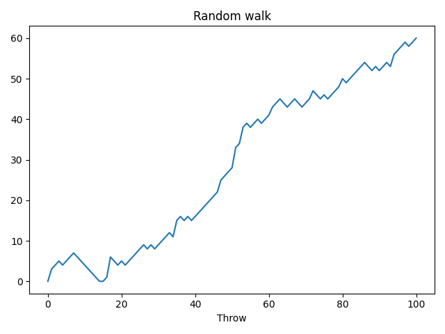

## Task 34

**Description:**

A single random walk is one thing, but that doesn't tell you if you have a good chance at winning the bet.

To get an idea about how big your chances are of reaching `60` steps, you can repeatedly simulate the random walk and collect the results. Let's do this!

Simulate a random walk of `100` steps `5` times. Save the result in a list - `all_walks`. Output `all_walks`. Set the random seed to `123`.

**Acceptance criteria:**

1. The test case passes.

**Test case:**

```console
python task34.py
```

```console
[[0, 3, 4, 5, 4, 5, 6, 7, 6, 5, 4, 3, 2, 1, 0, 0, 1, 6, 5, 4, 5, 4, 5, 6, 7, 8, 9, 8, 9, 8, 9, 10, 11, 12, 11, 15, 16, 15, 16, 15, 16, 17, 18, 19, 20, 21, 22, 25, 26, 27, 28, 33, 34, 38, 39, 38, 39, 40, 39, 40, 41, 43, 44, 45, 44, 43, 44, 45, 44, 43, 44, 45, 47, 46, 45, 46, 45, 46, 47, 48, 50, 49, 50, 51, 52, 53, 54, 53, 52, 53, 52, 53, 54, 53, 56, 57, 58, 59, 58, 59, 60], [0, 4, 3, 2, 4, 3, 4, 6, 7, 8, 13, 12, 13, 14, 15, 16, 17, 16, 21, 22, 23, 24, 23, 22, 21, 20, 19, 20, 21, 22, 28, 27, 26, 25, 26, 27, 28, 27, 28, 29, 28, 33, 34, 33, 32, 31, 30, 31, 30, 29, 31, 32, 35, 36, 38, 39, 40, 41, 40, 39, 40, 41, 42, 43, 42, 43, 44, 45, 48, 49, 50, 49, 50, 49, 50, 51, 52, 56, 55, 54, 55, 56, 57, 56, 57, 56, 57, 59, 64, 63, 64, 65, 66, 67, 68, 69, 68, 69, 70, 71, 73], [0, 2, 1, 2, 3, 6, 5, 6, 5, 6, 7, 8, 7, 8, 7, 8, 9, 11, 10, 9, 10, 11, 10, 12, 13, 14, 15, 16, 17, 18, 17, 18, 19, 24, 25, 24, 23, 22, 21, 22, 23, 24, 29, 30, 29, 30, 31, 32, 33, 34, 35, 34, 33, 34, 33, 39, 38, 39, 38, 39, 38, 39, 43, 47, 49, 51, 50, 51, 53, 52, 58, 59, 61, 62, 61, 62, 63, 64, 63, 64, 65, 66, 68, 67, 66, 67, 73, 78, 77, 76, 80, 81, 82, 83, 85, 84, 85, 84, 85, 84, 83], [0, 6, 5, 6, 7, 8, 9, 10, 11, 12, 13, 12, 13, 12, 11, 12, 11, 12, 11, 12, 13, 17, 18, 17, 23, 22, 21, 22, 21, 20, 21, 20, 24, 23, 24, 23, 24, 23, 24, 26, 25, 24, 23, 24, 23, 28, 29, 30, 29, 28, 29, 28, 29, 28, 33, 34, 33, 32, 31, 30, 31, 32, 36, 42, 43, 44, 45, 46, 45, 46, 48, 49, 50, 51, 50, 49, 50, 49, 50, 51, 52, 51, 52, 53, 54, 53, 52, 53, 54, 59, 60, 61, 66, 65, 66, 65, 66, 67, 68, 69, 68], [0, 6, 5, 6, 5, 4, 5, 9, 10, 11, 12, 13, 12, 11, 10, 9, 8, 9, 10, 11, 12, 13, 14, 13, 14, 15, 14, 15, 16, 19, 18, 19, 18, 19, 22, 23, 24, 25, 24, 23, 26, 27, 28, 29, 28, 27, 28, 31, 32, 37, 38, 37, 38, 37, 38, 37, 43, 42, 41, 42, 44, 43, 42, 41, 42, 43, 44, 45, 49, 54, 55, 56, 57, 60, 61, 62, 63, 64, 65, 66, 65, 64, 65, 66, 65, 71, 70, 71, 72, 71, 70, 71, 70, 69, 75, 74, 73, 74, 75, 74, 73]]
```

## Task 35

**Description:**

`all_walks` is a list of lists: every sub-list represents a single random walk. Convert it into a `numpy` array and create a line plot.

**Acceptance criteria:**

1. The test case passes.

**Test case:**

```console
python task35.py
```

The following figure gets created:

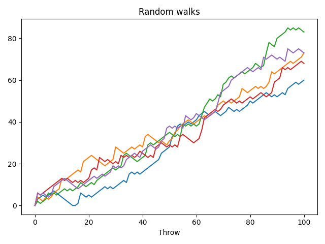

## Task 36

**Description:**

There's still something we forgot. You're a bit clumsy and you have a `0.5%` chance of falling down. That calls for another random number generation. Basically, you can generate a random float between `0` and `1`. If this value is less than or equal to `0.005`, you should reset step to `0`.

Add the clumsiness logic and repeat the experiment `20` times.

**Acceptance criteria:**

1. The test case passes.

**Test case:**

```console
python task36.py
```

The following figure gets created:

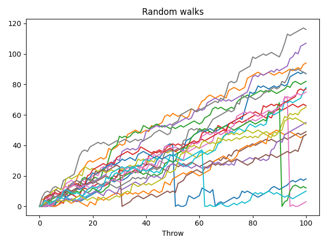

## Task 37

**Description:**

Ok, so what are the odds that you'll reach `60` steps high on the Empire State Building?

To answer this, we need to know the end points of all the random walks we've simulated. These end points have a certain distribution that we can visualize with a histogram.

Simulate the experiment `500` times and calculate the odds. Write their value in a comment.

**Acceptance criteria:**

1. The test case passes.
2. A comment is written with the odds of getting to step `60`.

**Test case:**

```console
python task37.py
```

The following figure gets created:

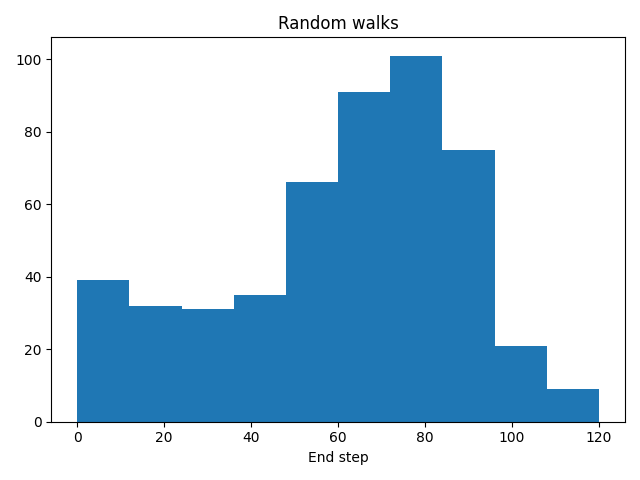
