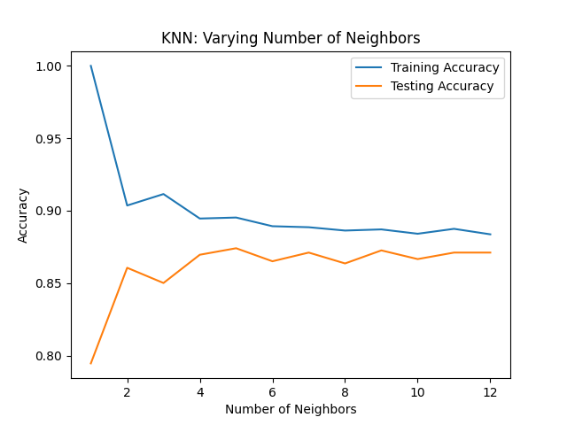

# Goals for week 02

1. Introduce machine learning.
2. Introduce classification.

## Task 01

**Description:**

The `.head()` of a dataset, `churn_df`, is shown below. You can expect the rest of the data to contain similar values.

|   | account_length | total_day_charge | total_eve_charge | total_night_charge | total_intl_charge | customer_service_calls | churn |
|---|----------------|------------------|------------------|--------------------|-------------------|------------------------|-------|
| 0 | 101            | 45.85            | 17.65            | 9.64               | 1.22              | 3                      | 1     |
| 1 | 73             | 22.3             | 9.05             | 9.98               | 2.75              | 2                      | 0     |
| 2 | 86             | 24.62            | 17.53            | 11.49              | 3.13              | 4                      | 0     |
| 3 | 59             | 34.73            | 21.02            | 9.66               | 3.24              | 1                      | 0     |
| 4 | 129            | 27.42            | 18.75            | 10.11              | 2.59              | 1                      | 0     |

Answer the following questions:

1. What is classification?
2. What is binary classification?
3. Which column could be the target variable for binary classification?
4. What term is used to describe the other columns?

**Acceptance criteria:**

1. A Python script (i.e. a `.py` file) is created with the questions put there in a multiline comment.
2. The answers are written **in Bulgarian**.

## Task 02

**Description:**

`scikit-learn` offers a repeatable workflow for using supervised learning models to predict the target variable values when presented with new data. List the steps using pseudocode in that workflow - building a supervised learning model and making predictions using it.

**Acceptance criteria:**

1. A Python script (i.e. a `.py` file) is created.
2. Python pseudocode is written that details the workflow - it's expected that it shouldn't compile.

## Task 03

**Description:**

A telecom company contacts your business. They provide a churn dataset - `telecom_churn_clean.csv` (present in the `DATA` folder in the GitHub repository) alongside a `data dictionary` - a document with column semantics (column definitions).

Here's part of the `data dictionary`:

- ... other column definitions here
- `churn` - whether a customer has stopped being a client or is still a client;
- `account_length` - number of days since the customer's account was created;
- `customer_service_calls` - number of times a customer has called the company's support team;
- ... other column definitions here

The telecom wants to be able to predict whether a customer will leave the company. Your business' internal consultants (i.e. domain experts) tell you that account length should indicate customer loyalty while frequent customer service calls may signal dissatisfaction. Both of these can be good predictors of churning.

Build your first classification model - `KNeighborsClassifier`, and use it to make predictions. Set the number of neighbors to `6`.

**Acceptance criteria:**

1. A Python script is created.
2. A model of type `KNeighborsClassifier` is trained.
3. The test case passes.

**Test case:**

Prediction on `X_new`, as it's defined below, produces `[0 1 0]`.

```python
X_new = np.array([[30.0, 17.5],
                  [107.0, 24.1],
                  [213.0, 10.9]])
```

## Task 04

**Description:**

We'll now search the parameter space of the `KNeighborsClassifier` to see what accuracies we obtain when changing the value of `n_neighbors`. This is known as `hyperparameter optimization`.

First, load and split the churn dataset (`telecom_churn_clean.csv`) into training and testing subsets with 20% of the data going to the test set. Use the full columnset. Set the `random_state` to `42` and ensure stratification is enabled to ensure representative distribution. Create and evaluate a `KNeighborsClassifier` with `n_neighbors=5`.

As a second step, create two dictionaries `train_accuracies` and `test_accuracies`, holding the accuracies obtained by varying the number of neighbors from `1` to `12`. **Store the range in a numpy array.**  Using these dictionaries we'll see where the model overfits and underfits.

The third and final step would be to plot the two dictionaries on a `matplotlib` figure to see how the accuracies change as the number of neighbors changes. Place the latter on the x-axis and the former - on the y-axis. Set the title to "KNN: Varying Number of Neighbors", the x-axis label to "Number of Neighbors" and the y-axis label to "Accuracy".

Round all floating-point numbers to `4` digits.

**Acceptance criteria:**

1. A Python script is created.
2. Data is split into training and testing subsets.
3. The full columnset is used for training and evaluating the model.
4. Two dictionaries are created - `train_accuracies` and `test_accuracies`, holding the accuracies obtained by varying the number of neighbors from `1` to `12`. The range is stored in a numpy array.
5. A single `matplotlib` figure is produced with two lines on it.
6. The test case passes.
7. All floating-point numbers are rounded to `4` digits.

**Test case:**

The following should be printed if the script is executed in a command prompt:

```console
Training Dataset Shape: (2666, 18)
Accuracy when "n_neighbors=5": 0.8741
neighbors=array([ 1,  2,  3,  4,  5,  6,  7,  8,  9, 10, 11, 12])
train_accuracies={1: 1.0, 2: 0.9036, 3: 0.9115, 4: 0.8946, 5: 0.8953, 6: 0.8893, 7: 0.8886, 8: 0.8863, 9: 0.8871, 10: 0.8841, 11: 0.8875, 12: 0.8837}
test_accuracies={1: 0.7946, 2: 0.8606, 3: 0.8501, 4: 0.8696, 5: 0.8741, 6: 0.8651, 7: 0.8711, 8: 0.8636, 9: 0.8726, 10: 0.8666, 11: 0.8711, 12: 0.8711}
```

The following figure should also be produced:



## Task 05

**Description:**

In class we talked about the *k*-nearest neighbors algorithm. This task is about implementing `KNN` from scratch using only `numpy` and `pandas`.

Implement a class called `KNN` that has as a minimum:

- a constructor;
- a `fit` method;
- a `predict` method;
- a `score` method that returns the accuracy of the model on unseen data.

After you finish your implementation compare it to the built-in class from `sklearn`. Apply both algorithm on the same dataset and output the return value of their `score` methods on the test set.

You have the freedom to choose a dataset and split parameters.

**Acceptance criteria:**

1. A Python script is created in which a custom implementation of KNN is compared to that of `sklearn`.
2. `sklearn` is not used in the custom implementation.
