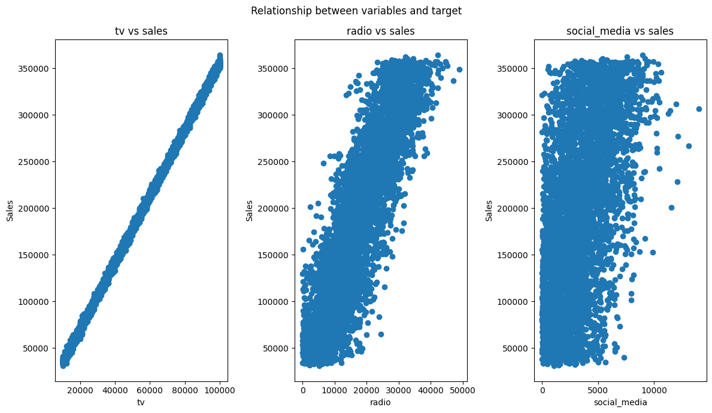
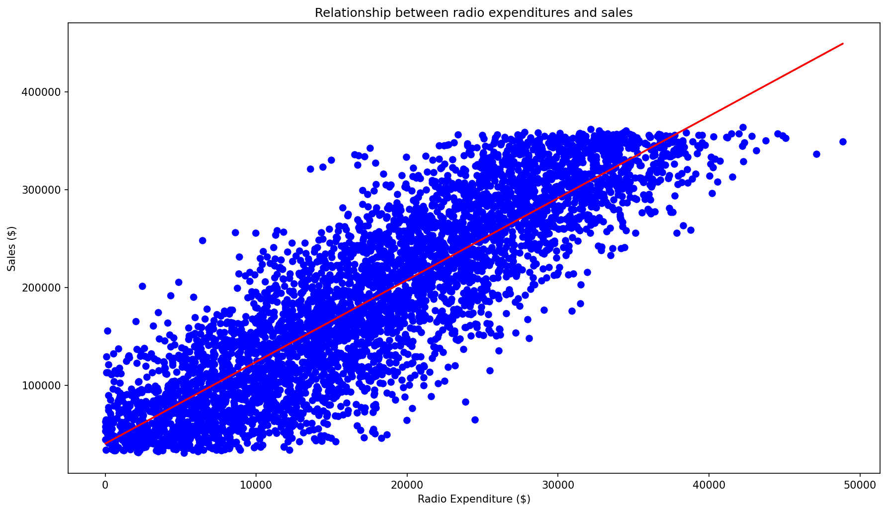

# Goals for week 03

1. Practice simple linear regression.
2. Practice multiple linear regression.

## Task 01 - Simple Linear Regression

**Description:**

A sales company markets its products on different media - TV commercials, radio and Social Media platforms. They contact your team as they need support in finding out which type of media makes them the most sales (and consequently profit). They provide a sales dataset - `advertising_and_sales_clean.csv` (present in the `DATA` folder in the GitHub repository) which contains information on advertising campaign expenditure across different media types, and the number of dollars generated in sales for the respective campaign.

Load the full dataset and print the first two rows. For each of the numeric features, print its relationship to the target variable (the step known as `exploratory data analysis`). Which is the feature that visually to you looks like it has the strongest correlation?

Train a linear regression model using the feature `radio` (don't create a train test split - use the full data) and print the first five predictions it makes again on the full data. Lastly, plot the data and the model.

**Acceptance criteria:**

1. A `LinearRegression` model implementing simple linear regression is created.
2. The test case passes.
3. The part `???` is filled in.

**Test case:**

```console
python task01.py
```

```console
        tv    radio  social_media influencer     sales
0  16000.0  6566.23       2907.98       Mega  54732.76
1  13000.0  9237.76       2409.57       Mega  46677.90

Feature with highest correlation (from visual inspection): ???
First five predictions: [ 95491.17119147 117829.51038393 173423.38071499 291603.11444202
 111137.28167129]
```

and the following two plots are created:



and



## Task 02 - Multiple Linear Regression

**Description:**

Create a multiple linear regression model on 70% of the data. Use the model to predict sales based on the values of the test features. Output the first two predictions alongside the true/expected labels for them. Using the predictions, calculate the loss of the model using the `RMSE` and its quality using the `R^2` metric. Set any random states to `42`.

**Acceptance criteria:**

1. A `LinearRegression` model implementing multiple linear regression is created.
2. The test case passes.

**Test case:**

```console
python task02.py
```

```console
Predictions: [53176.66154234 70996.19873235]
Actual Values: [55261.28, 67574.9]

R^2: 0.9990152104759368
RMSE: 2944.4331996001006
```

## Task 03 - Adjusted $R^2$

**Description:**

Research the definition of $R_{adj}^2$:

- What is the problem with always using $R^2$?
- How does using $R_{adj}^2$ help solve this problem?
- How could we calculate $R_{adj}^2$ in Python?

Create a text file and answer the questions above **in Bulgarian**. Add links to the sources you used.

**Acceptance criteria:**

1. A text file is created.
2. Answers to the questions are given **in Bulgarian**.
3. Sources are added in the end of the file.
