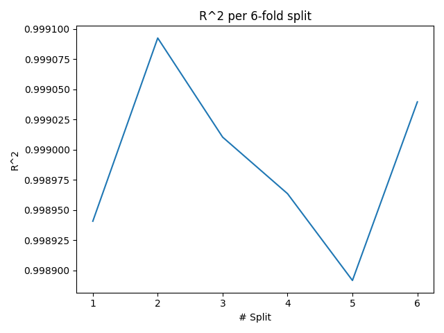
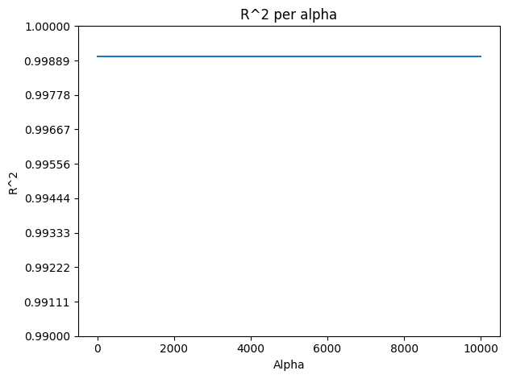
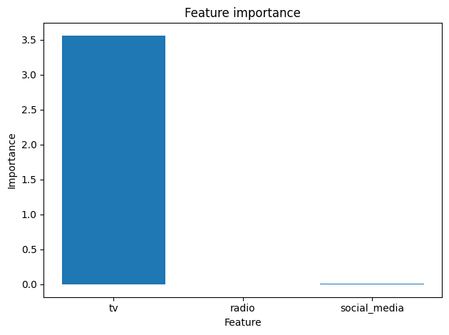
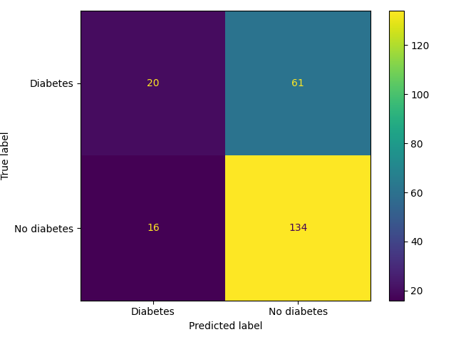

# Goals for week 04

1. Practice cross validation.
2. Practice regularized regression.
3. Practice classification metrics.

## Task 01

**Description:**

Train a linear regression model using 6-fold cross-validation on the full sales dataset (`advertising_and_sales_clean.csv`). Plot the obtained $R^2$ score for each of the folds and output the mean, standard deviation and 95% confidence interval. Set the seed when shuffling and splitting the data to `5`.

**Acceptance criteria:**

1. The test cases passes.

**Test case:**

```console
python task01.py
```

```console
Mean: 0.9989896443678249
Standard Deviation: 6.608118371529651e-05
95% Confidence Interval: [0.99889767 0.99908583]
```

and the following plot is generated:



## Task 02

**Description:**

In the previous task we used a linear regression model with no regularization. This task is about exploring how different strengths of regularization will affect the performance.

Fit Ridge regression models over a range of different alpha values, and output their $R^2$ scores. Create a plot to visually inspect the results as well. Set the `y`-axis values to a range of `10` linearly spaced numbers from `0.99` to `1`.

Use the following alpha values: `[0.1, 1.0, 10.0, 100.0, 1000.0, 10000.0]` and 30% of the data for testing. Set any random states to `42`.

Analyze the graph. Answer questions such as "Do we have overfitting?", "Do we have underfitting?" and "How does heavy penalization affect model performance?".

**Acceptance criteria:**

1. The test case passes.
2. Answers are given to the following questions: "Do we have overfitting?", "Do we have underfitting?" and "How does heavy penalization affect model performance?".

**Test case:**

```python
python task02.py
```

```console
Ridge scores per alpha: {0.1: 0.9990152104759369, 1.0: 0.9990152104759373, 10.0: 0.9990152104759419, 100.0: 0.9990152104759871, 1000.0: 0.9990152104764387, 10000.0: 0.9990152104809561}
```

and the following plot is generated:



## Task 03

**Description:**

Fit a Lasso regression model to the sales dataset and output and plot the model's coefficients. Use the full data to train the model. Analyze the graph. Which is the most important to predict `sales`?

**Acceptance criteria:**

1. The test case passes.
2. An answer is given to the following question: "Which is the most important to predict `sales`?".
3. The coefficients are rounded to the `4` decimal point.
4. A bar plot is created.

**Test case:**

```python
python task03.py
```

```console
Lasso coefficients per feature: {'tv': 3.5626, 'radio': -0.004, 'social_media': 0.005}
```

and the following plot is generated:



## Task 04

**Description:**

Analyze the below question. Create a text file with the answer to this question (the letter of the correct line) and an explanation **in Bulgarian** about what metric(s) can be used for the other situations.

Where would *precision* be best suited as the primary metric?

- A. A model predicting the presence of cancer as the positive class.
- B. A classifier predicting the positive class of a computer program containing malware.
- C. A model predicting if a customer is a high-value lead for a sales team with limited capacity.

**Acceptance criteria:**

1. A text file (`task04.txt`) is created.
2. The letter of the correct line is present there.
3. Explanations for the other two cases are given in which the correct metric(s) to use for them is (are) written.

## Task 05

**Description:**

In this task we'll work with a dataset containing data about patients and whether or not they have diabetes. You can find the dataset in our `DATA` folder (`diabetes_clean.csv`). A target value of `0` indicates that the individual does not have diabetes, while a value of `1` indicates that the individual does have diabetes.

The goal is to create a model that can predict whether or not a new individual is likely to have diabetes based on the features body mass index (BMI) and age (in years). Create and fit a `KNeighborsClassifier` model with `6` neighbors on 70% of the data, make predictions on the test set, then produce a confusion matrix and classification report. Set any random seeds to `42`.

Answer the following questions:

1. How many true positives were predicted?
2. How many false positives were predicted?
3. For which class is the `f1-score` higher?

**Acceptance criteria:**

1. The test case passes.
2. The questions in the description are answered.

**Test case:**

```python
python task05.py
```

```console
Classification report:
              precision    recall  f1-score   support

    Diabetes       0.56      0.25      0.34        81
 No diabetes       0.69      0.89      0.78       150

    accuracy                           0.67       231
   macro avg       0.62      0.57      0.56       231
weighted avg       0.64      0.67      0.62       231
```

and the following plot is created:


