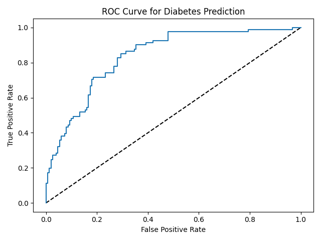
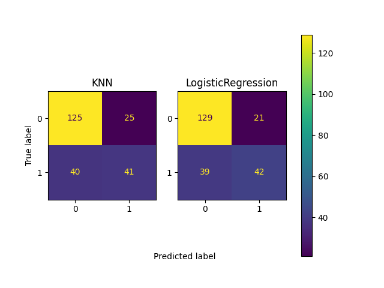

# Goals for week 05

1. Practice building and using logistic regression models.
2. Practice creating and interpreting the ROC curve.
3. Practice performing hyperparameter optimization/tuning.

## Task 01 - Model creation

**Description:**

Build a logistic regression model using all features in the diabetes dataset to predict the probability of individuals in a test set having a `diabetes` diagnosis. Use 70% of the data for training the model. Output the first `10` predicted probabilities. Set any random seeds to `42`.

**Acceptance criteria:**

1. The test case passes.

**Test case:**

```console
python task01.py
```

```console
[0.23040853 0.28910623 0.73169396 0.6312523  0.45115254 0.07690539
 0.73115032 0.12432892 0.04388881 0.34826864]
```

## Task 02 - Model evaluation

**Description:**

Extend your work on the previous task by plotting the ROC curve to visualize how the true positive rate and false positive rate vary as decision threshold changes.

Answer the question: *What does the plot tell you about the model's performance?*

Possible answers:

    A. The model is about as good as randomly guessing the class of each observation.
    B. The model is much worse than randomly guessing the class of each observation.
    C. The model is much better than randomly guessing the class of each observation.
    D. It is not possible to conclude whether the model performs better or worse than randomly guessing the class of each observation.

**Acceptance criteria:**

1. The test case passes.
2. The letter of the correct line is written as a comment in the solution.

**Test case:**

```console
python task02.py
```

The following graph is created:

<!-- TODO: Use https://scikit-learn.org/stable/modules/generated/sklearn.metrics.RocCurveDisplay.html#sklearn.metrics.RocCurveDisplay.from_predictions for this -->



## Task 03 - Model selection

**Description:**

Let's compare two classification models and choose the better one.

Create, train and evaluate a logistic regression model and a KNN model. For each of them compute the area under the ROC curve and plot the confusion matrices they produce. Calculate the precision, recall and f1-score.

Compare the models based on the evaluation outputs. Answer the following question: *Which model performs better on the test set and why?*.

**Acceptance criteria:**

1. The test case passes.
2. An answer is given to the question in the description as a comment in the code.

**Test case:**

```console
python task03.py
```

```console
Model KNN trained!
Model LogisticRegression trained!

KNN AUC: 0.7277366255144033
KNN Metrics:
              precision    recall  f1-score   support

           0       0.76      0.83      0.79       150
           1       0.62      0.51      0.56        81

    accuracy                           0.72       231
   macro avg       0.69      0.67      0.68       231
weighted avg       0.71      0.72      0.71       231

LogisticRegression AUC: 0.8360493827160493
LogisticRegression Metrics:
              precision    recall  f1-score   support

           0       0.77      0.86      0.81       150
           1       0.67      0.52      0.58        81

    accuracy                           0.74       231
   macro avg       0.72      0.69      0.70       231
weighted avg       0.73      0.74      0.73       231
```

and the following plot is generated:



## Task 04

**Description:**

Build a lasso regression model with optimal hyperparameters to predict blood glucose levels using the features in the diabetes dataset using 70% of the data for training.

Use a grid search with a `6`-fold cross validation to find the optimal value for the `alpha` parameter. Search 20 evenly spaced numbers ranging from `0.00001` to `1`. Set any random seeds to `42`.

Output the optimal value for `alpha` and the $R^2$ obtained with that value.

Taking into account what you observe as the tuned lasso $R^2$, answer the question: *Does using optimal hyperparameters guarantee a high performing model?*.

**Acceptance criteria:**

1. The test case passes.
2. A comment is present answering the question in the description.

**Test case:**

```console
python task04.py
```

```console
Tuned lasso paramaters: {'alpha': 1e-05}
Tuned lasso score: 0.3296417347139618
```

## Task 05

**Description:**

`GridSearchCV` can be computationally expensive, especially if you are searching over a large hyperparameter space. To combat such large spaces use `RandomizedSearchCV`, which tests a fixed number of hyperparameter settings from specified distributions.

Find the optimal parameters `penalty`, `tol`, `C`, `class_weight` of a logistic regression model that predicts whether a person has `diabetes`. Train using a `6`-fold cross validation. Add `l1` and `l2` as `penalty` values, set `tol` to a range of `50` floating point values between `0.0001` and `1.0`, set `C` to a range of `50` float values between `0.1` and `1.0`, and `class_weight` to either `balanced` or a dictionary containing `0:0.8, 1:0.2`. Set any random seeds to `42`.

Output the best parameters alongside the accuracy achieved with them.

**Acceptance criteria:**

1. The test case passes.

**Test case:**

```console
python task05.py
```

```console
Tuned Logistic Regression Parameters: {'tol': 0.8163448979591836, 'penalty': 'l2', 'class_weight': {0: 0.8, 1: 0.2}, 'C': 0.5775510204081633}
Tuned Logistic Regression Best Accuracy Score: 0.6441531419059509
```
