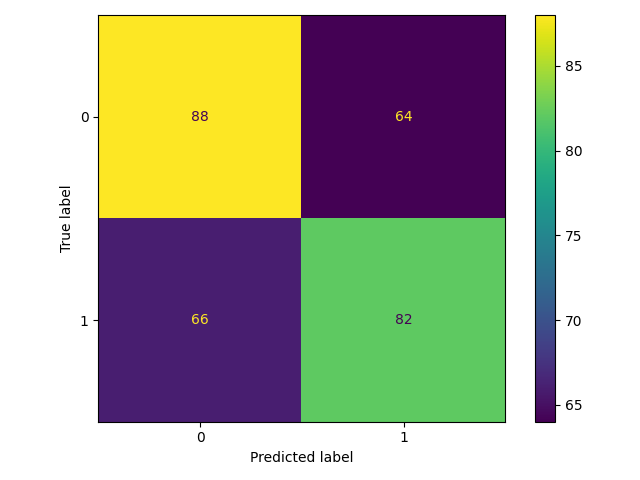
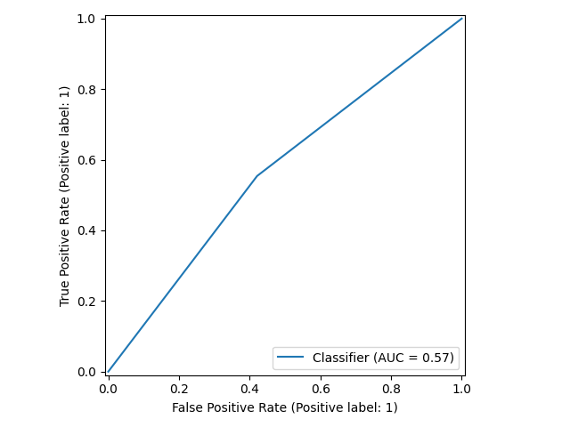
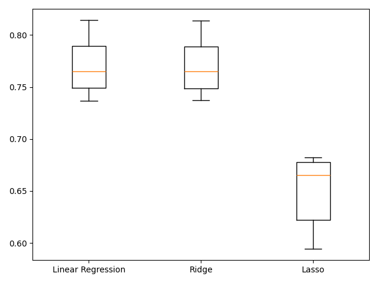
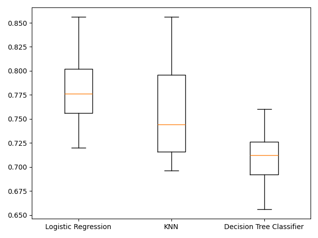

# Goals for week 06

1. Practice preprocessing data.
2. Practice building end-to-end machine learning pipelines.

## Task 01 - Dummy variables

**Description:**

Perform exploratory data analysis on the `music_dirty.txt` dataset (in our `DATA` folder) - plot how `popularity` varies by `genre`.

Create a new `DataFrame` containing the original columns of the dataset plus dummy variables from the categorical features.

Output the shape before and after adding the dummy variables.

**Acceptance criteria:**

1. The test case passes.

**Test case:**

```console
python task01.py
```

```console
Shape before one-hot-encoding: (1000, 12)
Shape after one-hot-encoding: (1000, 20)
```

and the following plot is generated:


## Task 02 - Regression with categorical features

**Description:**

In `Task 01` we transformed the categorical variables in `music_dirty.txt` into dummy ones. This task is about building a ridge regression model to predict song `popularity` using the preprocessed data.

Perform `6`-fold cross validation on the whole dataset on a ridge regression model with `alpha=0.2`. Output the average root mean squared error and compare it to the standard deviation of the target array. Set any random seeds to `42`.

Answer the question: *Given the value of the average RMSE and the standard deviation of the target column, does the model perform well?*.

**Acceptance criteria:**

1. The test case passes.
2. A comment is written with an answer to the question in the description.

**Test case:**

```console
python task02.py
```

```console
Average RMSE: 8.199562450329957
Standard Deviation of the target array: 14.028585146093715
```

## Task 03 - Missing values

**Description:**

In this exercise, we'll use the `music_dirty_missing_vals.txt` dataset.

Output the percentage of missing values for each column in the music dataset, sorted in descending order. Drop the rows that hold missing values accounting for less than 5% of the dataset. Then, convert the `genre` column into a binary feature - the new feature should have a `1` if the original row contains `Rock` and `0` if it does not.

Output the shape of the initial and preprocessed dataframes.

**Acceptance criteria:**

1. Missing values are shown in the output in descending order.
2. Appropriate columns are dropped according to the amount of missing values they have.
3. Shapes of the initial and preprocessed dataframes are shown in the output

**Test case:**

```python
python task03.py
```

```console
Shape of input dataframe: (1000, 12)
Percentage of missing values:
acousticness        0.200
energy              0.200
danceability        0.143
valence             0.143
duration_ms         0.091
instrumentalness    0.091
speechiness         0.059
liveness            0.046
tempo               0.046
loudness            0.044
popularity          0.031
genre               0.008
dtype: float64
Columns/Variables with missing values less than 5% of the dataset: ['liveness', 'tempo', 'loudness', 'popularity', 'genre']
First five entries in `genre` column:
1    0
2    1
3    1
5    1
6    0
Name: genre, dtype: int32
Shape of preprocessed dataframe: (892, 12)
```

## Task 04 - Building pipelines

**Description:**

Build a pipeline that contains two steps:

- one, called "imputer", for imputing missing values using an appropriate strategy;
- another, called "knn", for building a `KNN` model for the classification of song `genre` using the closest `3` neighbors.

Create a pipeline and apply it on the label encoded dirty music dataset. Use 70% of the data. Set any random seeds to 42. Do not remove the missing values as that's why the imputer will be used for.

Output the classification report, display the confusion matrix and ROC curve.

Analyze the performance of the model in a comment: *Does the model perform well on unseen data?*.

**Acceptance criteria:**

1. The test case passes.
2. A plot with the confusion matrix is generated.
3. A plot with the receiver operator characteristic curve is generated.
4. A comment is written with an answer to the question in the description.

**Test case:**

```console
python task04.py
```

```console
              precision    recall  f1-score   support

           0       0.57      0.58      0.58       152
           1       0.56      0.55      0.56       148

    accuracy                           0.57       300
   macro avg       0.57      0.57      0.57       300
weighted avg       0.57      0.57      0.57       300
```

and the following two plots are generated:



and



## Task 05 - Centering and scaling for regression

**Description:**

Preprocess the features of the `music_clean.csv` dataset and build a lasso regression model to predict a song's `loudness`.

Use 70% of the data for training the model. Set the `alpha` parameter of the lasso model to `0.5`. Set any random seeds to `42`.

Output the first five rows of dataframe before scaling.

Calculate and print the $R^2$ score of two pipelines - with and without scaling. Interpret the results - do the models perform well?

**Acceptance criteria:**

1. The test case passes.
2. A comment is written with an answer to the question in the description.

**Test case:**

```console
python task05.py
```

```console
       popularity  acousticness  danceability  ...    tempo  valence  genre
7738         43.0       0.00153         0.196  ...   96.138   0.0898      0
38678        57.0       0.09290         0.680  ...  116.989   0.5940      1
36593        53.0       0.91700         0.561  ...  144.226   0.3460      1
37377        66.0       0.18800         0.690  ...   92.967   0.6450      1
22678        53.0       0.01500         0.609  ...  121.768   0.7540      0

[5 rows x 11 columns]
Without scaling: 0.5031316281225606
With scaling: 0.7185052288252617
```

## Task 06 - Centering and scaling for classification

**Description:**

Bring together scaling and model building into a pipeline for cross-validation on the `music_clean.csv` dataset.

Build a pipeline to scale the features and perform grid search cross-validation using a logistic regression model with different values for the hyperparameter `C`. The target variable here is `genre`, which contains `1` for `Rock` and `0` for any other genre.

Use 80% of the data for training the model. Set any random seeds to `21`. For the `C` parameter search `20` equally spaced float values ranging from `0.001` to `1.0`.

Calculate and print the accuracies of two pipelines - with and without scaling. Interpret the results - do the models perform well?

**Acceptance criteria:**

1. The test case passes.
2. A comment is written with an answer to the question in the description.

**Test case:**

```console
python task06.py
```

```console
Without scaling: 0.665
Without scaling: {'logreg__C': 0.2113157894736842}
With scaling: 0.875
With scaling: {'logreg__C': 0.1061578947368421}
```

## Task 07

**Description:**

Build three regression models to predict a song's `energy` levels using the `music_clean.csv` dataset - `Linear Regression`, `Ridge`, and `Lasso`.

Perform `6` fold cross validation with shuffling. Set the `alpha` parameters to `0.1`. Use `75%` of the data for training the models. Set any random states to `42`.

Plot the accuracies on the `y`-axis of a bar plot and put the model names on the `x`-axis. Which model performs best?

**Acceptance criteria:**

1. The test case passes.
2. A comment is written with an answer to the question in the description.

**Test case:**

```console
python task07.py
```

The following plot is generated:



## Task 08

**Description:**

In the previous exercise linear regression and ridge appeared to produce similar results on unscaled data. It would be appropriate to select either of those models. Check the predictive performance on the test set to see if either one can outperform the other.

Scale all available data, refit the two models using it and then use the root mean squared error (`RMSE`) as the metric on the test set.

**Acceptance criteria:**

1. The test case passes.

**Test case:**

```console
python task08.py
```

```console
Linear Regression Test Set RMSE: 0.11109818526605353
Ridge Test Set RMSE: 0.11110048128156672
```

## Task 09

**Description:**

Build and visualize the results of three different models to classify whether a song is popular or not - `Logistic Regression`, `KNN`, `Decision Tree Classifier`.

Convert the `popularity` column to binary values, with `1` representing popularity more than or equal to the median for the `popularity` column, and `0` indicating popularity below the median. Split and scale the data. Train on 75% of the data. Perform `6`-fold cross validation. Set the random seed for splitting to `42` and for folding to `12`.

Plot the results on a boxplot. Which model performs best?

**Acceptance criteria:**

1. The test case passes.
2. A comment is written with an answer to the question in the description.

**Test case:**

```console
python task09.py
```

The following plot is generated:



## Task 10

**Description:**

Build a pipeline to impute missing values, scale features, and perform hyperparameter tuning of a logistic regression model on the `music_dirty_missing_vals.txt` dataset. The aim is to find the best parameters and accuracy when predicting whether a song has a genre of `Rock`.

Use `75%` of the data for training, setting the seed value to `42`. Perform grid search on two parameters - `solver` and `C`. For `solver` check the values: `newton-cg`, `saga` and `lbfgs`, for `C`: `10` numbers separated on equal distance in the range `[0.001, 1.0]`.

**Acceptance criteria:**

1. The test case passes.

**Test case:**

```console
python task10.py
```

```console
Tuned Logistic Regression Parameters: {'logreg__C': 0.112, 'logreg__solver': 'newton-cg'}
Accuracy: 0.86
```
