# Goals for week 08

1. Practice working with unsupervised machine learning algorithms.
2. Understand how to use `KMeans` clustering.

## Task 01

**Description:**

You are given a matrix `points`, where each row gives the `(x, y)` co-ordinates of a point on a map. Make a scatter plot of these points, and use the scatter plot to guess how many clusters there are.

```python
points = np.array([[0.0654464912057335, -0.7686637583746054], [-1.5290154723631335, -0.429530789283678], [1.7099337125153655, 0.698852527207745], [1.1677914530353883, 1.0126263823062864], [-1.8011008765125671, -0.3186129561722616], [-1.635678878103174, -0.0285953477048952], [1.2199037530859576, 0.7464346306206472], [-0.2617515511040414, -0.6249293924445927], [-1.6192580392899492, -0.4798394895824938], [-1.843295821844137, -0.1669443108493516], [1.35999601953568, 0.9499582661886437], [0.422918564737208, -0.7349534005968037], [-1.6857613901150803, 0.1068672757159062], [0.9062999493855556, 1.0910516186925248], [-1.5647832151997594, -0.8467539409172038], [-0.0257849010405154, -1.1867253939984086], [0.8302732361682478, 1.1450461198177004], [1.224504318044118, 1.3506675856135453], [-0.1539459551324558, -0.7170430090340084], [0.8635880949171804, 1.068246134206403], [-1.433863658847475, -0.2381297048308357], [0.0384476862052684, -0.7463502234351036], [-1.585679224619341, 0.0849935446557991], [0.6359887951357822, -0.5847769797814781], [0.2441724230738847, -0.5317246502745662], [-2.196803585261628, 0.4947367720571247], [1.0323502988225113, -0.5568799954803777], [-0.2885806653720872, -0.399725277630757], [0.2059700800721907, -0.8017153577365872], [-1.210730799565148, -0.3492410894419737], [1.334236838468181, 0.7721489008208623], [1.1948015178340623, 1.047885558425092], [0.9917476953726534, 0.8920200767628542], [-1.8356219039361112, -0.0483973247961464], [0.0841572076656148, -0.7156432575403593], [-1.4897017522845528, -0.192996040941223], [0.3878241808139117, -0.8206011901833663], [-0.0144804407734396, -0.9779840987237762], [-2.0521340998721707, -0.0212912540131101], [0.1033119432422531, -0.8216278059218872], [-0.4418931501740598, -0.6571097360468146], [1.103909263225082, 1.024811819134689], [-1.5922775939582692, -0.1737403796257469], [-1.473441520416564, -0.0220285304968524], [-1.3551470405553263, 0.2297106712795478], [0.0412336995801599, -1.2377662208006797], [0.4761516993039864, -1.136721236563179], [1.043356760427954, 0.8234590470870763], [-0.0796188170335298, -0.8567739353621651], [0.8706505901795596, 1.0805284140253724], [1.4026731334929738, 1.0752511922343315], [0.801111567004303, 1.283428254742632], [-0.1652751550086151, -1.2358380385590229], [-0.3377922091012056, -0.5919432342243465], [0.8061074868332878, -0.7375215868012956], [-1.4359003186858177, -0.5638444576816151], [0.5486889533068995, -0.951438293714394], [0.4680313077949052, -0.749739074518779], [-1.513712896942057, -0.8391432284169498], [0.913843599841932, 1.5112653172575654], [-1.972339030423432, -0.4115537496295794], [0.5213406016331779, -0.8865489365482295], [0.6275949431557073, -1.185904771196431], [0.9416301405581072, 1.353993354591306], [0.5699476779996157, 1.07036605536564], [-1.8766338206265312, 0.1474577340917372], [0.9061218594658672, 0.9108401052814168], [-1.3748145362460542, 0.2842839472879921], [-1.8056402943668943, -0.9671057419425316], [0.3430775659691717, -0.7999927487937941], [0.7038056620973427, 1.000258041761561], [-1.6848986211185557, -0.3056459496643352], [1.3147322131175057, 0.986149780647387], [0.2615121623829735, -0.2606925092787008], [0.9193121024473212, 0.823714845526499], [-1.2179592899480618, -0.2021967434650835], [-0.1772272310977897, -1.0266524532448829], [0.6482486163633215, -0.6682288060013553], [0.412067864292622, -0.2878378442018183], [1.0156820171676155, 1.1348166724278068], [0.6790025410486296, -0.9148950199813576], [-1.051827471063715, -0.0106237623252675], [0.6130659861093055, 1.7821038376771536], [-1.5021974801612847, -0.5230892170854781], [-1.7271729328459169, -0.4617391574563362], [-1.6099563119906712, -0.1821007032109933], [-1.0911102066045015, -0.0781398021857317], [-0.0104697815632507, -0.8091303412886869], [0.3278230325222045, -0.8073475437162415], [1.220385032027253, 1.195979302100845], [-1.333286810602751, -0.3000193743679564], [0.879595168964507, 1.1156649125877478], [-1.148290981079215, -0.3040076201000574], [-0.5801975462632827, -1.1999601847068089], [-0.0116115940154906, -0.7846885353997791], [0.1735972410762164, -0.6339814535829698], [1.3273855590403572, 0.6775996875620109], [-1.9346732743106585, 0.3057247205715128], [-1.5776189340196929, -0.2772636496588521], [0.4763900025188838, 1.2142264755806365], [-1.6523750865252471, -0.6803981003840274], [-0.12609976246678, -1.0432745741405829], [-1.8960708245432247, -0.7008550197468331], [0.5746689857995531, 0.748783693306254], [-0.1666031224121718, -0.831102946952984], [0.8013354959100127, 1.2224443484235474], [1.1845542591567533, 1.434646700177676], [1.0886442772018283, 0.6466711158456921], [-1.611585047986194, 0.2280572487292946], [-1.5751220451660382, -0.0961257600508364], [0.0721356955324795, -0.6964032764653807], [-1.4005429784650547, 0.1639059751023592], [1.0960771260886046, 1.1680469115344367], [-2.5434620433141517, -0.2308982171576408], [-1.3454487471580343, 0.2515112570009674], [-1.3547862853823236, -0.1910331668559034], [0.1836811292599628, -1.1582772499848413], [-1.3136867742972251, -0.3763569984538013], [0.099901286563361, 1.2250049094266122], [1.1722557441252894, 1.3083514263524965], [0.0865396987700791, -0.7971437137358454], [-0.2105392287217758, -1.1342151077436895], [0.2649602390475485, -0.9476074245480344], [-0.2557591033928975, -1.0626602197221122], [-0.2603975738337485, -0.7477422467984205], [-1.917873593816116, 0.1643457140638919], [0.9302113924561816, 0.4943633069333503], [0.4477046652125147, -0.7287791759929736], [-1.6380286912248638, -0.5892552757456395], [-1.9571276340863957, -0.1012513740190758], [0.9270337011305244, 0.882514226728072], [1.2566009331779366, 0.6082807304621214], [-1.7281863178915309, 0.0841688660768515], [0.3499787973638875, -0.3049029829461703], [-1.516960820018647, -0.5091310892535825], [0.1876360484644618, -0.5542492405318324], [0.8960980862983607, 0.8355150812307898], [-1.5496885650240504, -0.1711478213441832], [1.215745697288779, 1.233177284686227], [0.2030774535901103, -1.0378490610962725], [0.8458908629104305, 1.0361527283579377], [0.5323791878568742, 1.4736288387658585], [-0.0531904408326285, -1.361505529107807], [1.388197431517556, 1.117299153890155], [1.006963038293416, 1.036772104404645], [0.5668186879625374, -1.0963717575863503], [0.8688829648688388, 1.052488741716316], [-1.1628660935320507, -0.558752454192294], [0.2771776790511374, -0.838440149871372], [0.1656326725335266, -0.8030660737386272], [0.3826330298198334, -0.4268324141890894], [1.1451980736781826, 0.896590262377021], [0.8145585690063701, 0.6753366702240604], [-1.8603152008514652, -0.0953756097092091], [0.9656409952874998, 0.9029557901112318], [-1.498974511615101, -0.3325404360102928], [-0.1335489010984757, -0.8072758221114568], [0.1254152742756701, -1.1335490643888846], [1.0606243632066137, 1.2881635792978954], [-1.491545784548984, -0.202464102118804], [1.1618903199872417, 1.2881987698905646], [0.5428203291239563, 0.7520352396594223], [0.8922106508467552, 0.9921162366040982], [-1.4993201058946146, -0.3243066695752807], [0.3166647012635424, -1.3448291507175296], [0.1397246854860243, -1.220974476481136], [-1.5499723960767195, -0.1078258420141638], [1.2384685817822878, 1.3766880413971587], [1.2555895446451386, 0.7202609833504818], [0.2555868919333048, -1.2852976316843507], [0.4516893307622061, -0.5595209318010728], [1.0620205708618238, 1.0340460421826372], [0.6745190801340936, -0.5497029857556341], [0.2275967613293482, -1.0272946849858042], [-1.458352812370112, -0.0495107392336897], [0.2327350078517041, -0.7084926203827929], [1.5967958880334026, 1.1139507626418677], [0.8047610524694737, 0.5446269982211378], [1.1549252092617004, 1.043521906912246], [0.5963277561336563, -1.1914289691414517], [0.0283906831929064, -0.4382936594500548], [1.1345158357541545, 0.5632632979739165], [0.2157620438343024, -1.044457529514499], [1.410489866404848, 1.0283071932971288], [1.1228930156204953, 0.5802944134502128], [0.2520068817427344, -0.8258843605974264], [-1.2856608057922851, -0.0739090900781357], [1.528498149935305, 1.1182246872982793], [-0.23907858404898, -0.7054197249485433], [-0.2579278420594614, -0.8182503454141075], [0.5936781798705313, -0.4523991501399457], [0.0793190946913364, -0.2923321301963206], [-1.2725681463070748, 0.1163057698744086], [0.669301293330272, 1.0073148108513286], [0.3479154578936103, -1.208228767089348], [-2.112839925038438, -0.6689793468549369], [-1.629382396252732, -0.3271822191369679], [-1.5381913876982258, -0.0150197179603668], [-0.1198854473101109, -0.6036338950688659], [-1.54418955684223, -0.3038984374738928], [0.3002661436530568, -0.777231730345955], [0.0093544852006169, -0.5388819155394995], [-1.334243925912652, -0.1156043092131226], [0.4750448911523113, 0.784213838013291], [0.5931326371015391, 1.2322389981754205], [0.413703694582358, -1.3520585677651438], [0.5584094792445969, 0.7883105304005376], [0.4985501752387235, -0.789949003778334], [0.3567580858697111, -0.8103869319941585], [-1.8619782516712928, -0.5907130477671053], [-1.619776710874009, -0.1607668738067014], [0.8077929471500505, -0.7331129406344682], [1.6274577523743008, 0.6278716346647928], [-1.5699359287017738, -0.0846756688589884], [1.0255856065996505, 0.8938330199548162], [0.2429346098623145, -0.6088253049848489], [1.2313024182884664, 1.00262186248261], [-1.9651013042574703, -0.1588628914468655], [0.427950321198401, -0.7038443183784787], [-1.5830681762844188, -0.1943192251899976], [-1.571959224996652, 0.0141346870555553], [-0.981453732658289, 0.0613228538977156], [-1.486378442773307, -0.5746531036642516], [0.9874582844136752, 0.6918805326527924], [1.2861972092838352, 1.281288207379233], [0.8585059551128833, 0.9554148145127936], [0.1902828563196305, -0.8211294209700777], [0.265610462319974, -0.0425523896650452], [-1.6189789738321865, 0.0086237230505463], [0.2407018263775859, -0.5266420923479008], [1.152209930162803, 0.4391669350892604], [-1.2196781174958202, -0.2580312986833666], [0.3341253272521847, -0.8611776145578867], [0.1713100334681125, -0.7563896476095736], [-1.1982839682225466, -0.7374466455494118], [-0.1224593176190654, -0.4564887912252412], [1.5120069752500735, 0.888257407072307], [1.1033886565948183, 0.9234747873184772], [1.309720948221406, 0.5906698871295553], [0.1996487576796778, 1.1485588868394758], [0.8146051520392743, 0.8453897200875109], [-1.642273904762053, -0.4229620628312019], [0.0122435067974082, -0.2124781586331051], [0.3370910248719901, -0.7461806494867055], [0.4730105400145988, 0.7271207469354536], [0.3470662595395132, 1.2303375668004732], [-0.0039327864918558, -0.9720969390416028], [-1.6430311859446451, 0.052763370150502], [1.4464962531199248, 1.1421703264724763], [-1.93030086937966, -0.4002614600446369], [-2.3729613540644605, -0.7263364464821149], [0.4586012242999578, -1.060489534287036], [0.489636101912996, -1.1892831318183212], [-1.0233590198483322, -0.1752057838356285], [-1.3276110716139322, -0.9396354945749504], [-1.509879085473856, -0.094736582162001], [0.0272305669623996, -0.7987054916040169], [1.0169411977558729, 1.264617008757151], [0.4773352695039988, -0.98984710056481], [-1.2778422374901173, -0.5474159989810934], [0.4989880164093402, -0.6237259029530492], [1.0600473141462636, 0.8687000769741766], [1.0020750128100304, 1.3829351167050397], [1.3116139353733458, 0.6283395589328151], [1.134284427193519, 1.1834654169384748], [1.2767134615403704, 0.966328781070547], [-0.6334288525144172, -0.977682512557856], [0.1269877885696956, -0.931423170361161], [-1.3451081215324, -0.2375422563556248], [-0.5316227754264695, -1.251535942097754], [0.2195993380908377, -0.9026993798427284], [-1.7899747917891926, -0.1211574841151108], [1.231974725796502, -0.0745376435488047], [1.4163536023718353, 1.2155175194021297], [-1.9028097613580028, -0.1638976015203484], [-0.2244008096180195, -0.7545424755075612], [0.5955941249273331, 0.9241455296828398], [1.219307731244579, 1.081752840147472], [-1.9942753549563843, -0.3758779909018822], [-1.278184741839705, -0.5245455082345866], [0.6235268908283551, -1.0143010810673632], [0.1402425128874288, -0.4282660048507156], [-0.1614571261307495, -1.1635973109595263], [-1.7479586549697352, -0.060331008794093], [-1.166597912654541, 0.0902393019383889], [0.4111040797051339, -0.8084248985775087], [1.147571682061527, 0.7780452823812295], [-1.655907483219632, -0.4010544588749238], [-1.1530686547465177, 0.0085869931682231], [0.6089212149735674, 0.6897483335328548], [-0.0843413755232688, -0.976152563706225], [0.1917005299655985, -0.4233143781546386], [0.2966316166211803, -1.1335739943157594], [-1.3689362766976974, -0.2505212448026501], [-0.08037807115393, -0.5678415453281473], [0.3569501136432765, -1.150644084910159], [0.0248217937640379, -0.6359482849591866], [-1.4907555757248412, -0.248250698505186], [-1.4085879959335197, 0.2563543054178052], [-1.9827462594741505, -0.545844746986447]])
```

Answer the following question in a comment: *How many clusters do you see?*.

**Acceptance criteria:**

1. The test case passes.
2. A comment is written with an answer to the question in the description.

**Test case:**

```console
python task01.py
```

The following plot gets generated:


## Task 02

**Description:**

Create a `KMeans` model and fit it to the data points from the previous exercise. Predict the cluster labels for the points in the array `new_points`:

```python
new_points = np.array([[0.4002333320265674, -1.2654447065553371], [0.8032303700813846, 1.2826016688170383], [-1.3950755249367135, 0.0557292920906295], [-0.3411926769123959, -1.076619940010254], [1.547817473545126, 1.4025004898994076], [0.2450320175375499, -0.4834423276216081], [1.2070688617175875, 0.8887526050500794], [1.2513262772309852, 1.1555539518148343], [1.810044147829991, 0.9655307305763632], [-1.669634014657854, -0.308103509458039], [-0.0717482104584044, -0.9379396997933668], [0.6826319270615404, 1.1025816032172124], [1.0903959845516995, 1.4389952903513694], [-1.676454139320826, -0.5045570492933269], [-1.8444780366259956, 0.0452539543761144], [1.2423485050862004, 1.0208866089127862], [-1.8614704081677675, 0.0063864581085647], [-1.4604494285267078, 0.1532523830836319], [0.4989818169744144, 0.8980060577763966], [0.983962244309974, 1.0436937477387], [-1.831367418957484, -0.1636328350366194], [1.3062261736796343, 1.0765871744481543], [0.3534203282015242, -0.7513202179121603], [1.1395797044536962, 1.5450386043690263], [0.2939956935455874, -1.2613500521442478], [-1.145582247220963, -0.0378709635540704], [1.1871610476838488, 0.6002406629352124], [-2.232119462281373, 0.2304750944808798], [-1.2832042998796784, -0.3933145682714113], [0.4942966961525395, -0.8839720087642245], [0.063183493043089, -0.9119522278514528], [0.9357595389694396, 0.8668206847501292], [1.580147205050147, 1.0378839166980027], [1.0630495965303597, 1.0270608188286456], [-1.3973253641181504, -0.5051622490313863], [-0.1099352396306972, -0.908113619012788], [1.1734675783939748, 0.9475010921789884], [0.9200845106983088, 1.4576767182024295], [0.5826589564675202, -0.9000868321743926], [0.9527723280673276, 0.8990423859001851], [-1.372669555300173, -0.0317878214906239], [0.0212706760008508, -0.7076141940283391], [0.3270490517353891, -0.5559981073787117], [-1.7159026735270893, 0.215222266115168], [0.512516208882788, -0.7601282452864132], [1.1302346873969018, 0.7224511221624661], [-1.430743100030984, -0.3427875108264072], [-1.8272462496627275, 0.1176577746836864], [1.41801349539704, 1.1145507980398308], [1.2689730355046054, 1.4192597123818338], [0.8040764937373096, 1.6398855683919011], [0.8345677518010617, 1.099566888938277], [-1.2471473202906656, -0.2235223195135434], [-1.294225372060266, 0.0818770024376146], [-0.2273783156609026, -0.4133313867163021], [0.2188303872558432, -0.4681831195396797], [-1.2259341395432908, 0.2555991474864147], [-1.3129403283209065, -0.4288920696757677], [-1.3353238174034492, 0.6520537761945147], [-0.3011002328629553, -1.25156450724338], [0.2027783561332204, -0.9052774447453354], [1.0135778414771135, 1.1237898051898965], [0.8183243943552136, 0.8608412565444068], [1.2618155625202765, 1.466137437886443], [0.4648677244304032, -0.7972124589573605], [0.3609088981639311, 0.8441067198291454], [-2.150983103026574, -0.3695839369151511], [1.0500528098687707, 0.8741813644980215], [0.1065800740680946, -0.7492681533935283], [-1.7394572308492744, 0.2521835769814145], [-0.1120176866140086, -0.6524697876040267], [0.5166189510067274, -0.6412675816881157], [0.3266217871239109, -0.8806080148889077], [1.0901775875963506, 1.109525584516946], [0.3644595761914319, -0.6942156216036032], [-1.9077931816808351, 0.1873836740406743], [-1.9560182911330304, 0.139959126119237], [0.3185417014931508, -0.4052717041359056], [0.7365126986835167, 1.7641625460023058], [-1.4417516180120409, -0.0572320428664115], [0.3217571684082834, -0.5342838213080934], [-1.3731730463544376, 0.0464484644128515], [0.0687225909841006, -1.105229437891234], [0.9593142184469996, 0.6523162095118378], [-1.626419187808163, -0.562423280180794], [1.067883052462521, 0.7292604817658017], [-1.7964354693700573, -0.9883074177396988], [-0.0988628376605341, -0.0681198091844482], [-0.1051356996676786, 1.1702214346983502], [0.8799646993015682, 1.253403167715908], [0.9807534068479892, 1.1548653876175397], [-0.0833224966337974, -0.9248443677429224], [0.848759673293293, 1.0939742455294217], [1.3294164939525177, 1.137345628305919], [0.3237880684751769, -0.7497324512066812], [-1.526109703019544, -0.2490169288428174], [-1.4859811551413251, -0.2688286079948604], [-1.804795529448048, 0.187052700201347], [-2.0190734747511296, -0.4495116509492829], [0.2872024019713914, -0.6554874148914515], [0.8222951016345545, 1.3844323435720964], [-0.0356997035769391, -0.8018258068955944], [-1.6695543980809435, -0.138258504685709], [-1.7822682110743764, 0.2933530329302973], [0.7258371377839856, -0.6233740238035452], [0.3884325927706243, -0.7612834972221451], [1.49002782668951, 0.7956786712532995], [0.0006554232279744, -0.7405807019362622], [-1.3453311598066255, -0.4756299369161785], [-0.8038451057116693, -0.3099430125960101], [-0.2490412950059105, -1.0066241847122213], [-1.4109511807922228, -0.0706744126632764], [-1.7511959356833808, -0.3004913357705716], [-1.2794272423458892, 0.1737745999098149], [0.3350281826743395, 0.6247611513773945], [1.1681964908549058, 1.1890225089718274], [0.7152104568601423, 0.9260774191562786], [1.300572781743362, 0.916349564697178], [-1.216970075933798, 0.1100394768992077], [-1.7070793484711009, -0.0599659535549321], [1.2073065505131004, 1.0548046315261794], [0.1868960086048755, -0.9580472344730616], [0.8034634709748233, 0.3861331395771474], [-1.7348679046802356, -0.1498319133825518], [1.3126149924762784, 1.11802981738963], [0.404993147580149, -0.51090034730328], [-1.932679684301072, 0.2207646942888817], [0.6560047985146118, 0.9618871607020404], [-1.405882153104396, 0.1171344034664284], [-1.7430626422339452, -0.0747473958818091], [0.5437454124343493, 1.47209223603451], [-1.973316692928232, -0.2271244934119718], [1.539011709515556, 1.360490808681736], [-1.4832345230186, -0.4903020632514634], [0.3867484837065093, -1.261733998094538], [1.170157157781722, 1.185494153696634], [-0.0805381721060609, -0.321923627386691], [-0.0682273156156105, -0.8528258870251585], [0.7135000278803649, 1.2786851950310625], [-1.8501437762114057, -0.5034905576730881], [0.0636085265778256, -1.412570399974733], [1.5296606194895932, 0.9660565718481976], [0.1621657143883764, -1.3737484274059804], [-0.3234744968085503, -0.7066202689006988], [-1.517689933395664, 0.1876583021123375], [0.8888959113837018, 0.7622371605566541], [0.483164032247148, 0.8819318692890954], [-0.055299776600459, -0.711305016396542], [-1.5796644099147938, -0.6292203127968155], [0.055130864505792, -0.8472067629036832], [-2.0600158163670144, 0.0587697786760599], [1.118108549671997, 1.3025417465032032], [0.4870161641475913, -0.9901439374583558], [-1.6551804200375655, -0.1693863827923287], [-1.4434973799529995, 0.1902992431170639], [-0.1700745474880747, -0.8267360220133111], [-1.824339789139913, -0.307814626071575], [1.030934850193869, 1.2645769050131583], [1.6443116943156395, 1.2777311525997004], [-1.4761769264381148, 0.0260783872440232], [1.0095306707588962, 1.1427018140753182], [-1.4528563647019344, -0.2552162065298133], [-1.7409291726803937, -0.0834443177097485], [1.2203829912336142, 1.2869996131495278], [0.916925397059932, 0.7320702754102352], [-0.001607541849692, -0.7263755713166965], [0.8938412382881398, 0.8411466431487012], [0.6337919611890583, 1.009151335729084], [-1.4792707460559875, -0.6997819362786284], [0.0544799373526317, -1.0644197014122958], [-1.5193556824925778, -0.4892769290772025], [0.2899390263087406, -0.7731455226767868], [-0.0096815406106376, -1.1330220710411107], [1.1347463930946602, 0.971541744341109], [0.5364214059773794, -0.8479063881175805], [1.1475986378655694, 0.6899152046491732], [0.5732919022586174, 0.7908027102433104], [0.2123773967237214, -0.6075698078151486], [0.5265795477728625, -0.8159302635461885], [-2.0183164148773765, 0.067865074042239], [-0.2355126236637356, -1.0820513247221837], [0.159274779567722, -0.6007172613865557], [0.2281203563619448, -1.1600354896605691], [-1.536583780071456, 0.084079880753185], [1.1395460916729012, 0.6317820011520845], [1.0111925531921029, 1.043608047816048], [-0.1420398666823047, -0.4812303372945994], [-2.231201820617505, 0.0849162905373921], [0.1255548110642637, -1.017947931672471], [-1.7249350918334918, -0.6944261771347984], [-1.6043463038969006, 0.4455508679133457], [0.7371539787409838, 0.9265607436412832], [0.6729052709588117, 1.1336602959159123], [1.200664556764366, 0.7262730934489203], [0.0758747208880828, -0.9833783259664118], [1.2878326230927817, 1.1808860066647064], [1.065219295449487, 1.0071474604016484], [1.058716978914834, 1.129565193019349], [-1.1264340979123897, 0.1667877437708523], [-1.101572175412031, -0.3641378058993379], [0.2351182168054226, -0.1397699490301142], [1.138537953772015, 1.010185185416075], [0.5312056535944205, -0.8819907915506771], [0.4330859360296099, -0.7640590419867354], [-0.0044892615571993, -1.3054841053771022], [-1.7634858858975817, -0.4974307390604293], [1.3648568100147571, 0.5834046987674564], [0.5669238996877362, 1.5139196303045417], [1.3573682575435084, 0.6709153176202536], [1.07173397131927, 0.6119908837452674], [1.0010691544116854, 0.8938153256093224], [1.33091007084542, 0.8797738791009336], [-1.7960374038799916, -0.0353883973153408], [-1.27222978590375, 0.4001566415831013], [0.8474806027520546, 1.1703236354150213], [-1.5098912912157934, -0.7123183296610254], [-1.2495357580091535, -0.5578597299906052], [-1.277179730682378, -0.5993505497357117], [-1.81946743441716, 0.7370576727236302], [1.1994986715117046, 1.5696938611171598], [-1.255438466250899, -0.2338928257571076], [-1.6305205810978964, 0.1614558646111886], [1.1061130532991692, 0.7396982244750188], [0.6701931918150288, 0.8705670005920064], [0.369670156144509, -0.6946453064135064], [-1.2636229292628256, -0.6992492849533154], [-0.3666875074417828, -1.3531025998574808], [0.2440321467785219, -0.6594707932203552], [-1.2767914239764049, -0.48545341180964], [0.0377473612430844, -0.6992516050983633], [-2.1914853929412086, -0.4911994999491013], [-0.2932777772250221, -0.5894882119288223], [-1.6573739723897742, -0.2983377855098531], [0.7366388611344399, 0.5780370567291455], [1.1370908117465266, 1.3011975437641738], [-1.4414660113823912, 0.0313934680115914], [0.5923607081206381, 1.225451138247612], [0.6517194143329134, 0.492674894456384], [0.5945591391812747, 0.8256373151538152], [-1.8790072189725529, -0.5218996262712949], [0.2152250406431759, -1.2826985114132357], [0.4991459650764026, -0.6702686338109364], [-1.8295417631450963, -0.3392697306240546], [0.7927214032273834, 1.3378560641922397], [0.9543633716714262, 0.9803966258728768], [-1.353598455664638, 0.1039763401001231], [1.0559506192051886, 0.8070319271614147], [-1.9431101010974, -0.1189769642475599], [-1.3960413695739495, -0.3100959758834197], [1.289776239460994, 1.0175336493188667], [-1.5950313888468417, -0.540574609207296], [-1.41994045911711, -0.3810325692750039], [-0.0235569801396667, -1.1013370175277757], [-1.260385682681977, -0.6932738864756782], [0.9602159807545396, -0.8115536940366752], [0.551803308270898, -1.0179317577818612], [0.3701850851909715, -1.0688546750973675], [0.8255292066733384, 0.8770070597519889], [-1.870325947723697, 0.2875071987566922], [-1.562607692139408, -0.1891967118876786], [-1.2634654755771513, -0.7747252373004758], [-0.0633800420582518, -0.7594006111349588], [0.8852982802867434, 0.8856205186736593], [-0.1433246857396563, -1.1608367821528174], [-1.8390872522515156, -0.3266555153279336], [0.2747092294908227, -1.045468290017301], [-1.457035731362346, -0.2918420360744182], [-1.5904884225125158, 0.1660630310818418], [0.925549284234916, 0.741406406421462], [0.1972454685847446, -0.7807032247389641], [0.2884016972818718, -0.8324255513983669], [0.7241416179667342, -0.799149199742673], [-1.626586393727231, -0.1800055433818818], [0.5844815882480341, 1.1319564042970958], [1.0214673158906118, 0.4596577990099157], [0.865050554107589, 0.957714887289859], [0.3987177664298796, -1.2427314680567312], [0.8622348918988015, 1.1095556084481029], [-1.3599943045133849, 0.0249942653827561], [-1.1917850535860444, -0.0382946323258868], [1.2939242406012197, 1.103205093863668], [1.256796300232616, -0.7798575815567014], [0.093804030205517, -0.5532472578192074], [-1.735121753247433, -0.0976271666967815], [0.2231535871549069, -0.9434743514736362], [0.401989099672839, -1.1096305109671036], [-1.422441582089084, 0.1819147033585539], [0.3924762671827034, -0.8784262773053151], [1.2518187471885425, 0.6936149956889932], [0.0177481316567407, -0.7203042351849521], [-1.877525213291965, -0.2638704239110657], [-1.580636023186551, -0.5504563439340334], [-1.595894927081777, -0.1539328921060296], [-1.0182977039639498, 0.038854236979228], [1.2481965891402875, 0.660041803146544], [-1.2555137688133542, -0.029617200920684], [-1.4186455928109607, -0.3582301789223188], [0.5257583257407314, 0.8705005425324366], [0.5555999878971989, 1.1876507197090485], [0.0281344439165368, -0.699111313580463]])
```

Inspect the clustering by creating a scatter plot with the centroids and the new points colored by their predicted label.

**Acceptance criteria:**

1. The test case passes.

**Test case:**

```console
python task02.py
```

The following plot gets generated:

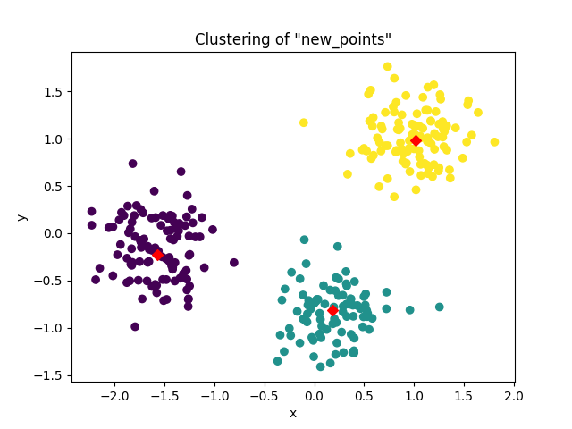

## Task 03

**Description:**

Let's create a `k-means` inertia graph.

We'll use the [`Seeds Dataset`](https://archive.ics.uci.edu/dataset/236/seeds) sourced from the UCI Machine Learning Repository and available in our `DATA` folder as `seeds_dataset.txt`. It is represented by an array containing seeds' measurements (such as `area`, `perimeter`, `length`, and several others). Load and output the dataset.

Experiment with fitting models that have a number of clusters ranging from `1` to `6`.

Answer the following question in a comment: *What's a good number of clusters in this case? Why?*.

**Acceptance criteria:**

1. The test case passes.

**Test case:**

```console
python task03.py
```

```console
Data:

      area  perimeter  compactness  length_of_kernel  width_of_kernel  asymmetry_coefficient  length_of_kernel_groove  varieties
0    15.26      14.84       0.8710             5.763            3.312                  2.221                    5.220        1.0
1    14.88      14.57       0.8811             5.554            3.333                  1.018                    4.956        1.0
2    14.29      14.09       0.9050             5.291            3.337                  2.699                    4.825        1.0
3    13.84      13.94       0.8955             5.324            3.379                  2.259                    4.805        1.0
4    16.14      14.99       0.9034             5.658            3.562                  1.355                    5.175        1.0
..     ...        ...          ...               ...              ...                    ...                      ...        ...
205  12.19      13.20       0.8783             5.137            2.981                  3.631                    4.870        3.0
206  11.23      12.88       0.8511             5.140            2.795                  4.325                    5.003        3.0
207  13.20      13.66       0.8883             5.236            3.232                  8.315                    5.056        3.0
208  11.84      13.21       0.8521             5.175            2.836                  3.598                    5.044        3.0
209  12.30      13.34       0.8684             5.243            2.974                  5.637                    5.063        3.0

[199 rows x 8 columns]
```

The following plot gets generated:

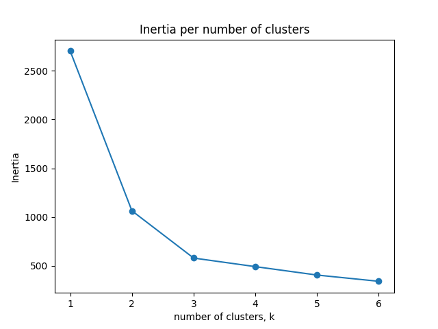

## Task 04

**Description:**

Fit a `KMeans` model with three clusters on the seeds dataset and create a cross tabulation displaying the distribution of the labels (in column `varieties`) in the clusters. To make it more readable, map each varienty class to its meaning:

- `1` corresponds to `Kama wheat`;
- `2` corresponds to `Rosa wheat`;
- `3` corresponds to `Canadian wheat`.

**Acceptance criteria:**

1. The test case passes.

**Test case:**

```console
python task04.py
```

```console
varieties  Canadian wheat  Kama wheat  Rosa wheat
row_0                                            
0                      64           8           0
1                       0           1          59
2                       1          57           9
```

## Task 05

**Description:**

You are given an array `samples` giving measurements of fish:

```python
samples = np.array([[242.0, 23.2, 25.4, 30.0, 38.4, 13.4], [290.0, 24.0, 26.3, 31.2, 40.0, 13.8], [340.0, 23.9, 26.5, 31.1, 39.8, 15.1], [363.0, 26.3, 29.0, 33.5, 38.0, 13.3], [430.0, 26.5, 29.0, 34.0, 36.6, 15.1], [450.0, 26.8, 29.7, 34.7, 39.2, 14.2], [500.0, 26.8, 29.7, 34.5, 41.1, 15.3], [390.0, 27.6, 30.0, 35.0, 36.2, 13.4], [450.0, 27.6, 30.0, 35.1, 39.9, 13.8], [500.0, 28.5, 30.7, 36.2, 39.3, 13.7], [475.0, 28.4, 31.0, 36.2, 39.4, 14.1], [500.0, 28.7, 31.0, 36.2, 39.7, 13.3], [500.0, 29.1, 31.5, 36.4, 37.8, 12.0], [600.0, 29.4, 32.0, 37.2, 40.2, 13.9], [600.0, 29.4, 32.0, 37.2, 41.5, 15.0], [700.0, 30.4, 33.0, 38.3, 38.8, 13.8], [700.0, 30.4, 33.0, 38.5, 38.8, 13.5], [610.0, 30.9, 33.5, 38.6, 40.5, 13.3], [650.0, 31.0, 33.5, 38.7, 37.4, 14.8], [575.0, 31.3, 34.0, 39.5, 38.3, 14.1], [685.0, 31.4, 34.0, 39.2, 40.8, 13.7], [620.0, 31.5, 34.5, 39.7, 39.1, 13.3], [680.0, 31.8, 35.0, 40.6, 38.1, 15.1], [700.0, 31.9, 35.0, 40.5, 40.1, 13.8], [725.0, 31.8, 35.0, 40.9, 40.0, 14.8], [720.0, 32.0, 35.0, 40.6, 40.3, 15.0], [714.0, 32.7, 36.0, 41.5, 39.8, 14.1], [850.0, 32.8, 36.0, 41.6, 40.6, 14.9], [1000.0, 33.5, 37.0, 42.6, 44.5, 15.5], [920.0, 35.0, 38.5, 44.1, 40.9, 14.3], [955.0, 35.0, 38.5, 44.0, 41.1, 14.3], [925.0, 36.2, 39.5, 45.3, 41.4, 14.9], [975.0, 37.4, 41.0, 45.9, 40.6, 14.7], [950.0, 38.0, 41.0, 46.5, 37.9, 13.7], [40.0, 12.9, 14.1, 16.2, 25.6, 14.0], [69.0, 16.5, 18.2, 20.3, 26.1, 13.9], [78.0, 17.5, 18.8, 21.2, 26.3, 13.7], [87.0, 18.2, 19.8, 22.2, 25.3, 14.3], [120.0, 18.6, 20.0, 22.2, 28.0, 16.1], [0.0, 19.0, 20.5, 22.8, 28.4, 14.7], [110.0, 19.1, 20.8, 23.1, 26.7, 14.7], [120.0, 19.4, 21.0, 23.7, 25.8, 13.9], [150.0, 20.4, 22.0, 24.7, 23.5, 15.2], [145.0, 20.5, 22.0, 24.3, 27.3, 14.6], [160.0, 20.5, 22.5, 25.3, 27.8, 15.1], [140.0, 21.0, 22.5, 25.0, 26.2, 13.3], [160.0, 21.1, 22.5, 25.0, 25.6, 15.2], [169.0, 22.0, 24.0, 27.2, 27.7, 14.1], [161.0, 22.0, 23.4, 26.7, 25.9, 13.6], [200.0, 22.1, 23.5, 26.8, 27.6, 15.4], [180.0, 23.6, 25.2, 27.9, 25.4, 14.0], [290.0, 24.0, 26.0, 29.2, 30.4, 15.4], [272.0, 25.0, 27.0, 30.6, 28.0, 15.6], [390.0, 29.5, 31.7, 35.0, 27.1, 15.3], [6.7, 9.3, 9.8, 10.8, 16.1, 9.7], [7.5, 10.0, 10.5, 11.6, 17.0, 10.0], [7.0, 10.1, 10.6, 11.6, 14.9, 9.9], [9.7, 10.4, 11.0, 12.0, 18.3, 11.5], [9.8, 10.7, 11.2, 12.4, 16.8, 10.3], [8.7, 10.8, 11.3, 12.6, 15.7, 10.2], [10.0, 11.3, 11.8, 13.1, 16.9, 9.8], [9.9, 11.3, 11.8, 13.1, 16.9, 8.9], [9.8, 11.4, 12.0, 13.2, 16.7, 8.7], [12.2, 11.5, 12.2, 13.4, 15.6, 10.4], [13.4, 11.7, 12.4, 13.5, 18.0, 9.4], [12.2, 12.1, 13.0, 13.8, 16.5, 9.1], [19.7, 13.2, 14.3, 15.2, 18.9, 13.6], [19.9, 13.8, 15.0, 16.2, 18.1, 11.6], [200.0, 30.0, 32.3, 34.8, 16.0, 9.7], [300.0, 31.7, 34.0, 37.8, 15.1, 11.0], [300.0, 32.7, 35.0, 38.8, 15.3, 11.3], [300.0, 34.8, 37.3, 39.8, 15.8, 10.1], [430.0, 35.5, 38.0, 40.5, 18.0, 11.3], [345.0, 36.0, 38.5, 41.0, 15.6, 9.7], [456.0, 40.0, 42.5, 45.5, 16.0, 9.5], [510.0, 40.0, 42.5, 45.5, 15.0, 9.8], [540.0, 40.1, 43.0, 45.8, 17.0, 11.2], [500.0, 42.0, 45.0, 48.0, 14.5, 10.2], [567.0, 43.2, 46.0, 48.7, 16.0, 10.0], [770.0, 44.8, 48.0, 51.2, 15.0, 10.5], [950.0, 48.3, 51.7, 55.1, 16.2, 11.2], [1250.0, 52.0, 56.0, 59.7, 17.9, 11.7], [1600.0, 56.0, 60.0, 64.0, 15.0, 9.6], [1550.0, 56.0, 60.0, 64.0, 15.0, 9.6], [1650.0, 59.0, 63.4, 68.0, 15.9, 11.0]])
```

Each row represents an individual fish. A species list is also given - it represent the species each fish belongs to:

```python
species = ['Bream', 'Bream', 'Bream', 'Bream', 'Bream', 'Bream', 'Bream', 'Bream', 'Bream', 'Bream', 'Bream', 'Bream', 'Bream', 'Bream', 'Bream', 'Bream', 'Bream', 'Bream', 'Bream', 'Bream', 'Bream', 'Bream', 'Bream', 'Bream', 'Bream', 'Bream', 'Bream', 'Bream', 'Bream', 'Bream', 'Bream', 'Bream', 'Bream', 'Bream', 'Roach', 'Roach', 'Roach', 'Roach', 'Roach', 'Roach', 'Roach', 'Roach', 'Roach', 'Roach', 'Roach', 'Roach', 'Roach', 'Roach', 'Roach', 'Roach', 'Roach', 'Roach', 'Roach', 'Roach', 'Smelt', 'Smelt', 'Smelt', 'Smelt', 'Smelt', 'Smelt', 'Smelt', 'Smelt', 'Smelt', 'Smelt', 'Smelt', 'Smelt', 'Smelt', 'Smelt', 'Pike', 'Pike', 'Pike', 'Pike', 'Pike', 'Pike', 'Pike', 'Pike', 'Pike', 'Pike', 'Pike', 'Pike', 'Pike', 'Pike', 'Pike', 'Pike', 'Pike']
```

The measurements, such as weight in grams, length in centimeters, and the percentage ratio of height to length, have very different scales. In order to cluster this data effectively, we'll need to standardize these features first. **Build an `sklean` pipeline to standardize and cluster the data.**

Model requirements:

- use `4` clusters.

Output a cross tabulation of the obtained clusters and the `species` list.

**Acceptance criteria:**

1. The test case passes.
2. An `sklearn` `Pipeline` is built.

**Test case:**

```console
python task05.py
```

```console
species  Bream  Pike  Roach  Smelt
labels
0            0    17      0      0
1           33     0      1      0
2            0     0      0     13
3            1     0     19      1
```

## Task 06

**Description:**

In the file `price_movements.txt` (in our `DATA` folder), you'll find daily stock price movements of companies (i.e. the dollar difference between the closing and opening prices for each trading day). Each row corresponds to a company, and each column corresponds to a trading day. **We'll try to see which companies have stock prices that tend to change in the same way** by clustering them together.

A list of company names is also given below:

```python
companies = ['Apple', 'AIG', 'Amazon', 'American express', 'Boeing', 'Bank of America', 'British American Tobacco', 'Canon', 'Caterpillar', 'Colgate-Palmolive', 'ConocoPhillips', 'Cisco', 'Chevron', 'DuPont de Nemours', 'Dell', 'Ford', 'General Electrics', 'Google/Alphabet', 'Goldman Sachs', 'GlaxoSmithKline', 'Home Depot', 'Honda', 'HP', 'IBM', 'Intel', 'Johnson & Johnson', 'JPMorgan Chase', 'Kimberly-Clark', 'Coca Cola', 'Lookheed Martin', 'MasterCard', 'McDonalds', '3M', 'Microsoft', 'Mitsubishi', 'Navistar', 'Northrop Grumman', 'Novartis', 'Pepsi', 'Pfizer', 'Procter Gamble', 'Philip Morris', 'Royal Dutch Shell', 'SAP', 'Schlumberger', 'Sony', 'Sanofi-Aventis', 'Symantec', 'Toyota', 'Total', 'Taiwan Semiconductor Manufacturing', 'Texas instruments', 'Unilever', 'Valero Energy', 'Walgreen', 'Wells Fargo', 'Wal-Mart', 'Exxon', 'Xerox', 'Yahoo']
```

To parse this file, load it into memory, then use `ast.literal_eval` to parse the string into a list. Convert the list into an array and output its shape.

Some stocks are more expensive than others. To account for this, include a `Normalizer` at the beginning of your pipeline. The `Normalizer` will separately transform each company's stock price to a relative scale before the clustering begins.

Model requirements:

- use `10` clusters.

Sort the predicted labels along with the company names to see which companies are in the same cluster and output the result.

**Acceptance criteria:**

1. The test case passes.
2. An `sklearn` `Pipeline` is built.

**Test case:**

```console
python task06.py
```

```console
Data shape: (60, 963)
    labels                           companies
29       0                     Lookheed Martin
36       0                    Northrop Grumman
4        0                              Boeing
43       1                                 SAP
30       1                          MasterCard
17       1                     Google/Alphabet
0        1                               Apple
59       1                               Yahoo
2        1                              Amazon
53       2                       Valero Energy
32       2                                  3M
39       2                              Pfizer
13       2                   DuPont de Nemours
25       2                   Johnson & Johnson
44       2                        Schlumberger
10       2                      ConocoPhillips
57       2                               Exxon
8        2                         Caterpillar
12       2                             Chevron
6        3            British American Tobacco
19       3                     GlaxoSmithKline
41       3                       Philip Morris
1        4                                 AIG
3        4                    American express
26       4                      JPMorgan Chase
55       4                         Wells Fargo
16       4                   General Electrics
18       4                       Goldman Sachs
5        4                     Bank of America
28       5                           Coca Cola
38       5                               Pepsi
23       6                                 IBM
14       6                                Dell
42       6                   Royal Dutch Shell
54       6                            Walgreen
49       6                               Total
37       6                            Novartis
35       6                            Navistar
20       6                          Home Depot
31       6                           McDonalds
22       6                                  HP
58       6                               Xerox
47       6                            Symantec
52       6                            Unilever
46       6                      Sanofi-Aventis
50       7  Taiwan Semiconductor Manufacturing
51       7                   Texas instruments
33       7                           Microsoft
24       7                               Intel
11       7                               Cisco
48       8                              Toyota
34       8                          Mitsubishi
21       8                               Honda
15       8                                Ford
45       8                                Sony
7        8                               Canon
40       9                      Procter Gamble
27       9                      Kimberly-Clark
56       9                            Wal-Mart
9        9                   Colgate-Palmolive
```

## Task 07

**Description:**

A sample of the grain measurements is provided in the array `samples`, while the variety of each grain sample is given by the list `varieties`.

```python
samples = np.array([[14.88, 14.57, 0.8811, 5.554, 3.333, 1.018, 4.956], [14.69, 14.49, 0.8799, 5.563, 3.259, 3.586, 5.219], [14.03, 14.16, 0.8796, 5.438, 3.201, 1.717, 5.001], [13.99, 13.83, 0.9183, 5.119, 3.383, 5.234, 4.781], [14.11, 14.26, 0.8722, 5.52, 3.168, 2.688, 5.219], [13.02, 13.76, 0.8641, 5.395, 3.026, 3.373, 4.825], [15.49, 14.94, 0.8724, 5.757, 3.371, 3.412, 5.228], [16.2, 15.27, 0.8734, 5.826, 3.464, 2.823, 5.527], [13.5, 13.85, 0.8852, 5.351, 3.158, 2.249, 5.176], [15.36, 14.76, 0.8861, 5.701, 3.393, 1.367, 5.132], [15.78, 14.91, 0.8923, 5.674, 3.434, 5.593, 5.136], [14.46, 14.35, 0.8818, 5.388, 3.377, 2.802, 5.044], [11.23, 12.63, 0.884, 4.902, 2.879, 2.269, 4.703], [14.34, 14.37, 0.8726, 5.63, 3.19, 1.313, 5.15], [16.84, 15.67, 0.8623, 5.998, 3.484, 4.675, 5.877], [17.32, 15.91, 0.8599, 6.064, 3.403, 3.824, 5.922], [18.72, 16.19, 0.8977, 6.006, 3.857, 5.324, 5.879], [18.88, 16.26, 0.8969, 6.084, 3.764, 1.649, 6.109], [18.76, 16.2, 0.8984, 6.172, 3.796, 3.12, 6.053], [19.31, 16.59, 0.8815, 6.341, 3.81, 3.477, 6.238], [17.99, 15.86, 0.8992, 5.89, 3.694, 2.068, 5.837], [18.85, 16.17, 0.9056, 6.152, 3.806, 2.843, 6.2], [19.38, 16.72, 0.8716, 6.303, 3.791, 3.678, 5.965], [18.96, 16.2, 0.9077, 6.051, 3.897, 4.334, 5.75], [18.14, 16.12, 0.8772, 6.059, 3.563, 3.619, 6.011], [18.65, 16.41, 0.8698, 6.285, 3.594, 4.391, 6.102], [18.94, 16.32, 0.8942, 6.144, 3.825, 2.908, 5.949], [17.36, 15.76, 0.8785, 6.145, 3.574, 3.526, 5.971], [13.32, 13.94, 0.8613, 5.541, 3.073, 7.035, 5.44], [11.43, 13.13, 0.8335, 5.176, 2.719, 2.221, 5.132], [12.01, 13.52, 0.8249, 5.405, 2.776, 6.992, 5.27], [11.34, 12.87, 0.8596, 5.053, 2.849, 3.347, 5.003], [12.02, 13.33, 0.8503, 5.35, 2.81, 4.271, 5.308], [12.44, 13.59, 0.8462, 5.319, 2.897, 4.924, 5.27], [11.55, 13.1, 0.8455, 5.167, 2.845, 6.715, 4.956], [11.26, 13.01, 0.8355, 5.186, 2.71, 5.335, 5.092], [12.46, 13.41, 0.8706, 5.236, 3.017, 4.987, 5.147], [11.81, 13.45, 0.8198, 5.413, 2.716, 4.898, 5.352], [11.27, 12.86, 0.8563, 5.091, 2.804, 3.985, 5.001], [12.79, 13.53, 0.8786, 5.224, 3.054, 5.483, 4.958], [12.67, 13.32, 0.8977, 4.984, 3.135, 2.3, 4.745], [11.23, 12.88, 0.8511, 5.14, 2.795, 4.325, 5.003]])
varieties = ['Kama wheat', 'Kama wheat', 'Kama wheat', 'Kama wheat', 'Kama wheat', 'Kama wheat', 'Kama wheat', 'Kama wheat', 'Kama wheat', 'Kama wheat', 'Kama wheat', 'Kama wheat', 'Kama wheat', 'Kama wheat', 'Rosa wheat', 'Rosa wheat', 'Rosa wheat', 'Rosa wheat', 'Rosa wheat', 'Rosa wheat', 'Rosa wheat', 'Rosa wheat', 'Rosa wheat', 'Rosa wheat', 'Rosa wheat', 'Rosa wheat', 'Rosa wheat', 'Rosa wheat', 'Canadian wheat', 'Canadian wheat', 'Canadian wheat', 'Canadian wheat', 'Canadian wheat', 'Canadian wheat', 'Canadian wheat', 'Canadian wheat', 'Canadian wheat', 'Canadian wheat', 'Canadian wheat', 'Canadian wheat', 'Canadian wheat', 'Canadian wheat']
```

Perform hierarchical clustering with `method='complete'` on the samples and plot a dendrogram in which the font size of the leafs is set to `6`.

**Acceptance criteria:**

1. The test case passes.

**Test case:**

```console
python task07.py
```

The following plot is generated:

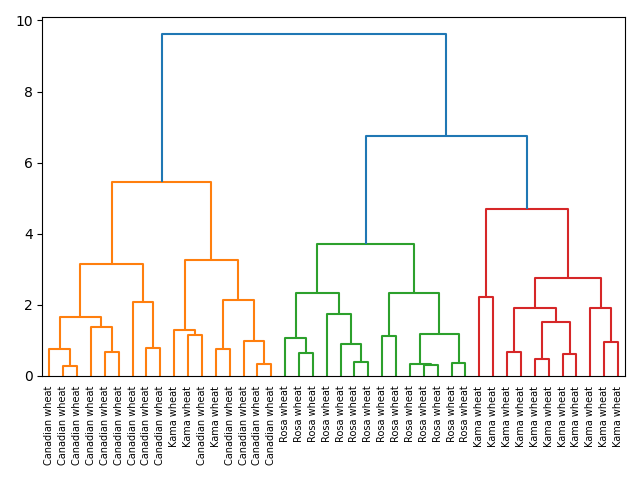

## Task 08

**Description:**

Perform hierarchical clustering of the companies from `Task 06` according to their stock price movements.

SciPy hierarchical clustering doesn't fit into a sklearn `Pipeline`, so you'll need to use the `normalize()` function from `sklearn.preprocessing` instead of `Normalizer`.

**Acceptance criteria:**

1. The test case passes.

**Test case:**

```console
python task08.py
```

The following plot is generated:

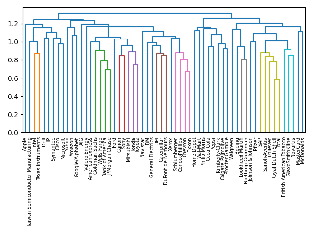

## Task 09

**Description:**

Perform hierarchical clustering of the voting countries with `'single'` linkage, and compare the resulting dendrogram with the one from class.

The data is available in the file `eurovision_voting.csv` in which each row corresponds to a voting country, and each column corresponds to a performance that was voted for.

**Acceptance criteria:**

1. The test case passes.

**Test case:**

```console
python task09.py
```

The following dendrogram is generated:

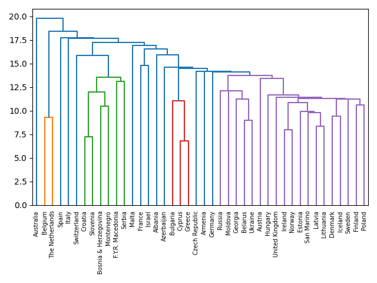

## Task 10

**Description:**

Extract the cluster labels in the intermediate clustering of grain samples from `Task 7` at height `6`, using `distance` as criterion. Compare the labels with the grain varieties using a cross-tabulation.

**Acceptance criteria:**

1. The test case passes.

**Test case:**

```console
python task10.py
```

```console
varieties  Canadian wheat  Kama wheat  Rosa wheat
labels                                           
1                      14           3           0
2                       0           0          14
3                       0          11           0
```

## Task 11

**Description:**

Apply `t-SNE` to the grain samples data from `Task 4` and inspect the resulting `t-SNE` features using a scatter plot. Try out different learing rates until you get a good-enough plot. Feel free to ouput multiple plots, showing out your experiments.

**Acceptance criteria:**

1. The test case passes.

**Test case:**

```console
python task11.py
```

A plot, similar to this one (may not be exactly the same), is generated:

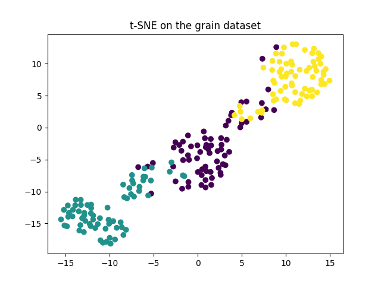

## Task 12

**Description:**

Apply `t-SNE` to the **normalized** company stock price data from `Task 08`. A scatter plot of the resulting `t-SNE` features, labeled by the company names, gives you a map of the stock market! Choose an appropriate learning rate. Feel free to ouput multiple plots, showing out your experiments.

To label each point in the resulting plot, research how [plt.annotate](https://matplotlib.org/stable/api/_as_gen/matplotlib.pyplot.annotate.html) can be used.

**Acceptance criteria:**

1. The test case passes.

**Test case:**

```console
python task12.py
```

A plot, similar to this one (may not be exactly the same), is generated:

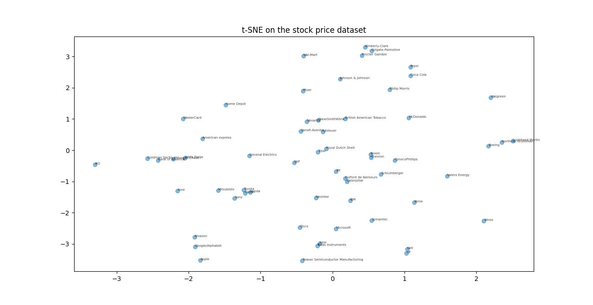

## Task 13

**Description:**

You are exploring the grain samples data. You suspect that width and length of the kernel might be correlated. To confirm this, make a scatter plot and measure their Pearson correlation. Place the value of the correlation as a title.

Answer the following question in a comment: *Is your hypothesis true?*.

**Acceptance criteria:**

1. The test case passes.
2. A comment is written with an answer to the question in the description.

**Test case:**

```console
python task13.py
```

The following plot is generated:

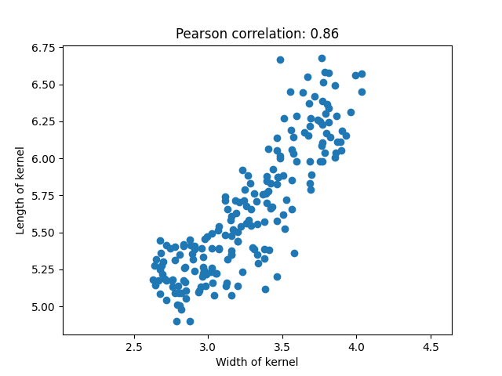

## Task 14

**Description:**

Apply PCA to the two measurements from `Task 13`, then plot the resulting points and measure their Pearson correlation.

**Acceptance criteria:**

1. The test case passes.

**Test case:**

```console
python task14.py
```

The following plot is generated:

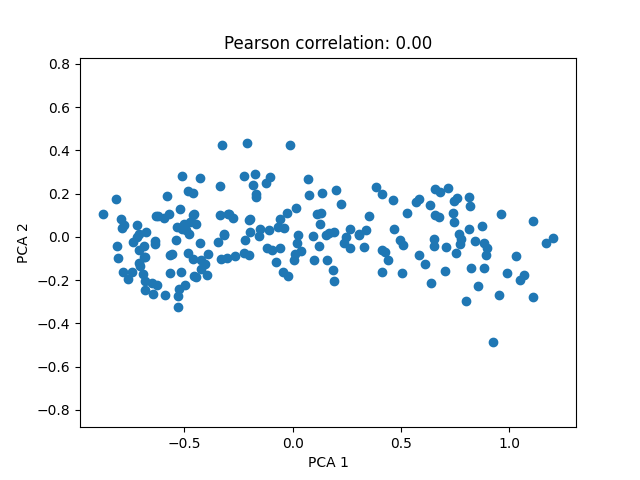

## Task 15

**Description:**

The first principal component of the data is the direction in which the data varies the most. Use PCA to find the first principal component of the length and width measurements of the `grain` samples. Represent it as an arrow on the scatter plot of the untransformed points. Research how [`plt.arrow`](https://matplotlib.org/stable/api/_as_gen/matplotlib.pyplot.arrow.html) can be used. The arrow should start from the mean of the data and go into the direction of the first principle component. This will be the same as the direction in which the untransformed data varies the most.

**Acceptance criteria:**

1. The test case passes.

**Test case:**

```console
python task15.py
```

The following plot is generated:

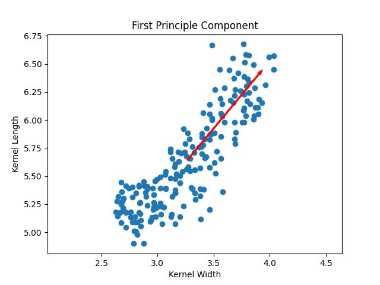

## Task 16

**Description:**

The fish dataset is `6`-dimensional. But what is its *intrinsic* dimension? To answer this question, we have to create a bar plot of the variances of the PCA features. Standardize the features before passing them to the PCA model - use a pipeline for that.

Identify the intrinsic dimension of the scaled dataset and use it to apply `PCA`for dimensionality reduction. Output the shape of the resulting features.

**Acceptance criteria:**

1. The test case passes.
2. An `sklearn` pipeline is used.

**Test case:**

```console
python task16.py
```

```console
Shape of PCA features: (85, 2)
```

And the following plot is generated:

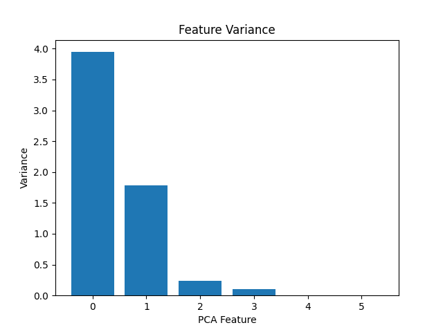

## Task 17

**Description:**

Create a tf-idf word frequency array for a toy collection of documents. For this, use the [`TfidfVectorizer`](https://scikit-learn.org/stable/modules/generated/sklearn.feature_extraction.text.TfidfVectorizer.html) class from `sklearn`. It transforms a list of documents into a word frequency array, which it outputs as a `csr_matrix`. It has `fit()` and `transform()` methods like other `sklearn` objects.

Here are the documents:

```python
['cats say meow', 'dogs say woof', 'dogs chase cats']
```

The columns of the produced CSR matrix correspond to words. Get the list of words by calling the `get_feature_names_out` method of the vectorizer and output the resulting words along with the CSR matrix.

**Acceptance criteria:**

1. The test case passes.

**Test case:**

```console
python task17.py
```

```console
[[0.51785612 0.         0.         0.68091856 0.51785612 0.        ]
 [0.         0.         0.51785612 0.         0.51785612 0.68091856]
 [0.51785612 0.68091856 0.51785612 0.         0.         0.        ]]
['cats' 'chase' 'dogs' 'meow' 'say' 'woof']
```

## Task 18

**Description:**

Let's cluster some popular pages from Wikipedia.

Create a `Pipeline` object consisting of a `TruncatedSVD` followed by `KMeans`. Apply it on the `wikipedia-vectors.csv` dataset. `tf-idf` word-frequencies have already been computed in it. Note that you'll have to do some preprcessing in order to get the data into the most appropriate format. To determine your actions, explore the data.

Model requirements:

- the top `50` most important features are kept. The others - disregarded.
- data is clustered into `6` clusters.

Output the labels and titles, sorted by label.

**Acceptance criteria:**

1. The test case passes.
2. An `sklearn` pipeline is created.

**Test case:**

```console
python task18.py
```

```console
    label                                        article
5       0                                         Tumblr
7       0                                  Social search
4       0                                  Google Search
9       0                                       LinkedIn
12      1                                   Nigel Lawson
11      1       Nationally Appropriate Mitigation Action
10      1                                 Global warming
14      1                                 Climate change
15      1                                 Kyoto Protocol
13      1                               Connie Hedegaard
30      1                  France national football team
31      1                              Cristiano Ronaldo
19      1  2007 United Nations Climate Change Conference
18      1  2010 United Nations Climate Change Conference
17      1  Greenhouse gas emissions by the United States
16      1                                        350.org
39      1                                  Franck Ribéry
38      1                                         Neymar
37      1                                       Football
36      1              2014 FIFA World Cup qualification
35      1                Colombia national football team
34      1                             Zlatan Ibrahimović
33      1                                 Radamel Falcao
32      1                                   Arsenal F.C.
23      2                           Catherine Zeta-Jones
22      2                              Denzel Washington
24      2                                   Jessica Biel
25      2                                  Russell Crowe
27      2                                 Dakota Fanning
26      2                                     Mila Kunis
20      2                                 Angelina Jolie
21      2                             Michael Fassbender
28      2                                  Anne Hathaway
29      2                               Jennifer Aniston
58      3                                         Sepsis
59      3                                    Adam Levine
52      3                                     The Wanted
53      3                                   Stevie Nicks
55      3                                  Black Sabbath
54      3                                 Arctic Monkeys
56      3                                       Skrillex
57      3                          Red Hot Chili Peppers
50      3                                   Chad Kroeger
51      3                                     Nate Ruess
2       4                              Internet Explorer
8       4                                        Firefox
6       4                    Hypertext Transfer Protocol
3       4                                    HTTP cookie
0       4                                       HTTP 404
1       4                                 Alexa Internet
45      5                                    Hepatitis C
44      5                                           Gout
43      5                                       Leukemia
42      5                                    Doxycycline
41      5                                    Hepatitis B
40      5                                    Tonsillitis
47      5                                          Fever
46      5                                     Prednisone
49      5                                       Lymphoma
48      5                                     Gabapentin
```

## Task 19

**Description:**

Apply NMF on the tf-idf word-frequency array of Wikipedia articles.

Model requirements:

- `6` components are retained.

Output the first `6` transformed samples, rounded to `2` decimal places.

Then, create a dataframe from those features and use the titles as index. Output the rows with titles `'Anne Hathaway' and 'Denzel Washington'`. Answer the following two questions in a comment:

1. *Which feature has the highest value?*
2. *What does this mean?*

Output the most common words that identify the topic encoded using the feature with the highest value. The list of the words that label the columns of the word-frequency array is available as `wikipedia-vocabulary-utf8.txt` in our `DATA` folder.

**Acceptance criteria:**

1. The test case passes.
2. Answers for to both questions are present as comments in the solution.

**Test case:**

```console
python task19.py
```

```console
[[0.   0.   0.   0.   0.   0.44]
 [0.   0.   0.   0.   0.   0.56]
 [0.   0.   0.   0.   0.   0.4 ]
 [0.   0.   0.   0.   0.   0.38]
 [0.   0.   0.   0.   0.   0.48]
 [0.01 0.01 0.01 0.03 0.   0.33]]
                          0         1    2         3    4    5
Anne Hathaway      0.003855  0.000000  0.0  0.571856  0.0  0.0
Denzel Washington  0.000000  0.005584  0.0  0.419569  0.0  0.0

The topic, that the articles about Anne Hathaway and Denzel Washington have in common, has the words:
film       0.632130
award      0.254844
starred    0.246946
role       0.212883
actress    0.187660
Name: 3, dtype: float64
```

## Task 20

**Description:**

Use NMF to decompose grayscale images into their commonly occurring patterns.

Firstly, explore the image dataset and see how it is encoded as an array. In our `DATA` folder, you'll find a dataset, called `lcd-digits.csv`. It holds `100` images as a `2D` array samples, where each row represents a single `13x8` image of a LED digital display. Plot the first digit.

Then, create and fit an NMF model with `7` components and plot each component. Notice how it's learned the parts that make up an LED image!

Unlike NMF, PCA *doesn't* learn the parts of things. Its components do not correspond to topics (in the case of documents) or to parts of images, when trained on images. Let's verify this - create and fit a `PCA` model with `7` components and plot its components.

**Acceptance criteria:**

1. The test case passes.

**Test case:**

```console
python task20.py
```

The following plots are generated:

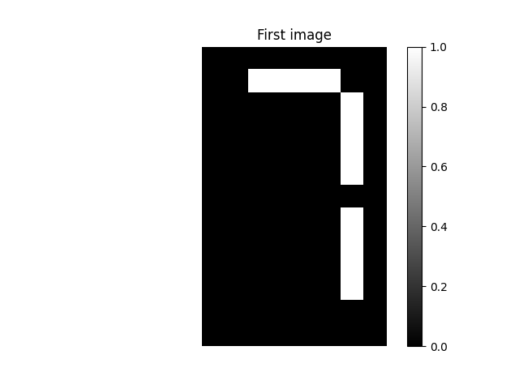
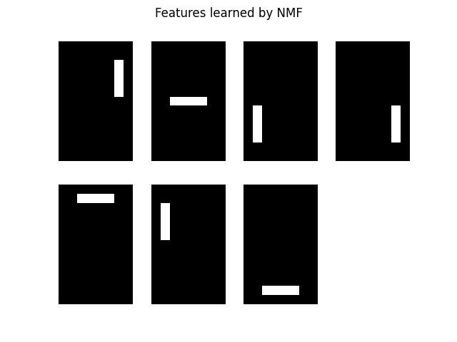
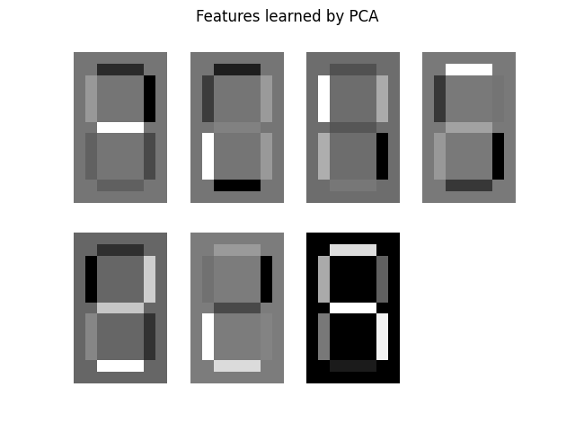

## Task 21

**Description:**

Use the NMF model for popular Wikipedia articles to find the articles most similar to the article about the footballer Cristiano Ronaldo. Output the names of the articles and their similarity value. Normalize the NMF features before searching for similarity.

**Acceptance criteria:**

1. The test case passes.

**Test case:**

```console
python task21.py
```

```console
Cristiano Ronaldo                1.000000
Franck Ribéry                    0.999973
Radamel Falcao                   0.999942
Zlatan Ibrahimović               0.999942
France national football team    0.999923
dtype: float64
```

## Task 22

**Description:**

In this exercise, use NMF to recommender popular music artists. You're given 2 CSV files:

1. `artists.csv` - a list of artist names.
2. `scrobbler-small-sample.csv` - a file containing information about how many times a user listened a song.

Merge the datasets together to create a sparse array whose rows correspond to artists and whose columns correspond to users. The entries will give the number of times each artist was listened to by each user.

Build an `sklearn` pipeline that transforms the array into normalized NMF features. Before passing the data to the model we need to ensure that all users have the same influence on the model, regardless of how many different artists they've listened to. To do that use [`MaxAbsScaler`](https://scikit-learn.org/stable/modules/generated/sklearn.preprocessing.MaxAbsScaler.html) to make the maximum value for each feature be `1`.

Model requirements:

- use `20` components.

Create an output that answers the question: *If you were a big fan of Bruce Springsteen which other musical artists might you like?*.

**Acceptance criteria:**

1. The test case passes.
2. An `sklearn` pipeline is built from `3` components.

**Test case:**

```console
python task22.py
```

```console
artist_name
Bruce Springsteen    1.000000
Leonard Cohen        0.962958
Neil Young           0.951201
The Beach Boys       0.858101
Van Morrison         0.842178
dtype: float64
```
