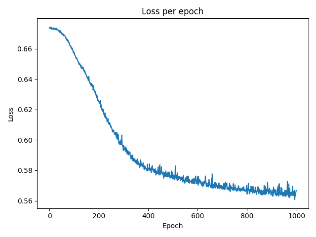
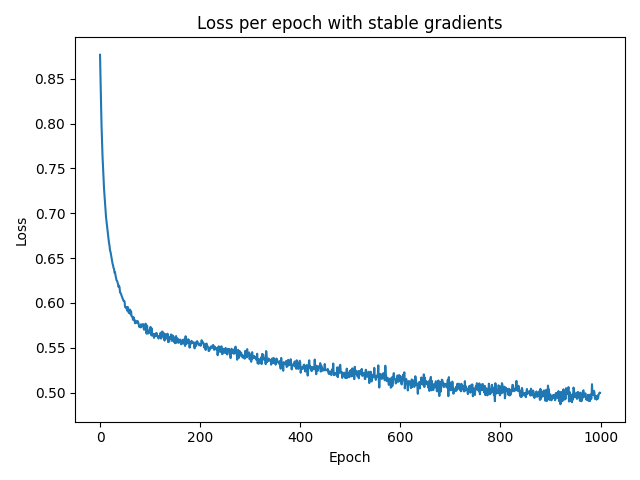

# 🎯 Goals for week 12

1. Practice working with PyTorch datasets, dataloaders and models.
2. Practice using PyTorch optimizers, activations and batch normalization.
3. Write a training and an evaluation loop using PyTorch.
4. Practice writing high quality code:
   1. Easy to read.
   2. Safe from bugs.
   3. Ready for change.

## Task 01

**Description:**

Build a PyTorch Dataset for the water potability data. Define a class called `WaterDataset` that loads data from a CSV file. Store the data in a NumPy array. Create an object from this class, using the training data, and output:

- the number of instances;
- the fifth item in the data.

Then, create a `DataLoader` object and pass the dataset to it, shuffling it and breaking it down into batches of two. Output the first batch of features and labels from the `DataLoader` object.

**Acceptance criteria:**

1. The test case passes.

**Test case:**

```console
python task01.py
```

```console
Number of instances: 1508
Fifth item: (array([0.61088305, 0.52523539, 0.46561915, 0.47513312, 0.63433849,
       0.19640938, 0.62342348, 0.52058877, 0.75585562]), 0.0)
tensor([[0.3921, 0.4874, 0.4012, 0.5431, 0.6080, 0.4304, 0.5240, 0.3609, 0.5177],
        [0.6141, 0.3594, 0.7207, 0.3401, 0.5015, 0.5395, 0.5549, 0.5834, 0.4812]],
       dtype=torch.float64) tensor([1., 1.], dtype=torch.float64)
```

## Task 02

**Description:**

Build a model with three linear layers and ReLU activations in-between. Here's the model defined using `nn.Sequential()`. Your goal is to rewrite it using the `class-based` approach.

```python
net = nn.Sequential(
  nn.Linear(9, 16),
  nn.ReLU(),
  nn.Linear(16, 8),
  nn.ReLU(),
  nn.Linear(8, 1),
  nn.Sigmoid(),
)
```

For reproducibility after the imports and before any of the function declarations set the seed of `torch` to `42`.

Then create a `train_model` function that trains the neural network. It should accept the following as parameters:

- `dataloader_train`: a `DataLoader` object;
- `optimizer`: an object with an instantiated optimizer;
- `net`: an object with an instantiated neural network;
- `num_epochs`: a natural number, representing the number of epochs to train the neural network;
- `create_plot`: an optional parameter that if set to `True` will produce a line plot for the loss per epoch. Default value: `False`.

The function `train_model` should output the average loss per epoch. Use it to train the above model for `10` epochs with a learning rate of `0.001`. Compare the values of the loss when using `4` different optimizers:

- `SGD`;
- `RMSprop`;
- `Adam`;
- `AdamW`.

As a final step, use the `AdamW` optimizer to train the neural network with the above setup for `1000` epochs. Then evaluate it on the test set (`water_test.csv`) and output its `f1` score.

Research how to use and apply [`tqdm`](https://tqdm.github.io/) to show the training progress visually in the console.

In a comment, answer the question: *Does the model perform well?*. You may also compute other metrics (besides the `f1` score) to determine that.

**Acceptance criteria:**

1. The test case passes.
2. Naming conventions are used when importing the libraries. Refer to the examples in `notes.md`.
3. The package `tqdm` is used to show training progress.
4. A comment is written answering the question in the description.
5. The variable holding the loss function is named `criterion`.
6. The variable holding the optimizer is named `optimizer`.

**Test case:**

```console
python task02.py
```

```console
Using the SGD optimizer:
100%|█████████████████████████████████████████████████████████████████████████████████████████████████████████████████████████████████████████████████████████| 10/10 [00:00<00:00, 24.33it/s]
Average loss: 0.6805641366934069
Using the RMSprop optimizer:
100%|█████████████████████████████████████████████████████████████████████████████████████████████████████████████████████████████████████████████████████████| 10/10 [00:00<00:00, 23.98it/s]
Average loss: 0.6728743024581424
Using the Adam optimizer:
100%|█████████████████████████████████████████████████████████████████████████████████████████████████████████████████████████████████████████████████████████| 10/10 [00:00<00:00, 21.94it/s]
Average loss: 0.6711271806203386
Using the AdamW optimizer:
100%|█████████████████████████████████████████████████████████████████████████████████████████████████████████████████████████████████████████████████████████| 10/10 [00:00<00:00, 21.99it/s]
Average loss: 0.6688455635771181
100%|█████████████████████████████████████████████████████████████████████████████████████████████████████████████████████████████████████████████████████| 1000/1000 [00:44<00:00, 22.53it/s]
Average loss: 0.5930093977063516

F1 score on test set: 0.5508021116256714
```

and the following plot is created:



## Task 03

**Description:**

Our `Net` model is prone to the problems of unstable (vanishing or exploding) gradients. This task is about expanding its architecture to make it more immune to those problems.

Here's what we can do:

1. Substitute ReLU with ELU.
2. Improve the weight initialization by using the He (Kaiming) uniform initialization strategy, accounting for the correct values for the `nonlinearity` parameter. Look for the proper initializer in the `torch.nn.init` module. Since `elu` is not supported, for the layers that have this activation function, use the default value - `leaky_relu`.
3. Add batch normalization.

Apply the new model on the setup you created in `Task 2` (using the seed of `42`) and report the test set `f1` score.

Answer the following question in a comment:

Which of the following statements is true about batch normalization?

```text
A. Adding batch normalization doesn't impact the number of parameters the model has to learn.
B. Batch normalization normalizes a layer's inputs to a standard normal distribution and passes these normalized values further.
C. Batch normalization effectively learns the optimal input distribution for each layer it precedes.
```

**Acceptance criteria:**

1. The test case passes.
2. The proper `nonlinearity` values are specified when using the initialization strategy.
3. The letter of the correct option is written in a comment.
4. F1 on test set is outputted.

**Test case:**

```console
python task03.py
```

```console
Using the SGD optimizer:
100%|█████████████████████████████████████████████████████████████████████████████████████████████████████████████████████████████████████████████████████████| 10/10 [00:00<00:00, 16.40it/s]
Average loss: 0.7231906765081529
Using the RMSprop optimizer:
100%|█████████████████████████████████████████████████████████████████████████████████████████████████████████████████████████████████████████████████████████| 10/10 [00:00<00:00, 13.84it/s]
Average loss: 0.6660845685743654
Using the Adam optimizer:
100%|█████████████████████████████████████████████████████████████████████████████████████████████████████████████████████████████████████████████████████████| 10/10 [00:00<00:00, 16.87it/s]
Average loss: 0.6405066689781016
Using the AdamW optimizer:
100%|█████████████████████████████████████████████████████████████████████████████████████████████████████████████████████████████████████████████████████████| 10/10 [00:00<00:00, 17.59it/s]
Average loss: 0.6218260192843735
100%|█████████████████████████████████████████████████████████████████████████████████████████████████████████████████████████████████████████████████████| 1000/1000 [00:56<00:00, 17.74it/s]
Average loss: 0.5319020461751744

F1 score on test set: 0.5141388177871704
```

and the following plot is created:



## Task 04

**Description:**

Try to create a better model than the one we obtained in the previous tasks. Things you could play around with:

- adding a validation set and tracking performance on it during training;
- batch size;
- activation functions;
- architecture:
  - more linear layers;
  - you could implement the famous `VGG` architectures: <https://viso.ai/deep-learning/vgg-very-deep-convolutional-networks/>. It's a model that's mainly used for image-related tasks but its architecture could inspire you to create your own twist that solves our problem.
- number of epochs;
- learning rates;
- etc., etc.

The above are just examples. There are numerous other things to try out.

**Treat this task as a playground for conducting experiments to understand what makes a good neural network.**

**Acceptance criteria:**

1. A training process that results in a model giving a higher per-class `F1` score on the test dataset.
