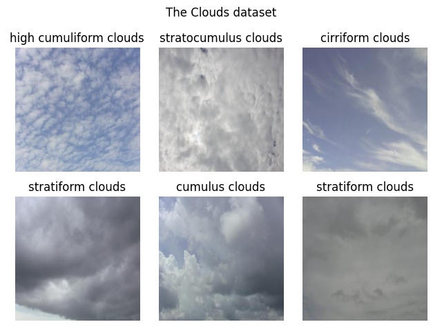
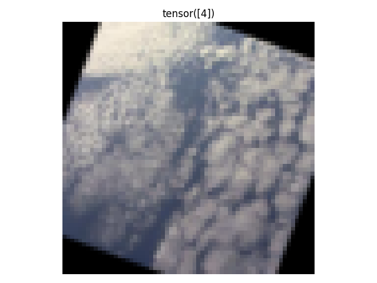
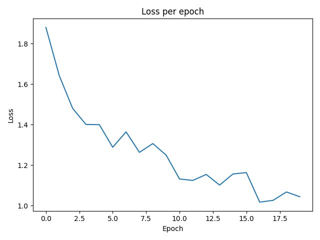

# 🎯 Goals for week 13

1. Practice working with convolutional neural networks using PyTorch.
2. Practice writing high quality code:
   1. Easy to read.
   2. Safe from bugs.
   3. Ready for change.

## Task 01

**Description:**

Create a plot with `6` randomly chosen pictures from the training data of the clouds dataset. Do not set a seed, so that the result is different every time.

**Acceptance criteria:**

1. A figure is created with `6` randomly chosen pictures.
2. No seed it set.

**Test case:**

```console
python task01.py
```



## Task 02

**Description:**

Create the dataset for training the model. Compose the following `6` transformations:

1. Random horizontal flip.
2. Random vertical flip.
3. A rotation by a random angle between `0` and `45` degrees.
4. Random automatic contrast adjustment.
5. Parse the image to a tensor.
6. Resize the image to `64` by `64`.

Display the first image in the preprocessed dataset.

Define a convolutional neural network, consisting of two parts:

- A feature extractor that learns a vector of features from the input batch of images.
- A classifier that predicts the class for each image in the batch based on the learned features.

The feature extractor should comprise of the following:

- Two convolutional layers with sizes of filters equal to `3`:
  - the first creating `32` feature maps;
  - the second - `64`.
- Zero-padding of `1` tile on each border.
- Max pooling with size `2`.
- `ELU` activation functions.

The classifier should be a single linear layer.

Train the model for `20` epochs using:

- a batch size of `16`;
- the `AdamW` optimizer;
- a learning rate of `0.001`.

Output the average loss across training batches and across the epochs. Create a plot from the latter.

**Acceptance criteria:**

1. Preprocessing is applied to all images.
2. The variable holding the loss function is named `criterion`.
3. The architecture of the neural network matches its description.
4. `tqdm` is used to show the progression through the batches for every epoch.

**Test case:**

Due to randomness while shuffling and augmentation operations, your output may vary.

```console
python task02.py
```



```console
Epoch 1: 100%|████████████████████████████████████████████████████████████████████████████████████████████████████████████████████████████████████████████████| 30/30 [00:03<00:00,  8.94it/s]
Average training loss per batch: 1.8804709315299988
Epoch 2: 100%|████████████████████████████████████████████████████████████████████████████████████████████████████████████████████████████████████████████████| 30/30 [00:03<00:00,  9.65it/s]
Average training loss per batch: 1.6421570380528767
Epoch 3: 100%|████████████████████████████████████████████████████████████████████████████████████████████████████████████████████████████████████████████████| 30/30 [00:03<00:00,  9.74it/s]
Average training loss per batch: 1.4803926865259807
Epoch 4: 100%|████████████████████████████████████████████████████████████████████████████████████████████████████████████████████████████████████████████████| 30/30 [00:03<00:00,  9.67it/s]
Average training loss per batch: 1.4007591962814332
Epoch 5: 100%|████████████████████████████████████████████████████████████████████████████████████████████████████████████████████████████████████████████████| 30/30 [00:03<00:00,  9.34it/s]
Average training loss per batch: 1.3997631867726643
Epoch 6: 100%|████████████████████████████████████████████████████████████████████████████████████████████████████████████████████████████████████████████████| 30/30 [00:03<00:00,  8.53it/s]
Average training loss per batch: 1.2880900959173838
Epoch 7: 100%|████████████████████████████████████████████████████████████████████████████████████████████████████████████████████████████████████████████████| 30/30 [00:03<00:00,  9.61it/s]
Average training loss per batch: 1.3640881101290385
Epoch 8: 100%|████████████████████████████████████████████████████████████████████████████████████████████████████████████████████████████████████████████████| 30/30 [00:03<00:00,  9.56it/s]
Average training loss per batch: 1.2628552218278248
Epoch 9: 100%|████████████████████████████████████████████████████████████████████████████████████████████████████████████████████████████████████████████████| 30/30 [00:03<00:00,  9.50it/s]
Average training loss per batch: 1.3062392791112265
Epoch 10: 100%|███████████████████████████████████████████████████████████████████████████████████████████████████████████████████████████████████████████████| 30/30 [00:03<00:00,  9.41it/s]
Average training loss per batch: 1.2490018725395202
Epoch 11: 100%|███████████████████████████████████████████████████████████████████████████████████████████████████████████████████████████████████████████████| 30/30 [00:03<00:00,  9.58it/s]
Average training loss per batch: 1.1311754703521728
Epoch 12: 100%|███████████████████████████████████████████████████████████████████████████████████████████████████████████████████████████████████████████████| 30/30 [00:03<00:00,  9.67it/s]
Average training loss per batch: 1.124160369237264
Epoch 13: 100%|███████████████████████████████████████████████████████████████████████████████████████████████████████████████████████████████████████████████| 30/30 [00:03<00:00,  9.56it/s]
Average training loss per batch: 1.1537493507067362
Epoch 14: 100%|███████████████████████████████████████████████████████████████████████████████████████████████████████████████████████████████████████████████| 30/30 [00:03<00:00,  9.52it/s]
Average training loss per batch: 1.1011268635590872
Epoch 15: 100%|███████████████████████████████████████████████████████████████████████████████████████████████████████████████████████████████████████████████| 30/30 [00:03<00:00,  9.42it/s]
Average training loss per batch: 1.1560158749421439
Epoch 16: 100%|███████████████████████████████████████████████████████████████████████████████████████████████████████████████████████████████████████████████| 30/30 [00:03<00:00,  9.15it/s]
Average training loss per batch: 1.162852003177007
Epoch 17: 100%|███████████████████████████████████████████████████████████████████████████████████████████████████████████████████████████████████████████████| 30/30 [00:03<00:00,  9.55it/s]
Average training loss per batch: 1.0168438176314036
Epoch 18: 100%|███████████████████████████████████████████████████████████████████████████████████████████████████████████████████████████████████████████████| 30/30 [00:03<00:00,  9.57it/s]
Average training loss per batch: 1.0256097475687662
Epoch 19: 100%|███████████████████████████████████████████████████████████████████████████████████████████████████████████████████████████████████████████████| 30/30 [00:03<00:00,  9.00it/s]
Average training loss per batch: 1.0670619587103525
Epoch 20: 100%|███████████████████████████████████████████████████████████████████████████████████████████████████████████████████████████████████████████████| 30/30 [00:03<00:00,  9.41it/s]
Average training loss per batch: 1.0435174524784088
Average training loss per epoch: 1.2627965263525645
```



## Task 03

**Description:**

In this task we'll add more metrics to the process in `Task 02` and track how our model performs on the test set.

Firstly, let's log how much is the total time needed to train the model. Use the `time` module and more specifically the function `time.time()`.

Secondly, let's see how the model scores on the test set. Output the global macro precision, global macro recall as well as the global macro `F1` score. To get a clearer view of which class has the lowest `F1` score, output the `F1` scores per class, rounded to the fourth digit. Use the `pprint` module to output a more readable version of the dictionary with scores.

Analyze the results and write out your conclusions in a comment.

**Acceptance criteria:**

1. The time needed for data preparation is logged in seconds.
2. The following metrics are logged: global macro precision, global macro recall, global macro `F1` score, per-class `F1` score.
3. The module `pprint` is used.
4. A comment is written with an analysis of the results.

**Test case:**

Due to randomness while shuffling and augmentation operations, your output may vary.

```console
python task03.py
```

```console
Epoch 1: 100%|████████████████████████████████████████████████████████████████████████████████████████████████████████████████████████████████████████████████| 30/30 [00:03<00:00,  9.31it/s]
Average training loss per batch: 1.9962177197138469
Epoch 2: 100%|████████████████████████████████████████████████████████████████████████████████████████████████████████████████████████████████████████████████| 30/30 [00:03<00:00,  9.67it/s]
Average training loss per batch: 1.6752891023953755
Epoch 3: 100%|████████████████████████████████████████████████████████████████████████████████████████████████████████████████████████████████████████████████| 30/30 [00:03<00:00,  9.38it/s]
Average training loss per batch: 1.5002583344777425
Epoch 4: 100%|████████████████████████████████████████████████████████████████████████████████████████████████████████████████████████████████████████████████| 30/30 [00:03<00:00,  9.59it/s]
Average training loss per batch: 1.4287975907325745
Epoch 5: 100%|████████████████████████████████████████████████████████████████████████████████████████████████████████████████████████████████████████████████| 30/30 [00:03<00:00,  9.81it/s]
Average training loss per batch: 1.358592732747396
Epoch 6: 100%|████████████████████████████████████████████████████████████████████████████████████████████████████████████████████████████████████████████████| 30/30 [00:03<00:00,  9.61it/s]
Average training loss per batch: 1.2679957528909047
Epoch 7: 100%|████████████████████████████████████████████████████████████████████████████████████████████████████████████████████████████████████████████████| 30/30 [00:03<00:00,  9.80it/s]
Average training loss per batch: 1.4660948197046915
Epoch 8: 100%|████████████████████████████████████████████████████████████████████████████████████████████████████████████████████████████████████████████████| 30/30 [00:03<00:00,  9.76it/s]
Average training loss per batch: 1.4036619583765666
Epoch 9: 100%|████████████████████████████████████████████████████████████████████████████████████████████████████████████████████████████████████████████████| 30/30 [00:03<00:00,  9.29it/s]
Average training loss per batch: 1.191452964146932
Epoch 10: 100%|███████████████████████████████████████████████████████████████████████████████████████████████████████████████████████████████████████████████| 30/30 [00:03<00:00,  9.73it/s]
Average training loss per batch: 1.1919040143489839
Epoch 11: 100%|███████████████████████████████████████████████████████████████████████████████████████████████████████████████████████████████████████████████| 30/30 [00:03<00:00,  9.64it/s]
Average training loss per batch: 1.1105531851450603
Epoch 12: 100%|███████████████████████████████████████████████████████████████████████████████████████████████████████████████████████████████████████████████| 30/30 [00:03<00:00,  9.70it/s]
Average training loss per batch: 1.2726434310277304
Epoch 13: 100%|███████████████████████████████████████████████████████████████████████████████████████████████████████████████████████████████████████████████| 30/30 [00:03<00:00,  9.75it/s]
Average training loss per batch: 1.0501343568166097
Epoch 14: 100%|███████████████████████████████████████████████████████████████████████████████████████████████████████████████████████████████████████████████| 30/30 [00:03<00:00,  9.54it/s]
Average training loss per batch: 1.1131938139597575
Epoch 15: 100%|███████████████████████████████████████████████████████████████████████████████████████████████████████████████████████████████████████████████| 30/30 [00:03<00:00,  9.51it/s]
Average training loss per batch: 1.236708535750707
Epoch 16: 100%|███████████████████████████████████████████████████████████████████████████████████████████████████████████████████████████████████████████████| 30/30 [00:03<00:00,  9.56it/s]
Average training loss per batch: 1.0538346747557321
Epoch 17: 100%|███████████████████████████████████████████████████████████████████████████████████████████████████████████████████████████████████████████████| 30/30 [00:03<00:00,  9.62it/s]
Average training loss per batch: 1.0497526168823241
Epoch 18: 100%|███████████████████████████████████████████████████████████████████████████████████████████████████████████████████████████████████████████████| 30/30 [00:03<00:00,  9.12it/s]
Average training loss per batch: 1.0329633315404256
Epoch 19: 100%|███████████████████████████████████████████████████████████████████████████████████████████████████████████████████████████████████████████████| 30/30 [00:03<00:00,  9.71it/s]
Average training loss per batch: 1.052131285270055
Epoch 20: 100%|███████████████████████████████████████████████████████████████████████████████████████████████████████████████████████████████████████████████| 30/30 [00:03<00:00,  9.53it/s]
Average training loss per batch: 1.1012929062048593

Summary statistics:
Average training loss per epoch: 1.2776736563444138
Precision: 0.559047520160675
Recall: 0.5428035259246826
F1: 0.4866856336593628
Total time taken to train the model in seconds: 62.65556859970093

Per class F1 score
{'cirriform clouds': 0.0488,
 'clear sky': 0.6066,
 'cumulonimbus clouds': 0.3478,
 'cumulus clouds': 0.5464,
 'high cumuliform clouds': 0.552,
 'stratiform clouds': 0.881,
 'stratocumulus clouds': 0.4242}
```

## Task 04

**Description:**

Try to create a better model than the one we obtained in the previous tasks. Things you could play around with:

- adding a validation set and tracking performance on it during training;
- batch size;
- image size;
- activation functions;
- architecture:
  - adding batch normalization;
  - more linear layers;
  - more convolutional layers;
  - more feature maps produced;
  - you could implement the famous `VGG` architectures: <https://viso.ai/deep-learning/vgg-very-deep-convolutional-networks/>.
- different augmentation techniques;
- number of epochs;
- learning rates;
- etc., etc.

The above are just examples. There are numerous other things to try out.

**Treat this task as a playground for conducting experiments to understand what makes a good neural network.**

**Acceptance criteria:**

1. A training process that results in a model giving a higher per-class `F1` score on the test dataset.
