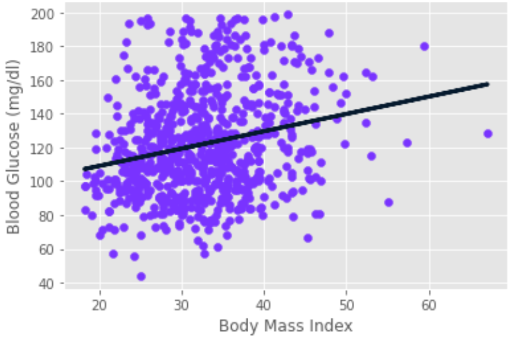

# Week 01 - Numpy, Pandas, Matplotlib & Seaborn

## Python Packages

### Introduction

You write all of your code to one and the same Python script.

<details>

<summary>What are the problems that arise from that?</summary>

- Huge code base: messy;
- Lots of code you won't use;
- Maintenance problems.

</details>

<details>

<summary>How do we solve this problem?</summary>

We can split our code into libraries (or in the Python world - **packages**).

Packages are a directory of Python scripts.

Each such script is a so-called **module**.

Here's the hierarchy visualized:


These modules specify functions, methods and new Python types aimed at solving particular problems. There are thousands of Python packages available from the Internet. Among them are packages for data science:

- there's **NumPy to efficiently work with arrays**;
- **Matplotlib for data visualization**;
- **scikit-learn for machine learning**.

</details>

Not all of them are available in Python by default, though. To use Python packages, you'll first have to install them on your own system, and then put code in your script to tell Python that you want to use these packages. Advice:

- always install packages in **virtual environments** (abstractions that hold packages for separate projects).
  - You can create a virtual environment by using the following code:

    ```console
    python3 -m venv .venv
    ```

    This will create a hidden folder, called `.venv`, that will store all packages you install for your current project (instead of installing them globally on your system).

  - If there is a `requirements.txt` file, use it to install the needed packages beforehand.
    - In the github repo, there is such a file - you can use it to install all the packages you'll need in the course. This can be done by using this command:

    ```console
    (if on Windows) > .venv\Scripts\activate
    (if on Linux) > source .venv/bin/activate
    (.venv) > pip install -r requirements.txt
    ```

Now that the package is installed, you can actually start using it in one of your Python scripts. To do this you should import the package, or a specific module of the package.

You can do this with the `import` statement. To import the entire `numpy` package, you can do `import numpy`. A commonly used function in NumPy is `array`. It takes a Python list as input and returns a [`NumPy array`](https://numpy.org/doc/stable/reference/generated/numpy.array.html) object as an output. The NumPy array is very useful to do data science, but more on that later. Calling the `array` function like this, though, will generate an error:

```python
import numpy
array([1, 2, 3])
```

```console
NameError: name `array` is not defined
```

To refer to the `array` function from the `numpy` package, you'll need this:

```python
import numpy
numpy.array([1, 2, 3])
```

```console
array([1, 2, 3])
```

This time it works.

Using this `numpy.` prefix all the time can become pretty tiring, so you can also import the package and refer to it with a different name. You can do this by extending your `import` statement with `as`:

```python
import numpy as np
np.array([1, 2, 3])
```

```console
array([1, 2, 3])
```

Now, instead of `numpy.array`, you'll have to use `np.array` to use NumPy's functions.

There are cases in which you only need one specific function of a package. Python allows you to make this explicit in your code.

Suppose that we ***only*** want to use the `array` function from the NumPy package. Instead of doing `import numpy`, you can instead do `from numpy import array`:

```python
from numpy import array
array([1, 2, 3])
```

```console
array([1, 2, 3])
```

This time, you can simply call the `array` function without `numpy.`.

This `from import` version to use specific parts of a package can be useful to limit the amount of coding, but you're also loosing some of the context. Suppose you're working in a long Python script. You import the array function from numpy at the very top, and way later, you actually use this array function. Somebody else who's reading your code might have forgotten that this array function is a specific NumPy function; it's not clear from the function call.


^ using numpy, but not very clear

Thus, the more standard `import numpy as np` call is preferred: In this case, your function call is `np.array`, making it very clear that you're working with NumPy.


- Suppose you want to use the function `inv()`, which is in the `linalg` subpackage of the `scipy` package. You want to be able to use this function as follows:

    ```python
    my_inv([[1,2], [3,4]])
    ```

    Which import statement will you need in order to run the above code without an error?

  - A. `import scipy`
  - B. `import scipy.linalg`
  - C. `from scipy.linalg import my_inv`
  - D. `from scipy.linalg import inv as my_inv`

    <details>

    <summary>Reveal answer:</summary>

    Answer: D

    </details>

### Importing means executing `main.py`

Remember that importing a package is equivalent to executing everything in the `main.py` module. Thus. you should always have `if __name__ == '__main__'` block of code and call your functions from there.

Run the scripts `test_script1.py` and `test_script2.py` to see the differences.

## NumPy

### Context

Python lists are pretty powerful:

- they can hold a collection of values with different types (heterogeneous data structure);
- easy to change, add, remove elements;
- many built-in functions and methods.

### Problems

This is wonderful, but one feature is missing, a feature that is super important for aspiring data scientists and machine learning engineers - carrying out mathematical operations **over entire collections of values** and doing it **fast**.

Let's take the heights and weights of your family and yourself. You end up with two lists, `height`, and `weight` - the first person is `1.73` meters tall and weighs `65.4` kilograms and so on.

```python
height = [1.73, 1.68, 1.71, 1.89, 1.79]
height
```

```console
[1.73, 1.68, 1.71, 1.89, 1.79]
```

```python
weight = [65.4, 59.2, 63.6, 88.4, 68.7]
weight
```

```console
[65.4, 59.2, 63.6, 88.4, 68.7]
```

If you now want to calculate the Body Mass Index for each family member, you'd hope that this call can work, making the calculations element-wise. Unfortunately, Python throws an error, because it has no idea how to do calculations on lists. You could solve this by going through each list element one after the other, and calculating the BMI for each person separately, but this is terribly inefficient and tiresome to write.

### Solution

- `NumPy`, or Numeric Python;
- Provides an alternative to the regular Python list: the NumPy array;
- The NumPy array is pretty similar to the list, but has one additional feature: you can perform calculations over entire arrays;
- super-fast as it's based on C++
- Installation:
  - In the terminal: `pip install numpy`

### Benefits

Speed, speed, speed:

- Stackoverflow: <https://stackoverflow.com/questions/73060352/is-numpy-any-faster-than-default-python-when-iterating-over-a-list>
- Visual Comparison:

    

### Usage

```python
import numpy as np
np_height = np.array(height)
np_height
```

```console
array([1.73, 1.68, 1.71, 1.89, 1.79])
```

```python
import numpy as np
np_weight = np.array(weight)
np_weight
```

```console
array([65.4, 59.2, 63.6, 88.4, 68.7])
```

```python
# Calculations are performed element-wise.
# 
# The first person's BMI was calculated by dividing the first element in np_weight
# by the square of the first element in np_height,
# 
# the second person's BMI was calculated with the second height and weight elements, and so on.
bmi = np_weight / np_height ** 2
bmi
```

```console
array([21.851, 20.975, 21.750, 24.747, 21.441])
```

in comparison, the above will not work for Python lists:

```python
weight / height ** 2
```

```console
TypeError: unsupported operand type(s) for ** or pow(): 'list' and 'int'
```

You should still pay attention, though:

- `numpy` assumes that your array contains values **of a single type**;
- a NumPy array is simply a new kind of Python type, like the `float`, `str` and `list` types. This means that it comes with its own methods, which can behave differently than you'd expect.

    ```python
    python_list = [1, 2, 3]
    numpy_array = np.array([1, 2, 3])
    ```

    ```python
    python_list + python_list
    ```

    ```console
    [1, 2, 3, 1, 2, 3]
    ```

    ```python
    numpy_array + numpy_array
    ```

    ```console
    array([2, 4, 6])
    ```

- When you want to get elements from your array, for example, you can use square brackets as with Python lists. Suppose you want to get the bmi for the second person, so at index `1`. This will do the trick:

    ```python
    bmi
    ```

    ```console
    [21.851, 20.975, 21.750, 24.747, 21.441]
    ```

    ```python
    bmi[1]
    ```

    ```console
    20.975
    ```

- Specifically for NumPy, there's also another way to do list subsetting: using an array of booleans.

    Say you want to get all BMI values in the bmi array that are over `23`.

    A first step is using the greater than sign, like this: The result is a NumPy array containing booleans: `True` if the corresponding bmi is above `23`, `False` if it's below.

    ```python
    bmi > 23
    ```

    ```console
    array([False, False, False, True, False])
    ```

    Next, you can use this boolean array inside square brackets to do subsetting. Only the elements in `bmi` that are above `23`, so for which the corresponding boolean value is `True`, is selected. There's only one BMI that's above `23`, so we end up with a NumPy array with a single value, that specific BMI. Using the result of a comparison to make a selection of your data is a very common way to work with data.

    ```python
    bmi[bmi > 23]
    ```

    ```console
    array([24.747])
    ```

### 2D NumPy Arrays

If you ask for the type of these arrays, Python tells you that they are `numpy.ndarray`:

```python
np_height = np.array([1.73, 1.68, 1.71, 1.89, 1.79])
np_weight = np.array([65.4, 59.2, 63.6, 88.4, 68.7])
type(np_height)
```

```console
numpy.ndarray
```

```python
type(np_weight)
```

```console
numpy.ndarray
```

`ndarray` stands for n-dimensional array. The arrays `np_height` and `np_weight` are one-dimensional arrays, but it's perfectly possible to create `2`-dimensional, `3`-dimensional and `n`-dimensional arrays.

You can create a 2D numpy array from a regular Python list of lists:

```python
np_2d = np.array([[1.73, 1.68, 1.71, 1.89, 1.79],
                  [65.4, 59.2, 63.6, 88.4, 68.7]])
np_2d
```

```console
array([[ 1.73,  1.68,  1.71,  1.89,  1.79],
       [65.4 , 59.2 , 63.6 , 88.4 , 68.7 ]])
```

Each sublist in the list, corresponds to a row in the `2`-dimensional numpy array. Using `.shape`, you can see that we indeed have `2` rows and `5` columns:

```python
np_2d.shape
```

```console
(2, 5) # 2 rows, 5 columns
```

`shape` is a so-called **attribute** of the `np2d` array, that can give you more information about what the data structure looks like.

> **Note:** The syntax for accessing an attribute looks a bit like calling a method, but they are not the same! Remember that methods have round brackets (`()`) after them, but attributes do not.
>
> **Note:** For n-D arrays, the NumPy rule still applies: an array can only contain a single type.

You can think of the 2D numpy array as a faster-to-work-with list of lists: you can perform calculations and more advanced ways of subsetting.

Suppose you want the first row, and then the third element in that row - you can grab it like this:

```python
np_2d[0][2]
```

```console
1.71
```

or use an alternative way of subsetting, using single square brackets and a comma:

```python
np_2d[0, 2]
```

```console
1.71
```

The value before the comma specifies the row, the value after the comma specifies the column. The intersection of the rows and columns you specified, are returned. This is the syntax that's most popular.

Suppose you want to select the height and weight of the second and third family member from the following array.

```console
array([[ 1.73,  1.68,  1.71,  1.89,  1.79],
       [65.4 , 59.2 , 63.6 , 88.4 , 68.7 ]])
```

<details>

<summary>How can this be achieved?</summary>

Answer: np_2d[:, [1, 2]]

</details>

### Basic Statistics

A typical first step in analyzing your data, is getting to know your data in the first place.

Imagine you conduct a city-wide survey where you ask `5000` adults about their height and weight. You end up with something like this: a 2D numpy array, that has `5000` rows, corresponding to the `5000` people, and `2` columns, corresponding to the height and the weight.

```python
np_city = ...
np_city
```

```console
array([[ 2.01, 64.33],
       [ 1.78, 67.56],
       [ 1.71, 49.04],
       ...,
       [ 1.73, 55.37],
       [ 1.72, 69.73],
       [ 1.85, 66.69]])
```

Simply staring at these numbers, though, won't give you any insights. What you can do is generate summarizing statistics about them.

- you can try to find out the average height of these people, with NumPy's `mean` function:

```python
np.mean(np_city[:, 0]) # alternative: np_city[:, 0].mean()
```

```console
1.7472
```

It appears that on average, people are `1.75` meters tall.

- What about the median height? This is the height of the middle person if you sort all persons from small to tall. Instead of writing complicated python code to figure this out, you can simply use NumPy's `median` function:

```python
np.median(np_city[:, 0]) # alternative: np_city[:, 0].median()
```

```console
1.75
```

You can do similar things for the `weight` column in `np_city`. Often, these summarizing statistics will provide you with a "sanity check" of your data. If you end up with a average weight of `2000` kilograms, your measurements are most likely incorrect. Apart from mean and median, there's also other functions, like:

```python
np.corrcoef(np_city[:, 0], np_city[:, 1])
```

```console
array([[1.       , 0.0082912],
       [0.0082912, 1.       ]])
```

```python
np.std(np_city[:, 0])
```

```console
np.float64(0.19759467357193614)
```

`sum()`, `sort()`, etc, etc. See all of them [here](https://numpy.org/doc/stable/reference/routines.statistics.html).

### Generate data

The data used above was generated using the following code. Two random distributions were sampled 5000 times to create the `height` and `weight` arrays, and then `column_stack` was used to paste them together as two columns.

```python
import numpy as np
height = np.round(np.random.normal(1.75, 0.2, 5000), 2)
weight = np.round(np.random.normal(60.32, 15, 5000), 2)
np_city = np.column_stack((height, weight))
```

## Matplotlib

The better you understand your data, the better you'll be able to extract insights. And once you've found those insights, again, you'll need visualization to be able to share your valuable insights with other people.


There are many visualization packages in python, but the mother of them all, is `matplotlib`. You will need its subpackage `pyplot`. By convention, this subpackage is imported as `plt`:

```python
import matplotlib.pyplot as plt
```

### Line plot

Let's try to gain some insights in the evolution of the world population. To plot data as a **line chart**, we call `plt.plot` and use our two lists as arguments. The first argument corresponds to the horizontal axis, and the second one to the vertical axis.

```python
year = [1950, 1970, 1990, 2010]
pop = [2.519, 3.692, 5.263, 6.972]

# "plt.plot" creates the plot, but does not display it
plt.plot(year, pop)

# "plt.show" displays the plot
plt.show()
```

You'll have to call `plt.show()` explicitly because you might want to add some extra information to your plot before actually displaying it, such as titles and label customizations.

As a result we get:


We see that:

- the years are indeed shown on the horizontal axis;
- the populations on the vertical axis;
- this type of plot is great for plotting a time scale along the x-axis and a numerical feature on the y-axis.

There are four data points, and Python draws a line between them.


In 1950, the world population was around 2.5 billion. In 2010, it was around 7 billion.

> **Insight:** The world population has almost tripled in sixty years.
>
> **Note:** If you pass only one argument to `plt.plot`, Python will know what to do and will use the index of the list to map onto the `x` axis, and the values in the list onto the `y` axis.

### Scatter plot

We can reuse the code from before and just swap `plt.plot(...)` with `plt.scatter(...)`:

```python
year = [1950, 1970, 1990, 2010]
pop = [2.519, 3.692, 5.263, 6.972]

# "plt.plot" creates the plot, but does not display it
plt.scatter(year, pop)

# "plt.show" displays the plot
plt.show()
```


The resulting scatter plot:

- plots the individual data points;
- dots aren't connected with a line;
- is great for plotting two numerical features (example: correlation analysis).

### Drawing multiple plots on one figure

This can be done by first instantiating the figure and two axis and the using each axis to plot the data. Example taken from [here](https://matplotlib.org/stable/api/_as_gen/matplotlib.pyplot.subplots.html#matplotlib.pyplot.subplots).

```python
import numpy as np
import matplotlib.pyplot as plt

x = np.linspace(0, 2*np.pi, 400)
y = np.sin(x**2)

f, (ax1, ax2) = plt.subplots(1, 2, sharey=True)
f.suptitle('Sharing Y axis')

ax1.plot(x, y)
ax2.scatter(x, y)

plt.show()
```


### The logarithmic scale

Sometimes the correlation analysis between two variables can be done easier when one or all of them is plotted on a logarithmic scale. This is because we would reduce the difference between large values as this scale "squashes" large numbers:


In `matplotlib` we can use the [plt.xscale](https://matplotlib.org/stable/api/_as_gen/matplotlib.pyplot.xscale.html) function to change the scaling of an axis using `plt` or [ax.set_xscale](https://matplotlib.org/stable/api/_as_gen/matplotlib.axes.Axes.set_xscale.html#matplotlib.axes.Axes.set_xscale) to set the scale of an axis of a subplot.

### Histogram

#### Introduction

The histogram is a plot that's useful to explore **distribution of numeric** data;

Imagine `12` values between `0` and `6`.


To build a histogram for these values, you can divide the line into **equal chunks**, called **bins**. Suppose you go for `3` bins, that each have a width of `2`:


Next, you count how many data points sit inside each bin. There's `4` data points in the first bin, `6` in the second bin and `2` in the third bin:


Finally, you draw a bar for each bin. The height of the bar corresponds to the number of data points that fall in this bin. The result is a histogram, which gives us a nice overview on how the `12` values are **distributed**. Most values are in the middle, but there are more values below `2` than there are above `4`:


#### In `matplotlib`

In `matplotlib` we can use the `.hist` function. In its documentation there're a bunch of arguments you can specify, but the first two are the most used ones:

- `x` should be a list of values you want to build a histogram for;
- `bins` is the number of bins the data should be divided into. Based on this number, `.hist` will automatically find appropriate boundaries for all bins, and calculate how may values are in each one. If you don't specify the bins argument, it will by `10` by default.


The number of bins is important in the following way:

- too few bins will oversimplify reality and won't show you the details;
- too many bins will overcomplicate reality and won't show the bigger picture.

Experimenting with different numbers and/or creating multiple plots on the same canvas can alleviate that.

Here's the code that generated the above example:

```python
import matplotlib.pyplot as plt
xs = [0, 0.6, 1.4, 1.6, 2.2, 2.5, 2.6, 3.2, 3.5, 3.9, 4.2, 6]
plt.hist(xs, bins=3)
plt.show()
```

and the result of running it:


#### Use cases

Histograms are really useful to give a bigger picture. As an example, have a look at this so-called **population pyramid**. The age distribution is shown, for both males and females, in the European Union.


Notice that the histograms are flipped 90 degrees; the bins are horizontal now. The bins are largest for the ages `40` to `44`, where there are `20` million males and `20` million females. They are the so called baby boomers. These are figures of the year `2010`. What do you think will have changed in `2050`?

Let's have a look.


The distribution is flatter, and the baby boom generation has gotten older. **With the blink of an eye, you can easily see how demographics will be changing over time.** That's the true power of histograms at work here!

### Checkpoint

<details>

<summary>
You want to visually assess if the grades on your exam follow a particular distribution. Which plot do you use?

```text
A. Line plot.
B. Scatter plot.
C. Histogram.
```

</summary>

Answer: C.

</details>

<details>

<summary>
You want to visually assess if longer answers on exam questions lead to higher grades. Which plot do you use?

```text
A. Line plot.
B. Scatter plot.
C. Histogram.
```

</summary>

Answer: B.

</details>

### Customization

Creating a plot is one thing. Making the correct plot, that makes the message very clear - that's the real challenge.

For each visualization, you have many options:

- change colors;
- change shapes;
- change labels;
- change axes, etc., etc.

The choice depends on:

- the data you're plotting;
- the story you want to tell with this data.

Below are outlined best practices when it comes to creating an MVP plot.

If we run the script for creating a line plot, we already get a pretty nice plot:


It shows that the population explosion that's going on will have slowed down by the end of the century.

But some things can be improved:

- **axis labels**;
- **title**;
- **ticks**.

#### Axis labels

The first thing you always need to do is label your axes. We can do this by using the `xlabel` and `ylabel` functions. As inputs, we pass strings that should be placed alongside the axes.


#### Title

We're also going to add a title to our plot, with the `title` function. We pass the actual title, `'World Population Projections'`, as an argument:


#### Ticks

Using `xlabel`, `ylabel` and `title`, we can give the reader more information about the data on the plot: now they can at least tell what the plot is about.

To put the population growth in perspective, the y-axis should start from `0`. This can be achieved by using the `yticks` function. The first input is a list, in this example with the numbers `0` up to `10`, with intervals of `2`:


Notice how the curve shifts up. Now it's clear that already in `1950`, there were already about `2.5` billion people on this planet.

Next, to make it clear we're talking about billions, we can add a second argument to the `yticks` function, which is a list with the display names of the ticks. This list should have the same length as the first list.


#### Adding more data

Finally, let's add some more historical data to accentuate the population explosion in the last `60` years. If we run the script once more, three data points are added to the graph, giving a more complete picture.


#### `plt.tight_layout()`

##### Problem

With the default Axes positioning, the axes title, axis labels, or tick labels can sometimes go outside the figure area, and thus get clipped.

```python
import matplotlib.pyplot as plt
import numpy as np

def example_plot(ax, fontsize=12):
    ax.plot([1, 2])
    ax.locator_params(nbins=3)
    ax.set_xlabel('x-label', fontsize=fontsize)
    ax.set_ylabel('y-label', fontsize=fontsize)
    ax.set_title('Title', fontsize=fontsize)

fig, ax = plt.subplots()
example_plot(ax, fontsize=24)
plt.show()
```


##### Solution

To prevent this, the location of Axes needs to be adjusted. `plt.tight_layout()` does this automatically:

```python
import matplotlib.pyplot as plt
import numpy as np

def example_plot(ax, fontsize=12):
    ax.plot([1, 2])
    ax.locator_params(nbins=3)
    ax.set_xlabel('x-label', fontsize=fontsize)
    ax.set_ylabel('y-label', fontsize=fontsize)
    ax.set_title('Title', fontsize=fontsize)

fig, ax = plt.subplots()
example_plot(ax, fontsize=24)
plt.tight_layout()
plt.show()
```


When you have multiple subplots, often you see labels of different Axes overlapping each other:

```python
import matplotlib.pyplot as plt
import numpy as np

def example_plot(ax, fontsize=12):
    ax.plot([1, 2])
    ax.locator_params(nbins=3)
    ax.set_xlabel('x-label', fontsize=fontsize)
    ax.set_ylabel('y-label', fontsize=fontsize)
    ax.set_title('Title', fontsize=fontsize)

fig, ((ax1, ax2), (ax3, ax4)) = plt.subplots(nrows=2, ncols=2)
example_plot(ax1)
example_plot(ax2)
example_plot(ax3)
example_plot(ax4)
plt.show()
```


`plt.tight_layout()` will also adjust spacing between subplots to minimize the overlaps:

```python
import matplotlib.pyplot as plt
import numpy as np

def example_plot(ax, fontsize=12):
    ax.plot([1, 2])
    ax.locator_params(nbins=3)
    ax.set_xlabel('x-label', fontsize=fontsize)
    ax.set_ylabel('y-label', fontsize=fontsize)
    ax.set_title('Title', fontsize=fontsize)

fig, ((ax1, ax2), (ax3, ax4)) = plt.subplots(nrows=2, ncols=2)
example_plot(ax1)
example_plot(ax2)
example_plot(ax3)
example_plot(ax4)
plt.tight_layout()
plt.show()
```


## Seaborn

Seaborn is a Python data visualization library based on `matplotlib`. It provides a higher-level interface for drawing attractive and informative statistical graphics. Most of the time what you can do in `matplotlib` with several lines of code, you can do with `seaborn` with one line! Refer to the notebook `matplotlib_vs_seaborn.ipynb` in `Week_01` to see a comparison between `matplotlib` and `seaborn`.

In the course you can use both `matplotlib` and `seaborn`! **If you want to only work with `seaborn`, this is completely fine!** Use a plotting library of your choice for any plotting exercises in the course.

## Pandas

### Introduction

As a person working in the data field, you'll often be working with tons of data. The form of this data can vary greatly, but pretty often, you can boil it down to a tabular structure, that is, in the form of a table like in a spreadsheet.

Suppose you're working in a chemical plant and have temperature measurements to analyze. This data can come in the following form:


- row = measurement = observation;
- column = variable. There are three variables above: temperature, date and time, and the location.

- To start working on this data in Python, you'll need some kind of rectangular data structure. That's easy, we already know one! The 2D `numpy` array, right?
    > It's an option, but not necessarily the best one. There are different data types and `numpy` arrays are not great at handling these.
        - it's possible that for a single column we have both a string variable and a float variable.

Your datasets will typically comprise different data types, so we need a tool that's better suited for the job. To easily and efficiently handle this data, there's the `pandas` package:

- a high level data manipulation tool;
- developed by [Wes McKinney](https://en.wikipedia.org/wiki/Wes_McKinney);
- built on the `numpy` package, meaning it's fast;
- Compared to `numpy`, it's more high level, making it very interesting for data scientists all over the world.

In `pandas`, we store the tabular data in an object called a **DataFrame**. Have a look at this [BRICS](https://en.wikipedia.org/wiki/BRICS) data:


We see a similar structure:

- the rows represent the observations;
- the columns represent the variables.

Notice also that:

- each row has a unique row label: `BR` for `Brazil`, `RU` for `Russia`, and so on;
- the columns have labels: `country`, `population`, and so on;
- the values in the different columns have different types.

### DataFrame from Dictionary

One way to build dataframes is using a dictionary:

- the keys are the column labels;
- the values are the corresponding columns, in list form.

```python
import pandas as pd
data = {
    'country': ['Brazil', 'Russia', 'India', 'China', 'South Africa'],
    'capital': ['Brasilia', 'Moscow', 'New Delhi', 'Beijing', 'Pretoria'],
    'area': [8.516, 17.10, 3.286, 9.597, 1.221],
    'poplulation': [200.4, 143.5, 1252, 1357, 52.98],
}

df_brics = pd.DataFrame(data)
df_brics
```

```console
        country    capital    area  poplulation
0        Brazil   Brasilia   8.516       200.40
1        Russia     Moscow  17.100       143.50
2         India  New Delhi   3.286      1252.00
3         China    Beijing   9.597      1357.00
4  South Africa   Pretoria   1.221        52.98
```

We're almost there:

- `pandas` assigned automatic row labels, `0` up to `4`;
- to specify them manually, you can set the `index` attribute of `df_brics` to a list with the correct labels.

```python
import pandas as pd
data = {
    'country': ['Brazil', 'Russia', 'India', 'China', 'South Africa'],
    'capital': ['Brasilia', 'Moscow', 'New Delhi', 'Beijing', 'Pretoria'],
    'area': [8.516, 17.10, 3.286, 9.597, 1.221],
    'poplulation': [200.4, 143.5, 1252, 1357, 52.98],
}
index = ['BR', 'RU', 'IN', 'CH', 'SA']

df_brics = pd.DataFrame(data, index)
df_brics
```

or

```python
import pandas as pd
data = {
    'country': ['Brazil', 'Russia', 'India', 'China', 'South Africa'],
    'capital': ['Brasilia', 'Moscow', 'New Delhi', 'Beijing', 'Pretoria'],
    'area': [8.516, 17.10, 3.286, 9.597, 1.221],
    'poplulation': [200.4, 143.5, 1252, 1357, 52.98],
}

df_brics = pd.DataFrame(data)
df_brics.index = ['BR', 'RU', 'IN', 'CH', 'SA']
df_brics
```

```console
         country    capital    area  poplulation
BR        Brazil   Brasilia   8.516       200.40
RU        Russia     Moscow  17.100       143.50
IN         India  New Delhi   3.286      1252.00
CH         China    Beijing   9.597      1357.00
SA  South Africa   Pretoria   1.221        52.98
```

The resulting `df_brics` is the same one as we saw before.

### DataFrame from CSV file

Using a dictionary approach is fine, but what if you're working with tons of data - you won't build the DataFrame manually, right? Yep - in this case, you import data from an external file that contains all this data.

A common file format used to store such data is the `CSV` file ([comma-separated file](https://en.wikipedia.org/wiki/Comma-separated_values)).

Here are the contents of our `brics.csv` file (you can find it in the `DATA` folder):

```console
,country,capital,area,poplulation
BR,Brazil,Brasilia,8.516,200.4
RU,Russia,Moscow,17.1,143.5
IN,India,New Delhi,3.286,1252.0
CH,China,Beijing,9.597,1357.0
SA,South Africa,Pretoria,1.221,52.98
```

Let's try to import this data into Python using the `read_csv` function:

```python
import pandas as pd
df_brics = pd.read_csv('DATA/brics.csv')
df_brics
```

```console
  Unnamed: 0       country    capital    area  poplulation
0         BR        Brazil   Brasilia   8.516       200.40
1         RU        Russia     Moscow  17.100       143.50
2         IN         India  New Delhi   3.286      1252.00
3         CH         China    Beijing   9.597      1357.00
4         SA  South Africa   Pretoria   1.221        52.98
```

There's something wrong:

- the row labels are seen as a column;
- to solve this, we'll have to tell the `read_csv` function that the first column contains the row indexes. This is done by setting the `index_col` argument.

```python
import pandas as pd
df_brics = pd.read_csv('DATA/brics.csv', index_col=0)
df_brics
```

```console
         country    capital    area  poplulation
BR        Brazil   Brasilia   8.516       200.40
RU        Russia     Moscow  17.100       143.50
IN         India  New Delhi   3.286      1252.00
CH         China    Beijing   9.597      1357.00
SA  South Africa   Pretoria   1.221        52.98
```

This time `df_brics` contains the `DataFrame` we started with. The `read_csv` function features many more arguments that allow you to customize your data import, so make sure to check out its [documentation](https://pandas.pydata.org/pandas-docs/stable/reference/api/pandas.read_csv.html).

### Indexing and selecting data

#### Column Access using `[]`

Suppose you only want to select the `country` column from `df_brics`. How do we do this? We can put the column label - `country`, inside square brackets.

```python
import pandas as pd
df_brics = pd.read_csv('DATA/brics.csv', index_col=0)
df_brics['country']
```

```console
BR          Brazil
RU          Russia
IN           India
CH           China
SA    South Africa
Name: country, dtype: object
```

- we see as output the entire column, together with the row labels;
- the last line says `Name: country, dtype: object` - we're not dealing with a regular DataFrame here. Let's find out about the `type` of the object that gets returned.

```python
import pandas as pd
df_brics = pd.read_csv('DATA/brics.csv', index_col=0)
type(df_brics['country'])
```

```console
<class 'pandas.core.series.Series'>
```

- we're dealing with a `Pandas Series` here;
- you can think of the Series as a 1-dimensional NumPy array that can be labeled:
  - if you paste together a bunch of Series next to each other, you can create a DataFrame.

If you want to select the `country` column but keep the data in a DataFrame, you'll need double square brackets:

```python
import pandas as pd
df_brics = pd.read_csv('DATA/brics.csv', index_col=0)

print(f"Type is {type(df_brics[['country']])}")

df_brics[['country']]
```

```console
Type is <class 'pandas.core.frame.DataFrame'>
         country
BR        Brazil
RU        Russia
IN         India
CH         China
SA  South Africa
```

- to select two columns, `country` and `capital`, add them to the inner list. Essentially, we're putting a list with column labels inside another set of square brackets, and end up with a 'sub DataFrame', containing only the wanted columns.

```python
import pandas as pd
df_brics = pd.read_csv('DATA/brics.csv', index_col=0)
df_brics[['country', 'capital']]
```

```console
         country    capital
BR        Brazil   Brasilia
RU        Russia     Moscow
IN         India  New Delhi
CH         China    Beijing
SA  South Africa   Pretoria
```

#### Row Access using `[]`

You can also use the same square brackets to select rows from a DataFrame. The way to do it is by specifying a slice. To get the **second**, **third** and **fourth** rows of brics, we use the slice `1` colon `4` (the end of the slice is exclusive).

```python
import pandas as pd
df_brics = pd.read_csv('DATA/brics.csv', index_col=0)
df_brics[1:4]
```

```console
   country    capital    area  population
RU  Russia     Moscow  17.100       143.5
IN   India  New Delhi   3.286      1252.0
CH   China    Beijing   9.597      1357.0
```

- these square brackets work, but it only offers limited functionality:
  - we'd want something similar to 2D NumPy arrays:
    - the index or slice before the comma referred to the rows;
    - the index or slice after the comma referred to the columns.
- if we want to do a similar thing with Pandas, we have to extend our toolbox with the `loc` and `iloc` functions.

`loc` is a technique to select parts of your data **based on labels**, `iloc` is position **based**.

#### Row Access using `loc`

Let's try to get the row for Russia. We put the label of the row of interest in square brackets after `loc`.

```python
import pandas as pd
df_brics = pd.read_csv('DATA/brics.csv', index_col=0)
df_brics.loc['RU']
```

```console
country       Russia
capital       Moscow
area            17.1
population     143.5
Name: RU, dtype: object
```

Again, we get a Pandas Series, containing all the row's information (rather inconveniently shown on different lines).

To get a DataFrame, we have to put the `'RU'` string inside another pair of brackets.

```python
import pandas as pd
df_brics = pd.read_csv('DATA/brics.csv', index_col=0)
df_brics.loc[['RU']]
```

```console
   country capital  area  population
RU  Russia  Moscow  17.1       143.5
```

We can also select multiple rows at the same time. Suppose you want to also include `India` and `China` - we can add some more row labels to the list.

```python
import pandas as pd
df_brics = pd.read_csv('DATA/brics.csv', index_col=0)
df_brics.loc[['RU', 'IN', 'CH']]
```

```console
   country    capital    area  population
RU  Russia     Moscow  17.100       143.5
IN   India  New Delhi   3.286      1252.0
CH   China    Beijing   9.597      1357.0
```

This was only selecting entire rows, that's something you could also do with the basic square brackets and integer slices.

**The difference here is that you can extend your selection with a comma and a specification of the columns of interest. This is used a lot!**

```python
import pandas as pd
df_brics = pd.read_csv('DATA/brics.csv', index_col=0)
df_brics.loc[['RU', 'IN', 'CH'], ['country', 'capital']]
```

```console
   country    capital
RU  Russia     Moscow
IN   India  New Delhi
CH   China    Beijing
```

You can also use `loc` to select all rows but only a specific number of columns - replace the first list that specifies the row labels with a colon (this is interpreted as a slice going from beginning to end). This time, the intersection spans all rows, but only two columns.

```python
import pandas as pd
df_brics = pd.read_csv('DATA/brics.csv', index_col=0)
df_brics.loc[:, ['country', 'capital']]
```

```console
         country    capital
BR        Brazil   Brasilia
RU        Russia     Moscow
IN         India  New Delhi
CH         China    Beijing
SA  South Africa   Pretoria
```

Note that the above can be done, by simply omitting the slice which is usually done.

```python
import pandas as pd
df_brics = pd.read_csv('DATA/brics.csv', index_col=0)
df_brics.loc[['country', 'capital']]
```

```console
         country    capital
BR        Brazil   Brasilia
RU        Russia     Moscow
IN         India  New Delhi
CH         China    Beijing
SA  South Africa   Pretoria
```

#### Checkpoint

- Square brackets:
  - Column access `brics[['country', 'capital']]`;
  - Row access: only through slicing `brics[1:4]`.
- loc (label-based):
  - Row access `brics.loc[['RU', 'IN', 'CH']]`;
  - Column access `brics.loc[:, ['country', 'capital']]`;
  - Row and Column access `df_brics.loc[['RU', 'IN', 'CH'], ['country', 'capital']]` (**very powerful**).

#### `iloc`

In `loc`, you use the `'RU'` string in double square brackets, to get a DataFrame. In `iloc`, you use the index `1` instead of `RU`. The results are exactly the same.

```python
import pandas as pd
df_brics = pd.read_csv('DATA/brics.csv', index_col=0)

print(df_brics.loc[['RU']])
print()
print(df_brics.iloc[[1]])
```

```console
   country capital  area  population
RU  Russia  Moscow  17.1       143.5

   country capital  area  population
RU  Russia  Moscow  17.1       143.5
```

To get the rows for `Russia`, `India` and `China`:

```python
import pandas as pd
df_brics = pd.read_csv('DATA/brics.csv', index_col=0)
df_brics.iloc[[1, 2, 3]]
```

```console
   country    capital    area  population
RU  Russia     Moscow  17.100       143.5
IN   India  New Delhi   3.286      1252.0
CH   China    Beijing   9.597      1357.0
```

To in addition only keep the `country` and `capital` column:

```python
import pandas as pd
df_brics = pd.read_csv('DATA/brics.csv', index_col=0)
df_brics.iloc[[1, 2, 3], [0, 1]]
```

```console
   country    capital
RU  Russia     Moscow
IN   India  New Delhi
CH   China    Beijing
```

To keep all rows and just select columns:

```python
import pandas as pd
df_brics = pd.read_csv('DATA/brics.csv', index_col=0)
df_brics.iloc[:, [0, 1]]
```

```console
         country    capital
BR        Brazil   Brasilia
RU        Russia     Moscow
IN         India  New Delhi
CH         China    Beijing
SA  South Africa   Pretoria
```

### Filtering pandas DataFrames

#### Single condition

Suppose you now want to get the countries for which the area is greater than 8 million square kilometers. In this case, they are Brazil, Russia, and China.

```console
         country    capital    area  population
BR        Brazil   Brasilia   8.516      200.40
RU        Russia     Moscow  17.100      143.50
IN         India  New Delhi   3.286     1252.00
CH         China    Beijing   9.597     1357.00
SA  South Africa   Pretoria   1.221       52.98
```

There are three steps:

1. Get the `area` column.
2. Perform the comparison on this column and store its result.
3. Use this result to do the appropriate selection on the DataFrame.

- There are a number of ways to achieve step `1`. What's important is that we should get a Pandas Series, not a Pandas DataFrame. How can we achieve this?
    > `brics['area']` or `brics.loc[:, 'area']` or `brics.iloc[:, 2]`

Next, we actually perform the comparison. To see which rows have an area greater than `8`, we simply append `> 8` to the code:

```python
print(df_brics['area'])
print()
print(df_brics['area'] > 8)
```

```console
BR     8.516
RU    17.100
IN     3.286
CH     9.597
SA     1.221
Name: area, dtype: float64

BR     True
RU     True
IN    False
CH     True
SA    False
Name: area, dtype: bool
```

We get a Series containing booleans - areas with a value over `8` correspond to `True`, the others - to `False`.

The final step is using this boolean Series to subset the Pandas DataFrame. To do this, we put the result of the comparison inside square brackets.

```python
is_huge = df_brics['area'] > 8
df_brics[is_huge]
```

```console
   country   capital    area  population
BR  Brazil  Brasilia   8.516       200.4
RU  Russia    Moscow  17.100       143.5
CH   China   Beijing   9.597      1357.0
```

We can also write this in a one-liner. Here is the final full code:

```python
import pandas as pd
df_brics = pd.read_csv('DATA/brics.csv', index_col=0)
df_brics[df_brics['area'] > 8]
```

```console
   country   capital    area  population
BR  Brazil  Brasilia   8.516       200.4
RU  Russia    Moscow  17.100       143.5
CH   China   Beijing   9.597      1357.0
```

#### Multiple conditions

Suppose you only want to keep the observations that have an area between `8` and `10` million square kilometers, inclusive. To do this, we'll have to place not one, but two conditions in the square brackets and connect them via **boolean logical operators**. The boolean logical operators we can use are:

- `&`: both conditions on each side have to evaluate to `True` (just like `&&` in `C++`);
- `|`: at least one of the conditions on each side have to evaluate to `True` (just like `||` in `C++`);
- `~`: unary operator, used for negation (just like `!` in `C++`).

And here is the Python code:

```python
import pandas as pd
df_brics = pd.read_csv('DATA/brics.csv', index_col=0)
df_brics[(df_brics['area'] >= 8) & (df_brics['area'] <= 10)]
```

```console
   country   capital   area  population
BR  Brazil  Brasilia  8.516       200.4
CH   China   Beijing  9.597      1357.0
```

> **Note:** It is very important to remember that when we have multiple conditions each condition should be surrounded by round brackets `(`, `)`.

There is also quite a handy pandas function that can do this for us called [`between`](https://pandas.pydata.org/docs/reference/api/pandas.Series.between.html):

```python
import pandas as pd
df_brics = pd.read_csv('DATA/brics.csv', index_col=0)
df_brics[df_brics['area'].between(8, 10)]
```

```console
   country   capital   area  population
BR  Brazil  Brasilia  8.516       200.4
CH   China   Beijing  9.597      1357.0
```

#### Filtering and selecting columns

You can also put these filters in `loc` and select columns - this is very handy for performing both subsetting row-wise and column-wise. This is how we can get the **countries** that have an area between `8` and `10` million square kilometers:

```python
import pandas as pd
df_brics = pd.read_csv('DATA/brics.csv', index_col=0)
df_brics.loc[(df_brics['area'] >= 8) & (df_brics['area'] <= 10), 'country']
```

```console
BR    Brazil
CH     China
Name: country, dtype: object
```

### Looping over dataframes

If a Pandas DataFrame were to function the same way as a 2D NumPy array or a list with nested lists in it, then maybe a basic for loop like the following would print out each row. Let's see what the output is.

```python
import pandas as pd
df_brics = pd.read_csv('DATA/brics.csv', index_col=0)
for val in df_brics:
    print(val)
```

```console
country
capital
area
population
```

Well, this was rather unexpected. We simply got the column names.

In Pandas, you have to mention explicitly that you want to iterate over the rows. You do this by calling the `iterrows` method - it looks at the DataFrame and on each iteration generates two pieces of data:

- the label of the row;
- the actual data in the row as a Pandas Series.

Let's change the for loop to reflect this change. We'll store:

- the row label as `lab`;
- the row data as `row`.

To understand what's happening, let's print `lab` and `row` seperately.

```python
import pandas as pd
df_brics = pd.read_csv('DATA/brics.csv', index_col=0)
for lab, row in df_brics.iterrows():
    print(f'Lab is:')
    print(lab)
    print(f'Row is:')
    print(row)
    print()
```

```console
Lab is:
BR
Row is:
country         Brazil 
capital       Brasilia 
area             8.516 
population       200.4 
Name: BR, dtype: object

Lab is:
RU
Row is:
country       Russia
capital       Moscow
area            17.1
population     143.5
Name: RU, dtype: object

Lab is:
IN
Row is:
country           India
capital       New Delhi
area              3.286
population       1252.0
Name: IN, dtype: object

Lab is:
CH
Row is:
country         China
capital       Beijing
area            9.597
population     1357.0
Name: CH, dtype: object

Lab is:
SA
Row is:
country       South Africa
capital           Pretoria
area                 1.221
population           52.98
Name: SA, dtype: object
```

Because this `row` variable on each iteration is a Series, you can easily select additional information from it using the subsetting techniques from earlier.

<details>

<summary>Suppose you only want to print out the capital on each iteration. How can this be done?
</summary>

```python
import pandas as pd
df_brics = pd.read_csv('DATA/brics.csv', index_col=0)
for lab, row in df_brics.iterrows():
    print(f"{lab}: {row['capital']}")
```

```console
BR: Brasilia
RU: Moscow
IN: New Delhi
CH: Beijing
SA: Pretoria
```

</details>

<details>

<summary>Let's add a new column to the end, named `name_length`, containing the number of characters in the country's name. What steps could we follow to do this?
</summary>

Here's our plan of attack:

  1. The specification of the `for` loop can be the same, because we'll need both the row label and the row data;
  2. We'll calculate the length of each country name by selecting the country column from row, and then passing it to the `len()` function;
  3. We'll add this new information to a new column, `name_length`, at the appropriate location.
  4. To see whether we coded things correctly, we'll add a printout of the data after the `for` loop.

In Python we could implement the steps like this:

```python
import pandas as pd
df_brics = pd.read_csv('DATA/brics.csv', index_col=0)
for lab, row in df_brics.iterrows():
    df_brics.loc[lab, 'name_length'] = len(row['country'])

print(df_brics)
```

</details>

```console
         country    capital    area  population  name_length
BR        Brazil   Brasilia   8.516      200.40          6.0
RU        Russia     Moscow  17.100      143.50          6.0
IN         India  New Delhi   3.286     1252.00          5.0
CH         China    Beijing   9.597     1357.00          5.0
SA  South Africa   Pretoria   1.221       52.98         12.0
```

<details>

<summary>This is all nice, but it's not especially efficient.
</summary>

We are creating a Series object on every iteration.

A way better approach if we want to calculate an entire DataFrame column by applying a function on a particular column in an element-wise fashion, is `apply()`. In this case, we don't even need a for loop.

```python
import pandas as pd
df_brics = pd.read_csv('DATA/brics.csv', index_col=0)
df_brics['name_length'] = df_brics['country'].apply(len) # alternative: df_brics['country'].apply(lambda val: len(val))
print(df_brics)
```

```console
         country    capital    area  population  name_length
BR        Brazil   Brasilia   8.516      200.40          6.0
RU        Russia     Moscow  17.100      143.50          6.0
IN         India  New Delhi   3.286     1252.00          5.0
CH         China    Beijing   9.597     1357.00          5.0
SA  South Africa   Pretoria   1.221       52.98         12.0
```

You can think of it like this:

- the `country` column is selected out of the DataFrame;
- on it `apply` calls the `len` function with each value as input;
- `apply` produces a new `array`, that is stored as a new column, `"name_length"`.

This is way more efficient, and also easier to read.

</details>

## Random numbers

### Context

Imagine the following:

- you're walking up the empire state building and you're playing a game with a friend.
- You throw a die `100` times:
  - If it's `1` or `2` you'll go one step down.
  - If it's `3`, `4`, or `5`, you'll go one step up.
  - If you throw a `6`, you'll throw the die again and will walk up the resulting number of steps.
- also, you admit that you're a bit clumsy and have a chance of `0.1%` of falling down the stairs when you make a move. Falling down means that you have to start again from step `0`.

With all of this in mind, you bet with your friend that you'll reach `60` steps high. What is the chance that you will win this bet?

- one way to solve it would be to calculate the chance analytically using equations;
- another possible approach, is to simulate this process thousands of times, and see in what fraction of the simulations that you will reach `60` steps.

We're going to opt for the second approach.

### Random generators

We have to simulate the die. To do this, we can use random generators.

```python
import numpy as np
np.random.rand() # Pseudo-random numbers
```

```console
0.026360555982748446
```

We get a random number between `0` and `1`. This number is so-called pseudo-random. Those are random numbers that are generated using a mathematical formula, starting from a **random seed**.

This seed was chosen by Python when we called the `rand` function, but you can also set this manually. Suppose we set it to `123` and then call the `rand` function twice.

```python
import numpy as np
np.random.seed(123)
print(np.random.rand())
print(np.random.rand())
```

```console
0.6964691855978616
0.28613933495037946
```

> **Note:** Set the seed in the global scope of the Python module (not in a function).

We get two random numbers, however, if call `rand` twice more ***from a new python session***, we get the exact same random numbers!

```python
import numpy as np
np.random.seed(123)
print(np.random.rand())
print(np.random.rand())
```

```console
0.6964691855978616
0.28613933495037946
```

This is funky: you're generating random numbers, but for the same seed, you're generating the same random numbers. That's why it's called pseudo-random; **it's random but consistent between runs**; this is very useful, because this ensures ***"reproducibility"***. Other people can reproduce your analysis.

Suppose we want to simulate a coin toss.

- we set the seed;
- we use the `np.random.randint()` function: it will randomly generate either `0` or `1`. We'll pass two arguments to determine the range of the generated numbers - `0` and `2` (non-inclusive on the right side).

```python
import numpy as np
np.random.seed(123)
print(np.random.randint(0, 2))
print(np.random.randint(0, 2))
print(np.random.randint(0, 2))
```

```console
0
1
0
```

We can extend the code with an `if-else` statement to improve user experience:

```python
import numpy as np
np.random.seed(123)
coin = np.random.randint(0, 2)
print(coin)
if coin == 0:
    print('heads')
else:
    print('tails')
```

```console
heads
```

# Week 02 - Machine learning with scikit-learn

## What is machine learning?

<details>

<summary>What is machine learning?</summary>

A process whereby computers learn to make decisions from data without being explicitly programmed.

</details>

<details>

<summary>What are simple machine learning use-cases you've heard of?</summary>

- email: spam vs not spam;
- clustering books into different categories/genres based on their content;
- assigning any new book to one of the existing clusters.

</details>

<details>

<summary>What types of machine learning do you know?</summary>

- Unsupervised learning;
- Supervised learning;
- Reinforcement learning;
- Semi-supervised learning.

</details>

<details>

<summary>What is unsupervised learning?</summary>

Uncovering patterns in unlabeled data.

</details>

</details>

<details>

<summary>Knowing the definition of unsupervised learning, can you give some examples?</summary>

grouping customers into categories based on their purchasing behavior without knowing in advance what those categories are (clustering, one branch of unsupervised learning)


</details>

<details>

<summary>What is supervised learning?</summary>

Uncovering patterns in labeled data. Here all possible values to be predicted are already known, and a model is built with the aim of accurately predicting those values on new data.

</details>

</details>

<details>

<summary>Do you know any types of supervised learning?</summary>

- Regression.
- Classification.

</details>

<details>

<summary>What are features?</summary>

Properties of the examples that our model uses to predict the value of the target variable.

</details>

<details>

<summary>Do you know any synonyms of the "feature" term?</summary>

feature = characteristic = predictor variable = independent variable

</details>

<details>

<summary>Do you know any synonyms of the "target variable" term?</summary>

target variable = dependent variable = label = response variable

</details>

<details>

<summary>What features could be used to predict the position of a football player?</summary>

points_per_game, assists_per_game, steals_per_game, number_of_passes

Here how the same example task looks like for basketball:


</details>

<details>

<summary>What is classification?</summary>

Classification is used to predict the label, or category, of an observation.

</details>

<details>

<summary>What are some examples of classification?</summary>

Predict whether a bank transaction is fraudulent or not. As there are two outcomes here - a fraudulent transaction, or non-fraudulent transaction, this is known as binary classification.

</details>

<details>

<summary>What is regression?</summary>

Regression is used to predict continuous values.

</details>

<details>

<summary>What are some examples of regression?</summary>

A model can use features such as the number of bedrooms, and the size of a property, to predict the target variable - the price of that property.

</details>

<details>

<summary>Let's say you want to create a model using supervised learning (for ex. to predict the price of a house). What requirements should the data, you want to use to train the model with, conform to?</summary>

It must not have missing values, must be in numeric format, and stored as CSV files, `pandas DataFrames` or `NumPy arrays`.

</details>

<details>

<summary>How can we make sure that our data conforms to those requirements?</summary>

We must look at our data, explore it. In other words, we need to **perform exploratory data analysis (EDA) first**. Various `pandas` methods for descriptive statistics, along with appropriate data visualizations, are useful in this step.

</details>

<details>

<summary>Have you heard of any supervised machine learning models?</summary>

- k-Nearest Neighbors (KNN);
- linear regression;
- logistic regression;
- support vector machines (SVM);
- decision tree;
- random forest;
- XGBoost;
- CatBoost.

</details>

<details>

<summary>Do you know how the k-Nearest Neighbors model works?</summary>

It uses distance between observations, spread in an `n`-dimensional plane, to predict labels or values, by using the labels or values of the closest `k` observations to them.

</details>

<details>

<summary>Do you know what `scikit-learn` is?</summary>

It is a Python package for using already implemented machine learning models and helpful functions centered around the process of creating and evaluating such models. You can find it's documentation [here](https://scikit-learn.org/).

Install using `pip install scikit-learn` and import using `import sklearn`.

</details>

## The `scikit-learn` syntax

`scikit-learn` follows the same syntax for all supervised learning models, which makes the workflow repeatable:

```python
# import a Model, which is a type of algorithm for our supervised learning problem, from an sklearn module
from sklearn.module import Model

# create a variable named "model", and instantiate the Model class
model = Model()

# fit to the data (X, an array of our features, and y, an array of our target variable values)
# notice the casing - capital letters represent matrices, lowercase - vectors
# during this step the model learns patterns about the features and the target variable
model.fit(X, y)

# use the model's "predict" method, passing X_new - new features of observations to get predictions
predictions = model.predict(X_new)

# for example, if feeding features from six emails to a spam classification model, an array of six values is returned.
# "1" indicates the model predicts that email is spam
# "0" indicates a prediction of not spam
print(predictions)
```

```console
array([0, 0, 0, 0, 1, 0])
```

## The classification challenge

- Classifying labels of unseen data:

    1. Build a model / Instantiate an object from the predictor class.
    2. Model learns from the labeled data we pass to it.
    3. Pass unlabeled data to the model as input.
    4. Model predicts the labels of the unseen data.

- As the classifier learns from the **labeled data**, we call this the **training data**.

- The first model we'll build is the `k-Nearest Neighbors` model. It predicts the label of a data point by:
  - looking at the `k` closest labeled data points;
  - taking a majority vote.

- What class would the black point by assigned to if `k = 3`?


<details>

<summary>Reveal answer</summary>

The red one, since from the closest three points, two of them are from the red class.


</details>

- `k-Nearest Neighbors` is a **non-linear classification and regression model**:
  - it creates a decision boundary between classes (labels)/values. Here's what it looks like on a dataset of customers who churned vs those who did not.

    

- Using `scikit-learn` to fit a classifier follows the standard syntax:

    ```python
    # import the KNeighborsClassifier from the sklearn.neighbors module
    from sklearn.neighbors import KNeighborsClassifier
    
    # split our data into X, a 2D NumPy array of our features, and y, a 1D NumPy array of the target values
    # scikit-learn requires that the features are in an array where each column is a feature and each row a different observation
    X = df_churn[['total_day_charge', 'total_eve_charge']].values
    y = df_churn['churn'].values

    # the target is expected to be a single column with the same number of observations as the feature data
    print(X.shape, y.shape)
    ```

    ```console
    (3333, 2), (3333,)
    ```

    We then instantiate the `KNeighborsClassifier`, setting `n_neighbors=15`, and fit it to the labeled data.

    ```python
    knn = KNeighborsClassifier(n_neighbors=15)
    knn.fit(X, y)
    ```

- Predicting unlabeled data also follows the standard syntax:

    Let's say we have a set of new observations, `X_new`. Checking the shape of `X_new`, we see it has three rows and two columns, that is, three observations and two features.

    ```python
    X_new = np.array([[56.8, 17.5],
                      [24.4, 24.1],
                      [50.1, 10.9]])
    print(X_new.shape)
    ```

    ```console
    (3, 2)
    ```

    We use the classifier's `predict` method and pass it the unseen data, again, as a 2D NumPy array of features and observations.

    Printing the predictions returns a binary value for each observation or row in `X_new`. It predicts `1`, which corresponds to `'churn'`, for the first observation, and `0`, which corresponds to `'no churn'`, for the second and third observations.

    ```python
    predictions = knn.predict(X_new)
    print(f'{predictions=}') # notice this syntax! It's valid and cool!
    ```

    ```console
    predictions=[1 0 0]
    ```

## Measuring model performance

<details>

<summary>How do we know if the model is making correct predictions?</summary>

We can evaluate its performance on seen and unseen data.

</details>

<details>

<summary>What is a metric?</summary>

A number which characterizes the quality of the model - the higher the metric value is, the better.

</details>

<details>

<summary>What metrics could be useful for the task of classification?</summary>

A commonly-used metric is accuracy. Accuracy is the number of correct predictions divided by the total number of observations:


There are other metrics which we'll explore further.

</details>

<details>

<summary>On which data should accuracy be measured?</summary>

<details>

<summary>What would be the training accuracy of a `KNN` model when `k=1`?</summary>

Always 100% because the model has seen the data. For every point we're asking the model to return the class of the closest labelled point, but that closest labelled point is the starting point itself (reflection).

</details>

We could compute accuracy on the data used to fit the classifier, however, as this data was used to train the model, performance will not be indicative of how well it can generalize to unseen data, which is what we are interested in!

We can still measure the training accuracy, but only for book-keeping purposes.

We should split the data into a part that is used to train the model and a part that's used to evaluate it.


We fit the classifier using the training set, then we calculate the model's accuracy against the test set's labels.


Here's how we can do this in Python:

```python
# we import the train_test_split function from the sklearn.model_selection module
from sklearn.model_selection import train_test_split

# We call train_test_split, passing our features and targets.
# 
# parameter test_size: We commonly use 20-30% of our data as the test set. By setting the test_size argument to 0.3 we use 30% here.
# 
# parameter random_state: The random_state argument sets a seed for a random number generator that splits the data. Using the same number when repeating this step allows us to reproduce the exact split and our downstream results.
# 
# parameter stratify: It is best practice to ensure our split reflects the proportion of labels in our data. So if churn occurs in 10% of observations, we want 10% of labels in our training and test sets to represent churn. We achieve this by setting stratify equal to y.
# 
# return value: train_test_split returns four arrays: the training data, the test data, the training labels, and the test labels. We unpack these into X_train, X_test, y_train, and y_test, respectively.
X_train, X_test, y_train, y_test = train_test_split(X, y, test_size=0.3, random_state=21, stratify=y)

# We then instantiate a KNN model and fit it to the training data.
knn = KNeighborsClassifier(n_neighbors=6)
knn.fit(X_train, y_train)

# To check the accuracy, we use the "score" method, passing X_test and y_test.
print(knn.score(X_test, y_test))
```

```console
0.8800599700149925
```

</details>

<details>

<summary>If our labels have a 9 to 1 ratio, what would be your conclusion about a model that achieves an accuracy of 88%?</summary>

It is low, since even the greedy strategy of always assigning the most common class, would be more accurate than our model (90%).

</details>

## Model complexity (overfitting and underfitting)

Let's discuss how to interpret `k`.

We saw that `KNN` creates decision boundaries, which are thresholds for determining what label a model assigns to an observation.

In the image shown below, as **`k` increases**, the decision boundary is less affected by individual observations, reflecting a **simpler model**:


**Simpler models are less able to detect relationships in the dataset, which is known as *underfitting***. In contrast, complex models can be sensitive to noise in the training data, rather than reflecting general trends. This is known as ***overfitting***.

So, for any `KNN` classifier:

- Larger `k` = Less complex model = Can cause underfitting
- Smaller `k` = More complex model = Can cause overfitting

## Hyperparameter optimization (tuning) / Model complexity curve

We can also interpret `k` using a model complexity curve.

With a KNN model, we can calculate accuracy on the training and test sets using incremental `k` values, and plot the results.

```text
We create empty dictionaries to store our train and test accuracies, and an array containing a range of "k" values.

We can use a for-loop to repeat our previous workflow, building several models using a different number of neighbors.

We loop through our neighbors array and, inside the loop, we instantiate a KNN model with "n_neighbors" equal to the current iterator, and fit to the training data.

We then calculate training and test set accuracy, storing the results in their respective dictionaries. 
```

After our for loop, we can plot the training and test values, including a legend and labels:

```python
plt.figure(figsize=(8, 6))
plt.title('KNN: Varying Number of Neighbors')
plt.plot(neighbors, train_accuracies.values(), label='Training Accuracy')
plt.plot(neighbors, test_accuracies.values(), label='Testing Accuracy')
plt.legend()
plt.xlabel('Number of Neighbors')
plt.ylabel('Accuracy')
plt.show()
```

We see that as `k` increases beyond `15` we see underfitting where performance plateaus on both test and training sets. The peak test accuracy actually occurs at around `13` neighbors.


- Which of the following situations looks like an example of overfitting?

```text
A. Training accuracy 50%, testing accuracy 50%.
B. Training accuracy 95%, testing accuracy 95%.
C. Training accuracy 95%, testing accuracy 50%.
D. Training accuracy 50%, testing accuracy 95%.
```

<details>

<summary>Reveal answer</summary>

Answer: C.

</details>

# Week 03 - Regression

---

## Which are the two main jobs connected to machine learning?

1. `Data Scientist`: Responsible for creating, training, evaluating and improving machine learning models.
2. `Machine Learning Engineer`: Responsible for taking the model produced by the data scientist and deploying it (integrating it) in existing business applications.

### Example

Let's say you are a doctor working in an Excel file. Your task is to map measurements (i.e. `features`) of patients (`age`, `gender`, `cholesterol_level`, `blood_pressure`, `is_smoking`, etc) to the `amount of risk` (a whole number from `0` to `10`) they have for developing heart problems, so that you can call them to come for a visit. For example, for a patient with the following features:

| age | gender | cholesterol_level | blood_pressure | is_smoking | risk_level |
|--------------|-----------|------------|------------|------------|------------|
| 40 | female | 5 | 6 | yes |

you might assign `risk_level=8`, thus the end result would be:

| age | gender | cholesterol_level | blood_pressure | is_smoking | risk_level |
|--------------|-----------|------------|------------|------------|------------|
| 40 | female | 5 | 6 | yes | 8

Throughout the years of working in the field, you have gathered 500,000 rows of data. Now, you've heard about the hype around AI and you want to use a model instead of you manually going through the data. For every patient you want the model to `predict` the amount the risk, so that you can only focus on the ones that have `risk_level > 5`.

- You hire a `data scientist` to create the model using your `training` data.
- You hire a `machine learning engineer` to integrate the created model with your Excel documents.

---

In regression tasks, the target variable typically has **continuous values**, such as a country's GDP, or the price of a house.

## Loading and exploring the data

As an example dataset, we're going to use one containing women's health data and we're going to create models that predict blood glucose levels. Here are the first five rows:

|  idx | pregnancies | glucose | diastolic | triceps | insulin | bmi  | dpf   | age | diabetes |
| ---: | ----------- | ------- | --------- | ------- | ------- | ---- | ----- | --- | -------- |
|    0 | 6           | 148     | 72        | 35      | 0       | 33.6 | 0.627 | 50  | 1        |
|    1 | 1           | 85      | 66        | 29      | 0       | 26.6 | 0.351 | 31  | 0        |
|    2 | 8           | 183     | 64        | 0       | 0       | 23.3 | 0.672 | 32  | 1        |
|    3 | 1           | 89      | 66        | 23      | 94      | 28.1 | 0.167 | 21  | 0        |
|    4 | 0           | 137     | 40        | 35      | 168     | 43.1 | 2.288 | 33  | 1        |

Our goal is to predict blood glucose levels from a single feature. This is known as **simple linear regression**. When we're using two or more features to predict a target variable using linear regression, the process is known as **multiple linear regression**.

We need to decide which feature to use. We talk with internal consultants (our domain experts) and they advise us to check whether there's any relationship between between blood glucose levels and body mass index. We plot them using a [`scatterplot`](https://en.wikipedia.org/wiki/Scatter_plot):


We can see that, generally, as body mass index increases, blood glucose levels also tend to increase. This is great - we can use this feature to create our model.

## Data Preparation

To do simple linear regression we slice out the column `bmi` of `X` and use the `[[]]` syntax so that the result is a dataframe (i.e. two-dimensional array) which `scikit-learn` requires when fitting models.

```python
X_bmi = X[['bmi']]
print(X_bmi.shape, y.shape)
```

```console
(752, 1) (752,)
```

## Modelling

Now we're going to fit a regression model to our data.

We're going to use the model `LinearRegression`. It fits a straight line through our data.

```python
# import
from sklearn.linear_model import LinearRegression

# train
reg = LinearRegression()
reg.fit(X_bmi, y)

# predict
predictions = reg.predict(X_bmi)

# evaluate (visually) - see what the model created (what the model is)
plt.scatter(X_bmi, y)
plt.plot(X_bmi, predictions)
plt.ylabel('Blood Glucose (mg/dl)')
plt.xlabel('Body Mass Index')
plt.show()
```



The black line represents the linear regression model's fit of blood glucose values against body mass index, which appears to have a weak-to-moderate positive correlation.

## Diving Deep (Regression mechanics)

Linear regression is the process of fitting a line through our data. In two dimensions this takes the form:

$$y = ax + b$$

When doing simple linear regression:

- $y$ is the target;
- $x$ is the single feature;
- $a, b$ are the parameters (coefficients) of the model - the slope and the intercept.

How do we choose $a$ and $b$?

- define an **error function** that can evaluate any given line;
- choose the line that minimizes the error function.

    > Note: error function = loss function = cost function.

Let's visualize a loss function using this scatter plot.


<details>

<summary>Where do we want the line to be?</summary>

As close to the observations as possible.


</details>

<details>

<summary>How do we obtain such a line (as an idea, not mathematically)?</summary>

We minimize the vertical distance between the fit and the data.

The distance between a single point and the line is called a ***residual***.


</details>

<details>

<summary>Why is minimizing the sum of the residuals not a good idea?</summary>

Because then each positive residual would cancel out each negative residual.


</details>

<details>

<summary>How could we avoid this?</summary>

We square the residuals.

By adding all the squared residuals, we calculate the **residual sum of squares**, or `RSS`. When we're doing linear regression by **minimizing the `RSS`** we're performing what's also called **Ordinary Least Squares Linear Regression**.


In `scikit-learn` linear regression is implemented as `OLS`.

</details>

<details>

<summary>How is linear regression called when we're using more than 1 feature to predict the target?</summary>

Multiple linear regression.

Fitting a multiple linear regression model means specifying a coefficient, $a_n$, for $n$ number of features, and a single $b$.

$$y = a_1x_1 + a_2x_2 + a_3x_3 + \dots + a_nx_n + b$$

</details>

## Model evaluation

### Using a metric

The default metric for linear regression is $R^2$. It quantifies **the amount of variance in the target variable that is explained by the features**.

Values range from `0` to `1` with `1` meaning that the features completely explain the target's variance.

Here are two plots visualizing high and low R-squared respectively:


To compute $R^2$ in `scikit-learn`, we can call the `.score` method of a linear regression class passing test features and targets.

```python
reg_all.score(X_test, y_test)
```

```console
0.356302876407827
```

- Is this a good result?
    > No. Here the features only explain about 35% of blood glucose level variance.

#### Adjusted $R^2$ ($R_{adj}^2$)

Using $R^2$ could have downsides in some situations. In `Task 03` you'll investigate what they are and how the extension $R_{adj}^2$ can help.

### Using a loss function

Another way to assess a regression model's performance is to take the mean of the residual sum of squares. This is known as the **mean squared error**, or (`MSE`).

$$MSE = \frac{1}{n} \sum (y_i - \hat{y_i})^2$$

> **Note**: Every time you see a hat above a letter (for example $\hat{y_i}$), think of it as if that variable holds the model predictions.

`MSE` is measured in units of our target variable, squared. For example, if a model is predicting a dollar value, `MSE` will be in **dollars squared**.

This is not very easy to interpret. To convert to dollars, we can take the **square root** of `MSE`, known as the **root mean squared error**, or `RMSE`.

$$RMSE = \sqrt{MSE}$$

`RMSE` has the benefit of being in the same unit as the target variable.

To calculate the `RMSE` in `scikit-learn`, we can use the `root_mean_squared_error` function in the `sklearn.metrics` module.
