# Table of Contents

- [Table of Contents](#table-of-contents)
- [Week 01 - Numpy, Pandas, Matplotlib \& Seaborn](#week-01---numpy-pandas-matplotlib--seaborn)
  - [Python Packages](#python-packages)
    - [Introduction](#introduction)
    - [Importing means executing `main.py`](#importing-means-executing-mainpy)
  - [NumPy](#numpy)
    - [Context](#context)
    - [Problems](#problems)
    - [Solution](#solution)
    - [Benefits](#benefits)
    - [Usage](#usage)
    - [2D NumPy Arrays](#2d-numpy-arrays)
    - [Basic Statistics](#basic-statistics)
    - [Generate data](#generate-data)
  - [Matplotlib](#matplotlib)
    - [Line plot](#line-plot)
    - [Scatter plot](#scatter-plot)
    - [Drawing multiple plots on one figure](#drawing-multiple-plots-on-one-figure)
    - [The logarithmic scale](#the-logarithmic-scale)
    - [Histogram](#histogram)
      - [Introduction](#introduction-1)
      - [In `matplotlib`](#in-matplotlib)
      - [Use cases](#use-cases)
    - [Checkpoint](#checkpoint)
    - [Customization](#customization)
      - [Axis labels](#axis-labels)
      - [Title](#title)
      - [Ticks](#ticks)
      - [Adding more data](#adding-more-data)
      - [`plt.tight_layout()`](#plttight_layout)
        - [Problem](#problem)
        - [Solution](#solution-1)
  - [Seaborn](#seaborn)
  - [Pandas](#pandas)
    - [Introduction](#introduction-2)
    - [DataFrame from Dictionary](#dataframe-from-dictionary)
    - [DataFrame from CSV file](#dataframe-from-csv-file)
    - [Indexing and selecting data](#indexing-and-selecting-data)
      - [Column Access using `[]`](#column-access-using-)
      - [Row Access using `[]`](#row-access-using-)
      - [Row Access using `loc`](#row-access-using-loc)
      - [Checkpoint](#checkpoint-1)
      - [`iloc`](#iloc)
    - [Filtering pandas DataFrames](#filtering-pandas-dataframes)
      - [Single condition](#single-condition)
      - [Multiple conditions](#multiple-conditions)
      - [Filtering and selecting columns](#filtering-and-selecting-columns)
    - [Looping over dataframes](#looping-over-dataframes)
  - [Random numbers](#random-numbers)
    - [Context](#context-1)
    - [Random generators](#random-generators)
  - [A note on code formatting](#a-note-on-code-formatting)
- [Week 02 - Machine learning with scikit-learn](#week-02---machine-learning-with-scikit-learn)
  - [What is machine learning?](#what-is-machine-learning)
  - [The `scikit-learn` syntax](#the-scikit-learn-syntax)
  - [The classification challenge](#the-classification-challenge)
  - [Measuring model performance](#measuring-model-performance)
  - [Model complexity (overfitting and underfitting)](#model-complexity-overfitting-and-underfitting)
  - [Hyperparameter optimization (tuning) / Model complexity curve](#hyperparameter-optimization-tuning--model-complexity-curve)
- [Week 03 - Regression](#week-03---regression)
  - [Which are the two main jobs connected to machine learning?](#which-are-the-two-main-jobs-connected-to-machine-learning)
    - [Example](#example)
  - [Loading and exploring the data](#loading-and-exploring-the-data)
  - [Data Preparation](#data-preparation)
  - [Modelling](#modelling)
  - [Diving Deep (Regression mechanics)](#diving-deep-regression-mechanics)
  - [Model evaluation](#model-evaluation)
    - [Using a metric](#using-a-metric)
      - [Adjusted $R^2$ ($R\_{adj}^2$)](#adjusted-r2-r_adj2)
    - [Using a loss function](#using-a-loss-function)
- [Week 04 - Cross Validation, Regularized Regression, Classification Metrics](#week-04---cross-validation-regularized-regression-classification-metrics)
  - [Cross Validation](#cross-validation)
  - [Regularized Regression](#regularized-regression)
    - [Regularization](#regularization)
    - [Ridge Regression](#ridge-regression)
    - [Hyperparameters](#hyperparameters)
    - [Lasso Regression](#lasso-regression)
    - [Feature Importance](#feature-importance)
    - [Lasso Regression and Feature Importance](#lasso-regression-and-feature-importance)
  - [Classification Metrics](#classification-metrics)
    - [A problem with using `accuracy` always](#a-problem-with-using-accuracy-always)
    - [Confusion matrix in scikit-learn](#confusion-matrix-in-scikit-learn)
- [Week 05 - Logistic Regression, The ROC curve, Hyperparameter optimization/tuning](#week-05---logistic-regression-the-roc-curve-hyperparameter-optimizationtuning)
  - [Logistic Regression](#logistic-regression)
    - [Introduction](#introduction-3)
    - [In `scikit-learn`](#in-scikit-learn)
  - [The receiver operating characteristic curve (`ROC` curve)](#the-receiver-operating-characteristic-curve-roc-curve)
    - [In `scikit-learn`](#in-scikit-learn-1)
    - [The Area Under the Curve (`AUC`)](#the-area-under-the-curve-auc)
    - [In `scikit-learn`](#in-scikit-learn-2)
  - [Hyperparameter optimization/tuning](#hyperparameter-optimizationtuning)
    - [Introduction](#introduction-4)
    - [Grid search cross-validation](#grid-search-cross-validation)
    - [In `scikit-learn`](#in-scikit-learn-3)
    - [Randomized search cross-validation](#randomized-search-cross-validation)
      - [Benefits](#benefits-1)
    - [Evaluating on the test set](#evaluating-on-the-test-set)
- [Week 06 - Preprocessing and Pipelines](#week-06---preprocessing-and-pipelines)
  - [Dealing with categorical features](#dealing-with-categorical-features)
    - [Dropping one of the categories per feature](#dropping-one-of-the-categories-per-feature)
    - [In `scikit-learn` and `pandas`](#in-scikit-learn-and-pandas)
  - [EDA with categorical feature](#eda-with-categorical-feature)
  - [Handling missing data](#handling-missing-data)
    - [Removing missing values](#removing-missing-values)
    - [Imputing missing values](#imputing-missing-values)
    - [Using pipelines](#using-pipelines)
  - [Centering and scaling](#centering-and-scaling)
  - [Definitions](#definitions)
  - [Scaling in `scikit-learn`](#scaling-in-scikit-learn)
  - [How do we decide which model to try out in the first place?](#how-do-we-decide-which-model-to-try-out-in-the-first-place)
    - [The size of our datase](#the-size-of-our-datase)
    - [Interpretability](#interpretability)
    - [Flexibility](#flexibility)
    - [Train several models and evaluate performance out of the box (i.e. without hyperparameter tuning)](#train-several-models-and-evaluate-performance-out-of-the-box-ie-without-hyperparameter-tuning)
    - [Scale the data](#scale-the-data)
- [Week 07 - Support Vector Machines. Decision Trees. Bagging. Boosting](#week-07---support-vector-machines-decision-trees-bagging-boosting)
  - [Support Vector Machines](#support-vector-machines)
    - [`LinearSVC`](#linearsvc)
    - [`SVC`](#svc)
    - [Linear vs nonlinear classification](#linear-vs-nonlinear-classification)
      - [Boudaries](#boudaries)
      - [Data](#data)
    - [Linear classifiers: the prediction equations](#linear-classifiers-the-prediction-equations)
      - [Example](#example-1)
    - [Minimzing functions using `scipy`](#minimzing-functions-using-scipy)
    - [Loss function diagrams](#loss-function-diagrams)
    - [Multi-class classification](#multi-class-classification)
      - [One-vs-rest](#one-vs-rest)
      - [Multinomial](#multinomial)
      - [Model coefficients](#model-coefficients)
    - [So, what is a support vector?](#so-what-is-a-support-vector)
    - [Max-margin classifier](#max-margin-classifier)
    - [Kernel SVMs](#kernel-svms)
    - [Comparing logistic regression and SVM (and beyond)](#comparing-logistic-regression-and-svm-and-beyond)
    - [`SGDClassifier`](#sgdclassifier)
  - [Decision Trees](#decision-trees)
    - [Classification-And-Regression-Tree (`CART`)](#classification-and-regression-tree-cart)
      - [Classification tree](#classification-tree)
        - [What is a classification tree?](#what-is-a-classification-tree)
        - [How does a classification tree learn?](#how-does-a-classification-tree-learn)
        - [What criterion is used to measure the impurity of a node?](#what-criterion-is-used-to-measure-the-impurity-of-a-node)
      - [Regression tree](#regression-tree)
    - [The Bias-Variance Tradeoff](#the-bias-variance-tradeoff)
      - [The goals of Supervised Learning](#the-goals-of-supervised-learning)
      - [Difficulties in Approximating $f$](#difficulties-in-approximating-f)
      - [Generalization Error](#generalization-error)
      - [Model Complexity](#model-complexity)
      - [Bias-Variance Tradeoff: A Visual Explanation](#bias-variance-tradeoff-a-visual-explanation)
      - [Checkpoint](#checkpoint-2)
    - [Train-test split revisited](#train-test-split-revisited)
      - [Estimating the Generalization Error](#estimating-the-generalization-error)
      - [Diagnose Variance Problems](#diagnose-variance-problems)
      - [Diagnose Bias Problems](#diagnose-bias-problems)
    - [Ensemble Learning](#ensemble-learning)
      - [Advantages of CARTs](#advantages-of-carts)
      - [Limitations of CARTs](#limitations-of-carts)
      - [What is Ensemble Learning?](#what-is-ensemble-learning)
      - [Ensemble Learning in Practice: The `Voting Classifier`](#ensemble-learning-in-practice-the-voting-classifier)
  - [Bagging](#bagging)
    - [Disadvantages of ensemble methods](#disadvantages-of-ensemble-methods)
    - [What is bagging?](#what-is-bagging)
    - [Bootstrap](#bootstrap)
    - [Bagging: Training](#bagging-training)
    - [Bagging: Prediction](#bagging-prediction)
    - [Bagging: Classification \& Regression](#bagging-classification--regression)
    - [Out of Bag Evaluation](#out-of-bag-evaluation)
    - [Further Diversity with `Random Forests`](#further-diversity-with-random-forests)
    - [`Random Forests`: Classification \& Regression](#random-forests-classification--regression)
    - [Feature Importance with Trees and Forests](#feature-importance-with-trees-and-forests)
  - [Boosting](#boosting)
    - [Boosting: Introduction](#boosting-introduction)
    - [Boosting: Process](#boosting-process)
    - [Adaboost](#adaboost)
    - [Adaboost: Training](#adaboost-training)
    - [Learning Rate](#learning-rate)
    - [AdaBoost: Prediction](#adaboost-prediction)
    - [Gradient Boosted Trees](#gradient-boosted-trees)
    - [Gradient Boosted Trees for Regression: Training](#gradient-boosted-trees-for-regression-training)
    - [Shrinkage](#shrinkage)
    - [Gradient Boosted Trees for Regression: Prediction](#gradient-boosted-trees-for-regression-prediction)
    - [Gradient Boosting: Cons](#gradient-boosting-cons)
    - [Stochastic Gradient Boosting](#stochastic-gradient-boosting)
- [Week 08 - Unsupervised Learning](#week-08---unsupervised-learning)
  - [What is unsupervised learning?](#what-is-unsupervised-learning)
  - [Supervised vs unsupervised learning](#supervised-vs-unsupervised-learning)
  - [The `K-Means Clustering` algorithm](#the-k-means-clustering-algorithm)
  - [Evaluating the quality of a cluster](#evaluating-the-quality-of-a-cluster)
    - [Cross Tabulation](#cross-tabulation)
    - [Inertia](#inertia)
    - [How many clusters to choose?](#how-many-clusters-to-choose)
  - [Transforming features for better clusterings](#transforming-features-for-better-clusterings)
    - [The Piedmont wines dataset](#the-piedmont-wines-dataset)
    - [Clusters vs. varieties](#clusters-vs-varieties)
    - [Feature variances](#feature-variances)
    - [`StandardScaler`](#standardscaler)
  - [`sklearn` preprocessing steps](#sklearn-preprocessing-steps)
  - [Visualization communicates insight](#visualization-communicates-insight)
  - [A higherarchy of groups](#a-higherarchy-of-groups)
  - [Eurovision scoring dataset](#eurovision-scoring-dataset)
  - [`Agglomerative` hiearchical clustering](#agglomerative-hiearchical-clustering)
  - [Implementing using `scipy`](#implementing-using-scipy)
  - [Cluster labels in hierarchical clustering](#cluster-labels-in-hierarchical-clustering)
  - [Dendrograms show cluster distances](#dendrograms-show-cluster-distances)
  - [Distance between clusters](#distance-between-clusters)
  - [Extracting cluster labels](#extracting-cluster-labels)
  - [Checkpoint](#checkpoint-3)
    - [Task 1](#task-1)
    - [Task 2](#task-2)
  - [`t-SNE` for 2-dimensional maps](#t-sne-for-2-dimensional-maps)
    - [What is `t-SNE`?](#what-is-t-sne)
    - [`t-SNE` on the iris dataset](#t-sne-on-the-iris-dataset)
    - [`t-SNE` in `sklean`](#t-sne-in-sklean)
    - [`t-SNE` has only `fit_transform()`](#t-sne-has-only-fit_transform)
    - [`t-SNE` learning rate](#t-sne-learning-rate)
  - [Dimension reduction / Dimensionality reduction](#dimension-reduction--dimensionality-reduction)
  - [Principal Component Analysis (PCA)](#principal-component-analysis-pca)
  - [Decorrelation](#decorrelation)
  - [PCA follows the fit/transform pattern](#pca-follows-the-fittransform-pattern)
  - [PCA features are not correlated](#pca-features-are-not-correlated)
  - [Pearson correlation](#pearson-correlation)
  - [Principal components](#principal-components)
  - [PCA - Checkpoint](#pca---checkpoint)
  - [Intrinsic dimention](#intrinsic-dimention)
  - [Versicolor dataset](#versicolor-dataset)
  - [Use PCA to identify intrinsic dimeonsion](#use-pca-to-identify-intrinsic-dimeonsion)
  - [Intrinsic dimeonsion can be ambiguous](#intrinsic-dimeonsion-can-be-ambiguous)
  - [PCA and standardization](#pca-and-standardization)
  - [Summary: Dimension Reduction using PCA](#summary-dimension-reduction-using-pca)
  - [Word frequency arrays](#word-frequency-arrays)
  - [Sparse arrays and `csr_matrix`](#sparse-arrays-and-csr_matrix)
  - [Non-negative matrix factorization (NMF)](#non-negative-matrix-factorization-nmf)
  - [Example word-frequency array](#example-word-frequency-array)
  - [NMF features](#nmf-features)
  - [Use cases](#use-cases-1)
  - [NMF - Checkpoint](#nmf---checkpoint)
    - [Question 1](#question-1)
    - [Question 2](#question-2)
  - [NMF components are topics](#nmf-components-are-topics)
  - [Grayscale images](#grayscale-images)
  - [Encoding a collection of images](#encoding-a-collection-of-images)
  - [Building recommender systems using NMF](#building-recommender-systems-using-nmf)
- [Week 09 - Natural Language Processing](#week-09---natural-language-processing)
  - [Introduction](#introduction-5)
  - [`re.match`](#rematch)
  - [Common regex patterns](#common-regex-patterns)
  - [Other useful functions](#other-useful-functions)
  - [Checkpoint](#checkpoint-4)
  - [Tokenization](#tokenization)
  - [Other tokenizers](#other-tokenizers)
  - [`re.search()` vs `re.match()`](#research-vs-rematch)
  - [Regex groups using `|` (or)](#regex-groups-using--or)
  - [Regex - Checkpoint](#regex---checkpoint)
  - [Topic identification with bag-of-words](#topic-identification-with-bag-of-words)
  - [Bag-of-words example](#bag-of-words-example)
  - [BoW: Checkpoint](#bow-checkpoint)
  - [Simple text preprocessing](#simple-text-preprocessing)
  - [Text preprocessing: Checkpoint](#text-preprocessing-checkpoint)
  - [Gensim](#gensim)
  - [What is a word vector?](#what-is-a-word-vector)
  - [Creating a gensim dictionary](#creating-a-gensim-dictionary)
  - [Creating a gensim corpus](#creating-a-gensim-corpus)
  - [Checkpoint](#checkpoint-5)
  - [`tf-idf` with gensim](#tf-idf-with-gensim)
  - [`tf-idf` - checkpoint](#tf-idf---checkpoint)
  - [Named Entity Recognition](#named-entity-recognition)
    - [`NER` - example](#ner---example)
    - [Using `nltk`](#using-nltk)
  - [What is `SpaCy`?](#what-is-spacy)
  - [SpaCy NER](#spacy-ner)
  - [What is polyglot?](#what-is-polyglot)
  - [Spanish NER with `polyglot`](#spanish-ner-with-polyglot)
  - [Building word count vectors with `scikit-learn`](#building-word-count-vectors-with-scikit-learn)
  - [Supervised NLP - checkpoint](#supervised-nlp---checkpoint)
  - [The Naive Bayes Classifier](#the-naive-bayes-classifier)
- [Week 10 - Hello, Deep Learning. Implementing a Multilayer Perceptron](#week-10---hello-deep-learning-implementing-a-multilayer-perceptron)
  - [So what can deep learning models model?](#so-what-can-deep-learning-models-model)
  - [Modeling a neuron that can multiply by `2`](#modeling-a-neuron-that-can-multiply-by-2)
- [Week 11 - Implementing Gradient Descent](#week-11---implementing-gradient-descent)
  - [Backpropagation](#backpropagation)
  - [Topological sort](#topological-sort)
  - [The hyperbolic tangent](#the-hyperbolic-tangent)
  - [Python OOP (Magic Methods)](#python-oop-magic-methods)
    - [Initialization and Construction](#initialization-and-construction)
    - [Arithmetic operators](#arithmetic-operators)
    - [String Magic Methods](#string-magic-methods)
    - [Comparison magic methods](#comparison-magic-methods)
- [Week 12 - Hello, PyTorch](#week-12---hello-pytorch)
  - [PyTorch Dataset](#pytorch-dataset)
  - [PyTorch Dataloader](#pytorch-dataloader)
  - [PyTorch Model](#pytorch-model)
  - [Training loop - PyTorch style](#training-loop---pytorch-style)
  - [Optimizers](#optimizers)
  - [Model evaluation - PyTorch style](#model-evaluation---pytorch-style)
    - [Unstable gradients](#unstable-gradients)
    - [Solutions to unstable gradients](#solutions-to-unstable-gradients)
      - [Proper weights initialization](#proper-weights-initialization)
      - [More appropriate activation functions](#more-appropriate-activation-functions)
      - [Batch normalization](#batch-normalization)

# Week 01 - Numpy, Pandas, Matplotlib & Seaborn

## Python Packages

### Introduction

You write all of your code to one and the same Python script.

<details>

<summary>What are the problems that arise from that?</summary>

- Huge code base: messy;
- Lots of code you won't use;
- Maintenance problems.

</details>

<details>

<summary>How do we solve this problem?</summary>

We can split our code into libraries (or in the Python world - **packages**).

Packages are a directory of Python scripts.

Each such script is a so-called **module**.

Here's the hierarchy visualized:


These modules specify functions, methods and new Python types aimed at solving particular problems. There are thousands of Python packages available from the Internet. Among them are packages for data science:

- there's **NumPy to efficiently work with arrays**;
- **Matplotlib for data visualization**;
- **scikit-learn for machine learning**.

</details>

Not all of them are available in Python by default, though. To use Python packages, you'll first have to install them on your own system, and then put code in your script to tell Python that you want to use these packages. Advice:

- always install packages in **virtual environments** (abstractions that hold packages for separate projects).
  - You can create a virtual environment by using the following code:

    ```console
    python3 -m venv .venv
    ```

    This will create a hidden folder, called `.venv`, that will store all packages you install for your current project (instead of installing them globally on your system).

  - If there is a `requirements.txt` file, use it to install the needed packages beforehand.
    - In the github repo, there is such a file - you can use it to install all the packages you'll need in the course. This can be done by using this command:

    ```console
    (if on Windows) > .venv\Scripts\activate
    (if on Linux) > source .venv/bin/activate
    (.venv) > pip install -r requirements.txt
    ```

Now that the package is installed, you can actually start using it in one of your Python scripts. To do this you should import the package, or a specific module of the package.

You can do this with the `import` statement. To import the entire `numpy` package, you can do `import numpy`. A commonly used function in NumPy is `array`. It takes a Python list as input and returns a [`NumPy array`](https://numpy.org/doc/stable/reference/generated/numpy.array.html) object as an output. The NumPy array is very useful to do data science, but more on that later. Calling the `array` function like this, though, will generate an error:

```python
import numpy
array([1, 2, 3])
```

```console
NameError: name `array` is not defined
```

To refer to the `array` function from the `numpy` package, you'll need this:

```python
import numpy
numpy.array([1, 2, 3])
```

```console
array([1, 2, 3])
```

This time it works.

Using this `numpy.` prefix all the time can become pretty tiring, so you can also import the package and refer to it with a different name. You can do this by extending your `import` statement with `as`:

```python
import numpy as np
np.array([1, 2, 3])
```

```console
array([1, 2, 3])
```

Now, instead of `numpy.array`, you'll have to use `np.array` to use NumPy's functions.

There are cases in which you only need one specific function of a package. Python allows you to make this explicit in your code.

Suppose that we ***only*** want to use the `array` function from the NumPy package. Instead of doing `import numpy`, you can instead do `from numpy import array`:

```python
from numpy import array
array([1, 2, 3])
```

```console
array([1, 2, 3])
```

This time, you can simply call the `array` function without `numpy.`.

This `from import` version to use specific parts of a package can be useful to limit the amount of coding, but you're also loosing some of the context. Suppose you're working in a long Python script. You import the array function from numpy at the very top, and way later, you actually use this array function. Somebody else who's reading your code might have forgotten that this array function is a specific NumPy function; it's not clear from the function call.


^ using numpy, but not very clear

Thus, the more standard `import numpy as np` call is preferred: In this case, your function call is `np.array`, making it very clear that you're working with NumPy.


- Suppose you want to use the function `inv()`, which is in the `linalg` subpackage of the `scipy` package. You want to be able to use this function as follows:

    ```python
    my_inv([[1,2], [3,4]])
    ```

    Which import statement will you need in order to run the above code without an error?

  - A. `import scipy`
  - B. `import scipy.linalg`
  - C. `from scipy.linalg import my_inv`
  - D. `from scipy.linalg import inv as my_inv`

    <details>

    <summary>Reveal answer:</summary>

    Answer: D

    </details>

### Importing means executing `main.py`

Remember that importing a package is equivalent to executing everything in the `main.py` module. Thus. you should always have `if __name__ == '__main__'` block of code and call your functions from there.

Run the scripts `test_script1.py` and `test_script2.py` to see the differences.

## NumPy

### Context

Python lists are pretty powerful:

- they can hold a collection of values with different types (heterogeneous data structure);
- easy to change, add, remove elements;
- many built-in functions and methods.

### Problems

This is wonderful, but one feature is missing, a feature that is super important for aspiring data scientists and machine learning engineers - carrying out mathematical operations **over entire collections of values** and doing it **fast**.

Let's take the heights and weights of your family and yourself. You end up with two lists, `height`, and `weight` - the first person is `1.73` meters tall and weighs `65.4` kilograms and so on.

```python
height = [1.73, 1.68, 1.71, 1.89, 1.79]
height
```

```console
[1.73, 1.68, 1.71, 1.89, 1.79]
```

```python
weight = [65.4, 59.2, 63.6, 88.4, 68.7]
weight
```

```console
[65.4, 59.2, 63.6, 88.4, 68.7]
```

If you now want to calculate the Body Mass Index for each family member, you'd hope that this call can work, making the calculations element-wise. Unfortunately, Python throws an error, because it has no idea how to do calculations on lists. You could solve this by going through each list element one after the other, and calculating the BMI for each person separately, but this is terribly inefficient and tiresome to write.

### Solution

- `NumPy`, or Numeric Python;
- Provides an alternative to the regular Python list: the NumPy array;
- The NumPy array is pretty similar to the list, but has one additional feature: you can perform calculations over entire arrays;
- super-fast as it's based on C++
- Installation:
  - In the terminal: `pip install numpy`

### Benefits

Speed, speed, speed:

- Stackoverflow: <https://stackoverflow.com/questions/73060352/is-numpy-any-faster-than-default-python-when-iterating-over-a-list>
- Visual Comparison:

    

### Usage

```python
import numpy as np
np_height = np.array(height)
np_height
```

```console
array([1.73, 1.68, 1.71, 1.89, 1.79])
```

```python
import numpy as np
np_weight = np.array(weight)
np_weight
```

```console
array([65.4, 59.2, 63.6, 88.4, 68.7])
```

```python
# Calculations are performed element-wise.
# 
# The first person's BMI was calculated by dividing the first element in np_weight
# by the square of the first element in np_height,
# 
# the second person's BMI was calculated with the second height and weight elements, and so on.
bmi = np_weight / np_height ** 2
bmi
```

```console
array([21.851, 20.975, 21.750, 24.747, 21.441])
```

in comparison, the above will not work for Python lists:

```python
weight / height ** 2
```

```console
TypeError: unsupported operand type(s) for ** or pow(): 'list' and 'int'
```

You should still pay attention, though:

- `numpy` assumes that your array contains values **of a single type**;
- a NumPy array is simply a new kind of Python type, like the `float`, `str` and `list` types. This means that it comes with its own methods, which can behave differently than you'd expect.

    ```python
    python_list = [1, 2, 3]
    numpy_array = np.array([1, 2, 3])
    ```

    ```python
    python_list + python_list
    ```

    ```console
    [1, 2, 3, 1, 2, 3]
    ```

    ```python
    numpy_array + numpy_array
    ```

    ```console
    array([2, 4, 6])
    ```

- When you want to get elements from your array, for example, you can use square brackets as with Python lists. Suppose you want to get the bmi for the second person, so at index `1`. This will do the trick:

    ```python
    bmi
    ```

    ```console
    [21.851, 20.975, 21.750, 24.747, 21.441]
    ```

    ```python
    bmi[1]
    ```

    ```console
    20.975
    ```

- Specifically for NumPy, there's also another way to do list subsetting: using an array of booleans.

    Say you want to get all BMI values in the bmi array that are over `23`.

    A first step is using the greater than sign, like this: The result is a NumPy array containing booleans: `True` if the corresponding bmi is above `23`, `False` if it's below.

    ```python
    bmi > 23
    ```

    ```console
    array([False, False, False, True, False])
    ```

    Next, you can use this boolean array inside square brackets to do subsetting. Only the elements in `bmi` that are above `23`, so for which the corresponding boolean value is `True`, is selected. There's only one BMI that's above `23`, so we end up with a NumPy array with a single value, that specific BMI. Using the result of a comparison to make a selection of your data is a very common way to work with data.

    ```python
    bmi[bmi > 23]
    ```

    ```console
    array([24.747])
    ```

### 2D NumPy Arrays

If you ask for the type of these arrays, Python tells you that they are `numpy.ndarray`:

```python
np_height = np.array([1.73, 1.68, 1.71, 1.89, 1.79])
np_weight = np.array([65.4, 59.2, 63.6, 88.4, 68.7])
type(np_height)
```

```console
numpy.ndarray
```

```python
type(np_weight)
```

```console
numpy.ndarray
```

`ndarray` stands for n-dimensional array. The arrays `np_height` and `np_weight` are one-dimensional arrays, but it's perfectly possible to create `2`-dimensional, `3`-dimensional and `n`-dimensional arrays.

You can create a 2D numpy array from a regular Python list of lists:

```python
np_2d = np.array([[1.73, 1.68, 1.71, 1.89, 1.79],
                  [65.4, 59.2, 63.6, 88.4, 68.7]])
np_2d
```

```console
array([[ 1.73,  1.68,  1.71,  1.89,  1.79],
       [65.4 , 59.2 , 63.6 , 88.4 , 68.7 ]])
```

Each sublist in the list, corresponds to a row in the `2`-dimensional numpy array. Using `.shape`, you can see that we indeed have `2` rows and `5` columns:

```python
np_2d.shape
```

```console
(2, 5) # 2 rows, 5 columns
```

`shape` is a so-called **attribute** of the `np2d` array, that can give you more information about what the data structure looks like.

> **Note:** The syntax for accessing an attribute looks a bit like calling a method, but they are not the same! Remember that methods have round brackets (`()`) after them, but attributes do not.
>
> **Note:** For n-D arrays, the NumPy rule still applies: an array can only contain a single type.

You can think of the 2D numpy array as a faster-to-work-with list of lists: you can perform calculations and more advanced ways of subsetting.

Suppose you want the first row, and then the third element in that row - you can grab it like this:

```python
np_2d[0][2]
```

```console
1.71
```

or use an alternative way of subsetting, using single square brackets and a comma:

```python
np_2d[0, 2]
```

```console
1.71
```

The value before the comma specifies the row, the value after the comma specifies the column. The intersection of the rows and columns you specified, are returned. This is the syntax that's most popular.

Suppose you want to select the height and weight of the second and third family member from the following array.

```console
array([[ 1.73,  1.68,  1.71,  1.89,  1.79],
       [65.4 , 59.2 , 63.6 , 88.4 , 68.7 ]])
```

<details>

<summary>How can this be achieved?</summary>

Answer: np_2d[:, [1, 2]]

</details>

### Basic Statistics

A typical first step in analyzing your data, is getting to know your data in the first place.

Imagine you conduct a city-wide survey where you ask `5000` adults about their height and weight. You end up with something like this: a 2D numpy array, that has `5000` rows, corresponding to the `5000` people, and `2` columns, corresponding to the height and the weight.

```python
np_city = ...
np_city
```

```console
array([[ 2.01, 64.33],
       [ 1.78, 67.56],
       [ 1.71, 49.04],
       ...,
       [ 1.73, 55.37],
       [ 1.72, 69.73],
       [ 1.85, 66.69]])
```

Simply staring at these numbers, though, won't give you any insights. What you can do is generate summarizing statistics about them.

- you can try to find out the average height of these people, with NumPy's `mean` function:

```python
np.mean(np_city[:, 0]) # alternative: np_city[:, 0].mean()
```

```console
1.7472
```

It appears that on average, people are `1.75` meters tall.

- What about the median height? This is the height of the middle person if you sort all persons from small to tall. Instead of writing complicated python code to figure this out, you can simply use NumPy's `median` function:

```python
np.median(np_city[:, 0]) # alternative: np_city[:, 0].median()
```

```console
1.75
```

You can do similar things for the `weight` column in `np_city`. Often, these summarizing statistics will provide you with a "sanity check" of your data. If you end up with a average weight of `2000` kilograms, your measurements are most likely incorrect. Apart from mean and median, there's also other functions, like:

```python
np.corrcoef(np_city[:, 0], np_city[:, 1])
```

```console
array([[1.       , 0.0082912],
       [0.0082912, 1.       ]])
```

```python
np.std(np_city[:, 0])
```

```console
np.float64(0.19759467357193614)
```

`sum()`, `sort()`, etc, etc. See all of them [here](https://numpy.org/doc/stable/reference/routines.statistics.html).

### Generate data

The data used above was generated using the following code. Two random distributions were sampled 5000 times to create the `height` and `weight` arrays, and then `column_stack` was used to paste them together as two columns.

```python
import numpy as np
height = np.round(np.random.normal(1.75, 0.2, 5000), 2)
weight = np.round(np.random.normal(60.32, 15, 5000), 2)
np_city = np.column_stack((height, weight))
```

## Matplotlib

The better you understand your data, the better you'll be able to extract insights. And once you've found those insights, again, you'll need visualization to be able to share your valuable insights with other people.


There are many visualization packages in python, but the mother of them all, is `matplotlib`. You will need its subpackage `pyplot`. By convention, this subpackage is imported as `plt`:

```python
import matplotlib.pyplot as plt
```

### Line plot

Let's try to gain some insights in the evolution of the world population. To plot data as a **line chart**, we call `plt.plot` and use our two lists as arguments. The first argument corresponds to the horizontal axis, and the second one to the vertical axis.

```python
year = [1950, 1970, 1990, 2010]
pop = [2.519, 3.692, 5.263, 6.972]

# "plt.plot" creates the plot, but does not display it
plt.plot(year, pop)

# "plt.show" displays the plot
plt.show()
```

You'll have to call `plt.show()` explicitly because you might want to add some extra information to your plot before actually displaying it, such as titles and label customizations.

As a result we get:


We see that:

- the years are indeed shown on the horizontal axis;
- the populations on the vertical axis;
- this type of plot is great for plotting a time scale along the x-axis and a numerical feature on the y-axis.

There are four data points, and Python draws a line between them.


In 1950, the world population was around 2.5 billion. In 2010, it was around 7 billion.

> **Insight:** The world population has almost tripled in sixty years.
>
> **Note:** If you pass only one argument to `plt.plot`, Python will know what to do and will use the index of the list to map onto the `x` axis, and the values in the list onto the `y` axis.

### Scatter plot

We can reuse the code from before and just swap `plt.plot(...)` with `plt.scatter(...)`:

```python
year = [1950, 1970, 1990, 2010]
pop = [2.519, 3.692, 5.263, 6.972]

# "plt.plot" creates the plot, but does not display it
plt.scatter(year, pop)

# "plt.show" displays the plot
plt.show()
```


The resulting scatter plot:

- plots the individual data points;
- dots aren't connected with a line;
- is great for plotting two numerical features (example: correlation analysis).

### Drawing multiple plots on one figure

This can be done by first instantiating the figure and two axis and the using each axis to plot the data. Example taken from [here](https://matplotlib.org/stable/api/_as_gen/matplotlib.pyplot.subplots.html#matplotlib.pyplot.subplots).

```python
import numpy as np
import matplotlib.pyplot as plt

x = np.linspace(0, 2*np.pi, 400)
y = np.sin(x**2)

f, (ax1, ax2) = plt.subplots(1, 2, sharey=True)
f.suptitle('Sharing Y axis')

ax1.plot(x, y)
ax2.scatter(x, y)

plt.show()
```


### The logarithmic scale

Sometimes the correlation analysis between two variables can be done easier when one or all of them is plotted on a logarithmic scale. This is because we would reduce the difference between large values as this scale "squashes" large numbers:


In `matplotlib` we can use the [plt.xscale](https://matplotlib.org/stable/api/_as_gen/matplotlib.pyplot.xscale.html) function to change the scaling of an axis using `plt` or [ax.set_xscale](https://matplotlib.org/stable/api/_as_gen/matplotlib.axes.Axes.set_xscale.html#matplotlib.axes.Axes.set_xscale) to set the scale of an axis of a subplot.

### Histogram

#### Introduction

The histogram is a plot that's useful to explore **distribution of numeric** data;

Imagine `12` values between `0` and `6`.


To build a histogram for these values, you can divide the line into **equal chunks**, called **bins**. Suppose you go for `3` bins, that each have a width of `2`:


Next, you count how many data points sit inside each bin. There's `4` data points in the first bin, `6` in the second bin and `2` in the third bin:


Finally, you draw a bar for each bin. The height of the bar corresponds to the number of data points that fall in this bin. The result is a histogram, which gives us a nice overview on how the `12` values are **distributed**. Most values are in the middle, but there are more values below `2` than there are above `4`:


#### In `matplotlib`

In `matplotlib` we can use the `.hist` function. In its documentation there're a bunch of arguments you can specify, but the first two are the most used ones:

- `x` should be a list of values you want to build a histogram for;
- `bins` is the number of bins the data should be divided into. Based on this number, `.hist` will automatically find appropriate boundaries for all bins, and calculate how may values are in each one. If you don't specify the bins argument, it will by `10` by default.


The number of bins is important in the following way:

- too few bins will oversimplify reality and won't show you the details;
- too many bins will overcomplicate reality and won't show the bigger picture.

Experimenting with different numbers and/or creating multiple plots on the same canvas can alleviate that.

Here's the code that generated the above example:

```python
import matplotlib.pyplot as plt
xs = [0, 0.6, 1.4, 1.6, 2.2, 2.5, 2.6, 3.2, 3.5, 3.9, 4.2, 6]
plt.hist(xs, bins=3)
plt.show()
```

and the result of running it:


#### Use cases

Histograms are really useful to give a bigger picture. As an example, have a look at this so-called **population pyramid**. The age distribution is shown, for both males and females, in the European Union.


Notice that the histograms are flipped 90 degrees; the bins are horizontal now. The bins are largest for the ages `40` to `44`, where there are `20` million males and `20` million females. They are the so called baby boomers. These are figures of the year `2010`. What do you think will have changed in `2050`?

Let's have a look.


The distribution is flatter, and the baby boom generation has gotten older. **With the blink of an eye, you can easily see how demographics will be changing over time.** That's the true power of histograms at work here!

### Checkpoint

<details>

<summary>
You want to visually assess if the grades on your exam follow a particular distribution. Which plot do you use?

```text
A. Line plot.
B. Scatter plot.
C. Histogram.
```

</summary>

Answer: C.

</details>

<details>

<summary>
You want to visually assess if longer answers on exam questions lead to higher grades. Which plot do you use?

```text
A. Line plot.
B. Scatter plot.
C. Histogram.
```

</summary>

Answer: B.

</details>

### Customization

Creating a plot is one thing. Making the correct plot, that makes the message very clear - that's the real challenge.

For each visualization, you have many options:

- change colors;
- change shapes;
- change labels;
- change axes, etc., etc.

The choice depends on:

- the data you're plotting;
- the story you want to tell with this data.

Below are outlined best practices when it comes to creating an MVP plot.

If we run the script for creating a line plot, we already get a pretty nice plot:


It shows that the population explosion that's going on will have slowed down by the end of the century.

But some things can be improved:

- **axis labels**;
- **title**;
- **ticks**.

#### Axis labels

The first thing you always need to do is label your axes. We can do this by using the `xlabel` and `ylabel` functions. As inputs, we pass strings that should be placed alongside the axes.


#### Title

We're also going to add a title to our plot, with the `title` function. We pass the actual title, `'World Population Projections'`, as an argument:


#### Ticks

Using `xlabel`, `ylabel` and `title`, we can give the reader more information about the data on the plot: now they can at least tell what the plot is about.

To put the population growth in perspective, the y-axis should start from `0`. This can be achieved by using the `yticks` function. The first input is a list, in this example with the numbers `0` up to `10`, with intervals of `2`:


Notice how the curve shifts up. Now it's clear that already in `1950`, there were already about `2.5` billion people on this planet.

Next, to make it clear we're talking about billions, we can add a second argument to the `yticks` function, which is a list with the display names of the ticks. This list should have the same length as the first list.


#### Adding more data

Finally, let's add some more historical data to accentuate the population explosion in the last `60` years. If we run the script once more, three data points are added to the graph, giving a more complete picture.


#### `plt.tight_layout()`

##### Problem

With the default Axes positioning, the axes title, axis labels, or tick labels can sometimes go outside the figure area, and thus get clipped.

```python
import matplotlib.pyplot as plt
import numpy as np

def example_plot(ax, fontsize=12):
    ax.plot([1, 2])
    ax.locator_params(nbins=3)
    ax.set_xlabel('x-label', fontsize=fontsize)
    ax.set_ylabel('y-label', fontsize=fontsize)
    ax.set_title('Title', fontsize=fontsize)

fig, ax = plt.subplots()
example_plot(ax, fontsize=24)
plt.show()
```


##### Solution

To prevent this, the location of Axes needs to be adjusted. `plt.tight_layout()` does this automatically:

```python
import matplotlib.pyplot as plt
import numpy as np

def example_plot(ax, fontsize=12):
    ax.plot([1, 2])
    ax.locator_params(nbins=3)
    ax.set_xlabel('x-label', fontsize=fontsize)
    ax.set_ylabel('y-label', fontsize=fontsize)
    ax.set_title('Title', fontsize=fontsize)

fig, ax = plt.subplots()
example_plot(ax, fontsize=24)
plt.tight_layout()
plt.show()
```


When you have multiple subplots, often you see labels of different Axes overlapping each other:

```python
import matplotlib.pyplot as plt
import numpy as np

def example_plot(ax, fontsize=12):
    ax.plot([1, 2])
    ax.locator_params(nbins=3)
    ax.set_xlabel('x-label', fontsize=fontsize)
    ax.set_ylabel('y-label', fontsize=fontsize)
    ax.set_title('Title', fontsize=fontsize)

fig, ((ax1, ax2), (ax3, ax4)) = plt.subplots(nrows=2, ncols=2)
example_plot(ax1)
example_plot(ax2)
example_plot(ax3)
example_plot(ax4)
plt.show()
```


`plt.tight_layout()` will also adjust spacing between subplots to minimize the overlaps:

```python
import matplotlib.pyplot as plt
import numpy as np

def example_plot(ax, fontsize=12):
    ax.plot([1, 2])
    ax.locator_params(nbins=3)
    ax.set_xlabel('x-label', fontsize=fontsize)
    ax.set_ylabel('y-label', fontsize=fontsize)
    ax.set_title('Title', fontsize=fontsize)

fig, ((ax1, ax2), (ax3, ax4)) = plt.subplots(nrows=2, ncols=2)
example_plot(ax1)
example_plot(ax2)
example_plot(ax3)
example_plot(ax4)
plt.tight_layout()
plt.show()
```


## Seaborn

Seaborn is a Python data visualization library based on `matplotlib`. It provides a higher-level interface for drawing attractive and informative statistical graphics. Most of the time what you can do in `matplotlib` with several lines of code, you can do with `seaborn` with one line! Refer to the notebook `matplotlib_vs_seaborn.ipynb` in `Week_01` to see a comparison between `matplotlib` and `seaborn`.

In the course you can use both `matplotlib` and `seaborn`! **If you want to only work with `seaborn`, this is completely fine!** Use a plotting library of your choice for any plotting exercises in the course.

## Pandas

### Introduction

As a person working in the data field, you'll often be working with tons of data. The form of this data can vary greatly, but pretty often, you can boil it down to a tabular structure, that is, in the form of a table like in a spreadsheet.

Suppose you're working in a chemical plant and have temperature measurements to analyze. This data can come in the following form:


- row = measurement = observation;
- column = variable. There are three variables above: temperature, date and time, and the location.

- To start working on this data in Python, you'll need some kind of rectangular data structure. That's easy, we already know one! The 2D `numpy` array, right?
    > It's an option, but not necessarily the best one. There are different data types and `numpy` arrays are not great at handling these.
        - it's possible that for a single column we have both a string variable and a float variable.

Your datasets will typically comprise different data types, so we need a tool that's better suited for the job. To easily and efficiently handle this data, there's the `pandas` package:

- a high level data manipulation tool;
- developed by [Wes McKinney](https://en.wikipedia.org/wiki/Wes_McKinney);
- built on the `numpy` package, meaning it's fast;
- Compared to `numpy`, it's more high level, making it very interesting for data scientists all over the world.

In `pandas`, we store the tabular data in an object called a **DataFrame**. Have a look at this [BRICS](https://en.wikipedia.org/wiki/BRICS) data:


We see a similar structure:

- the rows represent the observations;
- the columns represent the variables.

Notice also that:

- each row has a unique row label: `BR` for `Brazil`, `RU` for `Russia`, and so on;
- the columns have labels: `country`, `population`, and so on;
- the values in the different columns have different types.

### DataFrame from Dictionary

One way to build dataframes is using a dictionary:

- the keys are the column labels;
- the values are the corresponding columns, in list form.

```python
import pandas as pd
data = {
    'country': ['Brazil', 'Russia', 'India', 'China', 'South Africa'],
    'capital': ['Brasilia', 'Moscow', 'New Delhi', 'Beijing', 'Pretoria'],
    'area': [8.516, 17.10, 3.286, 9.597, 1.221],
    'poplulation': [200.4, 143.5, 1252, 1357, 52.98],
}

df_brics = pd.DataFrame(data)
df_brics
```

```console
        country    capital    area  poplulation
0        Brazil   Brasilia   8.516       200.40
1        Russia     Moscow  17.100       143.50
2         India  New Delhi   3.286      1252.00
3         China    Beijing   9.597      1357.00
4  South Africa   Pretoria   1.221        52.98
```

We're almost there:

- `pandas` assigned automatic row labels, `0` up to `4`;
- to specify them manually, you can set the `index` attribute of `df_brics` to a list with the correct labels.

```python
import pandas as pd
data = {
    'country': ['Brazil', 'Russia', 'India', 'China', 'South Africa'],
    'capital': ['Brasilia', 'Moscow', 'New Delhi', 'Beijing', 'Pretoria'],
    'area': [8.516, 17.10, 3.286, 9.597, 1.221],
    'poplulation': [200.4, 143.5, 1252, 1357, 52.98],
}
index = ['BR', 'RU', 'IN', 'CH', 'SA']

df_brics = pd.DataFrame(data, index)
df_brics
```

or

```python
import pandas as pd
data = {
    'country': ['Brazil', 'Russia', 'India', 'China', 'South Africa'],
    'capital': ['Brasilia', 'Moscow', 'New Delhi', 'Beijing', 'Pretoria'],
    'area': [8.516, 17.10, 3.286, 9.597, 1.221],
    'poplulation': [200.4, 143.5, 1252, 1357, 52.98],
}

df_brics = pd.DataFrame(data)
df_brics.index = ['BR', 'RU', 'IN', 'CH', 'SA']
df_brics
```

```console
         country    capital    area  poplulation
BR        Brazil   Brasilia   8.516       200.40
RU        Russia     Moscow  17.100       143.50
IN         India  New Delhi   3.286      1252.00
CH         China    Beijing   9.597      1357.00
SA  South Africa   Pretoria   1.221        52.98
```

The resulting `df_brics` is the same one as we saw before.

### DataFrame from CSV file

Using a dictionary approach is fine, but what if you're working with tons of data - you won't build the DataFrame manually, right? Yep - in this case, you import data from an external file that contains all this data.

A common file format used to store such data is the `CSV` file ([comma-separated file](https://en.wikipedia.org/wiki/Comma-separated_values)).

Here are the contents of our `brics.csv` file (you can find it in the `DATA` folder):

```console
,country,capital,area,poplulation
BR,Brazil,Brasilia,8.516,200.4
RU,Russia,Moscow,17.1,143.5
IN,India,New Delhi,3.286,1252.0
CH,China,Beijing,9.597,1357.0
SA,South Africa,Pretoria,1.221,52.98
```

Let's try to import this data into Python using the `read_csv` function:

```python
import pandas as pd
df_brics = pd.read_csv('DATA/brics.csv')
df_brics
```

```console
  Unnamed: 0       country    capital    area  poplulation
0         BR        Brazil   Brasilia   8.516       200.40
1         RU        Russia     Moscow  17.100       143.50
2         IN         India  New Delhi   3.286      1252.00
3         CH         China    Beijing   9.597      1357.00
4         SA  South Africa   Pretoria   1.221        52.98
```

There's something wrong:

- the row labels are seen as a column;
- to solve this, we'll have to tell the `read_csv` function that the first column contains the row indexes. This is done by setting the `index_col` argument.

```python
import pandas as pd
df_brics = pd.read_csv('DATA/brics.csv', index_col=0)
df_brics
```

```console
         country    capital    area  poplulation
BR        Brazil   Brasilia   8.516       200.40
RU        Russia     Moscow  17.100       143.50
IN         India  New Delhi   3.286      1252.00
CH         China    Beijing   9.597      1357.00
SA  South Africa   Pretoria   1.221        52.98
```

This time `df_brics` contains the `DataFrame` we started with. The `read_csv` function features many more arguments that allow you to customize your data import, so make sure to check out its [documentation](https://pandas.pydata.org/pandas-docs/stable/reference/api/pandas.read_csv.html).

### Indexing and selecting data

#### Column Access using `[]`

Suppose you only want to select the `country` column from `df_brics`. How do we do this? We can put the column label - `country`, inside square brackets.

```python
import pandas as pd
df_brics = pd.read_csv('DATA/brics.csv', index_col=0)
df_brics['country']
```

```console
BR          Brazil
RU          Russia
IN           India
CH           China
SA    South Africa
Name: country, dtype: object
```

- we see as output the entire column, together with the row labels;
- the last line says `Name: country, dtype: object` - we're not dealing with a regular DataFrame here. Let's find out about the `type` of the object that gets returned.

```python
import pandas as pd
df_brics = pd.read_csv('DATA/brics.csv', index_col=0)
type(df_brics['country'])
```

```console
<class 'pandas.core.series.Series'>
```

- we're dealing with a `Pandas Series` here;
- you can think of the Series as a 1-dimensional NumPy array that can be labeled:
  - if you paste together a bunch of Series next to each other, you can create a DataFrame.

If you want to select the `country` column but keep the data in a DataFrame, you'll need double square brackets:

```python
import pandas as pd
df_brics = pd.read_csv('DATA/brics.csv', index_col=0)

print(f"Type is {type(df_brics[['country']])}")

df_brics[['country']]
```

```console
Type is <class 'pandas.core.frame.DataFrame'>
         country
BR        Brazil
RU        Russia
IN         India
CH         China
SA  South Africa
```

- to select two columns, `country` and `capital`, add them to the inner list. Essentially, we're putting a list with column labels inside another set of square brackets, and end up with a 'sub DataFrame', containing only the wanted columns.

```python
import pandas as pd
df_brics = pd.read_csv('DATA/brics.csv', index_col=0)
df_brics[['country', 'capital']]
```

```console
         country    capital
BR        Brazil   Brasilia
RU        Russia     Moscow
IN         India  New Delhi
CH         China    Beijing
SA  South Africa   Pretoria
```

#### Row Access using `[]`

You can also use the same square brackets to select rows from a DataFrame. The way to do it is by specifying a slice. To get the **second**, **third** and **fourth** rows of brics, we use the slice `1` colon `4` (the end of the slice is exclusive).

```python
import pandas as pd
df_brics = pd.read_csv('DATA/brics.csv', index_col=0)
df_brics[1:4]
```

```console
   country    capital    area  population
RU  Russia     Moscow  17.100       143.5
IN   India  New Delhi   3.286      1252.0
CH   China    Beijing   9.597      1357.0
```

- these square brackets work, but it only offers limited functionality:
  - we'd want something similar to 2D NumPy arrays:
    - the index or slice before the comma referred to the rows;
    - the index or slice after the comma referred to the columns.
- if we want to do a similar thing with Pandas, we have to extend our toolbox with the `loc` and `iloc` functions.

`loc` is a technique to select parts of your data **based on labels**, `iloc` is position **based**.

#### Row Access using `loc`

Let's try to get the row for Russia. We put the label of the row of interest in square brackets after `loc`.

```python
import pandas as pd
df_brics = pd.read_csv('DATA/brics.csv', index_col=0)
df_brics.loc['RU']
```

```console
country       Russia
capital       Moscow
area            17.1
population     143.5
Name: RU, dtype: object
```

Again, we get a Pandas Series, containing all the row's information (rather inconveniently shown on different lines).

To get a DataFrame, we have to put the `'RU'` string inside another pair of brackets.

```python
import pandas as pd
df_brics = pd.read_csv('DATA/brics.csv', index_col=0)
df_brics.loc[['RU']]
```

```console
   country capital  area  population
RU  Russia  Moscow  17.1       143.5
```

We can also select multiple rows at the same time. Suppose you want to also include `India` and `China` - we can add some more row labels to the list.

```python
import pandas as pd
df_brics = pd.read_csv('DATA/brics.csv', index_col=0)
df_brics.loc[['RU', 'IN', 'CH']]
```

```console
   country    capital    area  population
RU  Russia     Moscow  17.100       143.5
IN   India  New Delhi   3.286      1252.0
CH   China    Beijing   9.597      1357.0
```

This was only selecting entire rows, that's something you could also do with the basic square brackets and integer slices.

**The difference here is that you can extend your selection with a comma and a specification of the columns of interest. This is used a lot!**

```python
import pandas as pd
df_brics = pd.read_csv('DATA/brics.csv', index_col=0)
df_brics.loc[['RU', 'IN', 'CH'], ['country', 'capital']]
```

```console
   country    capital
RU  Russia     Moscow
IN   India  New Delhi
CH   China    Beijing
```

You can also use `loc` to select all rows but only a specific number of columns - replace the first list that specifies the row labels with a colon (this is interpreted as a slice going from beginning to end). This time, the intersection spans all rows, but only two columns.

```python
import pandas as pd
df_brics = pd.read_csv('DATA/brics.csv', index_col=0)
df_brics.loc[:, ['country', 'capital']]
```

```console
         country    capital
BR        Brazil   Brasilia
RU        Russia     Moscow
IN         India  New Delhi
CH         China    Beijing
SA  South Africa   Pretoria
```

Note that the above can be done, by simply omitting the slice which is usually done.

```python
import pandas as pd
df_brics = pd.read_csv('DATA/brics.csv', index_col=0)
df_brics.loc[['country', 'capital']]
```

```console
         country    capital
BR        Brazil   Brasilia
RU        Russia     Moscow
IN         India  New Delhi
CH         China    Beijing
SA  South Africa   Pretoria
```

#### Checkpoint

- Square brackets:
  - Column access `brics[['country', 'capital']]`;
  - Row access: only through slicing `brics[1:4]`.
- loc (label-based):
  - Row access `brics.loc[['RU', 'IN', 'CH']]`;
  - Column access `brics.loc[:, ['country', 'capital']]`;
  - Row and Column access `df_brics.loc[['RU', 'IN', 'CH'], ['country', 'capital']]` (**very powerful**).

#### `iloc`

In `loc`, you use the `'RU'` string in double square brackets, to get a DataFrame. In `iloc`, you use the index `1` instead of `RU`. The results are exactly the same.

```python
import pandas as pd
df_brics = pd.read_csv('DATA/brics.csv', index_col=0)

print(df_brics.loc[['RU']])
print()
print(df_brics.iloc[[1]])
```

```console
   country capital  area  population
RU  Russia  Moscow  17.1       143.5

   country capital  area  population
RU  Russia  Moscow  17.1       143.5
```

To get the rows for `Russia`, `India` and `China`:

```python
import pandas as pd
df_brics = pd.read_csv('DATA/brics.csv', index_col=0)
df_brics.iloc[[1, 2, 3]]
```

```console
   country    capital    area  population
RU  Russia     Moscow  17.100       143.5
IN   India  New Delhi   3.286      1252.0
CH   China    Beijing   9.597      1357.0
```

To in addition only keep the `country` and `capital` column:

```python
import pandas as pd
df_brics = pd.read_csv('DATA/brics.csv', index_col=0)
df_brics.iloc[[1, 2, 3], [0, 1]]
```

```console
   country    capital
RU  Russia     Moscow
IN   India  New Delhi
CH   China    Beijing
```

To keep all rows and just select columns:

```python
import pandas as pd
df_brics = pd.read_csv('DATA/brics.csv', index_col=0)
df_brics.iloc[:, [0, 1]]
```

```console
         country    capital
BR        Brazil   Brasilia
RU        Russia     Moscow
IN         India  New Delhi
CH         China    Beijing
SA  South Africa   Pretoria
```

### Filtering pandas DataFrames

#### Single condition

Suppose you now want to get the countries for which the area is greater than 8 million square kilometers. In this case, they are Brazil, Russia, and China.

```console
         country    capital    area  population
BR        Brazil   Brasilia   8.516      200.40
RU        Russia     Moscow  17.100      143.50
IN         India  New Delhi   3.286     1252.00
CH         China    Beijing   9.597     1357.00
SA  South Africa   Pretoria   1.221       52.98
```

There are three steps:

1. Get the `area` column.
2. Perform the comparison on this column and store its result.
3. Use this result to do the appropriate selection on the DataFrame.

- There are a number of ways to achieve step `1`. What's important is that we should get a Pandas Series, not a Pandas DataFrame. How can we achieve this?
    > `brics['area']` or `brics.loc[:, 'area']` or `brics.iloc[:, 2]`

Next, we actually perform the comparison. To see which rows have an area greater than `8`, we simply append `> 8` to the code:

```python
print(df_brics['area'])
print()
print(df_brics['area'] > 8)
```

```console
BR     8.516
RU    17.100
IN     3.286
CH     9.597
SA     1.221
Name: area, dtype: float64

BR     True
RU     True
IN    False
CH     True
SA    False
Name: area, dtype: bool
```

We get a Series containing booleans - areas with a value over `8` correspond to `True`, the others - to `False`.

The final step is using this boolean Series to subset the Pandas DataFrame. To do this, we put the result of the comparison inside square brackets.

```python
is_huge = df_brics['area'] > 8
df_brics[is_huge]
```

```console
   country   capital    area  population
BR  Brazil  Brasilia   8.516       200.4
RU  Russia    Moscow  17.100       143.5
CH   China   Beijing   9.597      1357.0
```

We can also write this in a one-liner. Here is the final full code:

```python
import pandas as pd
df_brics = pd.read_csv('DATA/brics.csv', index_col=0)
df_brics[df_brics['area'] > 8]
```

```console
   country   capital    area  population
BR  Brazil  Brasilia   8.516       200.4
RU  Russia    Moscow  17.100       143.5
CH   China   Beijing   9.597      1357.0
```

#### Multiple conditions

Suppose you only want to keep the observations that have an area between `8` and `10` million square kilometers, inclusive. To do this, we'll have to place not one, but two conditions in the square brackets and connect them via **boolean logical operators**. The boolean logical operators we can use are:

- `&`: both conditions on each side have to evaluate to `True` (just like `&&` in `C++`);
- `|`: at least one of the conditions on each side have to evaluate to `True` (just like `||` in `C++`);
- `~`: unary operator, used for negation (just like `!` in `C++`).

And here is the Python code:

```python
import pandas as pd
df_brics = pd.read_csv('DATA/brics.csv', index_col=0)
df_brics[(df_brics['area'] >= 8) & (df_brics['area'] <= 10)]
```

```console
   country   capital   area  population
BR  Brazil  Brasilia  8.516       200.4
CH   China   Beijing  9.597      1357.0
```

> **Note:** It is very important to remember that when we have multiple conditions each condition should be surrounded by round brackets `(`, `)`.

There is also quite a handy pandas function that can do this for us called [`between`](https://pandas.pydata.org/docs/reference/api/pandas.Series.between.html):

```python
import pandas as pd
df_brics = pd.read_csv('DATA/brics.csv', index_col=0)
df_brics[df_brics['area'].between(8, 10)]
```

```console
   country   capital   area  population
BR  Brazil  Brasilia  8.516       200.4
CH   China   Beijing  9.597      1357.0
```

#### Filtering and selecting columns

You can also put these filters in `loc` and select columns - this is very handy for performing both subsetting row-wise and column-wise. This is how we can get the **countries** that have an area between `8` and `10` million square kilometers:

```python
import pandas as pd
df_brics = pd.read_csv('DATA/brics.csv', index_col=0)
df_brics.loc[(df_brics['area'] >= 8) & (df_brics['area'] <= 10), 'country']
```

```console
BR    Brazil
CH     China
Name: country, dtype: object
```

### Looping over dataframes

If a Pandas DataFrame were to function the same way as a 2D NumPy array or a list with nested lists in it, then maybe a basic for loop like the following would print out each row. Let's see what the output is.

```python
import pandas as pd
df_brics = pd.read_csv('DATA/brics.csv', index_col=0)
for val in df_brics:
    print(val)
```

```console
country
capital
area
population
```

Well, this was rather unexpected. We simply got the column names.

In Pandas, you have to mention explicitly that you want to iterate over the rows. You do this by calling the `iterrows` method - it looks at the DataFrame and on each iteration generates two pieces of data:

- the label of the row;
- the actual data in the row as a Pandas Series.

Let's change the for loop to reflect this change. We'll store:

- the row label as `lab`;
- the row data as `row`.

To understand what's happening, let's print `lab` and `row` seperately.

```python
import pandas as pd
df_brics = pd.read_csv('DATA/brics.csv', index_col=0)
for lab, row in df_brics.iterrows():
    print(f'Lab is:')
    print(lab)
    print(f'Row is:')
    print(row)
    print()
```

```console
Lab is:
BR
Row is:
country         Brazil 
capital       Brasilia 
area             8.516 
population       200.4 
Name: BR, dtype: object

Lab is:
RU
Row is:
country       Russia
capital       Moscow
area            17.1
population     143.5
Name: RU, dtype: object

Lab is:
IN
Row is:
country           India
capital       New Delhi
area              3.286
population       1252.0
Name: IN, dtype: object

Lab is:
CH
Row is:
country         China
capital       Beijing
area            9.597
population     1357.0
Name: CH, dtype: object

Lab is:
SA
Row is:
country       South Africa
capital           Pretoria
area                 1.221
population           52.98
Name: SA, dtype: object
```

Because this `row` variable on each iteration is a Series, you can easily select additional information from it using the subsetting techniques from earlier.

<details>

<summary>Suppose you only want to print out the capital on each iteration. How can this be done?
</summary>

```python
import pandas as pd
df_brics = pd.read_csv('DATA/brics.csv', index_col=0)
for lab, row in df_brics.iterrows():
    print(f"{lab}: {row['capital']}")
```

```console
BR: Brasilia
RU: Moscow
IN: New Delhi
CH: Beijing
SA: Pretoria
```

</details>

<details>

<summary>Let's add a new column to the end, named `name_length`, containing the number of characters in the country's name. What steps could we follow to do this?
</summary>

Here's our plan of attack:

  1. The specification of the `for` loop can be the same, because we'll need both the row label and the row data;
  2. We'll calculate the length of each country name by selecting the country column from row, and then passing it to the `len()` function;
  3. We'll add this new information to a new column, `name_length`, at the appropriate location.
  4. To see whether we coded things correctly, we'll add a printout of the data after the `for` loop.

In Python we could implement the steps like this:

```python
import pandas as pd
df_brics = pd.read_csv('DATA/brics.csv', index_col=0)
for lab, row in df_brics.iterrows():
    df_brics.loc[lab, 'name_length'] = len(row['country'])

print(df_brics)
```

</details>

```console
         country    capital    area  population  name_length
BR        Brazil   Brasilia   8.516      200.40          6.0
RU        Russia     Moscow  17.100      143.50          6.0
IN         India  New Delhi   3.286     1252.00          5.0
CH         China    Beijing   9.597     1357.00          5.0
SA  South Africa   Pretoria   1.221       52.98         12.0
```

<details>

<summary>This is all nice, but it's not especially efficient.
</summary>

We are creating a Series object on every iteration.

A way better approach if we want to calculate an entire DataFrame column by applying a function on a particular column in an element-wise fashion, is `apply()`. In this case, we don't even need a for loop.

```python
import pandas as pd
df_brics = pd.read_csv('DATA/brics.csv', index_col=0)
df_brics['name_length'] = df_brics['country'].apply(len) # alternative: df_brics['country'].apply(lambda val: len(val))
print(df_brics)
```

```console
         country    capital    area  population  name_length
BR        Brazil   Brasilia   8.516      200.40          6.0
RU        Russia     Moscow  17.100      143.50          6.0
IN         India  New Delhi   3.286     1252.00          5.0
CH         China    Beijing   9.597     1357.00          5.0
SA  South Africa   Pretoria   1.221       52.98         12.0
```

You can think of it like this:

- the `country` column is selected out of the DataFrame;
- on it `apply` calls the `len` function with each value as input;
- `apply` produces a new `array`, that is stored as a new column, `"name_length"`.

This is way more efficient, and also easier to read.

</details>

## Random numbers

### Context

Imagine the following:

- you're walking up the empire state building and you're playing a game with a friend.
- You throw a die `100` times:
  - If it's `1` or `2` you'll go one step down.
  - If it's `3`, `4`, or `5`, you'll go one step up.
  - If you throw a `6`, you'll throw the die again and will walk up the resulting number of steps.
- also, you admit that you're a bit clumsy and have a chance of `0.1%` of falling down the stairs when you make a move. Falling down means that you have to start again from step `0`.

With all of this in mind, you bet with your friend that you'll reach `60` steps high. What is the chance that you will win this bet?

- one way to solve it would be to calculate the chance analytically using equations;
- another possible approach, is to simulate this process thousands of times, and see in what fraction of the simulations that you will reach `60` steps.

We're going to opt for the second approach.

### Random generators

We have to simulate the die. To do this, we can use random generators.

```python
import numpy as np
np.random.rand() # Pseudo-random numbers
```

```console
0.026360555982748446
```

We get a random number between `0` and `1`. This number is so-called pseudo-random. Those are random numbers that are generated using a mathematical formula, starting from a **random seed**.

This seed was chosen by Python when we called the `rand` function, but you can also set this manually. Suppose we set it to `123` and then call the `rand` function twice.

```python
import numpy as np
np.random.seed(123)
print(np.random.rand())
print(np.random.rand())
```

```console
0.6964691855978616
0.28613933495037946
```

> **Note:** Set the seed in the global scope of the Python module (not in a function).

We get two random numbers, however, if call `rand` twice more ***from a new python session***, we get the exact same random numbers!

```python
import numpy as np
np.random.seed(123)
print(np.random.rand())
print(np.random.rand())
```

```console
0.6964691855978616
0.28613933495037946
```

This is funky: you're generating random numbers, but for the same seed, you're generating the same random numbers. That's why it's called pseudo-random; **it's random but consistent between runs**; this is very useful, because this ensures ***"reproducibility"***. Other people can reproduce your analysis.

Suppose we want to simulate a coin toss.

- we set the seed;
- we use the `np.random.randint()` function: it will randomly generate either `0` or `1`. We'll pass two arguments to determine the range of the generated numbers - `0` and `2` (non-inclusive on the right side).

```python
import numpy as np
np.random.seed(123)
print(np.random.randint(0, 2))
print(np.random.randint(0, 2))
print(np.random.randint(0, 2))
```

```console
0
1
0
```

We can extend the code with an `if-else` statement to improve user experience:

```python
import numpy as np
np.random.seed(123)
coin = np.random.randint(0, 2)
print(coin)
if coin == 0:
    print('heads')
else:
    print('tails')
```

```console
heads
```

## A note on code formatting

In this course we'll strive to learn how to develop scripts in Python. In general, good code in software engineering is one that is:

1. Easy to read.
2. Safe from bugs.
3. Ready for change.

This section focuses on the first point - how do we make our code easier to read? Here are some principles:

1. Use a linter/formatter.
2. Simple functions - every function should do one thing. This is the single responsibility principle.
3. Break up complex logic into multiple steps. In other words, prefer shorter lines instead of longer.
4. Do not do extended nesting. Instead of writing nested `if` clauses, prefer [`match`](https://docs.python.org/3/tutorial/controlflow.html#match-statements) or many `if` clauses on a single level.

You can automatically handle the first point - let's see how to install and use the `yapf` formatter extension in VS Code.

1. Open the `Extensions` tab, either by using the UI or by pressing `Ctrl + Shift + x`. You'll see somthing along the lines of:
  


2. Search for `yapf`:


3. Select and install it:


4. After installing, please apply it on every Python file. To do so, press `F1` and type `Format Document`. The script would then be formatted accordingly.


# Week 02 - Machine learning with scikit-learn

## What is machine learning?

<details>

<summary>What is machine learning?</summary>

A process whereby computers learn to make decisions from data without being explicitly programmed.

</details>

<details>

<summary>What are simple machine learning use-cases you've heard of?</summary>

- email: spam vs not spam;
- clustering books into different categories/genres based on their content;
- assigning any new book to one of the existing clusters.

</details>

<details>

<summary>What types of machine learning do you know?</summary>

- Unsupervised learning;
- Supervised learning;
- Reinforcement learning;
- Semi-supervised learning.

</details>

<details>

<summary>What is unsupervised learning?</summary>

Uncovering patterns in unlabeled data.

</details>

</details>

<details>

<summary>Knowing the definition of unsupervised learning, can you give some examples?</summary>

grouping customers into categories based on their purchasing behavior without knowing in advance what those categories are (clustering, one branch of unsupervised learning)


</details>

<details>

<summary>What is supervised learning?</summary>

Uncovering patterns in labeled data. Here all possible values to be predicted are already known, and a model is built with the aim of accurately predicting those values on new data.

</details>

</details>

<details>

<summary>Do you know any types of supervised learning?</summary>

- Regression.
- Classification.

</details>

<details>

<summary>What are features?</summary>

Properties of the examples that our model uses to predict the value of the target variable.

</details>

<details>

<summary>Do you know any synonyms of the "feature" term?</summary>

feature = characteristic = predictor variable = independent variable

</details>

<details>

<summary>Do you know any synonyms of the "target variable" term?</summary>

target variable = dependent variable = label = response variable

</details>

<details>

<summary>What features could be used to predict the position of a football player?</summary>

points_per_game, assists_per_game, steals_per_game, number_of_passes

Here how the same example task looks like for basketball:


</details>

<details>

<summary>What is classification?</summary>

Classification is used to predict the label, or category, of an observation.

</details>

<details>

<summary>What are some examples of classification?</summary>

Predict whether a bank transaction is fraudulent or not. As there are two outcomes here - a fraudulent transaction, or non-fraudulent transaction, this is known as binary classification.

</details>

<details>

<summary>What is regression?</summary>

Regression is used to predict continuous values.

</details>

<details>

<summary>What are some examples of regression?</summary>

A model can use features such as the number of bedrooms, and the size of a property, to predict the target variable - the price of that property.

</details>

<details>

<summary>Let's say you want to create a model using supervised learning (for ex. to predict the price of a house). What requirements should the data, you want to use to train the model with, conform to?</summary>

It must not have missing values, must be in numeric format, and stored as CSV files, `pandas DataFrames` or `NumPy arrays`.

</details>

<details>

<summary>How can we make sure that our data conforms to those requirements?</summary>

We must look at our data, explore it. In other words, we need to **perform exploratory data analysis (EDA) first**. Various `pandas` methods for descriptive statistics, along with appropriate data visualizations, are useful in this step.

</details>

<details>

<summary>Have you heard of any supervised machine learning models?</summary>

- k-Nearest Neighbors (KNN);
- linear regression;
- logistic regression;
- support vector machines (SVM);
- decision tree;
- random forest;
- XGBoost;
- CatBoost.

</details>

<details>

<summary>Do you know how the k-Nearest Neighbors model works?</summary>

It uses distance between observations, spread in an `n`-dimensional plane, to predict labels or values, by using the labels or values of the closest `k` observations to them.

</details>

<details>

<summary>Do you know what `scikit-learn` is?</summary>

It is a Python package for using already implemented machine learning models and helpful functions centered around the process of creating and evaluating such models. You can find it's documentation [here](https://scikit-learn.org/).

Install using `pip install scikit-learn` and import using `import sklearn`.

</details>

## The `scikit-learn` syntax

`scikit-learn` follows the same syntax for all supervised learning models, which makes the workflow repeatable:

```python
# import a Model, which is a type of algorithm for our supervised learning problem, from an sklearn module
from sklearn.module import Model

# create a variable named "model", and instantiate the Model class
model = Model()

# fit to the data (X, an array of our features, and y, an array of our target variable values)
# notice the casing - capital letters represent matrices, lowercase - vectors
# during this step the model learns patterns about the features and the target variable
model.fit(X, y)

# use the model's "predict" method, passing X_new - new features of observations to get predictions
predictions = model.predict(X_new)

# for example, if feeding features from six emails to a spam classification model, an array of six values is returned.
# "1" indicates the model predicts that email is spam
# "0" indicates a prediction of not spam
print(predictions)
```

```console
array([0, 0, 0, 0, 1, 0])
```

## The classification challenge

- Classifying labels of unseen data:

    1. Build a model / Instantiate an object from the predictor class.
    2. Model learns from the labeled data we pass to it.
    3. Pass unlabeled data to the model as input.
    4. Model predicts the labels of the unseen data.

- As the classifier learns from the **labeled data**, we call this the **training data**.

- The first model we'll build is the `k-Nearest Neighbors` model. It predicts the label of a data point by:
  - looking at the `k` closest labeled data points;
  - taking a majority vote.

- What class would the black point by assigned to if `k = 3`?


<details>

<summary>Reveal answer</summary>

The red one, since from the closest three points, two of them are from the red class.


</details>

- `k-Nearest Neighbors` is a **non-linear classification and regression model**:
  - it creates a decision boundary between classes (labels)/values. Here's what it looks like on a dataset of customers who churned vs those who did not.

    

- Using `scikit-learn` to fit a classifier follows the standard syntax:

    ```python
    # import the KNeighborsClassifier from the sklearn.neighbors module
    from sklearn.neighbors import KNeighborsClassifier
    
    # split our data into X, a 2D NumPy array of our features, and y, a 1D NumPy array of the target values
    # scikit-learn requires that the features are in an array where each column is a feature and each row a different observation
    X = df_churn[['total_day_charge', 'total_eve_charge']].values
    y = df_churn['churn'].values

    # the target is expected to be a single column with the same number of observations as the feature data
    print(X.shape, y.shape)
    ```

    ```console
    (3333, 2), (3333,)
    ```

    We then instantiate the `KNeighborsClassifier`, setting `n_neighbors=15`, and fit it to the labeled data.

    ```python
    knn = KNeighborsClassifier(n_neighbors=15)
    knn.fit(X, y)
    ```

- Predicting unlabeled data also follows the standard syntax:

    Let's say we have a set of new observations, `X_new`. Checking the shape of `X_new`, we see it has three rows and two columns, that is, three observations and two features.

    ```python
    X_new = np.array([[56.8, 17.5],
                      [24.4, 24.1],
                      [50.1, 10.9]])
    print(X_new.shape)
    ```

    ```console
    (3, 2)
    ```

    We use the classifier's `predict` method and pass it the unseen data, again, as a 2D NumPy array of features and observations.

    Printing the predictions returns a binary value for each observation or row in `X_new`. It predicts `1`, which corresponds to `'churn'`, for the first observation, and `0`, which corresponds to `'no churn'`, for the second and third observations.

    ```python
    predictions = knn.predict(X_new)
    print(f'{predictions=}') # notice this syntax! It's valid and cool!
    ```

    ```console
    predictions=[1 0 0]
    ```

## Measuring model performance

<details>

<summary>How do we know if the model is making correct predictions?</summary>

We can evaluate its performance on seen and unseen data.

</details>

<details>

<summary>What is a metric?</summary>

A number which characterizes the quality of the model - the higher the metric value is, the better.

</details>

<details>

<summary>What metrics could be useful for the task of classification?</summary>

A commonly-used metric is accuracy. Accuracy is the number of correct predictions divided by the total number of observations:


There are other metrics which we'll explore further.

</details>

<details>

<summary>On which data should accuracy be measured?</summary>

<details>

<summary>What would be the training accuracy of a `KNN` model when `k=1`?</summary>

Always 100% because the model has seen the data. For every point we're asking the model to return the class of the closest labelled point, but that closest labelled point is the starting point itself (reflection).

</details>

We could compute accuracy on the data used to fit the classifier, however, as this data was used to train the model, performance will not be indicative of how well it can generalize to unseen data, which is what we are interested in!

We can still measure the training accuracy, but only for book-keeping purposes.

We should split the data into a part that is used to train the model and a part that's used to evaluate it.


We fit the classifier using the training set, then we calculate the model's accuracy against the test set's labels.


Here's how we can do this in Python:

```python
# we import the train_test_split function from the sklearn.model_selection module
from sklearn.model_selection import train_test_split

# We call train_test_split, passing our features and targets.
# 
# parameter test_size: We commonly use 20-30% of our data as the test set. By setting the test_size argument to 0.3 we use 30% here.
# 
# parameter random_state: The random_state argument sets a seed for a random number generator that splits the data. Using the same number when repeating this step allows us to reproduce the exact split and our downstream results.
# 
# parameter stratify: It is best practice to ensure our split reflects the proportion of labels in our data. So if churn occurs in 10% of observations, we want 10% of labels in our training and test sets to represent churn. We achieve this by setting stratify equal to y.
# 
# return value: train_test_split returns four arrays: the training data, the test data, the training labels, and the test labels. We unpack these into X_train, X_test, y_train, and y_test, respectively.
X_train, X_test, y_train, y_test = train_test_split(X, y, test_size=0.3, random_state=21, stratify=y)

# We then instantiate a KNN model and fit it to the training data.
knn = KNeighborsClassifier(n_neighbors=6)
knn.fit(X_train, y_train)

# To check the accuracy, we use the "score" method, passing X_test and y_test.
print(knn.score(X_test, y_test))
```

```console
0.8800599700149925
```

</details>

<details>

<summary>If our labels have a 9 to 1 ratio, what would be your conclusion about a model that achieves an accuracy of 88%?</summary>

It is low, since even the greedy strategy of always assigning the most common class, would be more accurate than our model (90%).

</details>

## Model complexity (overfitting and underfitting)

Let's discuss how to interpret `k`.

We saw that `KNN` creates decision boundaries, which are thresholds for determining what label a model assigns to an observation.

In the image shown below, as **`k` increases**, the decision boundary is less affected by individual observations, reflecting a **simpler model**:


**Simpler models are less able to detect relationships in the dataset, which is known as *underfitting***. In contrast, complex models can be sensitive to noise in the training data, rather than reflecting general trends. This is known as ***overfitting***.

So, for any `KNN` classifier:

- Larger `k` = Less complex model = Can cause underfitting
- Smaller `k` = More complex model = Can cause overfitting

## Hyperparameter optimization (tuning) / Model complexity curve

We can also interpret `k` using a model complexity curve.

With a KNN model, we can calculate accuracy on the training and test sets using incremental `k` values, and plot the results.

```text
We create empty dictionaries to store our train and test accuracies, and an array containing a range of "k" values.

We can use a for-loop to repeat our previous workflow, building several models using a different number of neighbors.

We loop through our neighbors array and, inside the loop, we instantiate a KNN model with "n_neighbors" equal to the current iterator, and fit to the training data.

We then calculate training and test set accuracy, storing the results in their respective dictionaries. 
```

After our for loop, we can plot the training and test values, including a legend and labels:

```python
plt.figure(figsize=(8, 6))
plt.title('KNN: Varying Number of Neighbors')
plt.plot(neighbors, train_accuracies.values(), label='Training Accuracy')
plt.plot(neighbors, test_accuracies.values(), label='Testing Accuracy')
plt.legend()
plt.xlabel('Number of Neighbors')
plt.ylabel('Accuracy')
plt.show()
```

We see that as `k` increases beyond `15` we see underfitting where performance plateaus on both test and training sets. The peak test accuracy actually occurs at around `13` neighbors.


- Which of the following situations looks like an example of overfitting?

```text
A. Training accuracy 50%, testing accuracy 50%.
B. Training accuracy 95%, testing accuracy 95%.
C. Training accuracy 95%, testing accuracy 50%.
D. Training accuracy 50%, testing accuracy 95%.
```

<details>

<summary>Reveal answer</summary>

Answer: C.

</details>

# Week 03 - Regression

---

## Which are the two main jobs connected to machine learning?

1. `Data Scientist`: Responsible for creating, training, evaluating and improving machine learning models.
2. `Machine Learning Engineer`: Responsible for taking the model produced by the data scientist and deploying it (integrating it) in existing business applications.

### Example

Let's say you are a doctor working in an Excel file. Your task is to map measurements (i.e. `features`) of patients (`age`, `gender`, `cholesterol_level`, `blood_pressure`, `is_smoking`, etc) to the `amount of risk` (a whole number from `0` to `10`) they have for developing heart problems, so that you can call them to come for a visit. For example, for a patient with the following features:

| age | gender | cholesterol_level | blood_pressure | is_smoking | risk_level |
|--------------|-----------|------------|------------|------------|------------|
| 40 | female | 5 | 6 | yes |

you might assign `risk_level=8`, thus the end result would be:

| age | gender | cholesterol_level | blood_pressure | is_smoking | risk_level |
|--------------|-----------|------------|------------|------------|------------|
| 40 | female | 5 | 6 | yes | 8

Throughout the years of working in the field, you have gathered 500,000 rows of data. Now, you've heard about the hype around AI and you want to use a model instead of you manually going through the data. For every patient you want the model to `predict` the amount the risk, so that you can only focus on the ones that have `risk_level > 5`.

- You hire a `data scientist` to create the model using your `training` data.
- You hire a `machine learning engineer` to integrate the created model with your Excel documents.

---

In regression tasks, the target variable typically has **continuous values**, such as a country's GDP, or the price of a house.

## Loading and exploring the data

As an example dataset, we're going to use one containing women's health data and we're going to create models that predict blood glucose levels. Here are the first five rows:

|  idx | pregnancies | glucose | diastolic | triceps | insulin | bmi  | dpf   | age | diabetes |
| ---: | ----------- | ------- | --------- | ------- | ------- | ---- | ----- | --- | -------- |
|    0 | 6           | 148     | 72        | 35      | 0       | 33.6 | 0.627 | 50  | 1        |
|    1 | 1           | 85      | 66        | 29      | 0       | 26.6 | 0.351 | 31  | 0        |
|    2 | 8           | 183     | 64        | 0       | 0       | 23.3 | 0.672 | 32  | 1        |
|    3 | 1           | 89      | 66        | 23      | 94      | 28.1 | 0.167 | 21  | 0        |
|    4 | 0           | 137     | 40        | 35      | 168     | 43.1 | 2.288 | 33  | 1        |

Our goal is to predict blood glucose levels from a single feature. This is known as **simple linear regression**. When we're using two or more features to predict a target variable using linear regression, the process is known as **multiple linear regression**.

We need to decide which feature to use. We talk with internal consultants (our domain experts) and they advise us to check whether there's any relationship between between blood glucose levels and body mass index. We plot them using a [`scatterplot`](https://en.wikipedia.org/wiki/Scatter_plot):


We can see that, generally, as body mass index increases, blood glucose levels also tend to increase. This is great - we can use this feature to create our model.

## Data Preparation

To do simple linear regression we slice out the column `bmi` of `X` and use the `[[]]` syntax so that the result is a dataframe (i.e. two-dimensional array) which `scikit-learn` requires when fitting models.

```python
X_bmi = X[['bmi']]
print(X_bmi.shape, y.shape)
```

```console
(752, 1) (752,)
```

## Modelling

Now we're going to fit a regression model to our data.

We're going to use the model `LinearRegression`. It fits a straight line through our data.

```python
# import
from sklearn.linear_model import LinearRegression

# train
reg = LinearRegression()
reg.fit(X_bmi, y)

# predict
predictions = reg.predict(X_bmi)

# evaluate (visually) - see what the model created (what the model is)
plt.scatter(X_bmi, y)
plt.plot(X_bmi, predictions)
plt.ylabel('Blood Glucose (mg/dl)')
plt.xlabel('Body Mass Index')
plt.show()
```


The black line represents the linear regression model's fit of blood glucose values against body mass index, which appears to have a weak-to-moderate positive correlation.

## Diving Deep (Regression mechanics)

Linear regression is the process of fitting a line through our data. In two dimensions this takes the form:

$$y = ax + b$$

When doing simple linear regression:

- $y$ is the target;
- $x$ is the single feature;
- $a, b$ are the parameters (coefficients) of the model - the slope and the intercept.

How do we choose $a$ and $b$?

- define an **error function** that can evaluate any given line;
- choose the line that minimizes the error function.

    > Note: error function = loss function = cost function.

Let's visualize a loss function using this scatter plot.


<details>

<summary>Where do we want the line to be?</summary>

As close to the observations as possible.


</details>

<details>

<summary>How do we obtain such a line (as an idea, not mathematically)?</summary>

We minimize the vertical distance between the fit and the data.

The distance between a single point and the line is called a ***residual***.


</details>

<details>

<summary>Why is minimizing the sum of the residuals not a good idea?</summary>

Because then each positive residual would cancel out each negative residual.


</details>

<details>

<summary>How could we avoid this?</summary>

We square the residuals.

By adding all the squared residuals, we calculate the **residual sum of squares**, or `RSS`. When we're doing linear regression by **minimizing the `RSS`** we're performing what's also called **Ordinary Least Squares Linear Regression**.


In `scikit-learn` linear regression is implemented as `OLS`.

</details>

<details>

<summary>How is linear regression called when we're using more than 1 feature to predict the target?</summary>

Multiple linear regression.

Fitting a multiple linear regression model means specifying a coefficient, $a_n$, for $n$ number of features, and a single $b$.

$$y = a_1x_1 + a_2x_2 + a_3x_3 + \dots + a_nx_n + b$$

</details>

## Model evaluation

### Using a metric

The default metric for linear regression is $R^2$. It quantifies **the amount of variance in the target variable that is explained by the features**.

Values range from `0` to `1` with `1` meaning that the features completely explain the target's variance.

Here are two plots visualizing high and low R-squared respectively:


To compute $R^2$ in `scikit-learn`, we can call the `.score` method of a linear regression class passing test features and targets.

```python
reg_all.score(X_test, y_test)
```

```console
0.356302876407827
```

<details>

<summary>Is this a good result?</summary>

No. Here the features only explain about 35% of blood glucose level variance.

</details>

#### Adjusted $R^2$ ($R_{adj}^2$)

Using $R^2$ could have downsides in some situations. In `Task 03` you'll investigate what they are and how the extension $R_{adj}^2$ can help.

### Using a loss function

Another way to assess a regression model's performance is to take the mean of the residual sum of squares. This is known as the **mean squared error**, or (`MSE`).

$$MSE = \frac{1}{n} \sum (y_i - \hat{y_i})^2$$

> **Note**: Every time you see a hat above a letter (for example $\hat{y_i}$), think of it as if that variable holds the model predictions.

`MSE` is measured in units of our target variable, squared. For example, if a model is predicting a dollar value, `MSE` will be in **dollars squared**.

This is not very easy to interpret. To convert to dollars, we can take the **square root** of `MSE`, known as the **root mean squared error**, or `RMSE`.

$$RMSE = \sqrt{MSE}$$

`RMSE` has the benefit of being in the same unit as the target variable.

To calculate the `RMSE` in `scikit-learn`, we can use the `root_mean_squared_error` function in the `sklearn.metrics` module.

# Week 04 - Cross Validation, Regularized Regression, Classification Metrics

## Cross Validation

Currently, we're using train-test split to compute model performance.

<details>

<summary>What are the potential downsides of using train-test split?</summary>

1. Model performance is dependent on the way we split up the data: we may get different results if we do another split.
2. The data points in the test set may have some peculiarities: the R-squared computed on it is not representative of the model's ability to generalize to unseen data.
3. The points in the test set will never be used for training the model: we're missing out on potential benefits.

</details>

<details>

<summary>Have you heard of the technique called cross-validation?</summary>

It is a vital approach to evaluating a model. It maximizes the amount of data that is available to the model, as the model is not only trained but also tested on all of the available data.

Here's a visual example of what cross-validation comprises of:


We begin by splitting the dataset into `k` groups or folds - ex. `5`. Then we set aside the first fold as a test set, fit our model on the remaining four folds, predict on our test set, and compute the metric of interest, such as R-squared.

Next, we set aside the second fold as our test set, fit on the remaining data, predict on the test set, and compute the metric of interest.


Then similarly with the third fold, the fourth fold, and the fifth fold. As a result we get five values of R-squared from which we can compute statistics of interest, such as the mean, median, and 95% confidence intervals.


Usually the value for `k` is either `5` or `10`.

</details>

<details>

<summary>What is the trade-off of using cross-validation compared to train-test split?</summary>

Using more folds is more computationally expensive. This is because we're fitting and predicting multiple times, instead of just `1`.

</details>

To perform k-fold cross-validation in `scikit-learn`, we can use the function [`cross_val_score`](https://scikit-learn.org/stable/modules/generated/sklearn.model_selection.cross_val_score.html#cross-val-score) and the class [`KFold`](https://scikit-learn.org/stable/modules/generated/sklearn.model_selection.KFold.html#kfold) that are part of `sklearn.model_selection`.

- the `KFold` class allows us to set a seed and shuffle our data, making our results repeatable downstream. The `n_splits` argument has a default of `5`, but in this case we assign `2`, allowing us to use `2` folds from our dataset for cross-validation. We also set `shuffle=True`, which shuffles our dataset **before** splitting into folds. We assign a seed to the `random_state` keyword argument, ensuring our data would be split in the same way if we repeat the process making the results repeatable downstream. We save this as the variable `kf`.

```python
X = np.array([[1, 2], [3, 4], [1, 2], [3, 4]])
y = np.array([1, 2, 3, 4])

kf = KFold(n_splits=2, shuffle=True, random_state=42)

print(list(kf.split(X)))
print(list(kf.split(y)))
```

```console
[(array([0, 2]), array([1, 3])), (array([1, 3]), array([0, 2]))]
[(array([0, 2]), array([1, 3])), (array([1, 3]), array([0, 2]))]
```

The result is a list of tuples of arrays with training and testing indices. In this case, we would use elements at indices `0` and `2` to train a model and evaluate it on elements at indices `1` and `3`.

- in practice, you wouldn't call `kf.split` directly. Instead, you would pass the `kf` object to `cross_val_score`. It accepts a model, feature data and target data as the first three positional arguments. We also specify the number of folds by setting the keyword argument `cv` equal to our `kf` variable.

```python
cv_results = cross_val_score(linear_reg, X, y, cv=kf)
print(cv_results)

# we can calculate the 95% confidence interval passing our results followed by a list containing the upper and lower limits of our interval as decimals 
print(np.quantile(cv_results, [0.025, 0.975]))
```

```console
[0.70262578, 0.7659624, 0.75188205, 0.76914482, 0.72551151, 0.736]
array([0.7054865, 0.76874702])
```

This returns an array of cross-validation scores, which we assign to `cv_results`. The length of the array is the number of folds utilized.

> **Note:** the reported score is the result of calling `linear_reg.score`. Thus, when the model is linear regression, the score reported is $R^2$.

## Regularized Regression

### Regularization

<details>

<summary>Have you heard of regularization?</summary>

Regularization is a technique used to avoid overfitting. It can be applied in any task - classification or regression.


Its main idea is to reduce the size / values of model parameters / coefficients as large coefficients lead to overfitting.

Linear regression models minimize a loss function to choose a coefficient - $a$, for each feature, and an intercept - $b$. When we apply regularization to them, we "extend" the loss function, adding one more variable to the sum, that grows in value as coefficients grow.

</details>

### Ridge Regression

The first type of regularized regression that we'll look at is called `Ridge`. With `Ridge`, we use the `Ordinary Least Squares` loss function plus the squared value of each coefficient, multiplied by a constant - `alpha`.

$$J = \sum_{i=1}^n(y_i - \hat{y_i})^2 + \alpha \sum_{i=1}^na_i^2$$

So, when minimizing the loss function, models are penalized both *for creating a line that's far from the ideal one* **and** *for coefficients with large positive or negative values*.

When using `Ridge`, we need to choose the `alpha` value in order to fit and predict.

- we can select the `alpha` for which our model performs best;
- picking alpha for `Ridge` is similar to picking `k` in `KNN`;
- multiple experiments with different values required - choose local minimum; hope it is the global one.

`Alpha` controls model complexity. When alpha equals `0`, we are performing `OLS`, where large coefficients are not penalized and overfitting *may* occur. A high alpha means that large coefficients are significantly penalized, which *can* lead to underfitting (we're making our model dumber).

`Scikit-learn` comes with a ready-to-use class for Ridge regression - check it out [here](https://scikit-learn.org/stable/modules/generated/sklearn.linear_model.Ridge.html#ridge).

### Hyperparameters

<details>

<summary>What are hyperparameters?</summary>

A hyperparameter is a variable used for selecting a model's parameters.

</details>

<details>

<summary>What are some examples?</summary>

- $a$ in `Ridge`;
- $k$ in `KNN`.

</details>

### Lasso Regression

There is another type of regularized regression called Lasso, where our loss function is the `OLS` loss function plus the absolute value of each coefficient multiplied by some constant - `alpha`:

$$J = \sum_{i=1}^n(y_i - \hat{y_i})^2 + \alpha \sum_{i=1}^n|a_i|$$

`Scikit-learn` also comes with a ready-to-use class for Lasso regression - check it out [here](https://scikit-learn.org/stable/modules/generated/sklearn.linear_model.Lasso.html#lasso).

### Feature Importance

Feature importance is the amount of added value that a feature provides to a model when that model is trying to predict the target variable. The more important a feature is, the better it is to be part of a model.

Assessing the feature importance of all features can be used to perform **feature selection** - choosing which features will be part of the final model.

### Lasso Regression and Feature Importance

Lasso regression can actually be used to assess feature importance. This is because **it shrinks the coefficients of less important features to `0`**. The features whose coefficients are not shrunk to `0` are, essentially, selected by the lasso algorithm - when summing them up, **the coefficients act as weights**.

Here's how this can be done in practice:

```python
lasso = Lasso(alpha=0.1)
lasso_coef = lasso.fit(X, y).coef_
plt.bar(columns, lasso_coef)
plt.xticks(rotation=45)
plt.show()
```


We can see that the most important predictor for our target variable, `blood glucose levels`, is the binary value for whether an individual has `diabetes` or not! This is not surprising, but is a great sanity check.

Benefits:

- allows us to communicate results to non-technical audiences (stakeholders, clients, management);
- helps us eliminate non-important features when we have too many;
- identifies which factors are important predictors for various physical phenomena.

## Classification Metrics

### A problem with using `accuracy` always

**Situation:**

A bank contacts our company and asks for a model that can predict whether a bank transaction is fraudulent or not.

Keep in mind that in practice, 99% of transactions are legitimate and only 1% are fraudulent.

> **Definition:** The situation where classes are not equally represented in the data is called ***class imbalance***.

**Problem:**

<details>

<summary>Do you see any problems with using accuracy as the primary metric here?</summary>

The accuracy of a model that predicts every transactions as legitimate is `99%`.

</details>

**Solution:**

<details>

<summary>How do we solve this?</summary>

We have to use other metrics that put focus on the **per-class** performance.

</details>

<details>

<summary>What can we measure then?</summary>

We have to count how the model treats every observation and define the performance of the model based on the number of times that an observation:

- is positive and the model predicts it to be negative;
- or is negative and the model predicts it to be positive;
- or the model predicts its class correctly.

We can store those counts in a table:


> **Definition:** A **confusion matrix** is a table that is used to define the performance of a classification algorithm.

- Across the top are the predicted labels, and down the side are the actual labels.
- Usually, the class of interest is called the **positive class**. As we aim to detect fraud, **the positive class is an *illegitimate* transaction**.
  - The **true positives** are the number of fraudulent transactions correctly labeled;
  - The **true negatives** are the number of legitimate transactions correctly labeled;
  - The **false negatives** are the number of legitimate transactions incorrectly labeled;
  - And the **false positives** are the number of transactions incorrectly labeled as fraudulent.

</details>

**Benefit:**

<details>

<summary>We can retrieve the accuracy. How?</summary>

It's the sum of true predictions divided by the total sum of the matrix.


</details>

<details>

<summary>Do you know what precision is?</summary>

`precision` is the number of true positives divided by the sum of all positive predictions.

- also called the `positive predictive value`;
- in our case, this is the number of correctly labeled fraudulent transactions divided by the total number of transactions classified as fraudulent:


- **high precision** means having a **lower false positive rate**. For our classifier, it means predicting most fraudulent transactions correctly.

$$FPR = \frac{FP}{FP + TN}$$

</details>

<details>

<summary>Do you know what recall is?</summary>

`recall` is the number of true positives divided by the sum of true positives and false negatives

- also called `sensitivity`;


- **high recall** reflects a **lower false positive rate**. For our classifier, this translates to fewer legitimate transactions being classified as fraudulent.

$$FNR = \frac{FN}{TP + FN}$$

Here is a helpful table that can serve as another example:


</details>

<details>

<summary>Do you know what the f1-score is?</summary>

The `F1-score` is the harmonic mean of precision and recall.

- gives equal weight to precision and recall -> it factors in both the number of errors made by the model and the type of errors;
- favors models with similar precision and recall;
- useful when we are seeking a model which performs reasonably well across both metrics.


Another interpretation of the link between precision and recall:


Why is the harmonic mean used? Since both precision and recall are rates (ratios) between `0` and `1`, the harmonic mean helps balance these two metrics by considering their reciprocals. This ensures that a low value in either one has a significant impact on the overall `F1` score, thus incentivizing a balance between the two.

How does gradient descend happen when we have regularization in linear regression?

- <https://towardsdatascience.com/create-a-gradient-descent-algorithm-with-regularization-from-scratch-in-python-571cb1b46642>;
- <https://math.stackexchange.com/questions/1652661/gradient-descent-l2-norm-regularization>.

</details>

### Confusion matrix in scikit-learn

We can use the [`confusion_matrix`](https://scikit-learn.org/stable/modules/generated/sklearn.metrics.confusion_matrix.html#confusion-matrix) function in `sklearn.metrics`:

```python
from sklearn.metrics import confusion_matrix
y_true = [2, 0, 2, 2, 0, 1]
y_pred = [0, 0, 2, 2, 0, 2]
confusion_matrix(y_true, y_pred)
```

```console
array([[2, 0, 0],
       [0, 0, 1],
       [1, 0, 2]])
```

We can also use the `from_predictions` static function of the [`ConfusionMatrixDisplay`](https://scikit-learn.org/stable/modules/generated/sklearn.metrics.ConfusionMatrixDisplay.html#confusionmatrixdisplay) class, also in `sklearn.metrics` to plot the matrix:

```python
import matplotlib.pyplot as plt
from sklearn.metrics import ConfusionMatrixDisplay
y_true = [2, 0, 2, 2, 0, 1]
y_pred = [0, 0, 2, 2, 0, 2]
ConfusionMatrixDisplay.from_predictions(y_true, y_pred)
plt.tight_layout()
plt.show()
```


We can get the discussed metrics from the confusion matrix, by calling the [`classification_report`](https://scikit-learn.org/stable/modules/generated/sklearn.metrics.classification_report.html#classification-report) function in `sklearn.metrics`:

```python
from sklearn.metrics import classification_report
y_true = [0, 1, 2, 2, 2]
y_pred = [0, 0, 2, 2, 1]
target_names = ['class 0', 'class 1', 'class 2']
print(classification_report(y_true, y_pred, target_names=target_names))
```

```console
              precision    recall  f1-score   support

     class 0       0.50      1.00      0.67         1
     class 1       0.00      0.00      0.00         1
     class 2       1.00      0.67      0.80         3

    accuracy                           0.60         5
   macro avg       0.50      0.56      0.49         5
weighted avg       0.70      0.60      0.61         5
```

```python
y_pred = [1, 1, 0]
y_true = [1, 1, 1]
print(classification_report(y_true, y_pred, labels=[1, 2, 3]))
```

```console
              precision    recall  f1-score   support

           1       1.00      0.67      0.80         3
           2       0.00      0.00      0.00         0
           3       0.00      0.00      0.00         0

   micro avg       1.00      0.67      0.80         3
   macro avg       0.33      0.22      0.27         3
weighted avg       1.00      0.67      0.80         3
```

`Support` represents the number of instances for each class within the true labels. If the column with `support` has different numbers, then we have class imbalance.

- `macro average` = $\frac{F1_{class1} + F1_{class2} + F1_{class3}}{3}$
- `weighted average` = $\frac{F1_{class1}*SUPPORT_{class1} + F1_{class2}*SUPPORT_{class2} + F1_{class3}*SUPPORT_{class3}}{3}$
- `micro average` = $\frac{F1_{class1}*SUPPORT_{class1} + F1_{class2}*SUPPORT_{class2} + F1_{class3}*SUPPORT_{class3}}{SUPPORT_{class1} + SUPPORT_{class2} + SUPPORT_{class3}}$

# Week 05 - Logistic Regression, The ROC curve, Hyperparameter optimization/tuning

## Logistic Regression

### Introduction

It's time to introduce another model: `Logistic Regression`.

<details>

<summary>Is logistic regression used for regression or classification problem?</summary>

Despite its name, **logistic regression is used for solving classification problems**.

This model:

- calculates the probability - `p`, that an observation belongs to a class;
- is usually used in binary classification, though it's also popular in multi-class classification;
- produces a linear decision boundary.


Using our diabetes dataset as an example:

- if `p >= 0.5`, we label the data as `1`, representing a prediction that an individual is more likely to have diabetes;
- if `p < 0.5`, we label it `0` to represent that they are more likely to not have diabetes.

</details>

<details>

<summary>Have you heard about the iris dataset?</summary>

- The [`iris` dataset](https://scikit-learn.org/stable/auto_examples/datasets/plot_iris_dataset.html) is a collection of measurements of many [iris plants](https://en.wikipedia.org/wiki/Iris_flower_data_set).
- Three species of iris:
  - *setosa*;
  - *versicolor*;
  - *virginica*.
- Features: petal length, petal width, sepal length, sepal width.

Iris setosa:


Iris versicolor:


Iris virginica:


</details>

### In `scikit-learn`

In scikit-learn logistic regression is implemented in the [`sklearn.linear_model`](https://scikit-learn.org/stable/modules/generated/sklearn.linear_model.LogisticRegression.html#logisticregression) module:

```python
from sklearn.datasets import load_iris
from sklearn.linear_model import LogisticRegression
X, y = load_iris(return_X_y=True)
print(f'Possible classes: {set(y)}')
clf = LogisticRegression(random_state=0).fit(X, y)
clf.predict(X[:2, :])
```

```console
Possible classes: {0, 1, 2}
array([0, 0])
```

> **Note:** The hyperparameter `C` is the inverse of the regularization strength - larger `C` means less regularization and smaller `C` means more regularization.

```python
clf.predict_proba(X[:2]) # probabilities of each instance belonging to each of the three classes
```

```console
array([[9.81780846e-01, 1.82191393e-02, 1.44184120e-08],
       [9.71698953e-01, 2.83010167e-02, 3.01417036e-08]])
```

```python
clf.predict_proba(X[:2])[:, 2] # probabilities of each instance belonging to the third class only
```

```console
array([1.44184120e-08, 3.01417036e-08])
```

```python
clf.score(X, y) # returns the accuracy
```

```console
0.97
```

## The receiver operating characteristic curve (`ROC` curve)

<details>

<summary>Do you know what the ROC curve shows?</summary>

> **Note:** Use the `ROC` curve only when doing ***binary* classification**.

The default probability threshold for logistic regression in scikit-learn is `0.5`. What happens as we vary this threshold?

We can use a receiver operating characteristic, or ROC curve, to visualize how different thresholds affect `true positive` and `false positive` rates.


The dotted line represents a random model - one that randomly guesses labels.

When the threshold:

- equals `0` (`p=0`), the model predicts `1` for all observations, meaning it will correctly predict all positive values, and incorrectly predict all negative values;
- equals `1` (`p=1`), the model predicts `0` for all data, which means that both true and false positive rates are `0` (nothing gets predicted as positive).


If we vary the threshold, we get a series of different false positive and true positive rates.


A line plot of the thresholds helps to visualize the trend.


<details>

<summary>What plot would be produced by the perfect model?</summary>

One in which the line goes straight up and then right.


</details>

</details>

### In `scikit-learn`

In scikit-learn the `roc_curve` is implemented in the `sklearn.metrics` module.

```python
import numpy as np
from sklearn import metrics
y = np.array([1, 1, 2, 2])
scores = np.array([0.1, 0.4, 0.35, 0.8])
fpr, tpr, thresholds = metrics.roc_curve(y, scores, pos_label=2)

fpr
```

```console
array([0. , 0. , 0.5, 0.5, 1. ])
```

```python
tpr
```

```console
array([0. , 0.5, 0.5, 1. , 1. ])
```

```python
thresholds
```

```console
array([ inf, 0.8 , 0.4 , 0.35, 0.1 ])
```

To plot the curve can create a `matplotlib` plot or use a built-in function.

Using `matplotlib` would look like this:

```python
plt.plot([0, 1], [0, 1], 'k--') # to draw the dashed line
plt.plot(fpr, tpr)
plt.ylabel('True Positive Rate')
plt.xlabel('False Positive Rate')
plt.title('Logistic Regression ROC Curve')
plt.show()
```


We could also use the `from_predictions` function in the `RocCurveDisplay` class to create plots.

```python
import matplotlib.pyplot as plt
from sklearn.metrics import RocCurveDisplay
RocCurveDisplay.from_predictions(y, scores)
plt.tight_layout()
plt.show()
```


<details>

<summary>The above figures look great, but how do we quantify the model's performance based on them?</summary>

### The Area Under the Curve (`AUC`)

If we have a model with `true_positive_rate=1` and `false_positive_rate=0`, this would be the perfect model.

Therefore, we calculate the area under the ROC curve, a **metric** known as `AUC`. Scores range from `0` to `1`, with `1` being ideal.

In the below figure, the model scores `0.67`, which is `34%` better than a model making random guesses.


### In `scikit-learn`

In scikit-learn the area under the curve can be calculated in two ways.

Either by using the `RocCurveDisplay.from_predictions` function:


or by using the `roc_auc_score` function in the `sklearn.metrics` module:

```python
from sklearn.metrics import roc_auc_score
print(roc_auc_score(y_test, y_pred_probs))
```

```console
0.6700964152663693
```

</details>

## Hyperparameter optimization/tuning

### Introduction

Recall that we had to choose a value for `alpha` in ridge and lasso regression before fitting it.

Likewise, before fitting and predicting `KNN`, we choose `n_neighbors`.

> **Definition:** Parameters that we specify before fitting a model, like `alpha` and `n_neighbors`, are called **hyperparameters**.

<details>

<summary>So, a fundamental step for building a successful model is choosing the correct hyperparameters. What's the best way to go about achieving this?</summary>

We can try lots of different values, fit all of them separately, see how well they perform, and choose the best values!

> **Definition:** The process of trying out different hyperparameters until a satisfactory performance threshold is reached is called **hyperparameter tuning**.

</details>

When fitting different hyperparameter values, we use cross-validation to avoid overfitting the hyperparameters to the test set:

- we split the data into train and test;
- and perform cross-validation on the training set.

We withhold the test set and use it only for evaluating the final, tuned model.

> **Definition:** The set on which the model is evaluated on during cross-validation is called the **validation set**.

Notice how:

- the training set is used to train the model;
- the validation set is used to tune the model until a satisfactory performance threshold is used;
- the test set is used as the final set on which model performance is reported. It is data that the model hasn't seen, but because it is labeled, we can use to evaluate the performance eliminating bias.

### Grid search cross-validation

<details>

<summary>Do you know what grid search cross-validation comprises of?</summary>

One approach for hyperparameter tuning is called **grid search**, where we choose a grid of possible hyperparameter values to try. In Python this translates to having a dictionary that maps strings to lists/arrays of possible values to choose from.

For example, we can search across two hyperparameters for a `KNN` model - the type of metric and a different number of neighbors. We perform `k`-fold cross-validation for each combination of hyperparameters. The mean scores (in this case, accuracies) for each combination are shown here:


We then choose hyperparameters that performed best:


To get a list of supported values for the model we're building, we can use the scikit-learn documentation. For example, in the documentation for [logistic regression](https://scikit-learn.org/stable/modules/generated/sklearn.linear_model.LogisticRegression.html#logisticregression), the possible values for the `solver` parameter can be seen as one scrolls down the page.

### In `scikit-learn`

`scikit-learn` has an implementation of grid search using cross-validation in the `sklearn.model_selection` module:

```python
from sklearn.model_selection import GridSearchCV

# instantiate a `KFold` object

param_grid = {
    'alpha': np.arange(0.0001, 1, 10),
    'solver': ['sag', 'lsqr']
}

ridge_cv = GridSearchCV(Ridge(), param_grid, cv=kf)
ridge_cv.fit(X_train, y_train)
print(ridge_cv.best_params_, ridge_cv.best_score_)
```

```console
{'alpha': 0.0001, 'solver': 'sag'}
0.7529912278705785
```

</details>

<details>

<summary>What is the main problem of grid search?</summary>

Grid search is great - it allows us to scan a predefined parameter space fully. However, it does not scale well:

<details>

<summary>How many fits will be done while performing 3-fold cross-validation for 1 hyperparameter with 10 values?</summary>

Answer: 30.

</details>

<details>

<summary>How many fits will be done while performing 10-fold cross-validation for 3 hyperparameters with 10 values each?</summary>

Answer: 10,000!

We can verify this:

```python
import numpy as np
from sklearn import svm, datasets
from sklearn.model_selection import GridSearchCV


def main():
    iris = datasets.load_iris()

    parameters = {
        'degree': np.arange(10),
        'C': np.linspace(0, 10, 10),
        'tol': np.linspace(0.0001, 0.01, 10),
    }

    print(len(parameters['degree']))
    print(len(parameters['C']))
    print(len(parameters['tol']))

    svc = svm.SVC() # This is a support vector machine. We'll talk about it soon.
    clf = GridSearchCV(svc, parameters, cv=10, verbose=1)
    clf.fit(iris.data, iris.target)
    print(sorted(clf.cv_results_))


if __name__ == '__main__':
    main()
```

This is because:

1. The total number of parameter combinations is `10^3 = 1000` (we have one for-loop with two nested ones inside).

  ```python
  # pseudocode
  for d in degrees:
    for c in cs:
      for tol in tols:
        # this is one combination
  ```

2. For every single one combination we do a `10`-fold cross-validation to get the mean metric. This means that every single one of the paramter combinations is the same while we shift the training and testing sets `10` times.

</details>

<details>

<summary>What is the formula in general then?</summary>

```text
number of fits = number of folds * number of total hyperparameter values
```

</details>

<details>

<summary>How can we go about solving this?</summary>

### Randomized search cross-validation

We can perform a random search, which picks random hyperparameter values rather than exhaustively searching through all options.

```python
from sklearn.model_selection import RandomizedSearchCV

# instantiate a `KFold` object

param_grid = {
    'alpha': np.arange(0.0001, 1, 10),
    'solver': ['sag', 'lsqr']
}

# optionally set the "n_iter" argument, which determines the number of hyperparameter values tested (default is 10)
# 5-fold cross-validation with "n_iter" set to 2 performs 10 fits
ridge_cv = RandomizedSearchCV(Ridge(), param_grid, cv=kf, n_iter=2)
ridge_cv.fit(X_train, y_train)
print(ridge_cv.best_params_, ridge_cv.best_score_)
```

In this case it is able to find the best hyperparameters from our previous grid search!

```console
{'alpha': 0.0001, 'solver': 'sag'}
0.7529912278705785
```

#### Benefits

This allows us to search from large parameter spaces efficiently.

### Evaluating on the test set

We can evaluate model performance on the test set by passing it to a call of the grid/random search object's `.score` method.

```python
test_score = ridge_cv.score(X_test, y_test)
test_score
```

```console
0.7564731534089224
```

</details>

</details>

# Week 06 - Preprocessing and Pipelines

## Dealing with categorical features

`scikit-learn` requires data that:

- is in **numeric** format;
- has **no missing** values.

All the data that we have used so far has been in this format. However, with real-world data:

- this will rarely be the case;
- typically we'll spend around 80% of our time solely focusing on preprocessing it before we can build models (may come as a shoker).

Say we have a dataset containing categorical features, such as `color` and `genre`. Those features are not numeric and `scikit-learn` will not accept them.

<details>

<summary>How can we solve this problem?</summary>

We can substitute the strings with numbers.

<details>

<summary>What approach can we use to do this?</summary>

We need to convert them into numeric features. We can achieve this by **splitting the features into multiple *binary* features**:

- `0`: observation was not that category;
- `1`: observation was that category.


> **Definition:** Such binary features are called **dummy variables**.

We create dummy features for each possible `genre`. As each song has one `genre`, each row will have a `1` in only one of the ten columns and `0` in the rest.

**Benefit:** We can now pass categorical features to models as well.

</details>

</details>

<details>

<summary>What is one problem of this approach?</summary>

### Dropping one of the categories per feature

If a song is not any of the first `9` genres, then implicitly, it is a `Rock` song. That means we only need nine features, so we can delete the `Rock` column.

If we do not do this, we are duplicating information, which might be an issue for some models (we're essentially introducing linear dependence - if I know the values for the first `9` columns, I for sure know the value of the `10`-th one as well).


Let's see why we have linear dependence:

To check for linear dependece, we can see what happens when we do one-hot encoding:

$$x_2 = 1 - x_0 - x_1 = (1, 1, 1) - (0, 1, 1) = (1, 0, 0)$$

This means that $x_2$ is linearly dependent hence brings no new information.

</details>

### In `scikit-learn` and `pandas`

To create dummy variables we can use:

- the `OneHotEncoder` class if we're working with `scikit-learn`;
- or `pandas`' `get_dummies` function.

We will use `get_dummies`, passing the categorical column.

```python
df_music.head()
```

```console
   popularity  acousticness  danceability  duration_ms  energy  instrumentalness  liveness  loudness  speechiness       tempo  valence       genre
0          41        0.6440         0.823       236533   0.814          0.687000    0.1170    -5.611       0.1770  102.619000    0.649        Jazz
1          62        0.0855         0.686       154373   0.670          0.000000    0.1200    -7.626       0.2250  173.915000    0.636         Rap
2          42        0.2390         0.669       217778   0.736          0.000169    0.5980    -3.223       0.0602  145.061000    0.494  Electronic
3          64        0.0125         0.522       245960   0.923          0.017000    0.0854    -4.560       0.0539  120.406497    0.595        Rock
4          60        0.1210         0.780       229400   0.467          0.000134    0.3140    -6.645       0.2530   96.056000    0.312         Rap
```

```python
# As we only need to keep nine out of our ten binary features, we can set the "drop_first" argument to "True".
music_dummies = pd.get_dummies(df_music['genre'], drop_first=True)
music_dummies.head()
```

```console
   Anime  Blues  Classical  Country  Electronic  Hip-Hop   Jazz    Rap   Rock
0  False  False      False    False       False    False   True  False  False
1  False  False      False    False       False    False  False   True  False
2  False  False      False    False        True    False  False  False  False
3  False  False      False    False       False    False  False  False   True
4  False  False      False    False       False    False  False   True  False
```

Printing the first five rows, we see pandas creates `9` new binary features. The first song is `Jazz`, and the second is `Rap`, indicated by a `True`/`1` in the respective columns.

```python
music_dummies = pd.get_dummies(df_music['genre'], drop_first=True, dtype=int)
music_dummies.head()
```

```console
   Anime  Blues  Classical  Country  Electronic  Hip-Hop  Jazz  Rap  Rock
0      0      0          0        0           0        0     1    0     0
1      0      0          0        0           0        0     0    1     0
2      0      0          0        0           1        0     0    0     0
3      0      0          0        0           0        0     0    0     1
4      0      0          0        0           0        0     0    1     0
```

To bring these binary features back into our original DataFrame we can use `pd.concat`, passing a list containing the music DataFrame and our dummies DataFrame, and setting `axis=1`. Lastly, we can remove the original genre column using `df.drop`, passing the `columns=['genre']`.

```python
music_dummies = pd.concat([df_music, music_dummies], axis=1)
music_dummies = music_dummies.drop(columns=['genre'])
```

If the DataFrame only has one categorical feature, we can pass the entire DataFrame, thus skipping the step of combining variables.

If we don't specify a column, the new DataFrame's binary columns will have the original feature name prefixed, so they will start with `genre_`.

```python
music_dummies = pd.get_dummies(df_music, drop_first=True)
music_dummies.columns
```

```console
Index(['popularity', 'acousticness', 'danceability', 'duration_ms', 'energy',
       'instrumentalness', 'liveness', 'loudness', 'speechiness', 'tempo',   
       'valence', 'genre_Anime', 'genre_Blues', 'genre_Classical',
       'genre_Country', 'genre_Electronic', 'genre_Hip-Hop', 'genre_Jazz',   
       'genre_Rap', 'genre_Rock'],
      dtype='object')
```

Notice the original genre column is automatically dropped. Once we have dummy variables, we can fit models as before.

## EDA with categorical feature

We will be working with the above music dataset this week, for both classification and regression problems.

Initially, we will build a regression model using all features in the dataset to predict song `popularity`. There is one categorical feature, `genre`, with ten possible values.

We can use a `boxplot` to visualize the relationship between categorical and numeric features:


## Handling missing data

<details>

<summary>How can we define missing data?</summary>

When there is no value for a feature in a particular row, we call it missing data.

</details>

<details>

<summary>Why might this happen?</summary>

- there was no observation;
- the data might be corrupt;
- the value is invalid;
- etc, etc.

</details>

<details>

<summary>What pandas functions/methods can we use to check how much of our data is missing?</summary>

We can use the `isna()` pandas method:

```python
# get the number of missing values per column
df_music.isna().sum().sort_values(ascending=False)
```

```console
acousticness        200
energy              200
valence             143
danceability        143
instrumentalness     91
duration_ms          91
speechiness          59
tempo                46
liveness             46
loudness             44
popularity           31
genre                 8
dtype: int64
```

We see that each feature is missing between `8` and `200` values!

Sometimes it's more appropriate to see the percentage of missing values:

```python
# get the number of missing values per column
df_music.isna().mean().sort_values(ascending=False)
```

```console
acousticness        0.200
energy              0.200
valence             0.143
danceability        0.143
instrumentalness    0.091
duration_ms         0.091
speechiness         0.059
tempo               0.046
liveness            0.046
loudness            0.044
popularity          0.031
genre               0.008
dtype: float64
```

</details>

<details>

<summary>How could we handle missing data in your opinion?</summary>

1. Remove it.
2. Substitute it with a plausible value.

</details>

<details>

<summary>What similar analysis could we do to find columns that are not useful?</summary>

We can check the number of unique values in categorical columns. If every row has a unique value, then this feature is useless - there is no pattern.

</details>

### Removing missing values

Two common approaches:

- for the columns with $< 5\%$ missing values, remove the **rows** that contain those missing values.
- for the columns with $> 65\%$ missing values, remove the **columns**.

To remove observations with missing values from a certain columnset, we can use the pandas `dropna` method, passing a list of columns to the `subset` argument. The idea being, that if there are missing values in our subset column, **the entire row** is removed.

```python
df_music = df_music.dropna(subset=['genre', 'popularity', 'loudness', 'liveness', 'tempo'])
df_music.isna().mean().sort_values(ascending=False)
```

```console
acousticness        0.199552
energy              0.199552
valence             0.142377
danceability        0.142377
speechiness         0.059417
duration_ms         0.032511
instrumentalness    0.032511
popularity          0.000000
loudness            0.000000
liveness            0.000000
tempo               0.000000
genre               0.000000
dtype: float64
```

Other rules of thumb include:

- removing every missing value from the target feature;
- removing columns whose missing values are above `65%`;
- etc, etc.

### Imputing missing values

> **Definition:** Making an educated guess as to what the missing values could be.

Which value to use?

- for numeric features, it's best to use the `median` of the column;
- for categorical values, we typically use the `mode` - the most frequent value.

<details>

<summary>What should we do to our data before imputing missing values?</summary>

We must split our data before imputing to avoid leaking test set information to our model, a concept known as **data leakage**.

</details>

Here is a workflow for imputation:

```python
from sklearn.impute import SimpleImputer
imp_cat = SimpleImputer(strategy='most_frequent')
X_train_cat = imp_cat.fit_transform(X_train_cat)
X_test_cat = imp_cat.transform(X_test_cat)
```

For our numeric data, we instantiate and use another imputer.

```python
imp_num = SimpleImputer(strategy='median') # note that default is 'mean'
X_train_num = imp_num.fit_transform(X_train_num)
X_test_num = imp_num.transform(X_test_num)
X_train = pd.concat([X_train_num, X_train_cat], axis=1)
X_test = pd.concat([X_test_num, X_test_cat], axis=1)
```

> **Definition:** Due to their ability to transform our data, imputers are known as **transformers**.

### Using pipelines

> **Definition:** A pipeline is an object used to run a series of transformers and build a model in a single workflow.

```python
from sklearn.pipeline import Pipeline

df_music = df_music.dropna(subset=['genre', 'popularity', 'loudness', 'liveness', 'tempo'])
df_music['genre'] = np.where(df_music['genre'] == 'Rock', 1, 0)
X = df_music.drop(columns=['genre'])
y = df_music['genre']
```

To build a pipeline we construct a list of steps containing tuples with the step names specified as strings, and instantiate the transformer or model.

> **Note:** In a pipeline, each step but the last must be a transformer.

```python
steps = [('imputation', SimpleImputer()),
('logistic_regression', LogisticRegression())]

pipeline = Pipeline(steps)

pipeline.fit(X_train, y_train)
pipeline.score(X_test, y_test)
```

## Centering and scaling

Let's use the `.describe().T` function composition to check out the ranges of some of our feature variables in the music dataset.


We see that the ranges vary widely:

- `duration_ms` ranges from `-1` to `1.6` million;
- `speechiness` contains only decimal values;
- `loudness` only has negative values.

<details>

<summary>What is the problem here?</summary>

Some machine learning models use some form of distance to inform them, so if we have features on far larger scales, they can disproportionately influence our model.

For example, `KNN` uses distance explicitly when making predictions.

</details>

<details>

<summary>What are the possible solutions?</summary>

We actually want features to be on a similar scale. To achieve this, we can `normalize` or `standardize` our data, often also referred to as scaling and centering.

As benefits we get:

1. Model agnostic data, meaning that any model would be able to work with it.
2. All features have equal meaning/contribution/weight.

</details>

## Definitions

Given any column, we can subtract the mean and divide by the variance:


- Result: All features are centered around `0` and have a variance of `1`.
- Terminology: This is called **standardization**.

We can also subtract the minimum and divide by the range of the data:

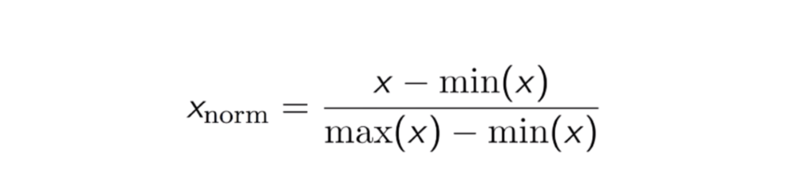

- Result: The normalized dataset has minimum of `0` and maximum of `1`.
- This is called **normalization**.

Or, we can center our data so that it ranges from `-1` to `1` instead. In general to get a value in a new interval `[a, b]` we can use the formula:

$$x''' = (b-a)\frac{x - \min{x}}{\max{x} - \min{x}} + a$$

## Scaling in `scikit-learn`

To scale our features, we can use the `StandardScaler` class from `sklearn.preprocessing`:

```python
from sklearn.preprocessing import StandardScaler
scaler = StandardScaler()
X_train_scaled = scaler.fit_transform(X_train)
X_test_scaled = scaler.transform(X_test)
print(np.mean(X), np.std(X))
print(np.mean(X_train_scaled), np.std(X_train_scaled))
```

```console
19801.42536120538, 71343.52910125865
2.260817795600319e-17, 1.0
```

Looking at the mean and standard deviation of the columns of both the original and scaled data verifies the change has taken place.

We can also put a scaler in a pipeline!

```python
steps = [('scaler', StandardScaler()),
         ('knn', KNeighborsClassifier(n_neighbors=6))]
pipeline = Pipeline(steps).fit(X_train, y_train)
```

and we can use that pipeline in cross validation. When we specify the hyperparameter space the dictionary has keys that are formed by the pipeline step name followed by a double underscore, followed by the hyperparameter name. The corresponding value is a list or an array of the values to try for that particular hyperparameter.

In this case, we are tuning `n_neighbors` in the `KNN` model:

```python
pipeline = Pipeline(steps)
parameters = {'knn__n_neighbors': np.arange(1, 50)}
```

## How do we decide which model to try out in the first place?

### The size of our datase

- Fewer features = a simpler model and can reduce training time.
- Some models, such as Artificial Neural Networks, require a lot of data to perform well.

### Interpretability

- Some models are easier to explain which can be important for stakeholders.
- Linear regression has high interpretability as we can understand the coefficients.

### Flexibility

- More flexibility = higher accuracy, because fewer assumptions are made about the data.
- A KNN model does not assume a linear relationship between the features and the target.

### Train several models and evaluate performance out of the box (i.e. without hyperparameter tuning)

- Regression model performance
  - RMSE
  - $R^2$

- Classification model performance
  - Accuracy
  - Confusion matrix
  - Precision, Recall, F1-score
  - ROC AUC

### Scale the data

Recall that the performance of some models is affected by scaling our data. Therefore, it is generally best to scale our data before evaluating models out of the box.

Models affected by scaling:

- KNN;
- Linear Regression (+ Ridge, Lasso);
- Logistic Regression;
- etc, etc, in general, every model that uses distance when predicting or has internal logic that works with intervals (activation functions in NN)

Models not affected by scaling:

- Decision Trees;
- Random Forest;
- XGBoost;
- Catboost;
- etc, etc, in general, models that are based on trees.

# Week 07 - Support Vector Machines. Decision Trees. Bagging. Boosting

## Support Vector Machines

### `LinearSVC`

In `scikit-learn`, the basic SVM classifier is implemented as the class `LinearSVC` (**linear support vector classifier**).

The `LinearSVC` class has the same methods as all of the previous machine learning algorithms we talked about:

```python
from sklearn import datasets, svm

wine = datasets.load_wine()
print(type(wine))
print(dir(wine))
print(set(wine.target))

svm = svm.LinearSVC()
svm.fit(wine.data, wine.target)
svm.score(wine.data, wine.target)
```

```console
<class 'sklearn.utils._bunch.Bunch'>
['DESCR', 'data', 'feature_names', 'frame', 'target', 'target_names']
{np.int64(0), np.int64(1), np.int64(2)}
0.9887640449438202
```

We see that the `wine` dataset has more than `2` classes and the classifier handles them automatically (as would `LogisticRegression` as well, by the way). We'll talk about how this works in later on.

### `SVC`

We can repeat these steps again for the `SVC` class. It fits a **nonlinear SVM** by default.

```python
from sklearn import datasets, svm

wine = datasets.load_wine()

svm = svm.SVC()
svm.fit(wine.data, wine.target)
svm.score(wine.data, wine.target)
```

```console
0.7078651685393258
```

With default hyperparameters the accuracy is not particularly high, but it's possible to tune them to achieve `100%` training accuracy. Such a classifier would be overfitting the training set, which is a risk we take when using more complex models like nonlinear SVMs.

### Linear vs nonlinear classification

#### Boudaries

A decision boundary tells us what class our classifier will predict for any example in our example space.

In this image, the classifier always predicts the `blue` class in the `blue` shaded area, where feature `2` is small, and the `red` class in the `red` shaded area, where feature `2` is large.


> **Definition:** The dividing line between the two regions is called the **decision boundary**.

This decision boundary is linear because it is a line. The line doesn't have to be horizontal; it could be in any orientation.

This definition extends to more than `2` features as well. With `5` features, the space of possible values is `5`-dimensional, which cannot be visualized. In that case, the boundary would be a higher-dimensional **"hyperplane"** cutting the space into two halves.

> **Definiton:** A nonlinear boundary is any type of boundary that is not linear.


In their basic forms, logistic regression and SVMs are linear classifiers, which means they learn linear decision boundaries. But, as we saw, they can also be nonlinear and we'll talk about this in a bit.

#### Data

Here's an example of a dataset that is linearly separable and one that is not.


In the left figure, there's no single line that separates the red and blue examples. On the other hand, in the right-hand figure we could divide the two classes with a straight line, so it's called linearly separable.

- Which of the following is a linear decision boundary?

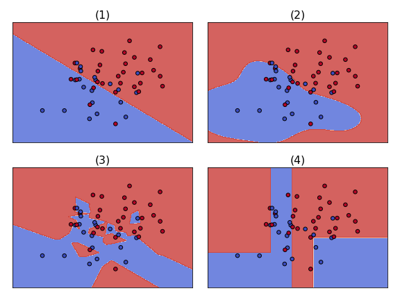

<details>

<summary>Reveal answer:</summary>

(1)

</details>

### Linear classifiers: the prediction equations

<details>

<summary>What is a dot-product of two vectors?</summary>

The sum of the element-wise multiplication.

```python
import numpy as np
x = np.arange(3)
y = np.arange(3, 6)

print(x)
print(y)
print(x * y)
print(np.sum(x * y))
print(x @ y)
```

```console
[0 1 2]
[3 4 5]
[ 0  4 10]
14
14
```

</details>

By using dot products, we can express how linear classifiers make predictions:

1. We compute what we'll call the `raw model output`:
    - `raw model output` = $coefficients \cdot features + intercept$
2. Take the sign of this quantity and check if it's positive or negative.

This pattern is the same for both logistic regression and linear SVMs.

We can say logistic regression and linear SVM have different `fit` functions but the same `predict` function.

- The differences in `fit` relate to loss functions, which we'll talk about in a bit.

#### Example

Let's see this equation in action with a logistic regression model. After it has been fit to the data we look at its predictions:

```python
lr.fit(X, y)
print(lr.predict(X)[10])
print(lr.predict(X)[20])
```

```console
0
1
```

We can get the learned coefficients and intercept with `lr.coef` and `lr.intercept`.

Computing the raw model output for example `10`, we see that it's negative: that's why we predict the negative class, called `0` in this data set.

```python
lr.coef_ @ X[10] + lr.intercept_ # raw model output
```

```console
array([-33.78572166])
```

On the other hand, for example `20` the raw model output is positive: so we predict the other class, called `1` in this data set.

```python
lr.coef_ @ X[20] + lr.intercept_ # raw model output
```

```console
array([0.08050621])
```

In general, this is what the `predict` function does for any `X`:

- it computes the raw model output;
- checks if it's positive or negative;
- returns a result based on the names of the classes in the data set, in this case `0` and `1`.

This figure shows an example in `2` dimensions, with the raw model output labeled at a few locations.


- as we move away from the boundary on one side, the output becomes more and more negative;
- on the other side, it becomes more and more positive.

**So the sign, positive or negative, tells you what side of the decision boundary you're on, and thus your prediction.**

<details>

<summary>Which values determine the boudary?</summary>

The values of the coefficients and intercept determine the boundary.

Here's how the boundary would look like if the intercept was different:


And here's how the boundary would look like if the coefficients were different:


</details>

Which classifiers make predictions based on the sign (positive or negative) of the raw model output?

```text
A. Logistic regression only.
B. Linear SVMs only.
C. Neither.
D. Both logistic regression and Linear SVMs.
```

<details>

<summary>Reveal answer:</summary>

D.

</details>

In the figure below, how many errors did the classifier make?


```text
A. 0.
B. 1.
C. 2.
D. 3.
```

<details>

<summary>Reveal answer:</summary>

D.

</details>

### Minimzing functions using `scipy`

> **Definition:** The `0-1` loss is the number of errors made by a classifier.

The package [scipy](https://scipy.org/) has a very handy function - [scipy.optimize.minimize](https://docs.scipy.org/doc/scipy/reference/generated/scipy.optimize.minimize.html), that can minimize all sorts of functions. It takes a function and an initial "guess" argument.

Let's try it out on the $y = x^2$ function.

```python
from scipy.optimize import minimize
minimize(np.square, 0).x
```

```console
array([0.])
```

We got zero as a result because this function is minimized when `x=0`. But that's not too interesting, since our initial guess was the correct answer. Let's try another initial guess to see if it's actually doing something.

```python
from scipy.optimize import minimize
minimize(np.square, 2).x
```

```console
array([-1.99946401e-08])
```

What we see is a very small number - `10` to the power of `-8`. This is normal for numerical optimization: we don't expect exactly the right answer, but something very close.

### Loss function diagrams

We want to draw loss functions, so let's set up a plot with `loss` on the vertical axis. On the horizontal axis we'll plot the `raw model output`.

Let's say that the training example is from class `+1`.Then, the right half represents correct predictions and the left half represents incorrect predictions.


Here's how the loss used by logistic regression looks like:


<details>

<summary>What was the loss function for logistic regression?</summary>

Binary cross entropy / Log loss:

$\text{Log Loss} = \sum_{(x,y)\in D} -y\log(y') - (1 - y)\log(1 - y')$

</details>

And here is the [`hinge loss`](https://en.wikipedia.org/wiki/Hinge_loss) used by support vector machines in comparison:


For an intended output $t = 1$ and a classifier score $y$, the hinge loss of the prediction $y$ is defined as:

$${hidge(y)=\max(0,1-t\cdot y)}$$

, where

$$y = \mathbf{w}^\intercal \cdot \mathbf{x} - b$$

Note that as we move to the right, towards the zone of correct predictions, the loss goes down.

Which of the four loss functions makes sense for classification?
    

```text
A. (1)
B. (2)
C. (3)
D. (4)
```

<details>

<summary>Reveal answer:</summary>

B.

</details>

### Multi-class classification

- Multi-class classification means having more than `2` classes;
- Two popular approaches:
  - one-vs-rest;
  - multinomial/softmax.

#### One-vs-rest

Train a series of binary classifiers for each class, then pick the class the classifier for which is most sure (i.e. returns the highest logit (score)).

```python
lr0.fit(X, y==0)

lr1.fit(X, y==1)

lr2.fit(X, y==2)
```

```python
# get raw model output
lr0.decision_function(X)[0]
```

```console
6.124
```

```python
lr1.decision_function(X)[0]
```

```console
-5.429
```

```python
lr2.decision_function(X)[0]
```

```console
-7.532
```

In this case, the largest raw model output comes from classifier `0`. This means it's more confident that the class is `0` than any of the other classes, so we predict class `0`.

We can just let scikit-learn do the work by fitting a logistic regression model on the original multi-class data set, setting the multi-class parameter to `ovr`.

```python
lr = LogisticRegression(multi_class='ovr')
lr.fit(X, y)
lr.predict(X)[0]
```

```console
0
```

#### Multinomial

Since version `1.5` the `multi_class` parameter is deprecated and is removed in version `1.7`. `multinomial` is used always when `num_classes > 2`. Use `sklearn.multiclass.OneVsRestClassifier(LogisticRegression())` if you still want to use `OvR`.

So, how does `multinomial`/`softmax` compare to `one-vs-rest`?

**One-vs-rest:**

- fit a binary classifier for each class;
- predict with all, take largest output;
- con: not directly optimizing accuracy;
- common for `SVM`.

**"Multinomial" or "softmax":**

- fit a single classifier for all classes;
- prediction directly outputs best class;
- pro: tackle the problem directly;
- possible for `SVM`, but less common.

#### Model coefficients

What do the coefficients look like for multi-class classification?

Let's fit a one-vs-rest model on the wine dataset and look at the coefficients.

```python
lr_ovr = LogicticRegression(multi_class='ovr')
lr_ovr.fit(X, y)
lr_ovr.coef_.shape
```

```console
(3, 13)
```

```python
lr_ovr.intercept_.shape
```

```console
(3,)
```

In the binary case we have one coefficient per feature and one intercept.

For `3` classes we now have `3` entire binary classifiers, so we end up with `1` coefficient per feature per class, and `1` intercept per class. Hence, the coefficients of this model are stored in a `3x13` array.

We can instantiate the multinomial version by setting the `multi_class` argument to `multinomial`.

```python
lr_mn = LogicticRegression(multi_class='multinomial')
lr_mn.fit(X, y)
lr_mn.coef_.shape
```

```console
(3, 13)
```

```python
lr_mn.intercept_.shape
```

```console
(3,)
```

The multinomial classifier has the same number of coefficients and intercepts as one-vs-rest. Although these two approaches work differently, they learn the same number of parameters and, roughly speaking, the parameters have the same interpretations. More on the way this works [in Wikipedia](https://en.wikipedia.org/wiki/Multinomial_logistic_regression).

If you fit a logistic regression model on a classification problem with `3` classes and `100` features, how many coefficients would you have, including intercepts?

```text
A. 101
B. 103
C. 301
D. 303
```

<details>

<summary>Reveal answer:</summary>

Answer: D.

</details>

### So, what is a support vector?

We now know that logistic regression is a linear classifier learned with the logistic loss function.

Linear SVMs are also linear classifiers, but they use the hinge loss instead and have built-in L2 regularization.


The key difference is in the "flat" part of the hinge loss, which occurs when the raw model output is greater than `1`.

This means you predicted an example correctly beyond some **margin of error**. If a training example falls in this "`0` loss" region, it doesn't contribute to the fit (in other words, if the example is removed, nothing would change). This is a key property of SVMs.

> **Definition:** Support vectors are examples that are **NOT** in the flat part of the loss diagram.

In the figure below, support vectors are shown with yellow circles around them.


Another way of defining support vectors is that they include the examples (correctly and incorrectly classified) that are *close enough* to the boundary.

How close is considered *close enough* is controlled by the regularization strength.

Critical to the popularity of SVMs is that kernel SVMs (coming next), are surprisingly **fast to fit *and* predict**. Part of the speed comes from clever algorithms whose running time only scales with the number of support vectors, rather than the total number of training examples.

### Max-margin classifier

You may also encounter the idea that **SVMs "maximize the margin"**. The diagram below shows an SVM fit on a linearly separable dataset.


The learned boundary falls just half way between the two classes. This is an appealing property: in the absence of other information, this boundary makes more sense than a boundary that is much closer to one class than the other.

The yellow lines show the distances from the support vectors to the boundary.


> **Definition:** The length of the yellow lines, **which is the same for all `3` cases**, is called the margin.

If the regularization strength is not too large, SVMs maximize the margin of linearly separable datasets. Unfortunately, most datasets are not linearly separable; in other words, we don't typically expect a training accuracy of `100%`.

While these max margin ideas can be extended to non-separable data, we won't be using them here. You can think of this as another view on what we've already defined SVMs to be, which is the **hinge loss with L2 regularization**. As it turns out, they are mathematically equivalent.


Which of the following is a true statement about support vectors?

```text
A. All support vectors are classified correctly.
B. All support vectors are classified incorrectly.
C. All correctly classified points are support vectors.
D. All incorrectly classified points are support vectors.
```

<details>

<summary>Reveal answer:</summary>

Answer: D.

</details>

### Kernel SVMs

Let's see how to fit **nonlinear boundaries** using **linear classifiers**.

Consider this `2D` toy dataset.


If we try fitting a linear SVM on these points, we might get back something that predicts blue everywhere.

However, notice that the red points are all close to the point `(0,0)`. Let's create two new features, one of which is `feature 1` squared and the other of which is `feature 2` squared.

- That means values near `0` will become small values, and values far from `0`, both positive and negative, will become large.

What happens now if we plot the points?


Now they are **linearly separable in this *transformed* space**. We can fit a ***linear*** SVM using these new features and the result is a perfect classification.

What does this linear boundary look like back in the original space?


We get an ellipse.

**Fitting a *linear* model in a *transformed* space corresponds to fitting a *nonlinear* model in the *original* space.**

Nice! In general:

- the transformation isn't always going to be squaring the features;
- the boundary isn't always going to be an ellipse;
- the new space often has a different number of dimensions from the original space.

Nevertheless, this is the basic idea.

Kernels and kernel SVMs implement feature transformations in a computationally efficient way.

Let's look at some code.

```python
# use scikit-learn's SVC class, rather than LinearSVC, to allow for different kernels
from sklearn.svm import SVC

svm = SVC(gamma=1) # default is kernel='rbf'. Note that kernel='linear' is also an option!
```

`RBF` stands for [Radial Basis Function kernel](https://en.wikipedia.org/wiki/Radial_basis_function_kernel). You can think of this as a complicated transformation of the features, followed by fitting a linear boundary in that new space, just like we saw for the simpler squaring transformation. Many nonlinear kernels options exist - we'll stick with RBF.

Let's look at a decision boundary.


This is definitely not linear!

As a result, we've gotten a higher training accuracy than we could have with a linear boundary.

We can control the shape of the boundary using the hyperparameters:

- we have the `C` hyperparameter that controls regularization strenght (lower = more);
- the RBF kernel also introduces a new hyperparameter, `gamma`, which controls the smoothness of the boundary:
  - decreasing `gamma` means making the boundaries smoother.


<details>

<summary>In the third image, we've reached `100%` training accuracy by creating a little "island" of blue around each blue training example. With the right hyperparameters, RBF SVMs are capable of perfectly separating almost any data set. So, why not always use the largest value of gamma and get the highest possible training accuracy?</summary>

Overfitting! The kernel hyperparameters affect the tradeoff between training and test accuracy. We should explore the parameter space before deciding on which the final model would be.

</details>

### Comparing logistic regression and SVM (and beyond)

Let's compare as a final step the two linear classifiers, logistic regression and linear SVMs.

| Logistic Regression                     | Linear Support Vector Machine                  |
| --------------------------------------- | ---------------------------------------------- |
| a linear classifier                     | a linear classifier                            |
| can utilize kernels, but is very slow   | can utilize kernels and fast                   |
| outputs easy-to-interpret probabilities | does not naturally output probabilities        |
| can be extended to multiclass           | can be extended to multiclass                  |
| all data points affect fit              | only "support vectors" affect fit              |
| has L1 and L2 regularization            | without extending, uses only L2 regularization |

Comparing the use in scikit-learn, we have:

| Logistic Regression                   | Linear Support Vector Machine                  |
| ------------------------------------- | ---------------------------------------------- |
| `linear_model.LogisticRegression`     | `svm.LinearSVC` and `svm.SVC(kernel='linear')` |
| `C` (inverse regularization strength) | `C` (inverse regularization strength)          |
| `penalty` (type of regularization)    | `kernel` (type of transformation)              |
| `multi_class` (type of multiclass)    | `gamma` (inverse RBF smoothness)               |

### [`SGDClassifier`](https://scikit-learn.org/stable/modules/generated/sklearn.linear_model.SGDClassifier.html)

SGD stands for stochastic gradient descent. This is a classifier that scales well to large datasets.

We haven't talked about SGD a lot, but it's worth knowing that **it can handle very large datasets much better than the other methods we've discussed**.

We've been talking about how logistic regression and SVM are just two types of linear classifiers, and `SGDClassifier` really brings this point home.

```python
from sklearn.linear_model import SGDClassifier

# to switch between logistic regression and a linear SVM, one only has to set the "loss" hyperparameter

logreg = SGDClassifier(loss='log_loss')
logsvm = SGDClassifier(loss='hidge')
```

Remember the underlying model is the same - only the loss changes.

`SGDClassifier` works pretty much like the other scikit-learn methods we've seen. One "gotcha" is that the regularization hyperparameter is called `alpha`, instead of `C`, and bigger `alpha` means more regularization. Basically, `alpha = 1/C`.

Which of the following is an advantage of SVMs over logistic regression?

```text
A. They naturally output meaningful probabilities.
B. They can be used with kernels.
C. They are computationally efficient with kernels.
D. They learn sigmoidal decision boundaries.
```

<details>

<summary>Reveal answer:</summary>

C. Having a limited number of support vectors makes kernel SVMs computationally efficient.

</details>

Which of the following is an advantage of logistic regression over SVMs?

```text
A. It naturally outputs meaningful probabilities.
B. It can be used with kernels.
C. It is computationally efficient with kernels.
D. It learns sigmoidal decision boundaries.
```

<details>

<summary>Reveal answer:</summary>

A.

</details>

## Decision Trees

### Classification-And-Regression-Tree (`CART`)

#### Classification tree

##### What is a classification tree?

Given a labeled dataset, a classification tree learns a **sequence** of **if-else** questions about **individual features** in order to infer the labels.

In contrast to linear models, trees:

- capture ***naturally* non-linear relationships** between features and labels;
- don't require the features to be on the same scale through standardization/normalization.

Let's try to predict whether a tumor is malignant or benign in the [Wisconsin Breast Cancer dataset](https://scikit-learn.org/stable/modules/generated/sklearn.datasets.load_breast_cancer.html) using only `2` features.


When a classification tree is trained on this dataset, the tree learns a sequence of if-else questions.

Each question involves `1` feature and `1` **split-point**.


1. At the top, the tree asks whether the mean of the concave-points is <= `0.051`. If it is, the instance traverses the `True` branch; otherwise, it traverses the `False` branch.
2. The instance keeps traversing the internal branches until it reaches an end (a leaf node).
3. The label of the instance is then predicted to be that of the **prevailing class at that end**.

In scikit-learn the class for creating decision trees is called `DecisionTreeClassifier` and can be found in `sklearn.tree`. Here's how we could implement the above solution

```python
from sklearn.model_selection import train_test_split
from sklearn.tree import DecisionTreeClassifier
from sklearn.metrics import accuracy_score

X_train, X_test, y_train, y_test = train_test_split(X, y, test_size=0.2, stratify=y, random_state=1)

dt = DecisionTreeClassifier(max_depth=2, random_state=1)
dt.fit(X_train, y_train)
y_pred = dt.predict(X_test)
accuracy_score(y_test, y_pred)
```

```console
0.90350877192982459
```

To understand the tree's predictions more concretely, let's see how it classifies instances in the feature-space.


- the left figure shows the decision regions of a logistic regression:
  - note how the boundary is a straight-line.
- the right figure shows the decision regions of a classification tree:
  - see how it produces rectangular decision regions in the feature space:
    - this happens because at each split made by the tree, only `1` feature is involved.

##### How does a classification tree learn?

Until now we know that:

- **Decision Tree:** a binary data structure consisting of a hierarchy of nodes;
- **Non-leaf Node:** question;
- **Leaf Node:** prediction.


The nodes of a classification tree are grown recursively. At each node, a tree asks a question involving one feature `f` and a split-point `sp`.

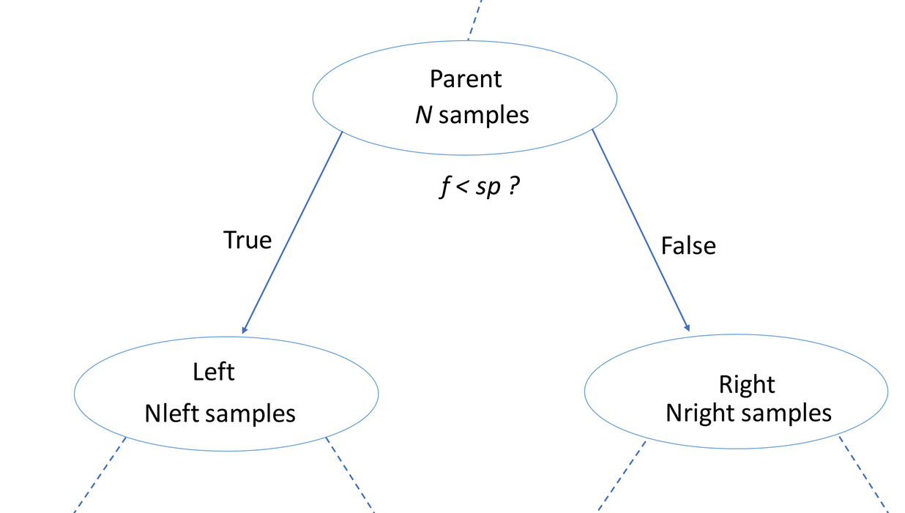

But how does it know which feature and which split-point to pick?

- It considers that every node contains an amount of uncertainty and aims to minimize that amount in the children nodes (make them more **pure**) with each split.

- The above is equivalent to saying that the tree maximizes the **information gain** it makes with every split.

Consider the case where a node with `N` samples is split into a left-node with `Nleft` samples and a right-node with `Nright` samples. The information gain (or the amount of uncertainty removed) for such split is given by this formula:


Here `I` is the amount of uncertainty and `IG` is information gain.[^1]

##### What criterion is used to measure the impurity of a node?

There are different criteria you can use among which are the **gini-index** and **entropy**.

**Gini Index Formula and Example[^2]:**


**Entropy Formula and Example[^3]:**


Note that here when we're considering multiple splits, we take the weighted averages between the entropies for each split:


The default criteria in scikit-learn is `gini`, though we could also specify `entropy`. Often we would compare both in a grid search.

```python
dt_with_gini = DecisionTreeClassifier(criterion='gini') # default
dt_with_entropy = DecisionTreeClassifier(criterion='entropy')
```

<details>

<summary>
Which of the following is not true?

1. The existence of a node depends on the state of its predecessors.
2. The impurity of a node can be determined using different criteria such as entropy and the gini-index.
3. When the information gain resulting from splitting a node is null, the node is declared as a leaf.
4. When an internal node is split, the split is performed in such a way so that information gain is minimized.

Click to reveal answer.
</summary>

Answer: 4. It's quite the contrary - splitting an internal node always involves maximizing the information gain.

</details>

#### Regression tree

Below the [`automobile miles-per-gallon`](https://archive.ics.uci.edu/dataset/9/auto+mpg) dataset is shown (it's also present in our `DATA` folder as `auto.csv`).


It consists of `6` features corresponding to the characteristics of a car and a continuous target variable labeled `mpg` (miles-per-gallon). Our task is to predict the mpg consumption of a car given these features.

Let's try to do this by only using the displacement of a car - `displ`.

A 2D scatter plot shows that the mpg-consumption decreases **nonlinearly** with displacement.


When a regression tree is trained on a dataset, the **impurity** of a node is measured using the **mean-squared error** of the targets in that node.


This means that the regression tree tries to find the splits that produce leafs where in each leaf the target values are on average, the closest possible to the mean-value of the labels in that particular leaf.

As a new instance traverses the tree and reaches a certain leaf, its target-variable `y` is computed as the average of the target-variables contained in that leaf.


To highlight the importance of the flexibility of regression trees, take a look at this figure. The regression tree shows a greater flexibility and is able to capture the non-linearity, though not fully.


### The Bias-Variance Tradeoff

In supervised learning, you make the assumption: $y = f(x), f$ is unknown.

$f$ shown in red is an unknown function that you want to determine. Real data, however, is always accompanied with randomness or noise like the blue points.


#### The goals of Supervised Learning

- find a model $\hat{f}$ that best approximates $f$: $\hat{f} \approx f$:
  - $\hat{f}$ can be any machine learning model: logistic regression, decision tree, neural network, etc.
- discard noise as much as possible;
- $\hat{f}$ should achieve a low predictive error on unseen data.

#### Difficulties in Approximating $f$

- **Overfitting:** $\hat{f}(x)$ fits the training set noise.


- **Underfitting:** $\hat{f}$ is not flexible enough / complex enough to approximate $f$.


#### Generalization Error

- **Generalization Error of $\hat{f}$**: Quantifies how well $\hat{f}$ generalizes on unseen data.
- It can be decomposed to:

$$\hat{f} = bias^2 + variance + irreducible\ error$$

- **Bias:** error term that quantifies how much on average the model fails to predict the true outcome ($\hat{f} \neq f$). Here is a model with high bias:


- **Variance:** error term that quantifies how much $\hat{f}$ is inconsistent over different training sets (how overfit the model is). Here is a model with high variance:


- **Irreducible error:** The error contribution of noise. There can never be a perfect model, so we regard this term as a small constant that is always present.

#### Model Complexity

- The easiest way in which we can control how well $\hat{f}$ approximates $f$ is by varying its (the model's) complexity.
- Examples: Maximum tree depth, Minimum samples per leaf, Number of features used, Number of neurons, etc.
- This diagram is known as the **Bias-Variance Tradeoff**: it shows how the best model complexity corresponds to the lowest generalization error.

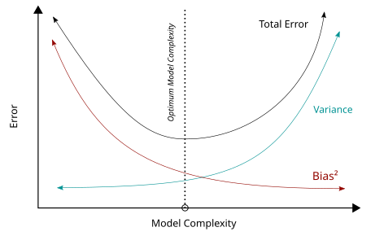

#### Bias-Variance Tradeoff: A Visual Explanation

Let's say that we want to create a model that predicts `2D` points.

The inner-most blue circle of the below diagrams represents perfect predictions with `0` error (in a certain threshold (the value of which does not matter)). The squares represent individual predictions.

The `x` and `y` axes represent the errors made for each coordinate - the center represents perfect predictions, so the errors are near `0`.

Then, we can visualize the bias-variance tradeoff with the following `4` diagrams:


#### Checkpoint

- Which of the following correctly describes the relationship between $\hat{f}$'s complexity and $\hat{f}$'s bias and variance terms?

```text
A. As the complexity of decreases, the bias term increases while the variance term decreases.
B. As the complexity of decreases, both the bias and the variance terms increase.
C. As the complexity of increases, the bias term increases while the variance term decreases.
D. As the complexity of increases, the bias term decreases while the variance term increases.
```

<details>

<summary>Click to reveal answer</summary>

Answer: D

</details>

- Visually diagnose whether a model is overfitting or underfitting the training set. Let's say you've trained two different models $A$ and $B$ on the `auto` dataset to predict the `mpg` consumption of a car using only the car's displacement (`displ`) as a feature. The following figure shows you scatterplots of `mpg` versus `displ` along with lines corresponding to the training set predictions of models $A$ and $B$ in red. Which of the following statements is true?

    

```text
A. (A) suffers from high bias and overfits the training set.
B. (A) suffers from high variance and underfits the training set.
C. (B) suffers from high bias and underfits the training set.
D. (B) suffers from high variance and underfits the training set.
```

<details>

<summary>Click to reveal answer</summary>

Answer: C. Model B is not able to capture the nonlinear dependence of `mpg` on `displ`.

</details>

### Train-test split revisited

#### Estimating the Generalization Error

- How do we estimate the generalization error of a model?
- Cannot be done directly because:
  - $f$ is unknown (if it was known, we would've just coded the formula);
  - usually there's only one dataset;
  - noise is unpredictable.
- Solution: split the data into training and testing sets:
  - fit $\hat{f}$ to the training set and evaluate the its error on the **unseen** test set;
  - the generalization error of $\hat{f}$ $\approx$ test set error of $\hat{f}$.
  - there's a problem with this approach, though: the test set should not be used until we're confident about $\hat{f}$'s performance.
    - also, we can't evaluate $\hat{f}$ on the training set as that would give a biased estimate ($\hat{f}$ has already seen all training points).

<details>

<summary>What is the solution?</summary>

K-Fold cross validation!


The error is then calculated as the mean of the cross-validation results:


</details>

#### Diagnose Variance Problems

- If CV error of $\hat{f}$ > training set error of $\hat{f}$: $\hat{f}$ suffers from **high variance**;
- $\hat{f}$ is said to have **overfit** the training set. To remedy overfitting:
  - decrease model complexity;
    - decrease max tree depth, increase min samples per leaf, decrease number of neurons.
  - gather more data.

#### Diagnose Bias Problems

- If CV error of $\hat{f} \approx$ training set error of $\hat{f}$ and this error is much greater than the disired error: $\hat{f}$ suffers from **high bias**;
- $\hat{f}$ is said to have **underfit** the training set. To remedy underfitting:
  - increase model complexity;
    - increase max tree depth, decrease min samples per leaf, increase number of neurons, increase number of layers.
  - gather more relevant features;
  - feature engineering.

- What do we deduct from the below outputs - overfitting or underfitting?

    

<details>

<summary>Click to reveal answer</summary>

Answer: overfitting. The cross-validation error is higher than the training error.

</details>

### Ensemble Learning

#### Advantages of CARTs

- Simple to understand;
- Simple to interpret;
- Easy to use;
- Flexibility: ability to describe non-linear dependecies;
- Preprocessing: no need to standardize or normalize features.

#### Limitations of CARTs

- Classification: can only produce orthogonal decision boundaries;
- Sensitive to small variations in the training set;
- High variance: unconstrained CARTs easily overfit the training set;
- We can address these limitations by utilizing the **Ensemble Learning** technique.

#### What is Ensemble Learning?

- Train different models on the same dataset;
- Let each model make its predictions;
- Create a meta-model that aggregates the predictions of individual models;
- Output the final prediction. Using this technique, we get more robust results that are less prone to errors;
- Usually the best results are obtained when the used models are skillful in different ways:
  - this can be achieved easily if different types of models are used (rather than a variation of the same model).


#### Ensemble Learning in Practice: The [`Voting Classifier`](https://scikit-learn.org/stable/modules/generated/sklearn.ensemble.VotingClassifier.html#sklearn.ensemble.VotingClassifier)

Let's say we have a binary classification task.

- We create $N$ classifiers and get their predictions for a single observation: $P_0, P_1, \dots, P_{n-1}$ with $P_i = 0$ or $1$.
- Those predictions get passed to a meta-model. In the case of the `Voting Classifier`, this model is simply a majority vote on the predictions.
  - If $N$ is even and the predictions get event, a class is chosen at random.
  - Therefore, aviod setting $N$ to an even number.

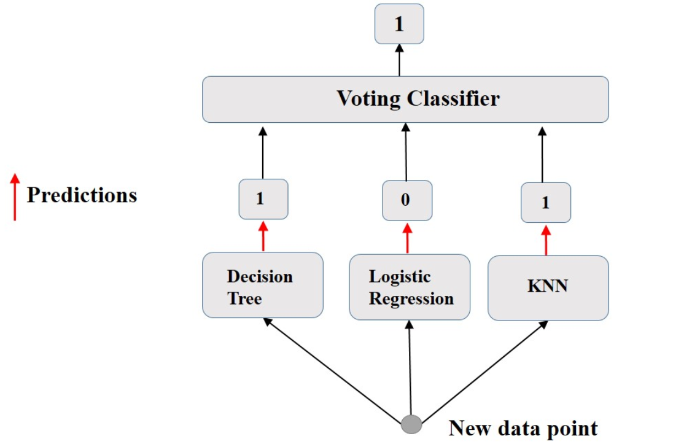

## Bagging

### Disadvantages of ensemble methods

- Trained on the same training set.
- Use different algorithms.
- Do not guarantee better performance (as you'll see in the tasks).

### What is bagging?

- Shorthand for `Bootstrap aggregation`.
- A model creation technique that outputs an ensemble meta-estimator that fits base classifiers **of 1 model type** each on random subsets of the original dataset and then aggregates their individual predictions (either by voting or by averaging) to form a final prediction.
  - Training dataset for each model is formed by the `Bootstrap` technique.
  - Proven to reduce variance of individual models in the ensemble.[^4]

### Bootstrap

A bootstrap sample is a set of randomly chosen observations from the original dataset drawn with replacement **up to the size of the original dataset**.


### Bagging: Training

In the training phase, bagging consists of:

1. Drawing `N` different bootstrap samples from the training set.
2. Using each of them train `N` models that use the same algorithm.


### Bagging: Prediction

When a new instance is fed to the different models forming the bagging ensemble, each model outputs its prediction. The meta model collects these predictions and outputs a final prediction depending on the nature of the problem.


### Bagging: Classification & Regression

**Classification:**

- Aggregates predictions by majorty voting.
- [`BaggingClassifier`](https://scikit-learn.org/1.5/modules/generated/sklearn.ensemble.BaggingClassifier.html) in scikit-learn.

**Regression:**

- Aggregates predictions through averaging.
- [`BaggingRegressor`](https://scikit-learn.org/1.5/modules/generated/sklearn.ensemble.BaggingRegressor.html) in scikit-learn.

> **Note:** The model you pass as an `estimator` must already be created / instanciated. Refer to the documentation in the above links.

### Out of Bag Evaluation

- During bagging some instances may be sampled several times for one model, but others may not be sampled at all. How can we make use of them?
  - Did you know? On average only `67%` of samples get sampled to form a bootstrap sample![^5]
- Solution: OOB Evaluation:

We use the unseen samples for evaluation. In general, this is analogous to the well-known `70%-30% train-test` split.


- In sklearn, we can obtain the out of bag scores of each model by doing these two steps:
  1. Set `oob_score` to `True` when instanciating the aggregator.
  2. Train the model using the training set.
  3. Access the `OOB` scores using the `oob_score_` attribute of the trained model.

> **Note:** `oob_score_` returns **accuracy** on the OOB instances.

### Further Diversity with `Random Forests`

- `Random Forests` is another ensemble learning method.
- Its base estimator is a `Decision Tree`.
- Each estimator is trained on a different bootstrap sample with size = size of original dataset.
- `RF` introduces further randomization in the training of individual trees:
  - $d$ features are sampled for each model without replacement ($d < total\ number\ of\ features$).


### `Random Forests`: Classification & Regression

- Aggregates predictions by majorty voting.
- [`RandomForestClassifier`](https://scikit-learn.org/1.5/modules/generated/sklearn.ensemble.RandomForestClassifier.html) in scikit-learn.

**Regression:**

- Aggregates predictions through averaging.
- [`RandomForestRegressor`](https://scikit-learn.org/1.5/modules/generated/sklearn.ensemble.RandomForestRegressor.html) in scikit-learn.

> **Note:** The model you pass as an `estimator` must already be created / instanciated. Refer to the documentation in the above links.

### Feature Importance with Trees and Forests

Tree-based methods enable measuring importance of each feature.

In `sklearn`:

- how many times the tree nodes use a particular feature (weighted average) to reduce impurity.
- accessed using the attribute `feature_importance_`.

## Boosting

### Boosting: Introduction

- **Boosting:** Ensemble method combining several weak learners to form a strong learner.
- **Weak learner:** Model doing slightly better than random guessing.
  - Example: decision stump (CART whose maximum depth is `1`).

### Boosting: Process

1. Train an ensemble of predictors sequentially.
2. Each predictor tries to correct its predecessor.

- Most popular boosting methods:
  - AdaBoost;
  - Gradient Boosting.

### Adaboost

- Shorthand for **Ada**ptive **Boost**ing.
- Each predictor pays more attention to the instances wrongly predicted by its predecessor.
  - Achieved by changing the weights of training instances, thus increasing the value of the loss if they get uncorrectly prediced again.
- Each predictor is assigned a coefficient $\alpha$ that corresponds to the **amount of say** the predictor has in determining the final vote.
  - $\alpha$ depends on the predictor's training error.

### Adaboost: Training

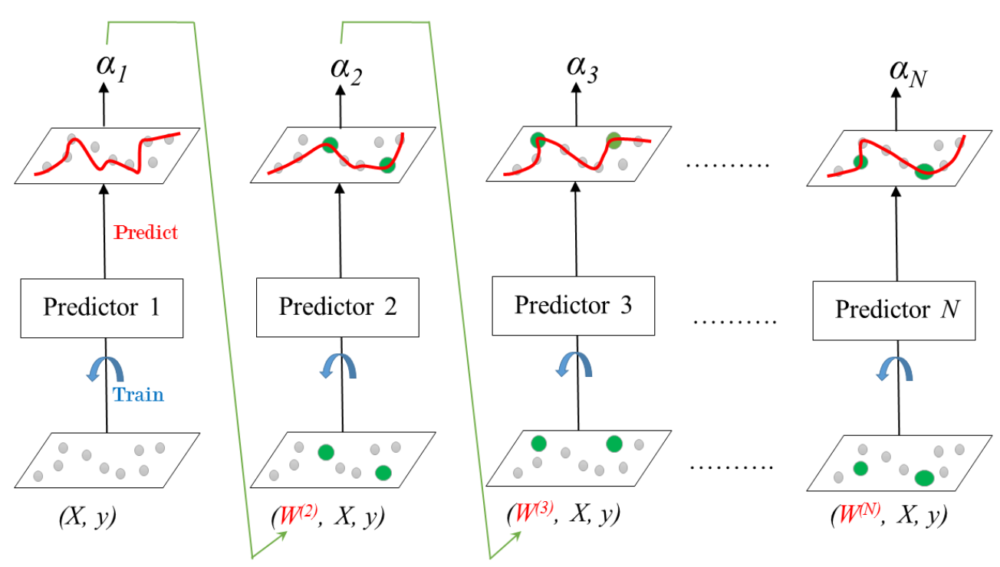

1. `predictor1` is trained on the initial dataset `(X, y)`.
2. The training error for `predictor1` is determined.
3. This error is used to determine `alpha1` which is `predictor1`'s say in the final vote.
4. `alpha1` is used to determine the weights $W^2$ of the training instances for `predictor2`. This can be see in the incorrectly predicted instances shown in `green` that acquire higher weights.

### Learning Rate

Learning rate: $0 < \eta \leq 1$


The learning rate - $\eta$ (eta), is used to shrink the coefficient $\alpha$ of a trained predictor. It's important to note that there's a trade-off between $\eta$ and the number of estimators. **A smaller value should be compensated by a greater number of estimators.**

### AdaBoost: Prediction

**Classification:**

- Weighted majority voting.
- In scikit-learn [`AdaBoostClassifier`](https://scikit-learn.org/1.5/modules/generated/sklearn.ensemble.AdaBoostClassifier.html).

**Regression:**

- Weighted average.
- In scikit-learn [`AdaBoostRegressor`](https://scikit-learn.org/1.5/modules/generated/sklearn.ensemble.AdaBoostRegressor.html).

### Gradient Boosted Trees

- Each predictor is trained using its predecessor's residual errors as **labels**.
- The base learner is a CART.
- Result: sequential correction of predecessor's errors.

### Gradient Boosted Trees for Regression: Training

Each predictor is trained to predict the last one's residuals.


For classification, the residuals are calculated as the difference between the class probabilities.[^6]

### Shrinkage

- The prediction of each tree in the ensemble is shrinked after it is multiplied by a learning rate $\eta$.
- Similarly to `AdaBoost`, there's a trade-off between eta and the number of estimators:
  - less learning rate => a lot of estimators


### Gradient Boosted Trees for Regression: Prediction

- Regression:
  - $y_{pred} = y_1 + \eta r_1 + \ldots + \eta r_N$
  - in sklearn: [`GradientBoostingRegressor`](https://scikit-learn.org/stable/modules/generated/sklearn.ensemble.GradientBoostingRegressor.html).

- Classification:
  - in sklearn: [`GradientBoostingClassifier`](https://scikit-learn.org/stable/modules/generated/sklearn.ensemble.GradientBoostingClassifier.html).

### Gradient Boosting: Cons

Each CART is trained to find the best split points and features. This produces two problems:

- this is an exhaustive search procedure;
- may lead to CARTs using the same split points and maybe the same features.

### Stochastic Gradient Boosting

- In sklearn we can use the classes `GradientBoostingRegressor` and `GradientBoostingClassifier`. Making them stochastic is done by changing the values for the parameters `subsample` and `max_features`.
- Each tree is trained on a random subset of rows of the training data.
- The sampled instances are sampled without replacement.
- When choosing split points the features are also sampled without replacement.
- Benefits:
  - Further ensemble diversity.
  - Added bias to the ensemble of trees, thus ability to reduce overfitting.


[^1]: <https://victorzhou.com/blog/information-gain/>
[^2]: <https://www.learndatasci.com/glossary/gini-impurity/>
[^3]: <https://towardsdatascience.com/entropy-how-decision-trees-make-decisions-2946b9c18c8>
[^4]: <https://stats.stackexchange.com/questions/380023/how-can-we-explain-the-fact-that-bagging-reduces-the-variance-while-retaining-t>
[^5]: <https://stats.stackexchange.com/questions/88980/why-on-average-does-each-bootstrap-sample-contain-roughly-two-thirds-of-observat>
[^6]: <https://affine.ai/gradient-boosting-trees-for-classification-a-beginners-guide/>

# Week 08 - Unsupervised Learning

## What is unsupervised learning?

It represents a class of machine learning algorithms that find patterns in unlabelled data.

Examples:

- *clustering* customers by their purchases;
- compressing the data using purchase patterns (*dimensionality reduction*).

## Supervised vs unsupervised learning

- *Supervised* learning finds patterns that best help in solving a prediction task.
  - Example: classify tumors as benign or cancerous (given a set of *labels*).
- Unsupervised learning finds patterns in data, but *without* a specific prediction task in mind.

## The [`K-Means Clustering`](https://scikit-learn.org/stable/modules/generated/sklearn.cluster.KMeans.html) algorithm

- Finds clusters of samples.
- Number of clusters must be specified when creating the model.
- Let's see how it works in `1D`:


- And in `2D`:


- New samples are assigned the label of the closest `centroid`.

## Evaluating the quality of a cluster

### Cross Tabulation

- We can check the correspondence with the labels of the points in the training dataset.
  - In other words, do the clusters correspond to the species?


- We see that cluster `1` corresponds perfectly with the species `setosa`. On the other hand, while cluster `0` contains mainly `virginica` samples, there are also some `virginica` samples in cluster `2`.
- The table displaying the unique values of `labels` vs the unique values of `species` is called a `cross-tabulation`.
- We create it with [`pandas.crosstab`](https://pandas.pydata.org/docs/reference/api/pandas.crosstab.html) with the following code:

```python
import pandas as pd
df = pd.DataFrame({'labels': labels, 'species': species})
df
```


```python
pd.crosstab(df['labels'], df['species'])
```


### Inertia

- Having species information in the training set is very helpful. This is actually the same as having a labelled training set.
- But how do we evaluate a clustering if the training set is not labelled?
- Solution: **Inertia**!
- Inertia measures how spread out the clusters are (*lower* is better).
- It uses the distance of each sample to the centroid of its cluster.
  - As per `sklearn`: "Inertia is the sum of squared distances of samples to their closest cluster center."
- Available after `fit()` as the attribute `inertia_`.
- `KMeans` attempts to minimize the inertia when choosing centroids.

> **Note:** More clusters means lower inertia, but a high amount of clusters may not correspond to reality.

### How many clusters to choose?

- Visualize, visualize, visualize!

**Approach 1:**

- If the data is `1D` or `2D`, just create a scatter plot - it'll guide you to the best number of clusters.


**Approach 2:**

- Fit various number of clusters and plot their values against the inertia.
- Choose an `elbow` point - a point after which there is little to no added value.
- **Benefit:** does not depend on dimensionality.


## Transforming features for better clusterings

### The [Piedmont wines dataset](https://archive.ics.uci.edu/dataset/109/wine)

- 178 samples from 3 varieties of red wine: Barolo, Grignolino and Barbera.
- Features measure:
  - Chemical composition e.g. alchohol content.
  - Visual properties like "color intensity".

### Clusters vs. varieties

If we run `KMeans` with three clusters, we would get clusters that don't correspond well with the wine varieties.


This is because the wine features have very different variances. This is how the clusters look like for two of the features:


The model did its best, but the data points themselves are not that different from each other.

### Feature variances

- So, the problem we have to solve is that the features have values on a large scale.
  - This is the same as saying that they have a wide spread of values.
- The measurement for amount of spread of values is the **variance** ().
  - Compare the variance of `proline`  to the variance of the other features (obtained via [`pd.var`](https://pandas.pydata.org/docs/reference/api/pandas.DataFrame.var.html)):

  

- We have to decrease the variance of the features and hope that we'll get points that are more grouped together.

### [`StandardScaler`](https://scikit-learn.org/stable/modules/generated/sklearn.preprocessing.StandardScaler.html)

- In `KMeans` clustering, the variance of a feature is directly proportional to its influence on the clustering algorithm.
- `StandardScaler` transforms each feature to have a mean of `0` and a variance of `1`, giving each feature a chance.
- Result: Much better grouping of points!


Effectively, we get a much better model:

Before scaling:


After scaling:


## `sklearn` preprocessing steps

- `StandardScaler` is one of several possible "data preprocessing" steps.
- Others include: `MaxAbsScaler` and `Normalizer`.
  - While `StandardScaler()` standardizes features by removing the mean and scaling to unit variance, `Normalizer()` rescales each sample independently of other samples so that its norm (`l1`, `l2` or `max`) equals `1`.

## Visualization communicates insight

- A huge part of the work of a data scientist / data analyst is communication insights to other people, esp. non-technical, stakeholder-like people.
- We'll now discuss two unsupervised learning techniques for visualization:
  - `Hierarchical clustering`;
  - `t-SNE`: Creates a 2D map of a dataset.

## A higherarchy of groups

- We already know many hierarchical clustering from the real world.
- Groups of living things can form a hierarchy.
- Clusters are groups that are contained in one another.


## [Eurovision scoring dataset](https://eurovision.tv/history/full-split-results)

- 2D array of scores.
- Rows are countries, columns are songs.


- If we run the data through a hierarchical clustering of voting countries, we get a tree-like diagram, called a `dendrogram`.
- The dendrogram groups countries into larger and larger clusters. Many of those clusters are recongnizable as containing countries that:
  - are close to one another geographically;
  - have cultural ties;
  - have political ties;
  - belong to the same language group.


- Dendrograms are read from the bottom up.
- Vertical lines represent clusters.

## `Agglomerative` hiearchical clustering

1. Every country is in a separate cluster.
2. At each step, the two closest clusters are merged.
3. Continue until all countires are in a single cluster.

## Implementing using `scipy`

We can use the functions from the [`scipy.cluster.hierarchy`](https://docs.scipy.org/doc/scipy/reference/cluster.hierarchy.html) module to perform agglomerative clustering:

- `linkage`: to create the clusters;
- `dendrogram`: to create the dendrogram plot.

```python
from scipy.cluster import hierarchy
mergings = hierarchy.linkage(samples, method='complete')
hierarchy.dendrogram(mergings, labels=country_names, leaf_rotation=90, leaf_font_size=6)
plt.show()
```

**Checkpoint**

<details>

<summary>If there are 5 data samples, how many merge operations will occur in a hierarchical clustering?</summary>

`4` merges. Look back in the dendrogram from Eurovision to see the tendency.

</details>

## Cluster labels in hierarchical clustering

- How do we extract the clusters from intermediate stages of a hierarchical clustering?
- An intermediate stage in the hierarchical clustering is specified by choosing a **height** on the dendrogram.
- E.g. at height `15`:
  - Bulgaria, Cyprus, Greece are one cluster;
  - Armenia in a cluster on its own;
  - Russia and Moldova are another.


- But what is the meaning of the height?

## Dendrograms show cluster distances

- Height on dendrogram = distance between merging clusters.
- E.g. clusters with only Cyprus and Greece had distance approx. `6`.
- When this cluster was merged with the cluster containing Bulgaria, the distance between them (the merged cluster and the cluster of Bulgaria) was `12`.


## Distance between clusters

- Defined by a `"linkage method"`.
- In `complete` linkage: distance between clusters is the maximum distance between their samples. In other words, the distance between two clusters is defined by the distance between their farthest points.
- Different linkage methods produce different hierarchical clusterings.


## Extracting cluster labels

- Use the `fcluster()` function.
- Returns a NumPy array of cluster labels.

```python
from scipy.cluster import hierarchy
mergings = hierarchy.linkage(samples, method='complete')
hierarchy.fcluster(mergings, 15, criterion='distance')
labels
```

```console
[ 9  8 11 20  2  1 17 14 ... ]
```

## Checkpoint

### Task 1

Consider the three clusters in the diagram. Which of the following statements are true?


**A.** In single linkage, `Cluster 3` is the closest cluster to `Cluster 2`.

**B.** In complete linkage, `Cluster 1` is the closest cluster to `Cluster 2`.

1. Neither A, nor B.
2. A only.
3. B only.
4. Both A and B.

<details>

<summary>Reveal answer</summary>

Answer: `4. Both A and B.`

</details>

### Task 2

Displayed is the dendrogram for the hierarchical clustering of the grain samples. If the hierarchical clustering were stopped at height `6` on the dendrogram, how many clusters would there be?

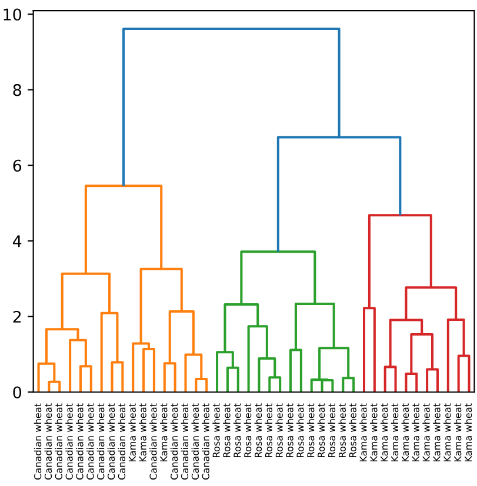

<details>

<summary>Reveal answer</summary>

Answer: 3 - if we draw a horizontal line at `6`, we would see them.

</details>

## `t-SNE` for 2-dimensional maps

### What is `t-SNE`?

- An unsupervised learning method for visualization.
- Stands for `t-distributed stochastic neighbor embedding`.
- Maps samples to `2D` or `3D` space (essentially, reducing their dimensionality).
- Map approximately preserves nearness of samples.
- Great for inspecting high-dimensional datasets.

### `t-SNE` on the iris dataset

The dataset has `4` measurements, so samples are `4`-dimensional.

Let's use `t-SNE` to map the samples to `2D` space. We won't give it information about the species of each sample.


We can see that the species were kept mostly separate.

We also learn that there are two iris species - `versicolor` and `virginica`, whose samples are close together in space, meaning that it's **hard to distinguish one from the other**.

### [`t-SNE` in `sklean`](https://scikit-learn.org/stable/modules/generated/sklearn.manifold.TSNE.html)

```python
from sklearn import manifold
model = manifold.TSNE(learning_rate=100)
transformed = model.fit_transform(samples)
xs = transformed[:, 0]
ys = transformed[:, 1]
plt.scatter(xs, ys, c=species)
plt.show()
```

### `t-SNE` has only `fit_transform()`

- Only has a `fit_transform()` method (no `fit()` and no `transform()`).
- Simultaneously fits the model and transforms the data.
- Must start over again when there's new data.

### `t-SNE` learning rate

- The learning rate for `t-SNE` is usually in the range `[10.0, 1000.0]`.
  - If too high, the data may look like a `ball` with any point approximately equidistant from its nearest neighbours.
  - If too low, most points may look compressed in a dense cloud with few outliers.
  - Basically, if the value is not ok, we'll get points that are bunched together.
- Advice: Try values between `50` and `200`.

Keep in mind that the results of applying `t-SNE` on the same features are different every time.

- Piedmont wines, 3 runs, 3 different scatter plots, same data used:


## Dimension reduction / Dimensionality reduction

- Finds patterns in data and uses these patterns to re-express the data in a compressed form.
- Benefits:
  - more efficient storage of large data (that can be [reconstructed](https://stats.stackexchange.com/questions/229092/how-to-reverse-pca-and-reconstruct-original-variables-from-several-principal-com) to its original form);
  - faster computation when working with large data.
  - less-informative, type `noise`, features are removed.

## Principal Component Analysis (PCA)

- Most popular dimensionality reduction technique.
- Works in `2` steps:
  1. Decorrelation.
  2. Dimension reduction.

## Decorrelation

- Rotates data samples to be aligned with axes.
- Shifts data samples so they have a mean of `0`.
- No information is lost.
  - data points are the same, it's just that they have been scaled.


## [PCA](https://scikit-learn.org/stable/modules/generated/sklearn.decomposition.PCA.html) follows the fit/transform pattern

- `fit()`: learns the transformation from given data;
- `transform()`: applies the learned transformation;
- `transform()`: can be applied to new data after being `fit()` on old data.
- The rows of the transformed data correspond to samples.
- The columns of the transformed data are called `PCA features`.

## PCA features are not correlated

- Features of dataset are often correlated, e.g. `total_phenols` and `od280`.
- But, because the first step of applying PCA is to allign data with axes, the resulting PCA features are not correlated.


## Pearson correlation

- Measures linear correlation of features.
- Value between `-1` and `1`.
- Value of `0` means no linear correlation.
- Can be retrieved via the [`corr`](https://pandas.pydata.org/docs/reference/api/pandas.DataFrame.corr.html) method.

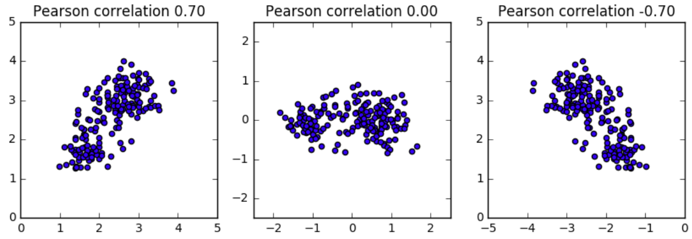

## Principal components

- "Principal components" = the directions in which samples vary the most
- The resulting table has the PCs order in descending order of their amount of variance. It is also known as the `eigenvector matrix`.


- Available as `components_` attribute of PCA object.
- Each row defines displacement from mean.

```python
print(model.components_)
```

```console
[[ 0.64116665  0.76740167]
 [-0.76740167  0.64116665]]
```

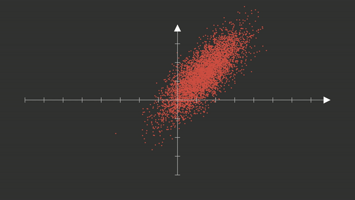

## PCA - Checkpoint

Three scatter plots of the same point cloud are shown. Each scatter plot shows a different set of axes (in red). In which of the plots could the axes represent the principal components of the point cloud?

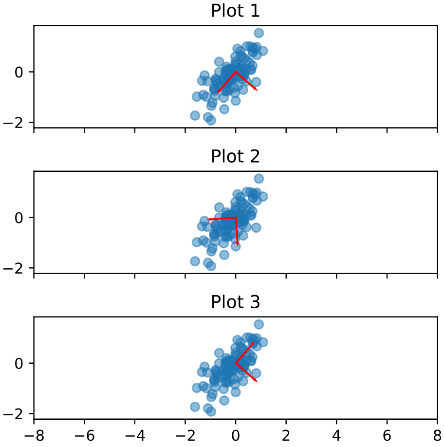

<details>

<summary>Reveal answer</summary>

Answer: Both plot `1` and plot `3`.

</details>

## Intrinsic dimention

- Consider `2` features: latitude and longitude at points along a flight path:

```console
latitude  longitude
  50.529     41.513
  50.360     41.672
  50.196     41.835
...
```

- Dataset *appears* to be `2`-dimensional.
- But can approximated using only `1` feature: `displacement` along flight path:


- So, the dataset is intrinsically `1`-dimensional.
- Intrinsic dimension = number of features needed to approximate the dataset.
- Essential idea behind dimeonsion reduction.
- Answer the question: *What is the most compact representation of the samples?*.
- Can be detected with PCA.

## Versicolor dataset

- Let's filter the iris dataset and leave only the `versicolor` samples.
- If we plot the `3` features that measure them, we see that the samples lie close to a flat `2`-dimensional plane.
- So, they can be approximated using `2` features.


## Use PCA to identify intrinsic dimeonsion

- Scatter plots only work if samples have `2` or `3` features.
- PCA identifies intrisic dimeonsion when samples have any number of features.
- Intrinsic dimension = number of PCA features with significat variance.

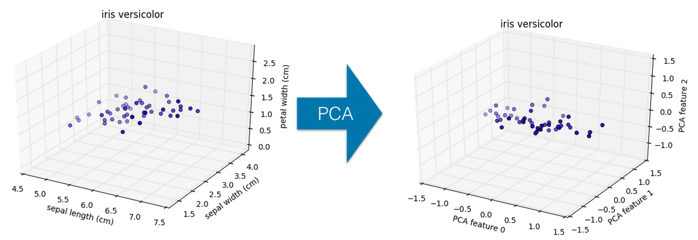

- PCA features are ordered by decreasing variance.
- In our example, these are the first `2` PCA features.
- Here's a `bar` diagram with their values. You can obtain them by using the `explained_variance_` attribute of a fitten `PCA` object.


## Intrinsic dimeonsion can be ambiguous

- Intrinsic dimeonsion is an idealization.
- There is not always one correct answer.
- Piedmont wines: could argue for `2`, or `3`, or more.


## PCA and standardization

<details>

<summary>Should we standardize data before applying principal component analysis (PCA)?</summary>

If some variables have a large variance and some small, PCA (maximizing variance) will load on the large variances. For example if you change one variable from `km` to `cm` (increasing its variance), it may go from having little impact to dominating the first principle component.

- If you want your PCA to be independent of such rescaling, standardizing the variables will do that.
- If the specific scale of your variables matters (in that you want your PCA to be in that scale), maybe you don't want to standardize.

More on the topic [here](https://stats.stackexchange.com/questions/69157/why-do-we-need-to-normalize-data-before-principal-component-analysis-pca).

</details>

## Summary: Dimension Reduction using PCA

- Represent the same data, using less features.
- PCA:
  - Orders features in decreasing order of variance.
  - Assumes the low variance features are `noise`.
  - Assumes the high variance features are informative.


## Word frequency arrays

- Alternative implementation of PCA.
- Rows represent documents, columns represent words.
- Entries measure presence of each word in each document:
  - Measurement can be count, tf-idf, etc.
  - Only some of the words from the vocabulary appear in any one document, so most of the entries are `0`.


## Sparse arrays and `csr_matrix`

- Arrays in which most entries are `0`, are called `sparse` arrays.
- They can be represented using a special type of an array, called [`csr_matrix`](https://docs.scipy.org/doc/scipy/reference/generated/scipy.sparse.csr_matrix.html) (Compressed Sparse Row matrix).
  - ["Remembers"](https://en.wikipedia.org/wiki/Sparse_matrix) only the non-zero entries.


- scikit-learn's `PCA` doesn't support `csr_matrix`, but [`TruncatedSVD`](https://scikit-learn.org/stable/modules/generated/sklearn.decomposition.TruncatedSVD.html) does!
- Use `TruncatedSVD` when working with sparse matrices. Its interface is the same as the one `PCA` has.

## Non-negative matrix factorization (NMF)

- Dimension reduction technique.
- NMF models are interpretable (unlike PCA), i.e. easy to explain.
- One requirement: all sample features must be non-negative.
- It expresses documents as combinations of topics (or `themes`):


- and images as combination of patterns:


- In scikit-learn it's implemented as [`NMF`](https://scikit-learn.org/stable/modules/generated/sklearn.decomposition.NMF.html) and follows the standard `fit()` and `transform()` pattern.
- Works with normal (non-sparse) NumPy arrays and with `csr_matrix`.

## Example word-frequency array

- Word frequency array / matrix, 4 words, many documents.
- Presence of words in each document is measured using `tf-df`:
  - `tf` = `term frequency` = number of times a word is seen in a document / number of words in the document;

  $$tf(t,d) = \frac{f_{t,d}}{\displaystyle\sum_{t^\prime \isin d} f_{t^\prime, d}}$$

  - `idf` = `inverted document frequency` = number of documents / number of documents containing word.

  $$idf(t,D) = \frac{N}{\vert \{ d \isin D : t \isin d \} \vert}$$


## NMF features

- NMF features are also non-negative.
- Can be used to reconstruct the samples by ***matrix multiplying*** them with the identified components.
- This is the "**M**atrix **F**actorization" part in `NMF`.

```python
print(samples[i])
```

```console
[  0.12  0.18  0.32  0.14]
```

```python
print(nmf_features[i])
```

```console
[  0.15  0.12]
```


## Use cases

- Word frequencies in each document.
- Images encoded as arrays.
- Audio spectograms.
- Purchase histories on e-commerce sites.

## NMF - Checkpoint

### Question 1

Which of the following 2-dimensional arrays are examples of non-negative data?

1. A tf-idf word-frequency array.
2. An array daily stock market price movements (up and down), where each row represents a company.
3. An array where rows are customers, columns are products and entries are 0 or 1, indicating whether a customer has purchased a product.

<details>

<summary>Reveal answer</summary>

Answer: `1` and `3`

Stock prices can go down as well as up, so an array of daily stock market price movements is not an example of non-negative data.

</details>

### Question 2

The components of an NMF model are given. If the NMF feature values of a sample are `[2, 1]`, then which of the following is most likely to represent the original sample?

```python
[[1, 0.5, 0], [0.2, 0.1, 2.1]]
```

1. `[2.2, 1.1, 2.1]`.
2. `[0.5, 1.6, 3.1]`.
3. `[-4.0, 1.0, -2.0]`.

<details>

<summary>Reveal answer</summary>

Answer: `1`.

We have matrix multiply the features with the components:

```python
nmf_features = np.array([2, 1])
components = np.array([[1, 0.5, 0], [0.2, 0.1, 2.1]])
np.dot(nmf_features, components)
```

</details>

## NMF components are topics

Example:

- Word-frequency array of articles (tf-idf).
- 20,000 scientific articles (rows).
- 800 words (columns).


If we apply NMF with `10` components to this data, we would get a resulting matrix with shape `(10, 800)`.

Choosing a component and looking at which words have the highest values, we see that they fit a theme: the words are `species`, `plant`, `plants`, `genetic`, `evolution` and `life`.


The same happens if any other component is considered.


So, when applied to text-based documents:

- `NMF` components represent topics;
- `NMF` features combine topics into documents.

For images, NMF components are parts of images:


<details>

<summary>How can we represent a collection of images as a non-negative array?</summary>

Answer: Using their pixels.

## Grayscale images

- Grayscale image = no colors, only shares of gray.
- They can be used to measure pixel brightness by having a value between `0` and `1` (`0` is black).
- Here's an 8x8 grayscale image of the moon, written as an array:


## Encoding a collection of images

- Encode each image as 1D flat array.
- Encode the collection as 2D array.
- Each row corresponds to an image.
- Each column corresponds to a pixel.
- We can then apply NMF.


</details>

## Building recommender systems using NMF

Image you're a data scientist at a large online newspaper.

You've been tasked to recommend articles similar to the article being currently read by a customer.

<details>

<summary>How would you go about doing this?</summary>

Similar articles should have similar topics!

1. Convert the articles into a word-frequency array.
2. We can extract the different topics by applying NMF to the array.
3. The extracted topics themselves are just vectors.
4. We can compute how close those vectors are to one another, by using the consine similarity.
5. Whichever vectors are the closest to the one obtained by the current article, would represent the articles we should return to the user.

Recap of how cosine similarity works:


- Uses the angle between the lines.
- Higher values means more similar.
- Maximum value is `1`, when angle is `0` degrees.

Here's how this can be done via `scikit-learn`:

```python
from sklearn.preprocessing import normalize
norm_features = normalize(nmf_features)
# if the current document has index 23
current_article = norm_features[23]
similarities = norm_features.dot(current_article)
print(similarities)
```

```console
[ 0.7150569  0.26349967 ..., 0.20323616  0.05047817]
```

</details>

# Week 09 - Natural Language Processing

## Introduction

<details>

<summary>What is Natural Language Processing?</summary>

Field of study focused on making sense of language using statsitics and computers.

</details>

<details>

<summary>What applications of Natural Language Processing techniques have you heard of?</summary>

- Chatbots.
- Translation.
- Sentiment analysis.
- Named-entity recongnition.
- etc, etc.

</details>

<details>

<summary>What are regular expressions? Why do we use them?</summary>

Strings with a special syntax that allow us to match patterns in other strings.

</details>

<details>

<summary>What application of regular expressions have you heard of?</summary>

- Find all web links in a document.
- Parse email addresses.
- Remove/replace unwanted characters.
- Validate user credentials.
- Part of speech tagging.

</details>

## `re.match`

- Regular expressions can be used in Python via the [`re`](https://docs.python.org/3/library/re.html) library.
- `re.match`: matches a pattern with a string:
  - first argument is the pattern;
  - second argument is the string in which to match the pattern.
  - Returns a [`Match`](https://docs.python.org/3/library/re.html#re.Match) object (`None` if the string does not match the pattern).

```python
import re
re.match('abc', 'abcdef')
```

```console
<re.Match object; span=(0, 3), match='abc'>
```

```python
re.match(r'\w+', 'hi there!') # notice the r-string used here!
```

```console
<re.Match object; span=(0, 2), match='hi'>
```

- `r` prefix: ensure that your patterns are interpreted in the way you want them to (raw string).
  - Else, you may encounter problems to do with escape sequences in strings.
  - For example, `"\n"` in Python is used to indicate a new line, but if you use the `r` prefix, it will be interpreted as the raw string `"\n"`: the character `"\"` followed by the character `"n"` - and not as a new line.
- A cool website to play around with regular expressions: [regex101](https://regex101.com/).

## Common regex patterns

Challenge: fill in the below patterns:

| pattern | matches                                     | example      |
| ------- | ------------------------------------------- | ------------ |
| ???     | word                                        | 'Magic'      |
| ???     | digit                                       | 9            |
| ???     | space                                       | `' '`        |
| ???     | any character (except for line terminators) | 'username74' |
| ???     | greedy match                                | 'aaaaaaa'    |
| ???     | **not** space                               | 'no_spaces'  |
| ???     | lowercase group                             | 'abcedefg'   |

<details>

<summary>Reveal answer</summary>

| pattern    | matches                                     | example      |
| ---------- | ------------------------------------------- | ------------ |
| \w+        | word                                        | 'Magic'      |
| \d         | digit                                       | 9            |
| \s         | space                                       | `' '`        |
| .*         | any character (except for line terminators) | 'username74' |
| `+` or `*` | greedy match                                | 'aaaaaaa'    |
| \S         | **not** space                               | 'no_spaces'  |
| [a-z]      | lowercase group                             | 'abcedefg'   |

</details>

## Other useful functions

- `split`: split a string on regex;
- `findall`: find all patterns in a string;
- `search`: search for a pattern;
- `match`: match an entire string or substring based on a pattern.
- All of the above return an iterator if multiple matches are found:

```python
re.split(r'\s+', 'Split on spaces.')
```

```console
['Split', 'on', 'spaces.']
```

## Checkpoint

Which of the following Regex patterns results in the following text?

```python
>>> my_string = "Let's write RegEx!"
>>> re.findall(PATTERN, my_string)
['Let', 's', 'write', 'RegEx']
```

```text
A. r"\s+"
B. r"\w+"
C. r"[a-z]"
D. r"\w"
```

<details>

<summary>Reveal answer</summary>

Answer: B.

</details>

## Tokenization

<details>

<summary>What is tokenization?</summary>

- Turning a string or document into smaller chunks. Those chunks are called **tokens**.
- This is often the first step in preparein a text for NLP.
- There are many different types of tokenization and rules for doing it.
- We can create our own rules using regular expressions.

</details>

<details>

<summary>Why should we tokenize text?</summary>

- Breaking our words or sentences.
- Separating punctuation.
- Separating all hashtags in a tweet.
- Easier to map part of speech.
- Removing common words.
- Removing unwanted tokens.

</details>

<details>

<summary>What Python library is used for basic natural language processing?</summary>

[nltk](https://www.nltk.org/): Natural language toolkit.

```python
import nltk
from nltk import tokenize
nltk.download('punkt_tab') # This is required only once. 
tokenize.word_tokenize('Hi there!')
```

```console
['Hi', 'there', '!']
```

</details>

## Other tokenizers

- [`sent_tokenize`](https://www.nltk.org/api/nltk.tokenize.sent_tokenize.html): tokenize a document into sentences;
- [RegexpTokenizer](https://www.nltk.org/api/nltk.tokenize.regexp.html): tokenize a string or document based on a regular expression pattern;
- [TweetTokenizer](https://www.nltk.org/api/nltk.tokenize.casual.html#nltk.tokenize.casual.TweetTokenizer): special class just for tweet tokenization, allowing you to separate hashtags, mentions and lots of exclamation points!!!

## `re.search()` vs `re.match()`

The main difference is what index they start searching from:

- `search` scans through the whole string (searching starts from every index);
- `match` scans only the beginning of the string (searching starts only from the first index).

```python
re.match(r'cd', 'abcde')
```

```console
```

```python
re.search(r'cd', 'abcde')
```

```console
<re.Match object; span=(2, 4), match='cd'>
```

> **Note:** Both return when they find the first matching substring.

## Regex groups using `|` (or)

- OR is represented using `|`.
- You can define a group using `()`.
- You can define explicit character range using `[]`.

```python
import re
re.findall(r'(\d+|\w+)', 'He has 11 cats.')
```

```console
['He', 'has', '11', 'cats']
```

Challenge: fill in the below patterns:

| pattern | matches                                           | example            |
| ------- | ------------------------------------------------- | ------------------ |
| ???     | upper and lowercase English alphabet              | 'ABCDEFghijk'      |
| ???     | numbers from 0 to 9                               | 9                  |
| ???     | upper and lowercase English alphabet, `-` and `.` | `'My-Website.com'` |
| ???     | `a`, `-` and `z`                                  | 'a-z'              |
| ???     | spaces or a comma                                 | `', '`             |

<details>

<summary>Reveal answer</summary>

| pattern       | matches                                           | example            |
| ------------- | ------------------------------------------------- | ------------------ |
| [a-zA-Z]+     | upper and lowercase English alphabet              | 'ABCDEFghijk'      |
| [0-9]         | numbers from 0 to 9                               | 9                  |
| [a-zA-Z\-\.]+ | upper and lowercase English alphabet, `-` and `.` | `'My-Website.com'` |
| (a-z)         | `a`, `-` and `z`                                  | 'a-z'              |
| (\s+\|,)       | spaces or a comma                                 | `', '`             |

</details>

## Regex - Checkpoint

In the following string you want to retain sentence punctuation as separate tokens, but have `#1` remain a single token.

```python
my_string = "SOLDIER #1: Found them? In Mercea? The coconut's tropical!"
```

Our goal would be to get the following tokenization:

```console
['SOLDIER', '#1', 'Found', 'them', '?', 'In', 'Mercea', '?', 'The', 'coconut', 's', 'tropical', '!']
```

Which of the below patterns is the best tokenizer?

A. `r"(\w+|\?|!)"`

B. `r"(\w+|#\d|\?|!)"`

C. `r"(#\d\w+\?!)"`

D. `r"\s+"`

<details>

<summary>Reveal answer</summary>

Answer: B.

You can try it out:

```python
import re
my_string = "SOLDIER #1: Found them? In Mercea? The coconut's tropical!"
re.findall(r"(\w+|#\d|\?|!)", my_string)
```

</details>

## Topic identification with bag-of-words

<details>

<summary>What is bag-of-words?</summary>

Basic method for finding topics in a text.

</details>

<details>

<summary>What are the two main steps of the bag-of-words approach?</summary>

1. Tokenize input.
2. Count up all the tokens.

</details>

<details>

<summary>What is an "important token" in the context of bag-of-words?</summary>

The more frequent a token is, the more important it might be.

Thus, this approach can be a good (not the greatest) way to determine the significant words in a text.

</details>

## Bag-of-words example

- Text: `The cat is in the box. The cat likes the box. The box is over the cat.`

<details>

<summary>What would bag-of-words produce if we were to strip the punctuation?</summary>

- "The": 3
- "box": 3
- "cat": 3
- "the": 3
- "is": 2
- "in": 1
- "likes": 1
- "over": 1

</details>

<details>

<summary>How can we do this in Python?</summary>

The Python [Counter](https://docs.python.org/3/library/collections.html#collections.Counter) can be really helpful here:

```python
import collections
from nltk import tokenize
counter = collections.Counter(tokenize.word_tokenize('The cat is in the box. The cat likes the box. The box is over the cat.'))
counter
```

```console
Counter({'The': 3, 'cat': 3, 'the': 3, 'box': 3, '.': 3, 'is': 2, 'in': 1, 'likes': 1, 'over': 1})
```

It also has a pretty useful method - `most_common`, that returns the most common entries:

```python
counter.most_common(2)
```

```console
[('The', 3), ('cat', 3)]
```

</details>

## BoW: Checkpoint

Which of the below options, with basic `nltk` tokenization, map the bag-of-words for the following text?

`"The cat is in the box. The cat box."`

```text
A. ('the', 3), ('box.', 2), ('cat', 2), ('is', 1)
B. ('The', 3), ('box', 2), ('cat', 2), ('is', 1), ('in', 1), ('.', 1)
C. ('the', 3), ('cat box', 1), ('cat', 1), ('box', 1), ('is', 1), ('in', 1)
D. ('The', 2), ('box', 2), ('.', 2), ('cat', 2), ('is', 1), ('in', 1), ('the', 1)
```

<details>

<summary>Reveal answer:</summary>

Answer: D.

</details>

## Simple text preprocessing

<details>

<summary>Why preprocess at all?</summary>

- Helps make for better input data.
- Increases quality of data.
- Removes noise - commonly used words `"the"`, `"and"` and similar may not be that important.

</details>

<details>

<summary>Have you heard of any examples of preprocessing?</summary>

- Tokenization to create a bag-of-words.
- Lowercasing.
- Removing `stopwords` - `"the"`, `"and"`, `"but"`, `"a"`, `"on"`, `"at"`, etc.

```python
import nltk
nltk.download('stopwords')
nltk.corpus.stopwords.words('english')
```

```console
['i', 'me', 'my', 'myself', 'we', 'our', 'ours', 'ourselves', 'you', "you're", "you've", "you'll", "you'd", 'your', 'yours', 'yourself', 'yourselves', 'he', 'him', 'his', 'himself', 'she', "she's", 'her', 'hers', 'herself', 'it', "it's", 'its', 'itself', 'they', 'them', 'their', 'theirs', 'themselves', 'what', 'which', 'who', 'whom', 'this', 'that', "that'll", 'these', 'those', 'am', 'is', 'are', 'was', 'were', 'be', 'been', 'being', 'have', 'has', 'had', 'having', 'do', 'does', 'did', 'doing', 'a', 'an', 'the', 'and', 'but', 'if', 'or', 'because', 'as', 'until', 'while', 'of', 'at', 'by', 'for', 'with', 'about', 'against', 'between', 'into', 'through', 'during', 'before', 'after', 'above', 'below', 'to', 'from', 'up', 'down', 'in', 'out', 'on', 'off', 'over', 'under', 'again', 'further', 'then', 'once', 'here', 'there', 'when', 'where', 'why', 'how', 'all', 'any', 'both', 'each', 'few', 'more', 'most', 'other', 'some', 'such', 'no', 'nor', 'not', 'only', 'own', 'same', 'so', 'than', 'too', 'very', 's', 't', 'can', 'will', 'just', 'don', "don't", 'should', "should've", 'now', 'd', 'll', 'm', 'o', 're', 've', 'y', 'ain', 'aren', "aren't", 'couldn', "couldn't", 'didn', "didn't", 'doesn', "doesn't", 'hadn', "hadn't", 'hasn', "hasn't", 'haven', "haven't", 'isn', "isn't", 'ma', 'mightn', "mightn't", 'mustn', "mustn't", 'needn', "needn't", 'shan', "shan't", 'shouldn', "shouldn't", 'wasn', "wasn't", 'weren', "weren't", 'won', "won't", 'wouldn', "wouldn't"]
```

- Removing punctuation.
- Removing other unwanted tokens.
- Stemming and/or Lemmatization:

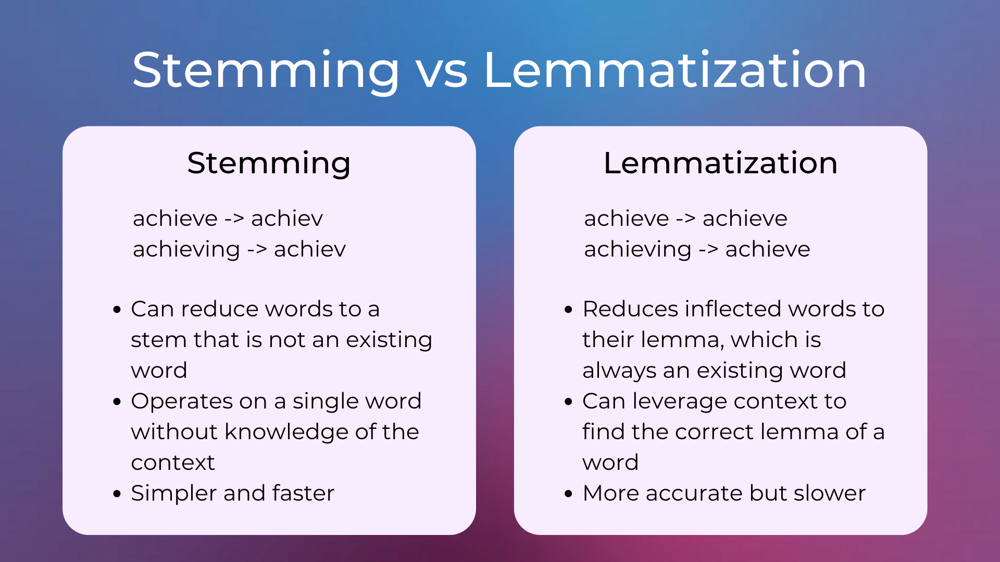

`nltk.stem` provides implementations for:

- lemmatization: [WordNetLemmatizer](https://www.nltk.org/api/nltk.stem.WordNetLemmatizer.html?highlight=wordnet#nltk-stem-wordnetlemmatizer);
- stemming: [PorterStemmer](https://www.nltk.org/api/nltk.stem.PorterStemmer.html).

As always the best approach is discovered via multiple experiments of using a single or a combination of techniques.

</details>

## Text preprocessing: Checkpoint

Which of the following are useful text preprocessing steps?

```text
A. Stems, spelling corrections, lowercase.
B. Lemmatization, lowercasing, removing unwanted tokens.
C. Removing stop words, leaving in capital words.
D. Strip stop words, word endings and digits.
```

<details>

<summary>Reveal answer:</summary>

Answer: B.

</details>

## [Gensim](https://radimrehurek.com/gensim/auto_examples/index.html#documentation)

- Popular open-source NLP library.
- Can be used to perform complex NLP tasks:
  - Building document vectors.
  - Building word vectors.
  - Perform topic identification.
  - Perform document comparison.
- `gensim` objects can be easily saved, updated and reused.

## What is a word vector?

<details>

<summary>Do you know what word vectors are?</summary>

It is a word that has been embedded in an `n` dimensional **semantic** space. The words around it have simiar meaning to it. Words far from it have a different meaning.


- The vector operation `king minus queen` is approximately equal to `man minus woman`.
- Spain is to Madrid as Italy is to Rome.

</details>

<details>

<summary>Do you know what a corpus (plural, corpora) is?</summary>

A set of raw texts (not preprocessed) to perform NLP tasks on.

</details>

## Creating a gensim dictionary

Gensim allows you to build corpora and dictionaries using simple classes and functions.

The `Dictionary` class creates a mapping with an `id` for each `token`.

```python
from gensim.corpora.dictionary import Dictionary
from nltk.tokenize import word_tokenize

my_documents = ['The movie was about a spaceship and aliens.','I really liked the movie!','Awesome action scenes, but boring characters.','The movie was awful! I hate alien films.','Space is cool! I liked the movie.','More space films, please!',]

tokenized_docs = [word_tokenize(doc.lower()) for doc in my_documents]
dictionary = Dictionary(tokenized_docs)
dictionary.token2id
```

```console
{'.': 0, 'a': 1, 'about': 2, 'aliens': 3, 'and': 4, 'movie': 5, 'spaceship': 6, 'the': 7, 'was': 8, '!': 9, 'i': 10, 'liked': 11, 'really': 12, ',': 13, 'action': 14, 'awesome': 15, 'boring': 16, 'but': 17, 'characters': 18, 'scenes': 19, 'alien': 20, 'awful': 21, 'films': 22, 'hate': 23, 'cool': 24, 'is': 25, 'space': 26, 'more': 27, 'please': 28}
```

We now can represent whole documents using:

- A list of their token ids.
- How often those tokens appear in each document.

## Creating a gensim corpus

The `doc2bow` method converts a document (a list of words) into the bag-of-words format = list of `(token_id, token_count)`.

```python
corpus = [dictionary.doc2bow(doc) for doc in tokenized_docs]
corpus
```

```console
[[(0, 1), (1, 1), (2, 1), (3, 1), (4, 1), (5, 1), (6, 1), (7, 1), (8, 1)], [(0, 1), (1, 1), (9, 1), (10, 1), (11, 1), (12, 1)], ...
```

## Checkpoint

What are word vectors and how do they help with NLP?

A. They are similar to bags of words, just with numbers. You use them to count how many tokens there are.
B. Word vectors are sparse arrays representing bigrams in the corpora. You can use them to compare two sets of words to one another.
C. Word vectors are multi-dimensional mathematical representations of words created using deep learning methods. They give us insight into relationships between words in a corpus.
D. Word vectors don't actually help NLP and are just hype.

<details>

<summary>Reveal answer:</summary>

Answer: C.

</details>

## `tf-idf` with gensim

<details>

<summary>What does "tf" stand for?</summary>

Term frequency.

</details>

<details>

<summary>What does "idf" stand for?</summary>

Inverse document frequency.

</details>

<details>

<summary>Explain "tf-idf" - what do the different parts mean?</summary>

- `tf`: number of times a token is present in a document;
- `idf`: number of documents / number of documents that contain the token.

</details>

<details>

<summary>What is the usecase for "tf-idf"?</summary>

Allows us to determine the most important words in a document by weighing them. Notice: important `!=` common. In other words, it keeps document specific frequent words weighted high.

</details>

<details>

<summary>How does "tf-idf" treat stopwords?</summary>

It assigns lower weights to them. This ensures most common words don't show up as key words.

</details>

<details>

<summary>What is the formula for "tf-idf"?</summary>

$$w_{i,j} = tf_{i,j} * log(\frac{N}{df_i})$$

, where:

- $tf_{i,j} =$ number of occurences of token $i$ in document $j$.
- $N =$ total number of documents.
- $df_{i,j} =$ number of documents that contain token $i$.
- $w_{i,j} =$ tf-df weight for token $i$ in document $j$.

- Why use `log`? <https://stackoverflow.com/a/65304417/16956119>
- When to use which base of log for tf-idf? <https://stackoverflow.com/a/56002747/16956119>
  - [`gensim` uses base `2`](https://radimrehurek.com/gensim/models/tfidfmodel.html)

</details>

## `tf-idf` - checkpoint

You want to calculate the tf-idf weight for the word `computer`, which appears five times in a document containing 100 words. Given a corpus containing 200 documents, with 20 documents mentioning the word `computer`, which of the below options is correct?

```text
A. (5 / 100) * log(200 / 20)
B. (5 * 100) / log(200 * 20)
C. (20 / 5) * log(200 / 20)
D. (200 * 5) * log(400 / 5)
```

<details>

<summary>Reveal answer</summary>

Answer: A.

</details>

## Named Entity Recognition

<details>

<summary>What is named entity recognition (NER)?</summary>

- NLP task to identify important named entities in a text:
  - people;
  - places;
  - organizations;
  - dates;
  - states;
  - works of art;
  - etc., etc.
- Can be used alongside topic identifitcation.
- Main usecase for NER is answering questions related to a text:
  - Who?
  - What?
  - When?
  - Where?
- Give an example with the `payee model`.

</details>

### `NER` - example


### Using `nltk`

```python
import nltk
nltk.download('averaged_perceptron_tagger_eng')
sentence = '''In New York, I like to ride the Metro to
              visit MOMA and some restaurants rated
              well by Ruth Reichl.'''
tokenized_sent = nltk.word_tokenize(sentence)
tagged_sent = nltk.pos_tag(tokenized_sent)
tagged_sent[:3]
```

```console
[('In', 'IN'), ('New', 'NNP'), ('York', 'NNP')]
```

To get information about the various POS (part-of-speech) tags, use the following:

```python
import nltk
nltk.download('tagsets_json')
nltk.help.upenn_tagset()
```

```console
$: dollar
    $ -$ --$ A$ C$ HK$ M$ NZ$ S$ U.S.$ US$
'': closing quotation mark
    ' ''
(: opening parenthesis
    ( [ {
): closing parenthesis
    ) ] }
,: comma
    ,
--: dash
    --
.: sentence terminator
    . ! ?
:: colon or ellipsis
    : ; ...
CC: conjunction, coordinating
    & 'n and both but either et for less minus neither nor or plus so
    therefore times v. versus vs. whether yet
CD: numeral, cardinal
    mid-1890 nine-thirty forty-two one-tenth ten million 0.5 one forty-
    seven 1987 twenty '79 zero two 78-degrees eighty-four IX '60s .025
    fifteen 271,124 dozen quintillion DM2,000 ...
DT: determiner
    all an another any both del each either every half la many much nary
    neither no some such that the them these this those
EX: existential there
    there
FW: foreign word
    gemeinschaft hund ich jeux habeas Haementeria Herr K'ang-si vous
    lutihaw alai je jour objets salutaris fille quibusdam pas trop Monte
    terram fiche oui corporis ...
...
```

```python
import nltk
nltk.download('maxent_ne_chunker_tab')
nltk.download('words')
sentence = '''In New York, I like to ride the Metro to
              visit MOMA and some restaurants rated
              well by Ruth Reichl.'''
tokenized_sent = nltk.word_tokenize(sentence)
tagged_sent = nltk.pos_tag(tokenized_sent)
print(nltk.ne_chunk(tagged_sent))
```

```console
(S
  In/IN
  (GPE New/NNP York/NNP)
  ,/,
  I/PRP
  like/VBP
  to/TO
  ride/VB
  the/DT
  (ORGANIZATION Metro/NNP)
  to/TO
  visit/VB
  (ORGANIZATION MOMA/NNP)
  and/CC
  some/DT
  restaurants/NNS
  rated/VBN
  well/RB
  by/IN
  (PERSON Ruth/NNP Reichl/NNP)
  ./.)
```

## What is [`SpaCy`](https://spacy.io/)?

- NLP library, similar to `gensim`, with different implementations.
- Open-source, with extra libraries and tools:
  - [Displacy](https://demos.explosion.ai/displacy): visualization tool for viewing parse trees which uses Node-js to create interactive text.
  - [Displacy Entity Recognition Visualizer](https://demos.explosion.ai/displacy-ent/).
- Easy creation of multi-step pipelines.
- Has different entity types compared to `nltk`.

```python
import spacy
nlp = spacy.load("en_core_web_sm")
nlp.get_pipe("ner").labels
```

```console
('CARDINAL', 'DATE', 'EVENT', 'FAC', 'GPE', 'LANGUAGE', 'LAW', 'LOC', 'MONEY', 'NORP', 'ORDINAL', 'ORG', 'PERCENT', 'PERSON', 'PRODUCT', 'QUANTITY', 'TIME', 'WORK_OF_ART')
```

- Great informal language corpora: easily find entities in Tweets and chat messages.

## SpaCy NER

```python
import spacy
nlp_pipeline = spacy.load('en_core_web_sm')
nlp_pipeline.get_pipe('ner')
```

```console
<spacy.pipeline.ner.EntityRecognizer object at 0x796d209882e0>
```

```python
doc = nlp_pipeline('''Berlin is the capital of Germany;
                           and the residence of Chancellor Angela Merkel.''')
doc.ents
```

```console
(Berlin, Germany, Angela Merkel)
```

```python
doc.ents[0], doc.ents[0].label_
```

```console
(Berlin, 'GPE')
```

## What is [polyglot](https://polyglot.readthedocs.io/en/latest/)?

- NLP library which uses word vectors.
- The main usecase is that `polyglot` has word vectors in [40 languages](https://polyglot.readthedocs.io/en/latest/NamedEntityRecognition.html).

## Spanish NER with `polyglot`

```python
# in venv run:
# "polyglot download embeddings2.es"
# and "polyglot download ner2.es" beforehand
from polyglot.text import Text
text = """El presidente de la Generalitat de Catalua,
                 Carles Puigdemont, ha afirmado hoy a la alcaldesa
                  de Madrid, Manuela Carmena, que en su etapa de
                  alcalde de Girona (de julio de 2011 a enero de 2016)
                  hizo una gran promocin de Madrid."""
ptext = Text(text)
ptext.entities
```

```console
[I-ORG(['Generalitat', 'de']),
I-LOC(['Generalitat', 'de', 'Catalua']),
I-PER(['Carles', 'Puigdemont']),
I-LOC(['Madrid']),
I-PER(['Manuela', 'Carmena']),
I-LOC(['Girona']),
I-LOC(['Madrid'])]
```

## Building word count vectors with `scikit-learn`

- [CountVectorizer](https://scikit-learn.org/1.5/modules/generated/sklearn.feature_extraction.text.CountVectorizer.html#countvectorizer):
  - Turns a text into bag-of-words vectors similar to a Gensim corpus.
  - Can also remove stopwords via its `stop_words='english'` parameter setting.
    - There is a note in the `sklearn` documentation that you should be careful when removing stop words and this is true - sometimes they are helpful, especially when these words can be used as a basis for comparing documents (eg. classifing an author, classifying author style, etc).
    - Same applies to removing punctuation.
  - Returns `scipy.sparse.csr_matrix`.

```python
from sklearn.feature_extraction.text import CountVectorizer
corpus = [
    'This is the first document.',
    'This document is the second document.',
    'And this is the third one.',
    'Is this the first document?',
]
vectorizer = CountVectorizer()
X = vectorizer.fit_transform(corpus)
print(X.toarray())
vectorizer.get_feature_names_out()
```

```console
[[0 1 1 1 0 0 1 0 1]
 [0 2 0 1 0 1 1 0 1]
 [1 0 0 1 1 0 1 1 1]
 [0 1 1 1 0 0 1 0 1]]
array(['and', 'document', 'first', 'is', 'one', 'second', 'the', 'third',
       'this'], dtype=object)
```

We can also create bigrams:

```python
vectorizer2 = CountVectorizer(analyzer='word', ngram_range=(2, 2))
X2 = vectorizer2.fit_transform(corpus)
print(X2.toarray())
vectorizer2.get_feature_names_out()
```

```console
[[0 0 1 1 0 0 1 0 0 0 0 1 0]
 [0 1 0 1 0 1 0 1 0 0 1 0 0]
 [1 0 0 1 0 0 0 0 1 1 0 1 0]
 [0 0 1 0 1 0 1 0 0 0 0 0 1]]
array(['and this', 'document is', 'first document', 'is the', 'is this',
       'second document', 'the first', 'the second', 'the third',
       'third one', 'this document', 'this is', 'this the'], dtype=object)
```

- [TfidfVectorizer](https://scikit-learn.org/1.5/modules/generated/sklearn.feature_extraction.text.TfidfVectorizer.html#tfidfvectorizer):
  - Creates a matrix of TF-IDF features.
  - Interesting implementation: `CountVectorizer` followed by [TfidfTransformer](https://scikit-learn.org/1.5/modules/generated/sklearn.feature_extraction.text.TfidfTransformer.html#sklearn.feature_extraction.text.TfidfTransformer).
  - Parameters `min_df` and `max_df`:
    - When building the vocabulary ignore terms that have a **document frequency** strictly lower/higher than the given threshold.
  - Parameter `max_features`:
    - If not `None`, build a vocabulary that only consider the top `max_features` **ordered by term frequency** across the corpus. Otherwise, all features are used.

```python
from sklearn.feature_extraction.text import TfidfVectorizer
corpus = [
    'This is the first document.',
    'This document is the second document.',
    'And this is the third one.',
    'Is this the first document?',
]
vectorizer = TfidfVectorizer()
X = vectorizer.fit_transform(corpus)
print(vectorizer.get_feature_names_out())
print(X.shape)
X.toarray()
```

```console
['and' 'document' 'first' 'is' 'one' 'second' 'the' 'third' 'this']
(4, 9)
array([[0.        , 0.46979139, 0.58028582, 0.38408524, 0.        ,
        1.        , 0.38408524, 0.        , 0.38408524],
       [0.        , 0.6876236 , 0.        , 0.28108867, 0.        ,
        0.53864762, 0.28108867, 0.        , 0.28108867],
       [0.51184851, 0.        , 0.        , 0.26710379, 0.51184851,
        2.        , 0.26710379, 0.51184851, 0.26710379],
       [0.        , 0.46979139, 0.58028582, 0.38408524, 0.        ,
        3.        , 0.38408524, 0.        , 0.38408524]])
```

## Supervised NLP - checkpoint

Which of the following are possible features for a text classification problem?

```text
A. Number of words in a document.
B. Specific named entities.
C. Language.
D. All of the above.
```

<details>

<summary>Reveal answer</summary>

Answer: D.

</details>

Which of the below is the most reasonable model to use when training a new supervised model using text vector data?

```text
A. Random Forests
B. Naive Bayes
C. Linear Regression
D. Deep Learning
```

<details>

<summary>Reveal answer</summary>

Answer: B.

</details>

## The Naive Bayes Classifier

- Based in probability.
- Simple and effective.
- Naive because it assumes all features are completely independent.
- Given a particular piece of data, how likely is a particular outcome?
  - If a film's plot has a spaceship, how likely is it to be a sci-fi?
  - Given a spaceship **and** an alien, how likely **now** is it sci-fi?

$$\displaystyle {\hat {y}}={\underset {k\in \{1,\ldots ,K\}}{\operatorname {argmax} }}\ p(C_{k})\displaystyle \prod _{i=1}^{n}p(x_{i}\mid C_{k}).$$

- Each word from `CountVectorizer` acts as a feature.
- Implemented in `sklearn` in [sklearn.naive_bayes.MultinomialNB](https://scikit-learn.org/stable/modules/generated/sklearn.naive_bayes.MultinomialNB.html#multinomialnb)

# Week 10 - Hello, Deep Learning. Implementing a Multilayer Perceptron

What is your experience with deep learning? Who has built a deep learning model? What was it about?

<details>

<summary>What is deep learning?</summary>

- Deep learning is a class of algorithms that solve the task of `automatic pattern recognition`.
- There are two main paradigms of programming: `imperative` and `functional`. Deep learning can be regarded as a third paradigm, different from the other two as follows: let's say you have a particular `task` you want to solve.
  - In imperative and functional programming, `you write the code directly`; you tell the machine what it has to do **explicitly** and you write exactly the code solves the task by outlining and connecting multiple steps together (i.e. **you** create an algorithm).
  - In deep learning you are **not** explicitly / directly writing the logic that would solve the task. Instead, you build a `deep learning model` that models the task you are tying to solve and **the model itself creates the algorithm** for solving your task.
- A deep learning model is a set of parameters connected in various ways. It solves tasks by finding optimal values of those parameters - i.e. values for which it can in **most** cases solve a task. The word **most** is important - notice that all a deep learning model is an `automatic mathematical optimization model` for a set of parameters. **`It solves tasks by approximation, not by building explicit logic`**.
- The process during which the model optimizes its parameters is called `training`.

</details>

<details>

<summary>How are deep learning models built?</summary>

Deep learning models are built by codifying the `description` of the desired model behavior. This description of the expected behavior is `implicitly` hidden in the data in the form of `patterns`. Thus, deep learning is uncovering those patterns and using them to solve various problems.

The process is called `training` - you give the untrained model your data (your `description` of desired behavior) and the model "tweaks" its parameters until it fits your description well enough. And there you have it - a deep learning model that does what you want (probably  (i.e. with a certain probability, because it's never going to be perfect)).

You can think about the "tweaking" process as the process in which multiple models are created each with different values for their parameters, their accuracies are compared and the model with the highest accuracy is chosen as the final version.

</details>

## So what can deep learning models model?

Here is the twist - `everything`! For any task as long as you have enough data, you can model it.

One of the things you can model is **the probability of the next word in a sentence**. Surprise - the models that solve these types of tasks are called `Large Language Models`! You have a partially written sentence and you can create a mathematical model that predicts how likely every possible word, in the language you're working in, is to be the next word in that sentence. And after you've selected the word, you can repeat the process on this extended sentence - that's how you get `ChatGPT`.

## Modeling a neuron that can multiply by `2`


We want to teach the model that `w` has to equal `2`.

<details>

<summary>How would we go about doing this?</summary>

1. We start with a random guess for `w`. For the sake of concreteness, let's say a random floating-point number in the interval `[0, 10)`. The interval does not matter  - even if it does not contain `2` the traning process would converge towards it.


2. We calculate the value of the loss function at that initial random guess.


3. We can see what will happen if we "wiggle" `w` by a tiny amount `eps`.


4. So, the value either goes up or down. This means that our loss function would represent a parabola.


5. If only we had a way to always know in which direction the value would go down? Oh, wait - we do! It's the opposite direction of the one in which the derivative grows!


For now, we won't calculate the exact derivative because we don't need to do that - we can use its general formula:

$${\displaystyle L=\lim _{eps\to 0}{\frac {loss(w+eps)-loss(w)}{eps}}}$$

6. We can then use `L` to step in the direction of decline, by doing: `w -= L`.

7. This, however, will have a problem: the value of `L` might be very high. If our step is always `L` we would start oscilating. Therefore, we'll use a learning rate that will say how large our step would be: `w -= learning_rate * L`.

And this is it! This process is guaranteed to find `2` as the optimal value. Moreover, this iterative algorithm for minimizing a differentiable multivariate function is what is also known as [Gradient Descent](https://en.wikipedia.org/wiki/Gradient_descent) .

</details>

<details>

<summary>What would the architecture and process for creating a model of an "AND" logical gate look like?</summary>

We might start off with something like this:


However, because our task now shifts from being a regression one into a classification one, we can also add the `sigmoid` function to control the output values:

$${\displaystyle f(x)={\frac {1}{1+e^{-x}}}}$$


<details>

<summary>But! Adding the sigmoid activation function actually causes another problem - for what values of w1 and w2 would we have a problem?</summary>

Look at what happens when we have $w_1=0$ and $w_2=0$ (our model is guessing correctly that the output should be `0`):


</details>

<details>

<summary>How do we fix this?</summary>

We need to keep the weights at `0` but also add another term that can control the logit value when all weights are `0`. Welcome, ***bias***.


</details>

</details>

<details>

<summary>How do we model the "XOR" logical gate?</summary>

Let's see how the classes are distributed in `2D` space:


The models we defined above are actually called perceptrons. They calculate a weighted sum of their inputs and thresholds it with a step function.

Geometrically, this means **the perceptron can separate its input space with a hyperplane**. Thats where the notion that a perceptron can only separate linearly separable problems comes from.

Since the `XOR` function **is not linearly separable**, it really is impossible for a single hyperplane to separate it.

<details>

<summary>What are our next steps then?</summary>

We need to describe the `XOR` gate using non-`XOR` gates. This can be done:

`(x|y) & ~(x&y)`

So, the `XOR` model can then be represented using the following architecture:


<details>

<summary>How many parameters would we have in total?</summary>

9

</details>

</details>

</details>

# Week 11 - Implementing Gradient Descent

## Backpropagation

<details>

<summary>How do we translate the expression "slope of a line"?</summary>

  .

</details>

<details>

<summary>How would you define the slope of a line?</summary>

- slope (also gradient) = a number that describes the direction of the line on a plane.
- often denoted by the letter $m$.


- calculated as the ratio of the vertical change to the horizontal change ("rise over run") between two distinct points on the line:
  - a 45 rising line has slope $m = 1$ (tan(45) = 1)
  - a 45 falling line has slope $m = -1$ (tan(-45) = -1)

</details>

<details>

<summary>What is the sign of the slope of an increasing line going up from left to right?</summary>

Positive ($m > 0$).

</details>

<details>

<summary>What is the sign of the slope of a decreasing line going down from left to right?</summary>

Negative ($m < 0$).

</details>

<details>

<summary>What is the slope of a horizontal line?</summary>

$0$.

</details>

<details>

<summary>What is the slope of a vertical line?</summary>

A vertical line would lead to a $0$ in the denominator, so the slope can be regarder as `undefined` or `infinite`.

</details>

<details>

<summary>What is the steepness of a line?</summary>

- The absolute value of its slope:
  - greater absolute value indicates a steeper line.

</details>

<details>

<summary>Suppose a line runs through two points: P = (1, 2) and Q = (13, 8). What is its slope, direction and level of steepness?</summary>

$dy = 8 - 2 = 6$
$dx = 13 - 1 = 12$
$m = \frac{dy}{dx} = \frac{6}{12} = \frac{1}{2} = 0.5$

Direction: $0.5 > 0$ => up
Steepness: $0 < 0.5 < 1$ => not very steep (less steep than a 45 rising line)

</details>

<details>

<summary>Suppose a line runs through two points: P = (4, 15) and Q = (3, 21). What is its slope, direction and level of steepness?</summary>

$dy = 21 - 15 = 6$
$dx = 3 - 4 = -1$
$m = \frac{dy}{dx} = \frac{6}{-1} = -6$

Direction: $-6 < 0$ => down
Steepness: $|-6| = 6 > 1$ => steep

</details>

<details>

<summary>What is the link between "slope" and "derivative"?</summary>

- For non-linear functions, the rate of change varies along the curve.
- The derivative of the function at a point
$=$ The slope of the line, tangent to the curve at the point
$=$ The rate of change of the function at that point


Formula for slope:

$m = \frac{dy}{dx}$

Formula for derivative:

${\displaystyle L=\lim _{eps\to 0}{\frac {f(x+eps)-f(x)}{eps}}}$

it's the same formula as for the slope, only here the change in $x$ is infinitesimally small.

For example, let $f$ be the squaring function: ${\displaystyle f(x)=x^{2}}$. Then the derivative is:

$$\frac{f(x+eps) - f(x)}{eps} = \frac{(x+eps)^2 - x^2}{eps} = \frac{x^2 + 2xeps + eps^2 - x^2}{eps} = 2x + eps$$

The division in the last step is valid as long as $eps \neq 0$. The closer $eps$ is to $0$, the closer this expression becomes to the value $2x$. The limit exists, and for every input $x$ the limit is $2x$. So, the derivative of the squaring function is the doubling function: ${\displaystyle f'(x)=2x}$.

</details>

<details>

<summary>So, what added value does the derivative have?</summary>

**It tells us by how much the value of a function increases when we *increase* its input by a tiny bit.**

Do we remember the below diagram?


</details>

<details>

<summary>What are the rules of derivatives that you can recall - write out the rule and an example of it?</summary>

Recall the rules of computation [here](https://en.wikipedia.org/wiki/Derivative#Rules_of_computation).

Also, recall the chain rule [here](https://en.wikipedia.org/wiki/Chain_rule).

<details>

<summary>What is the derivative of sin(6x)?</summary>

$\frac{d}{dx}[\sin(6x)] = \cos(6x) * \frac{d}{dx}[6x] = \cos(6x) * 6 = 6\cos(x)$

See how the above corresponds with this definition:

$${\displaystyle {\frac {dz}{dx}}={\frac {dz}{dy}}\cdot {\frac {dy}{dx}},}$$

$z = \sin$
$y = 6x$

In other words, $x$ influences the value of $\sin$ through the value of $y=6x$.

</details>

</details>

<details>

<summary>What is backpropagation then?</summary>

Backpropagation is the iterative process of calculating derivatives of the loss function with respect to every `value` node leading up to it.

Rules of thumb:

```text
Start from the final child (the last node in topological order).
+ => copy gradient to parents:
    parent1.grad = current.grad
    parent2.grad = current.grad
* => multiply value of other parent with current gradient:
    parent1.grad = parent2.value * current.grad
    parent2.grad = parent1.value * current.grad
```

Let's say we have the following computational graph and we have to see how tiny changes in the weights and biases influence the value of `L`:


<details>

<summary>Reveal answer</summary>


End:


</details>

</details>

## Topological sort

Topological ordering of a directed graph is a linear ordering of its vertices such that for every directed edge $(u,v)$ from vertex $u$ to vertex $v$, $u$ comes before $v$ in the ordering.

The canonical application of topological sorting is in scheduling a sequence of jobs or tasks based on their dependencies.

Two ways to sort elements in topological order are given in [Wikipedia](https://en.wikipedia.org/wiki/Topological_sorting).

## The hyperbolic tangent

<details>

<summary>Why are activation functiosns needed?</summary>

They introduce nonlinearity, making it possible for our network to learn somthing. Composition of matrices is a single matrix (as the matrix is a linear operation).

</details>

$${\displaystyle \tanh x={\frac {\sinh x}{\cosh x}}={\frac {e^{x}-e^{-x}}{e^{x}+e^{-x}}}={\frac {e^{2x}-1}{e^{2x}+1}}.}$$

We observe that the `tanh` function is a shifted and stretched version of the `sigmoid`. Below, we can see its plot when the input is in the range $[-10, 10]$:


The output range of the tanh function is $(-1, 1)$ and presents a similar behavior with the `sigmoid` function. Thus, the main difference is the fact that the `tanh` function pushes the input values to $1$ and $-1$ instead of $1$ and $0$.

The important difference between the two functions is the behavior of their gradient.

$${\frac {d}{dx}}\sigma(x) = \sigma(x) (1 - \sigma(x))$$
$${\frac {d}{dx}}\tanh(x) = 1 - \tanh^{2}(x)$$


Using the `tanh` activation function results in higher gradient values during training and higher updates in the weights of the network. So, if we want strong gradients and big steps, we should use the `tanh` activation function.

Another difference is that the output of `tanh` is symmetric around zero, which could sometimes lead to faster convergence.

## Python OOP (Magic Methods)

### Initialization and Construction

- `__init__`: To get called by the `__new__` method. This is the `constructor` function for Python classes.
- `__new__`: To get called in an objects instantiation (**do not use unless no other option**).
- `__del__`: It is the destructor (**do not use unless no other option**).

### Arithmetic operators

- `__add__(self, other)`: Implements behavior for the `+` operator (addition).
- `__sub__(self, other)`: Implements behavior for the `` operator (subtraction).
- `__mul__(self, other)`: Implements behavior for the `*` operator (multiplication).
- `__floordiv__(self, other)`: Implements behavior for the `//` operator (floor division).
- `__truediv__(self, other)`: Implements behavior for the `/` operator (true division).
- `__mod__(self, other)`: Implements behavior for the `%` operator (modulus).
- `__pow__(self, other)`: Implements behavior for the `**` operator (exponentiation).
- `__and__(self, other)`: Implements behavior for the `&` operator (bitwise and).
- `__or__(self, other)`: Implements behavior for the `|` operator (bitwise or).
- `__xor__(self, other)`: Implements behavior for the `^` operator (bitwise xor).
- `__neg__(self)`: Implements behavior for negation using the `` operator.

### String Magic Methods

- `__str__(self)`: Defines behavior for when `str()` is called on an instance of your class.
- `__repr__(self)`: To get called by built-int `repr()` method to return a machine readable representation of a type. **This method gets called when an object is passed to the `print` function.**

### Comparison magic methods

- `__eq__(self, other)`: Defines behavior for the equality operator, `==`.
- `__ne__(self, other)`: Defines behavior for the inequality operator, `!=`.
- `__lt__(self, other)`: Defines behavior for the less-than operator, `<`.
- `__gt__(self, other)`: Defines behavior for the greater-than operator, `>`.
- `__le__(self, other)`: Defines behavior for the less-than-or-equal-to operator, `<=`.
- `__ge__(self, other)`: Defines behavior for the greater-than-or-equal-to operator, `>=`.

# Week 12 - Hello, PyTorch

## PyTorch Dataset

<details>

<summary>What do you know about PyTorch?</summary>

[PyTorch](https://pytorch.org/docs/stable/index.html) is an optimized tensor library for deep learning using GPUs and CPUs.

- We'll refer to any `n`-dimensional numpy array as a tensor.

It has everything needed to create a data preprocessing, model training and model evaluation pipeline.


- Open source.
- Created by Meta.

</details>

Install the new requirements in the file `requirements.txt` by running the command `pip install -r requirements.txt` in your virutal environment.

This week we'll be working with `the water potability dataset`. The task is to classify a water sample as potable or drinkable (`1` or `0`) based on its chemical characteristics. All features have been normalized to between zero and one. Two files are present in our `DATA` folder: `water_train.csv` and `water_test.csv`. Here's how both of them look like:


We can create a custom dataset for our data by inheriting the PyTorch [Dataset class](https://pytorch.org/docs/stable/data.html#torch.utils.data.Dataset). All customs `Dataset` classes must implement the following methods:

- `__init__`: to loads and saves the data in the state of the class. Typically accepts a CSV or an already loaded numpy matrix;
- `__len__`: returns the number of instaces in the saved data;
- `__getitem__`: returns the features and label for a single sample. Note: this method returns **a tuple**! The first element is an array of the features, the second is the label.

See an example [here](https://pytorch.org/tutorials/beginner/basics/data_tutorial.html#creating-a-custom-dataset-for-your-files).

> **Note:** While it's not shown in the example, please don't forget to initialize the parent class as well by calling `super().__init__()`.

## PyTorch Dataloader

<details>

<summary>What is batch size?</summary>

A subsample of `n` instances. The batch size is used to split the dataset into multiple smaller dataset each with `n` instances. The benefit we get is having a smaller amount of data for one iteration of the training loop and faster training in general since the matrix calculations happen much faster.

</details>

The `Dataset` class retrieves our datasets features and labels one sample at a time.

While training a model, we typically want to:

- pass samples in `minibatches`;
- reshuffle the data at every epoch to reduce model overfitting;
- use Pythons `multiprocessing` package to speed up data retrieval.

The [`DataLoader` class](https://pytorch.org/docs/stable/data.html#torch.utils.data.DataLoader) is an iterable that abstracts this complexity for us in an easy API.

```python
from torch.utils.data import DataLoader

train_dataloader = DataLoader(training_data, batch_size=64, shuffle=True)
test_dataloader = DataLoader(test_data, batch_size=64, shuffle=True)
```

We can then iterate through those objects via a `for` loop or manually:

```python
# Display image and label.
train_features, train_labels = next(iter(train_dataloader))
print(f"Feature batch shape: {train_features.size()}")
print(f"Labels batch shape: {train_labels.size()}")
img = train_features[0].squeeze() # Removes dimensions of size 1. Shape (A1BC1D) becomes (ABCD).
label = train_labels[0]
plt.imshow(img, cmap="gray")
plt.show()
print(f"Label: {label}")
```

## PyTorch Model

- We can define neural networks in two ways: `sequential` and `class-based`. We'll focus on the `class-based` approach as it provides more flexibility.
- All functions and methods that work with neural networks can be found in the [torch.nn package](https://pytorch.org/docs/stable/nn.html). By convention `torch.nn` gets imported with an alias `nn`.

Here's an example of sequential model definition:

```python
import torch.nn as nn

net = nn.Sequential(
  nn.Linear(9, 16),
  nn.ReLU(),
  nn.Linear(16, 8),
  nn.ReLU(),
  nn.Linear(8, 1),
  nn.Sigmoid(),
)
```

The same can be written using the `class-based` approach:

```python
class Net(nn.Module):
  def __init__(self):
    super(Net, self).__init__()
    self.fc1 = nn.Linear(9, 16)
    self.fc2 = nn.Linear(16, 8)
    self.fc3 = nn.Linear(8, 1)
  
  def forward(self, x):
    x = nn.functional.relu(self.fc1(x))
    x = nn.functional.relu(self.fc2(x))
    x = nn.functional.sigmoid(self.fc3(x))
    return x

net = Net()
```

As can be seen above, every model should define the following two methods:

- `__init__()`: defines the layers that are used in the `forward()` method;
- `forward()`: defines what happens to the model inputs once it receives them; this is where you pass inputs through pre-defined layers.

By convention `torch.nn.functional` gets imported with an alias `F`. That means that the above body of `forward` can be rewritten like:

```python
import torch.nn.functional as F

...

x = F.relu(self.fc1(x))
x = F.relu(self.fc2(x))
x = F.sigmoid(self.fc3(x))
```

- PyTorch has many famous deep learning models already built-in.
- For example, various vision models can be found in the [torchvision.models package](https://pytorch.org/vision/0.9/models.html).

## Training loop - PyTorch style

Here is a general overview of the training loop using built-in PyTorch functions and classes.

```python
import torch.nn as nn
import torch.optim as optim

criterion = nn.BCELoss() # we define the loss function to use. BCE = Binary Cross Entropy
optimizer = optim.SGD(net.parameters(), lr=0.01) # we set the optimizer. SGD = Stochastic Gradient Descent

for epoch in range(1000):
  for features, labels in dataloader_train:
    optimizer.zero_grad() # clear the gradients
    outputs = net(features) # forward pass
    loss = criterion(outputs, labels.view(-1, 1)) # calculate the loss
    loss.backward() # compute the gradients
    optimizer.step() # tweak weights
```

## Optimizers

- Stochastic Gradient Descent (SGD):
  - Parameter update values depend on learning rate;
  - Simple and efficient for basic models.
  - Rarely used in practice, due to simplicity.

- Adaptive Gradient (Adagrad):
  - Adapts learning rate for each parameter;
  - Good for sparse data;
  - May decrease the learning rate too fast.

- Root Mean Square Propagation (RMSprop):
  - Update for each parameter based on the size of its previous gradients.

- Adaptive Moment Estimation (Adam):
  - Has an extension with weight decay, called `AdamW`, which is arguably the most versatile and widely used optimizer today.
  - RMSprop + gradient momentum.
  - Often `Adam` is used as the go-to optimizer.

## Model evaluation - PyTorch style

```python
from torchmetrics import Accuracy

acc = Accuracy(task='binary')

net.eval()
with torch.no_grad():
  for features, labels in dataloader_test:
    outputs = net(features)
    preds = (outputs >= 0.5).float()
    acc(preds, labels.view(-1, 1))

accuracy = acc.compute()
print(f'Accuracy" {accuracy}')
```

### Unstable gradients

- **Vanishing gradients**: Gradients get smaller and smaller during backward pass.


- Results:
  - Earlier layers get smaller parameter updates;
  - Model does not learn.
  - Loss becomes constant.

- **Exploding gradients**: Gradients get larger and larger during backward pass.


- Results:
  - Parameter updates are too large.
  - Loss becomes higher and higher.

### Solutions to unstable gradients

1. Proper weights initialization.
2. More appropriate activation functions.
3. Batch normalization.

#### Proper weights initialization

Good weight initialization ensures that the:

- Variance of layer inputs = variance of layer outputs;
- Variance of gradients is the same before and after a layer.

How to achieve this depends on the activation function:

- For ReLU and similar (sigmoid included), we can use [He/Kaiming initialization](https://paperswithcode.com/method/he-initialization).

```python
import torch.nn.init as init

init.kaiming_uniform_(layer.weight) # https://pytorch.org/docs/stable/nn.init.html#torch.nn.init.kaiming_uniform_
```

#### More appropriate activation functions

- Often the `ReLU` (rectified linear unit) activation function is used.

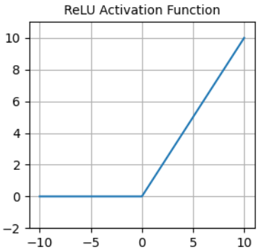

<details>

<summary>ReLU is not differentiable at x=0. So, how do we implement backpropagation?</summary>

For $x > 0$, the derivative of the ReLU function is $1$. For $x <= 0$, the derivative of the ReLU function is $0$. If $x == 0$, it's usually set either to $0$ or to a very small $eps$.

</details>

- It's available in `nn.functional.relu()`.
- It suffers from the `dying neuron` problem because it's `0` for negative inputs.

- Alternative of `ReLU` is `ELU` (Exponential Linear Unit ):


- Available in `nn.functional.elu()`.
- Non-zero gradients for negative values - helps against dying neurons.
- Average output is around `0` - helps against vanishing gradients.

#### Batch normalization

- Good choice of initial weights and activations doesn't prevent unstable gradients during training (only during initialization).
- Solution is to add another transformation after each layer - batch normalization:
  1. Standardizes the layer's outputs by subtracting the mean and diving by the standard deviation.
  2. Scales and shifts the standardized outputs using learnable parameters.
- Result:
  - Model learns optimal distribution of inputs for each layer.
  - Faster loss decrease.
  - Helps against unstable gradients during training.
- Available as [`nn.BatchNorm1d`](https://pytorch.org/docs/stable/generated/torch.nn.BatchNorm1d.html).
  - **Note 1:** The number of features has to be equal to the number of output neurons of the previous layer.
  - **Note 2:** Done after applying layer and before the activation.

